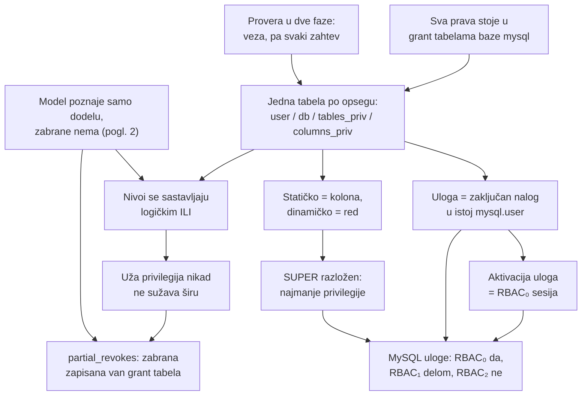
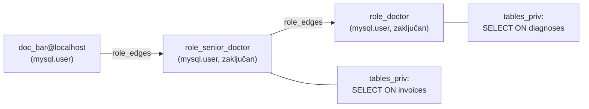

> [!quote] YOU

> [!note] SKILL loaded: teach

Chapter 3 of Tema 2 — Sistem privilegija i uloga u MySQL-u (ticket 16, .scratch/kontrola-pristupa/issues/16-privilegije-i-uloge.md). Ground it in research memo 03 (privileges and roles), the
 corrected RBAC-gap paragraph in memo 07, GLOSSARY.md §1–§2a, and the Poliklinika sandbox from ticket 10. Cover: the grant tables as a data model, the two-stage privilege check (OR-composition across
 global/db/table/column), static vs dynamic privileges and SUPER's decomposition, partial_revokes as the one deny-shaped thing in a grant-only model, then judge MySQL roles against ch. 2's RBAC model by name
 — role activation (SET ROLE, mandatory_roles, activate_all_roles_on_login) and role-to-role grants (mysql.role_edges) exist, but separation of duty does not.

> [!abstract] PI

I'll start by loading the workspace state and the grounding documents.

> [!abstract] PI

Workspace state loaded. Before probing, the session-log offer:

> [!question] Question
> Do you want this lesson mirrored live into an Obsidian note?
>
> The `md-log` extension mirrors the session's prose, quizzes and explanations into a Markdown file as they happen — nicer rendering (mermaid, code, tables) than the terminal. You still answer quizzes in the terminal.
>
> 1. Yes — new file (Recommended)
> 2. Yes — existing file
> 3. No

> [!example] Answer
> 1. Yes — new file (Recommended)

> [!abstract] PI

File created: `lessons-live/0002-privilegije-i-uloge.md`

Paste this into the terminal to link it:

```
/md-log lessons-live/0002-privilegije-i-uloge.md
```

Tell me when it's linked and I'll start Phase 1 (probing).


> [!quote] YOU

done


> [!abstract] PI

Linked. One preference before I start probing:


> [!question] Question
> Which language should the live teaching run in?
>
> The lesson HTML and reference card are Serbian either way (course rule). This is only about the chat/Obsidian session itself.
>
> 1. Serbian (Recommended)
> 2. English
> 3. Mixed — English prose, Serbian terms


> [!example] Answer
> 1. Serbian (Recommended)


> [!abstract] PI

Zapisaću to u `NOTES.md`. Sada Faza 1 — mapiranje ivice.

Počinjem sa odloženim prisećanjem iz prošle lekcije (poglavlje 2), jer se cela druga polovina ovog poglavlja meri baš tim kriterijumima.


> [!question] Quiz
> U Sandhu-ovoj lestvici, šta RBAC₀ (jezgro) traži pored toga da su privilegije grupisane u uloge, a korisnici dodeljeni ulogama?
>
> 1. Da su uloge uređene hijerarhijski, tako da starija uloga nasleđuje mlađu
> 2. Da vlasnik objekta može svoju ulogu proslediti drugom korisniku
> 3. Da ograničenja spreče korisnika da istovremeno drži dve sukobljene uloge
> 4. Da korisnik u sesiji aktivira podskup uloga koje su mu dodeljene


> [!failure] Quiz — incorrect ✗
> Your answer: 2. Da vlasnik objekta može svoju ulogu proslediti drugom korisniku
> Correct answer: 4
>
> RBAC₀ traži korisnike, uloge, privilegije **i sesije** — sesija je mesto gde se bira koje su uloge trenutno aktivne. Hijerarhija je RBAC₁, ograničenja (uključujući razdvajanje dužnosti) su RBAC₂, oba zajedno RBAC₃. Sesija je i tačka gde se princip najmanjih privilegija uopšte može ostvariti: bitno je čime korisnik *radi* u datom trenutku, ne šta *sme*.


> [!abstract] PI

Zanimljiv promašaj — izabrao si opciju koja je zapravo **DAC-ov** mehanizam. Da vidim koliko daleko to ide.


> [!question] Quiz
> Zbog čega RBAC nije samo „DAC u kojem se prava dodeljuju grupama umesto pojedincima"?
>
> 1. Zato što u RBAC-u prava drži uloga kao imenovana funkcija posla, a ne vlasnik objekta koji ih po svojoj volji deli
> 2. Zato što RBAC štiti tajnost podataka i kad korisnik pokrene tuđ program, što DAC ne može
> 3. Zato što RBAC uvodi klase sigurnosti kojima se objekti i subjekti obeležavaju
> 4. Zato što se u RBAC-u prava mogu i oduzimati, dok DAC poznaje samo dodelu prava


> [!success] Quiz — correct ✓
> Your answer: 1. Zato što u RBAC-u prava drži uloga kao imenovana funkcija posla, a ne vlasnik objekta koji ih po svojoj volji deli
> Correct answer: 1
>
> RBAC pomera *ko odlučuje i ko drži pravo*: nosilac privilegije je uloga — imenovana funkcija posla — a dodela uloge je administrativna odluka, ne diskreciona odluka vlasnika. Grupisanje je posledica, ne definicija. Trojanski konj je razlog za MAC (RBAC ga ne rešava — aktivna uloga i dalje radi punom snagom u tuđem programu), oduzimanje prava postoji i u DAC-u, a klase sigurnosti su Bell–LaPadula, tj. MAC.


> [!abstract] PI

Ta grana stoji. Sada MySQL strana.


> [!question] Quiz
> Kada `dbadmin` izvrši `GRANT SELECT, INSERT ON poliklinika.visits TO role_receptionist`, gde server tu činjenicu upisuje?
>
> 1. U dva reda tabele `mysql.global_grants`
> 2. U jedan red tabele `mysql.tables_priv`
> 3. U jedan red tabele `mysql.db`
> 4. U metapodatke same tabele `visits` u rečniku podataka


> [!failure] Quiz — incorrect ✗
> Your answer: 1. U dva reda tabele `mysql.global_grants`
> Correct answer: 2
>
> Privilegije na nivou tabele žive u `mysql.tables_priv`, u jednom redu po (nalog, baza, tabela), sa kolonom tipa `SET` koja drži skup prava — zato `SELECT` i `INSERT` staju u isti red. `mysql.db` je nivo baze, `mysql.global_grants` drži dinamičke globalne privilegije, a rečnik podataka ne zna ništa o pravima pristupa.


> [!question] Quiz
> Nalog `nurse_bar` ima globalnu privilegiju `SELECT ON *.*`, a pored toga i samo jednu kolonsku privilegiju: `SELECT (icd_code) ON poliklinika.diagnoses`. Šta vrati `SELECT diagnosis_text FROM poliklinika.diagnoses`?
>
> 1. Grešku — dva nivoa se sudaraju, pa server odbija upit kao dvosmislen
> 2. Podatke — globalna privilegija sama po sebi dozvoljava čitanje
> 3. Grešku — uža kolonska privilegija sužava širu globalnu
> 4. Podatke, ali samo ako je kolonska privilegija dodeljena pre globalne


> [!question] Quiz — I don't know
> Your answer: I don't know
> Correct answer: 2
>
> Note: I don't know but if I had to guess I woudl say 2.
>
> Nivoi privilegija se sastavljaju logičkim **ILI**, nikada presekom: dovoljno je da jedan nivo dodeli pravo. Uža privilegija na nižem nivou ne oduzima ništa — u modelu koji poznaje samo dodelu, ništa i ne može da oduzima. Redosled dodele takođe ne igra ulogu, jer se ne pamti.


> [!abstract] PI

Dobra iskrena procena — a baš to nagađanje („uža privilegija sužava širu") je centralna zabluda koju ovo poglavlje razgrađuje. Još jedna grana, pa plan.


> [!question] Quiz
> MySQL 8 je privilegiju `SUPER` proglasio zastarelom i razložio je na desetine imenovanih privilegija (`SYSTEM_VARIABLES_ADMIN`, `BINLOG_ADMIN`, `ROLE_ADMIN`…). Koji princip je razlog tog razlaganja?
>
> 1. Princip sigurnih podrazumevanih vrednosti — odluku zasnovati na dozvoli, a ne na zabrani
> 2. Princip ekonomičnosti mehanizma — mehanizam zaštite treba da bude što jednostavniji
> 3. Princip razdvajanja dužnosti — nijedan nalog ne sme sam da izvede ceo osetljiv postupak
> 4. Princip najmanjih privilegija — nalog treba da radi sa najmanjim skupom prava dovoljnim za posao


> [!question] Quiz — I don't know
> Your answer: I don't know
> Correct answer: 4
>
> `SUPER` je bio jedan prekidač koji uključuje sve; ko je smeo da promeni jednu sistemsku promenljivu, smeo je i da ugasi server. Razlaganje na imenovane dinamičke privilegije postoji da bi nalog dobio tačno ono što mu treba — Saltzer i Schroeder, princip najmanjih privilegija. Sigurni podrazumevani izbor opisuje to što MySQL uopšte poznaje samo dodelu prava, a razdvajanje dužnosti je RBAC₂ ograničenje kojeg u MySQL-u nema.


> [!abstract] PI

Ivica je locirana. **Pod:** razlika RBAC↔DAC na nivou modela, trojanski konj, princip najmanjih privilegija kao imenovano načelo. **Plafon:** ceo MySQL mehanizam (grant tabele, sastavljanje nivoa, statičke/dinamičke, `SUPER`) i četvrta komponenta RBAC₀ — sesija. Plus jedna aktivna zabluda: „uža privilegija sužava širu".

Jedno pitanje o obimu, pa plan:


> [!question] Question
> Poglavlje 3 ima dve prirodne polovine. Da ih spojim u jednu lekciju ili da idemo samo prvu danas?
>
> Polovina A: grant tabele kao model podataka, dvostepena provera, ILI-sastavljanje, statičke/dinamičke privilegije, `SUPER`, `partial_revokes`. Polovina B: MySQL uloge suđene po RBAC modelu iz poglavlja 2 (aktivacija, `mysql.role_edges`, odsustvo razdvajanja dužnosti).
>
> 1. Jedna lekcija, obe polovine (Recommended)
> 2. Samo polovina A danas
> 3. Samo polovina B danas


> [!example] Answer
> 1. Jedna lekcija, obe polovine (Recommended)


> [!abstract] PI

Faza 2 — memo 03 je odsečen kod `SUPER` (nema ni `partial_revokes` ni uloge), pa te delove proveravam iz primarnog izvora pre nego što ih izgovorim.


> [!abstract] PI

Memo 03 je bio odsečen; sve što sledi o `partial_revokes` i ulogama proverio sam iz priručnika za 8.4 i imam tačne citate.

## Plan

Tvoja ivica je čista: **model** ti stoji (uloga kao funkcija posla, ne vlasnikova volja), a **mehanizam** ne postoji uopšte. Zato lekciju ne gradim od MySQL sintakse ka modelu, nego obrnuto — od jedne činjenice o tome *gde* MySQL uopšte drži prava, iz koje se skoro sve ostalo da izvesti.

Nosivi potez: **grant tabele su obične tabele**. Iz oblika tih tabela izvodimo (a ne pamtimo) četiri stvari — zašto nivoa ima baš toliko, zašto se nivoi sastavljaju logičkim **ILI** a ne presekom (tvoja zabluda „uža sužava širu" pada tu), zašto je razlika statičko/dinamičko zapravo razlika **kolone i reda**, i zašto je `partial_revokes` moralo da se zapiše van grant tabela — kao JSON, jer za zabranu u tom obliku nema mesta.

Druga polovina onda ide sama: uloga je zaključan nalog **u istoj `mysql.user` tabeli**. Iz te jedne rečenice slede i grant uloge-ulozi (`mysql.role_edges` su samo parovi ID-jeva autorizacije), i to da razdvajanju dužnosti nema za šta da se zakači. Usput popravljamo i četvrtu komponentu RBAC₀ — sesiju — koja ti je danas pukla, jer je baš ona ono što `SET ROLE` ispunjava.



Sink je da možeš da odbraniš rečenicu poglavlja: MySQL uloge su **DAC sa ukusom uloga**, i da tačno kažeš koji deo RBAC-a jeste tu, a koji nije.

Reci „idemo" pa krećem čvor po čvor.


> [!quote] YOU

idemo


> [!abstract] PI

## Čvor R1 — gde MySQL uopšte drži prava

**Zašto ovo prvo.** U poglavlju 2 si radio sa modelom: subjekat, objekat, operacija. Ali model ne kaže *gde* sistem to pamti. A kod MySQL-a je baš odgovor na to pitanje generator skoro svega ostalog — pa krećemo odatle.

Bezuslovna istina, uzmi je zdravo za gotovo:

> **Sve što MySQL zna o pravima pristupa zapisano je u običnim tabelama u sistemskoj bazi `mysql`.** Te tabele se zovu **grant tabele**.

Ne u posebnom registru, ne u fajlu, ne u rečniku podataka uz samu tabelu. Deset običnih tabela ([8.2.3 Grant Tables](https://dev.mysql.com/doc/refman/8.4/en/grant-tables.html)). `dbadmin` može, ako ima prava, da uradi `SELECT * FROM mysql.tables_priv` i pročita ih kao bilo šta drugo.

I jedna posledica koju ćeš odmah osetiti: pošto je to *podatak*, sve što se o pravima može reći mora da stane u **oblik reda u tabeli**. Šta se ne uklapa u taj oblik — MySQL ne ume da izrazi. To je nit koja vodi kroz celu prvu polovinu lekcije.

Sećaš se već jedne takve posledice iz prošle lekcije: `mysql.tables_priv` ima kolonu `Grantor`, koju server upisuje ali nikad ne čita.

## Čvor R3 — dve faze provere

**Zašto sad.** Pre nego što izvedemo koliko grant tabela ima i kako izgledaju, treba nam odgovor na: *kada* server u njih gleda.

Priručnik deli kontrolu pristupa na dve faze:

- **Faza 1 — provera veze** ([8.2.6](https://dev.mysql.com/doc/refman/8.4/en/connection-access.html)): server prihvata ili odbija konekciju na osnovu tvog identiteta, kredencijala i toga da li je nalog zaključan. Ovo je **autentifikacija**.
- **Faza 2 — provera zahteva** ([8.2.7](https://dev.mysql.com/doc/refman/8.4/en/request-access.html)): *„Za svaki zahtev koji pošalješ kroz tu vezu, server utvrđuje koju operaciju želiš da izvedeš, pa proverava da li su tvoje privilegije dovoljne."* Ovo je **autorizacija**.

Ključna reč je **svaki**. Prava se ne razrešavaju jednom pri prijavi i pamte — proveravaju se iznova na svaki upit. Zato uopšte ima smisla pitati šta se dešava kad se privilegija promeni dok je veza otvorena, i zato uloga uopšte može da se menja usred sesije.

Provera ovog para pre nego što nastavimo:


> [!question] Quiz
> `doc_bar` je već povezan i radi. `dbadmin` mu u tom trenutku oduzme `SELECT` na `poliklinika.patients`. Šta sledi iz toga što se Faza 2 izvršava po zahtevu?
>
> 1. Njegova veza se odmah prekida, jer joj je osnov prestao da važi
> 2. Njegovi upiti prolaze do kraja sesije, jer su prava razrešena pri prijavi
> 3. Njegovi upiti prolaze dok neko ne izvrši `FLUSH PRIVILEGES`
> 4. Njegov sledeći upit nad `patients` biće odbijen, bez ponovnog prijavljivanja


> [!success] Quiz — correct ✓
> Your answer: 4. Njegov sledeći upit nad `patients` biće odbijen, bez ponovnog prijavljivanja
> Correct answer: 4
>
> Pošto se privilegije proveravaju za svaki zahtev, a ne jednom pri prijavi, promena tabelskih prava važi od sledećeg zahteva klijenta. Veza se ne prekida — Faza 1 je gotova i više se ne ponavlja. `FLUSH PRIVILEGES` je potreban samo ako se grant tabele menjaju direktnim `UPDATE`-om; `GRANT` i `REVOKE` same okidaju ponovno učitavanje.


> [!abstract] PI

Tačno. Faza 1 se ne ponavlja, Faza 2 se ponavlja uvek.

## Čvor D1 — zašto nivoa ima baš toliko

**Zašto sad.** Znamo da je pravo red u tabeli i da se čita na svaki zahtev. Sad izvedimo koliko tih tabela mora da bude — nemoj to da pamtiš iz spiska, hajde da ga dobijemo.

Red mora da odgovori na tri stvari: **ko** (nalog), **šta sme** (privilegija), i **nad čim**. Prve dve su svuda iste. Treća nije — i to je cela stvar. Da imenuješ objekat, treba ti različit broj kolona zavisno od toga koliko si precizan:

| Opseg | Kolone za imenovanje objekta | Tabela |
|---|---|---|
| globalno | — (ništa, važi svuda) | `mysql.user` |
| baza | `Db` | `mysql.db` |
| tabela | `Db`, `Table_name` | `mysql.tables_priv` |
| kolona | `Db`, `Table_name`, `Column_name` | `mysql.columns_priv` |
| rutina | `Db`, `Routine_name`, `Routine_type` | `mysql.procs_priv` |

Različita **arnost** imenovanja → različit oblik reda → zasebna tabela. Nije proizvoljna podela, nego posledica toga što je pravo podatak u relacionoj tabeli.

Zato je tvoj promašaj iz probe bio poučan: `GRANT SELECT, INSERT ON poliklinika.visits` ima *dve* kolone imenovanja, pa mora u `tables_priv`. A obe privilegije staju u **jedan** red, jer je kolona prava tipa `SET` — skup, ne pojedinačna zastavica.

Sad tvoj potez:


> [!question] Quiz
> Zašto u ovoj šemi ne postoji grant tabela koja bi držala pravo tipa „SELECT nad redovima tabele `diagnoses` čiji je `tenant_id` = 2"?
>
> 1. Zato što takva prava ne stoje u grant tabelama nego u rečniku podataka same tabele
> 2. Zato što red grant tabele imenuje objekat nazivom, a ne uslovom nad sadržajem
> 3. Zato što bi provera takvog prava bila prespora da se izvodi za svaki zahtev
> 4. Zato što takvo pravo može da se izrazi tek posle uključivanja `partial_revokes`


> [!success] Quiz — correct ✓
> Your answer: 2. Zato što red grant tabele imenuje objekat nazivom, a ne uslovom nad sadržajem
> Correct answer: 2
>
> Sve kolone imenovanja su nazivi: baza, tabela, kolona, rutina. Uslov nad vrednošću podatka nije naziv i nema kolone u koju bi stao. Ovo je ista granica koju si izveo u poglavlju 2 preko trojke (subjekat, objekat, operacija) — vrednost u podacima nije deo trojke. Zato red-level security nije nešto što MySQL „nije stigao" da doda, nego nešto što se u ovaj oblik zapisa ne uklapa. To je poglavlje 4.


> [!abstract] PI

Tačno, i to je već poglavlje 4 zarađeno unapred.

## Čvor D2 — zašto ILI, a ne presek

**Zašto sad.** Jedan nalog može istovremeno imati redove u više ovih tabela. Server mora nekako da ih spoji. U probi si rekao da bi pogodio „uža sužava širu" — hajde da vidimo zašto to ne može da bude tako, iz onoga što već imamo.

Uzmi R2 iz poglavlja 2: **model poznaje samo dodelu prava.** Svaki red grant tabele je, dakle, tvrdnja oblika *„ovaj nalog sme ovo nad ovim"*. Nijedan red nije tvrdnja *„ne sme"*.

Sad probaj presek. Da bi kolonski red `SELECT (icd_code)` **suzio** globalni `SELECT`, morao bi da se čita kao *„sme icd_code i ništa drugo"*. Ali to „i ništa drugo" nigde ne piše — to je zabrana koju bismo mi dopisali. Red bi morao da znači istovremeno i dodelu i zabranu svega neimenovanog, a to je već drugi model.

Ostaje jedina konzistentna operacija nad skupom tvrdnji „smem": **logičko ILI**. Priručnik to i kaže doslovno ([8.2.7](https://dev.mysql.com/doc/refman/8.4/en/request-access.html)):

> *global privileges OR database privileges OR table privileges OR column privileges OR routine privileges*

I odatle **D3**, koje ti je zapravo najvažnija rečenica u celom poglavlju: **uža privilegija nikad ne sužava širu.** Najmanje privilegije se u MySQL-u ne postižu time što nešto *dodaš* uže, nego time što šire **nikad ne dodeliš**. Zato `nurse_bar` u sandboxu nema nikakvu globalnu ni bazi-nivo privilegiju — samo kolonsku. Da ima i jednu širu, kolonska ne bi vredela ništa.


> [!question] Quiz
> `billing_niksic` ima `GRANT SELECT ON poliklinika.*` i, pored toga, `GRANT UPDATE (paid_status) ON poliklinika.invoices`. Šta ovaj nalog sme nad tabelom `poliklinika.diagnoses`?
>
> 1. Da čita i menja ceo sadržaj tabele
> 2. Da čita samo one kolone koje se poklapaju sa dodeljenom kolonskom privilegijom
> 3. Ništa, jer kolonska privilegija ograničava nalog na `invoices`
> 4. Da čita ceo sadržaj tabele


> [!success] Quiz — correct ✓
> Your answer: 4. Da čita ceo sadržaj tabele
> Correct answer: 4
>
> Privilegija na nivou baze dodeljuje `SELECT` nad svim objektima u `poliklinika`, pa i nad `diagnoses` — grana „database privileges" u ILI-lancu je sama dovoljna. Kolonska privilegija na `invoices` ne ograničava ništa; ona samo dodaje `UPDATE` tamo gde ga inače ne bi bilo. `UPDATE` nad `diagnoses` nijedan nivo ne dodeljuje, pa njega nema.


> [!abstract] PI

Zabluda je pala. Sad najlepše izvođenje u poglavlju.

## Čvor D4 — statičko je kolona, dinamičko je red

**Zašto sad.** MySQL 8 privilegije deli na **statičke** i **dinamičke**. To zvuči kao administrativna podela koju treba zapamtiti. Nije — to je razlika u obliku zapisa, i sve ostalo iz nje sledi.

Pogledaj `mysql.user`. Statičke globalne privilegije stoje tamo kao **kolone**: `Select_priv`, `Insert_priv`, `Drop_priv`… svaka tipa `ENUM('N','Y')`. Jedna kolona po privilegiji.

Sad postavi sebi pitanje projektanta: serveru se u toku rada učita komponenta koja donosi novu sposobnost. Gde da se upiše pravo na nju? U novu kolonu — znači `ALTER TABLE mysql.user` u letu, menjanje šeme sistemske tabele. Neizvodljivo.

Zato dinamičke privilegije nisu kolone nego **redovi**, u zasebnoj tabeli `mysql.global_grants`, sa kolonama `USER`, `HOST`, `PRIV`, `WITH_GRANT_OPTION` — gde je `PRIV` samo `VARCHAR` sa imenom privilegije ([8.2.3](https://dev.mysql.com/doc/refman/8.4/en/grant-tables.html)). Nova privilegija = nov *podatak*, ne nova šema. Skup dinamičkih privilegija je zato proširiv u toku rada, a skup statičkih je zaključan u binarnom kodu servera.


> [!question] Quiz
> Dinamičke privilegije postoje isključivo na globalnom opsegu — ne mogu se dodeliti nad jednom bazom ili tabelom. Šta je tome uzrok?
>
> 1. Tabela `mysql.global_grants` nema kolone kojima bi se imenovao uži objekat
> 2. Dinamičke privilegije pogađaju rad servera u celini, pa uži opseg ne bi imao smisla
> 3. Uži opseg bi tražio da se privilegija zapiše u `mysql.db`, gde nema kolone tipa `VARCHAR`
> 4. Dinamičke privilegije uvodi komponenta, a komponenta ne zna nazive baza na serveru


> [!failure] Quiz — incorrect ✗
> Your answer: 3. Uži opseg bi tražio da se privilegija zapiše u `mysql.db`, gde nema kolone tipa `VARCHAR`
> Correct answer: 1
>
> Vratili smo se na D1: opseg se u grant tabeli izražava kolonama imenovanja. `mysql.global_grants` ima samo `USER`, `HOST`, `PRIV` — nijednu kolonu za bazu ili tabelu, pa uži opseg nema gde da stane. Semantički razlog zvuči ubedljivo, ali ne stoji: `BACKUP_ADMIN` ili `AUDIT_ABORT_EXEMPT` bi se sasvim smisleno mogli vezati za jednu bazu — nema ih po opsegu zato što nema mesta u zapisu, a ne zato što bi bili besmisleni.


> [!abstract] PI

Poštena zamerka meni, ne tebi — ta opcija je bila preblizu tačnoj. Tvoje rezonovanje je **ispravno**: `mysql.db` zaista ima fiksne `ENUM` kolone i ime dinamičke privilegije nema gde da stane. Samo si stigao do zaključka sa druge strane iste činjenice.

Precizno rečeno, obe polovine su iste stvari: **nijedna postojeća grant tabela ne može da drži par (ime dinamičke privilegije, uži opseg)** — tabela sa `VARCHAR` imenom (`global_grants`) nema kolone opsega, a tabele sa kolonama opsega (`db`, `tables_priv`) nemaju `VARCHAR` ime, nego fiksne kolone. Dinamičko i „po opsegu" se u ovoj šemi ne mogu sresti.

Da proverim da je sam čvor ipak legao, iz drugog ugla:


> [!question] Quiz
> Iz toga što su statičke privilegije kolone tabele `mysql.user`, a dinamičke redovi tabele `mysql.global_grants` — šta još sledi?
>
> 1. Spisak statičkih privilegija je zaključan u verziji servera, a spisak dinamičkih nije
> 2. Statičke privilegije važe trajno, a dinamičke samo dok traje sesija koja ih je dobila
> 3. Statička privilegija se nalogu može dodeliti samo jednom, a dinamička više puta
> 4. Statičke privilegije se proveravaju brže, jer je čitanje kolone jeftinije od pretrage redova


> [!success] Quiz — correct ✓
> Your answer: 1. Spisak statičkih privilegija je zaključan u verziji servera, a spisak dinamičkih nije
> Correct answer: 1
>
> Nova kolona traži izmenu šeme sistemske tabele, pa se skup statičkih privilegija menja samo sa novom verzijom servera. Nov red ne traži ništa, pa komponenta može da registruje novu dinamičku privilegiju u toku rada. Nazivi zavaravaju: „dinamički" se ne odnosi na trajanje privilegije, nego na to što je sam spisak privilegija proširiv.


> [!abstract] PI

## Čvor D5 — `SUPER` i njegovo razlaganje

**Zašto sad.** Imamo mehanizam (dinamička privilegija = red, proširiv skup). `SUPER` je razlog zbog kog je taj mehanizam uopšte uveden.

`SUPER` je statička privilegija — dakle **jedna kolona** u `mysql.user`, jedan prekidač `Y`/`N`. A pokrivala je sve: menjanje sistemskih promenljivih, gašenje servera, upravljanje binlogom, replikaciju, prekidanje tuđih sesija. Ko je smeo jedno, smeo je sve. To je udžbenički prekršaj **principa najmanjih privilegija** (Saltzer i Schroeder, 1975): *„svaki program i svaki korisnik sistema treba da radi sa najmanjim skupom privilegija dovoljnim za obavljanje posla"*.

Popravka nije mogla da bude „napravimo dvadeset novih kolona". Zato je od MySQL 8.0 `SUPER` **zastareo** i razložen na desetine imenovanih dinamičkih privilegija ([8.2.2](https://dev.mysql.com/doc/refman/8.4/en/privileges-provided.html)): `SYSTEM_VARIABLES_ADMIN`, `BINLOG_ADMIN`, `CONNECTION_ADMIN`, `BACKUP_ADMIN`, `ROLE_ADMIN`, `REPLICATION_SLAVE_ADMIN` i tako dalje.

Ovo ti je već u sandboxu: `dbadmin` ima `ROLE_ADMIN` i `CREATE USER`, ali **nema** `RELOAD` — zato u `04-roles-and-accounts.sql` stoji komentar da nema `FLUSH PRIVILEGES`. Nalog koji administrira naloge ne mora da sme da dira server. To je razlaganje `SUPER`-a, opipljivo.

I jedna posledica koju vredi zapamtiti odvojeno, jer se ne izvodi iz oblika zapisa ([8.2.13, Privilege Changes](https://dev.mysql.com/doc/refman/8.4/en/privilege-changes.html)): **dinamičke globalne privilegije deluju odmah i na već otvorene sesije, a statičke globalne tek na nove veze.**


> [!question] Quiz
> Šta je glavni argument protiv toga da se `SUPER` popravi tako što bi se dodale nove statičke privilegije umesto dinamičkih?
>
> 1. Statičke privilegije bi se morale dodeljivati sve zajedno, pa bi problem širine ostao
> 2. Statičke privilegije ne mogu da postoje na globalnom opsegu, koji je `SUPER`-u bio potreban
> 3. Statičke privilegije se ne mogu dodeliti ulozi, nego samo pojedinačnom nalogu
> 4. Svaka nova statička privilegija traži novu kolonu u `mysql.user`, pa je spisak vezan za verziju servera


> [!failure] Quiz — incorrect ✗
> Your answer: 3. Statičke privilegije se ne mogu dodeliti ulozi, nego samo pojedinačnom nalogu
> Correct answer: 4
>
> Statička privilegija je kolona, pa se skup ne može proširiti bez izmene šeme sistemske tabele i nove verzije servera — a komponente koje donose nove sposobnosti (audit, keyring, firewall) treba da mogu i svoje privilegije da donesu sa sobom. Uloge primaju i statičke privilegije bez problema, `SUPER` i jeste bio statička globalna privilegija, i statičke se dodeljuju pojedinačno.


> [!abstract] PI

To je bilo posezanje za činjenicom koju još nismo obradili — i biće ti korisno, jer je **netačna**: uloga prima statičke privilegije potpuno isto kao nalog. Ceo `04-roles-and-accounts.sql` radi baš to (`GRANT SELECT ... TO role_doctor`, a `SELECT` je statička privilegija). Zapamti tu svoju pretpostavku, u drugoj polovini ćemo videti *zašto* je morala biti netačna.

Sam čvor stoji — prethodno pitanje si rešio istim rezonovanjem.

## Čvor D6 — `partial_revokes`, jedina stvar oblika zabrane

**Zašto sad.** Iz D3 imamo tvrdo pravilo: uža privilegija ne sužava širu. Ali postoji stvaran administrativni zahtev koji to pravilo čini neizvodljivim.

Zamisli nalog kome treba `SELECT` nad **svim** bazama na serveru — recimo nalog za pravljenje rezervnih kopija — osim nad jednom, `poliklinika`, koja sadrži zdravstvene podatke. U grant-only ILI-modelu to je **neizrazivo**. Možeš da nabrojiš sve baze osim te jedne, ali sutra neko napravi novu bazu i nalog je nema; nabrajanje se raspada.

Sve nam do sad govori da MySQL to ne može. A ipak može — od 8.0.16, ako se uključi sistemska promenljiva `partial_revokes` ([8.2.12](https://dev.mysql.com/doc/refman/8.4/en/partial-revokes.html)). Kako, kad model ne poznaje zabranu? **Tako što se zabrana ne zapisuje kao grant.**

```sql
SET PERSIST partial_revokes = ON;
GRANT SELECT ON *.* TO 'backup_op'@'localhost';
REVOKE SELECT ON poliklinika.* FROM 'backup_op'@'localhost';
```

Rezultat ne ide ni u jedan red sa privilegijom. Ide u kolonu `User_attributes` tabele `mysql.user`, kao **JSON**:

```json
{"Restrictions": [{"Database": "poliklinika", "Privileges": ["SELECT"]}]}
```

Pogledaj šta je tu urađeno: pošto ograničenje nije moglo da stane u oblik grant tabele, zapisano je **van tog oblika** — kao slobodni JSON dokument prikačen nalogu. `SHOW GRANTS` ga ipak prikazuje, kao `REVOKE` naredbu u izlazu, iako nikakav „negativan grant" ne postoji.

Tri ograde koje poglavlje mora da navede:

- **Samo na nivou šeme.** Priručnik izričito: ne može za privilegije koje postoje samo globalno (`FILE`, `BINLOG_ADMIN`), niti na nivou tabele, kolone ili rutine.
- **Jednosmerno u praksi.** Kad ograničenja postoje, `partial_revokes` se više ne može isključiti dok se ona ne uklone.
- **Menja značenje džokera.** Dok je uključena, `_` i `%` u nazivima šema tumače se doslovno, kao da su escape-ovani.


> [!question] Quiz
> Zašto `partial_revokes` ne postoji i na nivou tabele, tako da bi se moglo zabraniti čitanje jedne tabele nalogu sa privilegijom nad celom bazom?
>
> 1. Zato što `mysql.tables_priv` nema kolonu `User_attributes` u koju bi JSON stao
> 2. Zato što bi ograničenje na nivou tabele bilo u sukobu sa ILI-sastavljanjem nivoa
> 3. Priručnik ga ograničava na nivo šeme; niži nivoi su izostavljeni, a ne izvedeni iz modela
> 4. Zato što bi provera JSON ograničenja za svaku tabelu bila preskupa u Fazi 2


> [!failure] Quiz — incorrect ✗
> Your answer: 2. Zato što bi ograničenje na nivou tabele bilo u sukobu sa ILI-sastavljanjem nivoa
> Correct answer: 3
>
> Ovde nema dubljeg razloga za izvođenje — to je granica koju je MySQL povukao, a ne posledica oblika zapisa. JSON je prikačen nalogu, ne tabeli, pa bi ograničenje na nivou tabele stalo u isti dokument bez ikakve prepreke. Vredi to znati baš tako: `partial_revokes` je zakrpa na modelu, ograničena onoliko koliko su je autori ograničili, a ne dosledno proširenje modela.


> [!abstract] PI

Vredna greška, i tačno je vredi razumeti: `partial_revokes` **već jeste** u sukobu sa ILI-sastavljanjem — na nivou šeme. To mu je cela svrha. Ograničenje se u Fazi 2 primenjuje tako što se globalne privilegije prvo **umanje** za restrikcije te šeme, pa se tek onda ulazi u ILI-lanac ([8.2.7](https://dev.mysql.com/doc/refman/8.4/en/request-access.html)). Dakle to nije razlog protiv nižih nivoa — to je opis onoga što već radi.

Ovde sam te i malo naveo: cela lekcija te uči da izvodiš, pa si i ovde tražio izvođenje. Ali nije svaka činjenica izvediva. **Ova je odluka, ne posledica** — i baš zato je za rad korisna: `partial_revokes` je *izuzetak urezan u model*, priznat u priručniku, sa granicama koje su autori povukli.

Ako te profesor pita „može li MySQL zabranu?", odgovor je: model je grant-only, sa **jednim** dokumentovanim izuzetkom, koji važi samo nad šemama, zapisan van grant tabela, i koji se posle uključivanja praktično ne vraća.


> [!question] Quiz
> Nalog ima `SELECT ON *.*` i restrikciju `{"Database": "poliklinika", "Privileges": ["SELECT"]}`. Zatim mu se doda `GRANT SELECT ON poliklinika.diagnoses`. Šta sme nad `poliklinika.diagnoses`?
>
> 1. Ne sme ništa — restrikcija nad šemom nadjačava svaku privilegiju unutar te šeme
> 2. Ne sme ništa — dok restrikcija postoji, novi grantovi nad tom šemom se odbijaju
> 3. Da čita, ali tek posle `FLUSH PRIVILEGES`, jer se `User_attributes` kešira odvojeno
> 4. Da čita — restrikcija pogađa globalni nivo, a tabelski grant je zaseban član ILI-lanca


> [!failure] Quiz — incorrect ✗
> Your answer: 1. Ne sme ništa — restrikcija nad šemom nadjačava svaku privilegiju unutar te šeme
> Correct answer: 4
>
> Restrikcija umanjuje ono što nalog ima na globalnom nivou; ona ne briše niže nivoe ILI-lanca. Priručnik to i navodi kao način da se globalna privilegija oduzme nad šemom, a zatim vrati nad pojedinim objektom u njoj. Zabrana je, dakle, i po dometu uska: nije „zabrana pristupa šemi", nego „izuzimanje te šeme iz globalne privilegije".


> [!abstract] PI

Ovo je čvor koji nije legao, pa da ga postavim precizno — jednim izrazom.

Faza 2 sastavlja ovako:

$$
(\text{global} - \text{restrictions}) \;\lor\; \text{db} \;\lor\; \text{table} \;\lor\; \text{column} \;\lor\; \text{routine}
$$

Restrikcija je **oduzimanje unutar prvog člana**, ne množenje celog izraza nulom. Ona ne kaže *„nad ovom šemom se ne sme ništa"* — ona kaže *„ova globalna privilegija ne važi nad ovom šemom"*. Ostali članovi lanca je uopšte ne vide.

Prava slika je: restrikcija je **beleška zakačena na globalnu privilegiju**, a ne pravilo o šemi. Zato i stoji u `User_attributes` naloga, a ne igde uz šemu — i zato je priručnik zove *privilege restriction*, a nikad *deny*.

Praktična posledica koju priručnik izričito navodi kao obrazac: oduzmi globalno nad šemom, pa vrati precizno nad jednim objektom u njoj. To je zapravo **način da se dobiju najmanje privilegije** — široko pravo, izuzeta osetljiva šema, pa vraćeno tačno ono što treba.


> [!question] Quiz
> Kako biste najkraće opisali šta restrikcija iz `partial_revokes` zapravo modifikuje?
>
> 1. Pristup imenovanoj šemi za taj nalog, bez obzira odakle mu privilegija dolazi
> 2. Doseg jedne globalne privilegije naloga, izuzimajući imenovanu šemu iz nje
> 3. Ishod cele Faze 2 za taj nalog nad objektima imenovane šeme
> 4. Redosled kojim se članovi ILI-lanca proveravaju za taj nalog


> [!success] Quiz — correct ✓
> Your answer: 2. Doseg jedne globalne privilegije naloga, izuzimajući imenovanu šemu iz nje
> Correct answer: 2
>
> Restrikcija je zakačena na nalog i pogađa isključivo član „global" u izrazu $(\text{global} - \text{restrictions}) \lor \text{db} \lor \text{table} \lor \dots$. Privilegija dodeljena na nivou baze, tabele ili kolone prolazi netaknuta, pa restrikcija nije ni zabrana pristupa šemi ni presuda cele Faze 2.


> [!abstract] PI

Prva polovina stoji. Sada uloge.

## Čvor D7 — uloga je zaključan nalog

**Zašto sad.** Cela prva polovina počiva na tome da je sve red u grant tabeli. Postavi onda očigledno pitanje: gde živi uloga? Ako je uloga nova vrsta stvari, mora imati svoju tabelu. Nema je.

> Uloga je red u **`mysql.user`** — u istoj tabeli u kojoj su i nalozi.

Razlika je jedna jedina kolona. `CREATE ROLE` pravi **ID autorizacije** (*authorization ID*, termin iz profesorovog materijala) koji je **zaključan**; `CREATE USER` pravi otključan. Priručnik to kaže bez uvijanja ([8.2.10](https://dev.mysql.com/doc/refman/8.4/en/roles.html)):

> *„Dok je zaključana, uloga se ne može koristiti za prijavljivanje na server. Ako se otključa, uloga se može koristiti za prijavljivanje. To je zato što su uloge i korisnici oba ID-jevi autorizacije, sa mnogo zajedničkog i malo toga što ih razlikuje."*

Otključaj ulogu i ona postaje nalog. Zaključaj nalog i on postaje uloga. **Nema dve vrste objekta — ima jedne, sa prekidačem.**

Odatle odmah pada tvoja pretpostavka od maločas: uloga prima statičke privilegije isto kao nalog, jer *jeste* isti red u istoj tabeli. `GRANT SELECT ON poliklinika.visits TO role_receptionist` upisuje red u `tables_priv` koji se ničim ne razlikuje od reda za nalog.

I druga posledica, važnija: pošto su obe strane samo ID-jevi autorizacije, **grant uloge ulozi mora biti dozvoljen** — sintaksa ne bi ni umela da ih razlikuje. Priručnik: *„možete dodeliti korisnika korisniku, ulogu korisniku, korisnika ulozi, ili ulogu ulozi."* Taj graf stoji u `mysql.role_edges`, tabeli od samo dva para kolona (`FROM_HOST`/`FROM_USER` — ko prima, `TO_HOST`/`TO_USER` — šta se dodeljuje) plus `WITH_ADMIN_OPTION`.


> [!question] Quiz
> Šta je najjača posledica toga što su uloga i nalog isti objekat u `mysql.user`?
>
> 1. Uloga se ne može dodeliti drugoj ulozi, jer bi nalog dobio nalog
> 2. Uloga mora imati lozinku i metod autentifikacije kao i svaki nalog
> 3. Ne postoji zasebna vrsta objekta na koju bi se zakačilo ograničenje nad ulogama
> 4. Broj uloga na serveru ograničen je istim limitom kao broj naloga


> [!failure] Quiz — incorrect ✗
> Your answer: 1. Uloga se ne može dodeliti drugoj ulozi, jer bi nalog dobio nalog
> Correct answer: 3
>
> Ograničenje tipa „ove dve uloge se međusobno isključuju" traži da uloga bude entitet o kome se nešto može izjaviti. U MySQL-u je uloga samo zaključan red u `mysql.user`, pa nema mesta gde bi takva izjava stajala — isto kao što nije bilo mesta za uslov nad sadržajem u D1. Lančanje uloga je, naprotiv, upravo omogućeno tom istovetnošću, a uloga se pravi bez lozinke.


> [!abstract] PI

Obrni znak: istovetnost tu **ne smeta, nego omogućava**. Baš zato što sa obe strane stoji ista vrsta stvari — ID autorizacije — `GRANT` ne mora ni da zna šta prima šta. Rečenica iz priručnika koju sam citirao dva reda iznad nabraja sva četiri smera, uključujući *„ulogu ulozi"*.

Konkretno u tvom sandboxu, ovo je legalno i radi:

```sql
CREATE ROLE role_senior_doctor;
GRANT role_doctor TO role_senior_doctor;      -- uloga ulozi: nasleđivanje
GRANT SELECT ON poliklinika.invoices TO role_senior_doctor;
GRANT role_senior_doctor TO 'doc_bar'@'localhost';
```

Rezultat je jedan red u `mysql.role_edges` sa `FROM_USER='role_senior_doctor'`, `TO_USER='role_doctor'` — hijerarhija uloga, izgrađena istim `GRANT`-om kojim se uloga daje čoveku.


> [!question] Quiz
> Posle gornja četiri `GRANT`-a, `doc_bar` se prijavljuje. Odakle mu pravo `SELECT` nad `poliklinika.diagnoses`?
>
> 1. Niodakle — lančane uloge ne prenose privilegije dalje od prve ivice
> 2. Kroz dve ivice u `mysql.role_edges`, od naloga do `role_senior_doctor` pa do `role_doctor`
> 3. Kroz jednu ivicu do `role_senior_doctor`, kojoj je pravo prečeno pri dodeli uloge
> 4. Iz reda u `mysql.tables_priv` koji je `GRANT` upisao direktno na nalog `doc_bar`


> [!failure] Quiz — incorrect ✗
> Your answer: 4. Iz reda u `mysql.tables_priv` koji je `GRANT` upisao direktno na nalog `doc_bar`
> Correct answer: 2
>
> `role_edges` je graf i obilazi se do kraja: `doc_bar` → `role_senior_doctor` → `role_doctor`, a tek na poslednjem čvoru stoji red u `tables_priv` sa `SELECT` nad `diagnoses`. Privilegije se ne kopiraju pri dodeli — ostaju na svom nosiocu, a razrešavaju se u trenutku provere. Zato izmena prava uloge odmah pogađa sve koji je nose.


> [!abstract] PI

Ovde nedostaje jedna slika, pa da je nacrtam. Problem je u tome što **`GRANT` znači dve različite stvari**, zavisno od toga šta stoji ispred `TO`:

| Naredba | Upisuje u | Šta zapisuje |
|---|---|---|
| `GRANT SELECT ON poliklinika.diagnoses TO X` | `mysql.tables_priv` | privilegiju nad objektom |
| `GRANT role_doctor TO X` | `mysql.role_edges` | ivicu grafa, bez ijedne privilegije |

Druga naredba **ne kopira nikakva prava** na `X`. Ona samo povezuje `X` sa čvorom. Prava ostaju tamo gde su i bila.



U `mysql.tables_priv` **ne postoji nijedan red čiji je `User` = `doc_bar`**. Server u Fazi 2 kreće od naloga, obiđe ivice grafa, i skupi privilegije zatečene na svim dosegnutim čvorovima.


> [!question] Quiz
> `dbadmin` izvrši `REVOKE SELECT ON poliklinika.diagnoses FROM role_doctor`. Šta se dešava nalogu `doc_bar` iz gornje slike?
>
> 1. Zadržava ga dok ne izvrši ponovnu prijavu na server
> 2. Gubi to pravo, jer ga nikada nije ni imao zapisano kod sebe
> 3. Gubi ga, ali samo ako se istovremeno ukloni i ivica ka `role_senior_doctor`
> 4. Zadržava ga, jer mu je pravo prešlo u sopstveni zapis pri dodeli uloge


> [!warning] Quiz — cancelled
> (user skipped)


> [!quote] YOU

Vratimo se na prethodno pitanje u kvizu, na osnovu ove 4 naredbe je bilo pitanje: CREATE ROLE role_senior_doctor;
GRANT role_doctor TO role_senior_doctor;      -- uloga ulozi: nasleđivanje
GRANT SELECT ON poliklinika.invoices TO role_senior_doctor;
GRANT role_senior_doctor TO 'doc_bar'@'localhost'; ali nigde ne pise poliklinika.diagnoses. Kako sam mogao da zakljucim da ima privilegije za to


> [!abstract] PI

Potpuno opravdano — to je moj propust, ne tvoj.

Ta četiri `GRANT`-a nisu bila cela slika. `role_doctor` **već postoji** u sandboxu i već ima svoja prava, iz `examples/00-setup/04-roles-and-accounts.sql`:

```sql
GRANT SELECT, INSERT, UPDATE ON poliklinika.diagnoses TO role_doctor;
```

Nisam to ponovio uz pitanje, pa je izgledalo kao da `diagnoses` iskrsava niotkuda. Da si radio samo sa četiri prikazana reda, tvoj odgovor bi bio jedini moguć.

I to je zapravo poenta koju je pitanje trebalo da pogodi, sad izgovorena naglas: **privilegija ostaje zapisana kod svog nosioca.** `role_doctor` je taj red dobio ranije i on i dalje stoji u `mysql.tables_priv` sa `User='role_doctor'`. Nova naredba `GRANT role_doctor TO role_senior_doctor` nije ništa prepisala — samo je dodala ivicu ka čvoru koji taj red već drži.

Cela slika, sa navedenim izvorom svakog reda:

| Red | Tabela | Odakle |
|---|---|---|
| `role_doctor` → `SELECT, INSERT, UPDATE ON diagnoses` | `tables_priv` | `04-roles-and-accounts.sql` |
| `role_senior_doctor` → `SELECT ON invoices` | `tables_priv` | 3. naredba gore |
| `role_senior_doctor` → `role_doctor` | `role_edges` | 2. naredba gore |
| `doc_bar` → `role_senior_doctor` | `role_edges` | 4. naredba gore |

Sad isto pitanje, sa svim kartama na stolu:


> [!question] Quiz
> Prema tabeli iznad, `dbadmin` izvrši `REVOKE SELECT ON poliklinika.diagnoses FROM role_doctor`. Šta se dešava nalogu `doc_bar`?
>
> 1. Gubi to pravo, jer ga nikada nije ni imao zapisano kod sebe
> 2. Gubi ga, ali samo ako se ukloni i ivica ka `role_senior_doctor`
> 3. Zadržava ga, jer mu je pravo prešlo u sopstveni zapis pri dodeli uloge
> 4. Zadržava ga dok ne izvrši ponovnu prijavu na server


> [!success] Quiz — correct ✓
> Your answer: 1. Gubi to pravo, jer ga nikada nije ni imao zapisano kod sebe
> Correct answer: 1
>
> Pravo je stajalo u jednom jedinom redu tabele `tables_priv`, čiji je nosilac `role_doctor`. `doc_bar` je do njega dolazio obilaskom dve ivice; uklanjanje tog reda uklanja pravo svakome ko taj čvor doseže. Ništa se pri dodeli uloge nije kopiralo, pa nema šta da preživi — a pošto se razrešava po zahtevu, ne treba ni ponovna prijava.


> [!abstract] PI

## Čvor D8 — aktivacija uloga je RBAC₀ sesija

**Zašto sad.** Ovde se vraćamo na jedino pitanje iz probe koje je palo. RBAC₀ traži četiri stvari: korisnike, uloge, privilegije i **sesije**. Ti si za sesiju umesto toga izabrao delegaciju — a sesija je baš ono što sledi.

Bezuslovna istina o MySQL ulogama:

> **Dodeljena uloga nije aktivna uloga.** Privilegije uloge koja ti je dodeljena, ali nije aktivirana u sesiji, **ne važe.**

`SET ROLE` *„menja efektivne privilegije trenutnog korisnika unutar tekuće sesije, navodeći koje su od dodeljenih uloga aktivne"* ([15.7.1.11](https://dev.mysql.com/doc/refman/8.4/en/set-role.html)). Skup aktivnih uloga čitaš sa `CURRENT_ROLE()`; `NONE` znači nijedna.

To je, po definiciji, **sesija u smislu RBAC₀** — mesto na kom se bira podskup dodeljenih uloga koji je trenutno na snazi. I tu se zatvara nit iz poglavlja 2: Saltzer i Schroeder kažu *„treba da **radi sa**"*, ne *„treba da **sme**"*. Bez sesije princip najmanjih privilegija nema gde da se primeni.

Tri mehanizma određuju šta je aktivno pri prijavi:

- **`SET DEFAULT ROLE`** — upisuje red u `mysql.default_roles`; te uloge se aktiviraju pri prijavi. Ovo je ono što je urađeno svim tvojim demo nalozima.
- **`activate_all_roles_on_login`** — ako je uključena, server aktivira **sve** dodeljene uloge pri prijavi i **ima prednost** nad podrazumevanim ulogama. Na tvom serveru je `OFF` (izmereno, zapis 0001).
- **`mandatory_roles`** — server tretira navedene uloge kao dodeljene **svim** korisnicima, bez ijednog `GRANT`-a. Uloga navedena tu ne može se ni oduzeti (`REVOKE`) ni obrisati (`DROP ROLE`).

Obrati pažnju šta je `mandatory_roles`: privilegija koja svakom nalogu stiže **mimo grant tabela**, iz konfiguracije servera. Isti obrazac kao `partial_revokes` — kad model ne može nešto da izrazi, MySQL to zapiše van modela.


> [!question] Quiz
> Nalog ima dodeljenu ulogu `role_doctor`, ali je `activate_all_roles_on_login` isključena i nema upisanu podrazumevanu ulogu. Šta vraća njegov prvi `SELECT` nad `poliklinika.diagnoses` posle prijave?
>
> 1. Podatke — dodela uloge je dovoljna, a aktivacija samo bira između više dodeljenih uloga
> 2. Grešku — nalog bez podrazumevane uloge server odbija već u Fazi 1
> 3. Grešku — nijedna uloga nije aktivna, pa nijedna njena privilegija ne važi
> 4. Podatke — kad je dodeljena tačno jedna uloga, server je aktivira sam


> [!success] Quiz — correct ✓
> Your answer: 3. Grešku — nijedna uloga nije aktivna, pa nijedna njena privilegija ne važi
> Correct answer: 3
>
> Bez aktivacije `CURRENT_ROLE()` je `NONE` i nijedna privilegija uloge ne ulazi u proveru — nalog mora sam da izvrši `SET ROLE role_doctor`. Prijava uspeva normalno, jer je Faza 1 samo provera identiteta i zaključanosti naloga; nema ni pravila „jedna uloga se aktivira sama". Baš zato su svim demo nalozima u sandboxu upisane podrazumevane uloge.


> [!abstract] PI

## Sink — presuda: MySQL uloge naspram RBAC-a iz poglavlja 2

Sad možemo da sudimo po imenu, stavku po stavku. Ovo je i mesto gde rad mora da bude **precizan**, jer u literaturi kruži tvrdnja koja je dobrim delom netačna (i koja je iz naših sopstvenih beleški ispravljena): često se piše da MySQL ulogama nedostaju sesije, hijerarhija *i* razdvajanje dužnosti. **Dve od te tri su netačne.**

| Sandhu-ov nivo | Šta traži | MySQL 8.4 | Dokaz |
|---|---|---|---|
| **RBAC₀** | korisnici, uloge, privilegije, **sesije** | **ima** | `SET ROLE`, `CURRENT_ROLE()`, `SET DEFAULT ROLE`, `activate_all_roles_on_login` |
| **RBAC₁** | hijerarhija uloga, nasleđivanje | **delimično** | `GRANT role TO role`, graf u `mysql.role_edges` — ali to je graf, ne uređenje |
| **RBAC₂** | ograničenja, **razdvajanje dužnosti** | **nema** | nijedan mehanizam u priručniku |
| **RBAC₃** | oba | **nema** | posledica prethodnog |

Dva mesta gde treba biti oprezan, jer se tu brani rad:

**RBAC₁ — zašto „delimično", a ne „ima".** NIST hijerarhija uloga je **parcijalno uređenje**, a uređenje po definiciji ne dopušta cikluse. MySQL-ov `role_edges` je običan usmeren graf i priručnik nigde ne zabranjuje ciklus. Dakle: ivice nasleđivanja postoje i rade, ali struktura nije ono što standard traži. Tačna formulacija za rad je *„grantovi uloge ulozi postoje, pa se hijerarhija može izgraditi; da li MySQL sprovodi NIST semantiku hijerarhije je zasebno i suptilnije pitanje"* — a ne *„nema nasleđivanja"*.

**RBAC₂ — zašto je odsustvo strukturno, a ne propust.** Ovo si već izveo u čvoru D7: uloga nije zaseban entitet, nego zaključan red u `mysql.user`. Ograničenje „ove dve uloge se međusobno isključuju" nema gde da se zapiše, jednako kao što uslov nad sadržajem reda nije imao gde u D1. **Isti razlog, dva puta.**

Otuda formulacija koju rad treba da nosi: MySQL ima aktivaciju uloga i grantove uloge ulozi, ali su uloga i korisnik **isti objekat** u grant tabelama, nema ograničenja razdvajanja dužnosti, i nema pojma ograničene RBAC sesije mimo skupa aktivnih uloga. Ukratko — **DAC sa ukusom uloga**: uloge su pogodnost za grupisanje privilegija nad postojećim diskrecionim modelom, a ne novi model. Priručnik ih tako i opisuje, kao *„zgodnu alternativu dodeljivanju pojedinačnih privilegija"*, i nigde ne tvrdi usaglašenost sa RBAC standardom.


> [!question] Quiz
> Profesor kaže: „MySQL 8 nema RBAC — nema ni `SET ROLE` ni nasleđivanje uloga." Koja ispravka je tačna?
>
> 1. Oba postoje, pa je MySQL potpuna implementacija RBAC₃ modela po standardu
> 2. Nijedno ne postoji na način koji standard traži, pa je profesorova tvrdnja u suštini tačna
> 3. Oba postoje; ono čega nema je razdvajanje dužnosti, jer uloga nije zaseban entitet
> 4. `SET ROLE` postoji, ali nasleđivanja nema, jer se uloga ne može dodeliti drugoj ulozi


> [!success] Quiz — correct ✓
> Your answer: 3. Oba postoje; ono čega nema je razdvajanje dužnosti, jer uloga nije zaseban entitet
> Correct answer: 3
>
> `SET ROLE` postoji i sa njim RBAC₀ sesija; grantovi uloge ulozi postoje i ivice stoje u `mysql.role_edges`. Ono što stvarno nedostaje je RBAC₂ — nema nijednog mehanizma ograničenja, i to strukturno, jer je uloga samo zaključan red u `mysql.user`, bez mesta na koje bi se ograničenje zakačilo. RBAC₁ pritom nije potpun: graf ivica nije parcijalno uređenje koje standard traži.


> [!abstract] PI

Graf je potvrđen na svim čvorovima. Sada Faza 5 — sažimanje u radni prostor.


> [!abstract] PI

Sada lekcija.


> [!abstract] PI

Sada indeks, standing constraints i `NOTES.md`:


> [!abstract] PI

Lekcija je otvorena. Ostaje obavezna provera srpskog jezika (`TEACHING.md`):


> [!abstract] PI

Nema kroatizama; svi `-ira` oblici su standardni srpski. Ostaje jedna stvarna stavka — srpski posle modalnih glagola preferira `da` + prezent umesto golog infinitiva. Ispravljam na najvidljivijim mestima:


> [!abstract] PI

Jedna stvar zahteva pažnju — `04-roles-and-accounts.sql` je izmenjen:


> [!abstract] PI

Tvoj `/teach` prompt je slučajno zalepljen u taj SQL fajl. Vraćam ga:


> [!abstract] PI

Obsidian je napravio `.obsidian/` u `lessons-live/` — to ne treba u repo:


> [!abstract] PI

Gotovo. Rezime sesije:

## Šta je naučeno

Ceo graf je izveden iz **jedne** bezuslovne istine — *privilegija je red u običnoj tabeli* — umesto da bude spisak osobina. Odatle: broj nivoa iz arnosti imenovanja → ILI-sastavljanje iz grant-only modela → „uža nikad ne sužava širu" → statičko/dinamičko kao razlika kolone i reda → `SUPER` razložen → `partial_revokes` zapisan van oblika grant tabele → uloga kao zaključan red u `mysql.user` → aktivacija kao RBAC₀ sesija → presuda.

Pet zabluda uhvaćeno i ispravljeno, sve sa čistim prisećanjem posle ispravke. Najvrednija je bila ona koju si sam prijavio kao nagađanje („uža sužava širu") — centralni čvor poglavlja.

## Artefakti

| Putanja | Šta je |
|---|---|
| `lessons/0002-privilegije-i-uloge.html` | lekcija (otvorena u pregledaču), 8 pitanja za prisećanje |
| `reference/02-privilegije-i-uloge.html` | referentna kartica za odbranu |
| `examples/03-privilegije-i-uloge/` | tri skripta + `README.md` |
| `learning-records/0004-privilegije-i-uloge.md` | zapis + nova ograničenja u `README.md` |
| `.scratch/kontrola-pristupa/measurements/0004-…` | čeklista za živu proveru |
| `NOTES.md` | tri nove trajne beleške o načinu učenja |

Sve komitovano (`8b3827f`). Usput sam vratio `examples/00-setup/04-roles-and-accounts.sql` — na njegov kraj je bio slučajno zalepljen tvoj `/teach` prompt.

## Sledeći korak — nije opcion

Ticket 16, DoD stavka 4, traži **živu proveru semantike aktivacije uloga** pre nego što se poglavlje piše. Skriptovi su napisani ali **nisu pokrenuti** — svako „očekivano" u njima je iz priručnika, ne iz merenja.

Redosled: pokreni `01` i `02` (dovoljni su `dbadmin` i `doc_bar`), zatim `03` kao root. Vrati mi izlaz i upisaću merenja, pa pravimo figuru grafa uloga iz stvarnog sadržaja `mysql.role_edges`.


> [!quote] YOU

1    Nalaz za posetu #1: blaga infekcija gornjih disajnih puteva, preporucen odmor
2    Nalaz za posetu #2: sumnja na migrenu, propisana terapija
3    Nalaz za posetu #3: kontrola bez patoloskog nalaza
4    Nalaz za posetu #4: kontrola bez patoloskog nalaza
5    Nalaz za posetu #5: sumnja na migrenu, propisana terapija
    23:52:32    SELECT diagnosis_id, diagnosis_text FROM poliklinika.diagnoses LIMIT 5    Error Code: 1143. SELECT command denied to user 'probe_narrow'@'localhost' for column 'diagnosis_id' in table 'diagnoses'    0.000 sec
`role_doctor`@`%`23:57:10    SELECT invoice_id FROM poliklinika.invoices LIMIT 5    Error Code: 1142. SELECT command denied to user 'doc_bar'@'localhost' for table 'invoices'    0.000 sec
1
2
3
4
51
2
3
4
5
0    7    23:57:39    SELECT diagnosis_id FROM poliklinika.diagnoses LIMIT 5    Error Code: 1142. SELECT command denied to user 'doc_bar'@'localhost' for table 'diagnoses'    0.000 sec


> [!abstract] PI

Odlično — dva ključna nalaza, i jedan koji ispravlja moj skript.

## Šta je potvrđeno

**01 — ILI-sastavljanje.** `probe_wide` je vratio `diagnosis_text` u celosti, iako mu kolonska privilegija pokriva samo `icd_code`. `probe_narrow`, sa **identičnom** kolonskom privilegijom i bez šireg člana, pada. Tvrdnja „uža privilegija ne sužava širu" je izmerena, ne samo citirana.

**Ispravka mog skripta:** greška glasi `for column 'diagnosis_id'`, a ne `'diagnosis_text'`. Server prijavljuje **prvu** kolonu na koju naiđe bez privilegije, a ne onu koja je „poenta" upita. Sitnica, ali skript je tvrdio pogrešnu kolonu.

**02 — uloge.** `CURRENT_ROLE()` je vratio `` `role_doctor`@`%` `` — dakle `role_senior_doctor` je bila **dodeljena, ali neaktivna**, i `invoices` je pao sa `ERROR 1142`. Posle `SET ROLE role_senior_doctor` prošlo je i `invoices` i `diagnoses` — a `diagnoses` je dokaz **nasleđivanja kroz dve ivice**, jer `role_doctor` više nije bila direktno aktivna. Posle `SET ROLE NONE` `diagnoses` ponovo pada. RBAC₀ sesija, izmerena.

Ispravljam skript i lekciju:


> [!abstract] PI

Merenja su upisana. Ostaje **jedan** izlaz koji nedostaje, i to baš onaj koji je mapa označila kao nužno proveriti uživo.

U tvom ispisu vidim `CURRENT_ROLE()` samo za prvi slučaj (`` `role_doctor`@`%` ``). Nedostaje mi šta vraća **odmah posle** `SET ROLE role_senior_doctor` — to je jedini dokaz da `SET ROLE` **postavlja** aktivan skup, a ne dodaje u njega.

Pre nego što pokreneš, predvidi:


> [!question] Quiz
> Šta će `SELECT CURRENT_ROLE()` vratiti odmah posle `SET ROLE role_senior_doctor`, ako je pre toga vraćao `` `role_doctor`@`%` ``?
>
> 1. `role_senior_doctor`@`%`, a posle prvog upita i `role_doctor`@`%`
> 2. Sve tri, uključujući i nasleđenu ulogu kroz ivicu grafa
> 3. Obe uloge, `role_doctor`@`%` i `role_senior_doctor`@`%`
> 4. Samo `role_senior_doctor`@`%`


> [!question] Quiz — I don't know
> Your answer: I don't know
> Correct answer: 4
>
> Note: Kazi mi kako da resetujem ceo flow, sad je poremeceno
>
> `SET ROLE` postavlja aktivan skup na tačno ono što je navedeno — podrazumevana uloga ispada iz skupa. Zato je bitno što je `diagnoses` i dalje prolazio: privilegija nije dolazila od `role_doctor` kao aktivne uloge, nego obilaskom grafa od `role_senior_doctor`. Nasleđene uloge se ne prikazuju u `CURRENT_ROLE()` — funkcija vraća aktivan skup, ne njegovo tranzitivno zatvorenje.


> [!abstract] PI

Ništa nije trajno poremećeno — oba skripta samo **dodaju** objekte, ništa iz `00-setup/` nisu dirala. Dve odvojene stvari treba vratiti.

**1. Stanje sesije** — nije ni trajno. Aktivan skup uloga živi samo u konekciji; zatvori je i otvori novu i `doc_bar` je opet na `role_doctor`. Bez zatvaranja, dovoljno je:

```sql
SET ROLE DEFAULT;
```

**2. Objekti koje su skriptovi napravili.** Pišem ti jedan fajl za to:


> [!abstract] PI

`examples/03-privilegije-i-uloge/00-reset.sql` — pokreni kao `dbadmin`, pa si na čistom.

## Redosled za ponovno hvatanje izlaza

Treba mi samo `02`, i to sa `CURRENT_ROLE()` posle **svakog** koraka. Minimalna verzija:

**Kao `dbadmin`:**
```sql
CREATE ROLE role_senior_doctor;
GRANT role_doctor TO role_senior_doctor;
GRANT SELECT ON poliklinika.invoices TO role_senior_doctor;
GRANT role_senior_doctor TO 'doc_bar'@'localhost';
```

**Zatim sveža konekcija kao `doc_bar`** (bitno je da je sveža — stara sesija nosi zatečen aktivan skup):
```sql
SELECT CURRENT_ROLE();                  -- 1
SET ROLE role_senior_doctor;
SELECT CURRENT_ROLE();                  -- 2  <- ovo mi nedostaje
SET ROLE NONE;
SELECT CURRENT_ROLE();                  -- 3
SET ROLE DEFAULT;
SELECT CURRENT_ROLE();                  -- 4
```

Četiri reda teksta, ništa više. Red **2** je jedini koji zaista nedostaje — on razdvaja „`SET ROLE` postavlja skup" od „`SET ROLE` dodaje u skup", a od toga zavisi kako se u radu formuliše RBAC₀ sesija.

Na tvoje „ne znam" iz kviza, da stoji zapisano pre nego što izmeriš: očekujem **samo** `` `role_senior_doctor`@`%` ``. Ako se pojavi i `role_doctor`, moje objašnjenje je pogrešno i menjamo i lekciju i karticu — zato se i meri.


> [!quote] YOU

'`role_senior_doctor`@`%`'


> [!abstract] PI

Potvrđeno — `SET ROLE` **postavlja** aktivan skup, ne dodaje u njega. Time je i poslednji nesigurni deo poglavlja izmeren.

To ujedno zatvara i suptilnu stvar: `role_doctor` je nestala iz `CURRENT_ROLE()`, a `diagnoses` je i dalje prolazio. Dakle `CURRENT_ROLE()` vraća **aktivan skup**, ne njegovo tranzitivno zatvorenje — nasleđene uloge rade, ali se ne prikazuju. Za odbranu je to dobra rečenica: ono što vidiš u `CURRENT_ROLE()` nije spisak svega odakle ti prava dolaze.
