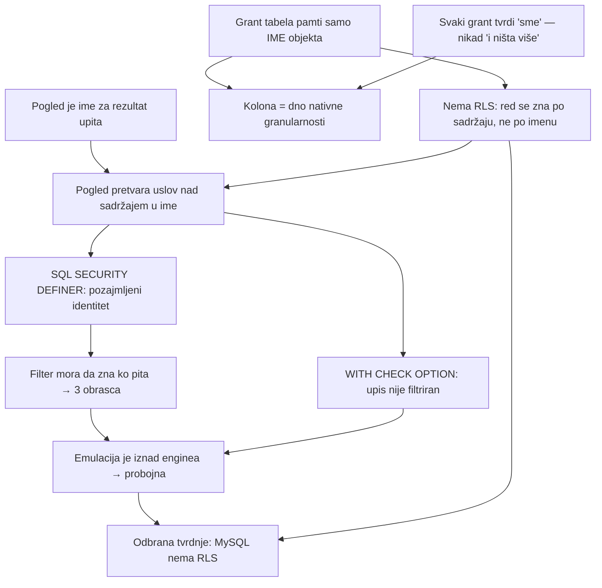

> [!quote] YOU

> [!note] SKILL loaded: teach

fgac i rls (fino-granularna kontrola pristupa i red-level security u MySQL-u)

> [!abstract] PI

I'll load the pedagogical engine and the workspace state first.

> [!abstract] PI

State loaded: mission, `NOTES.md`, index + records 0001 i 0004. Sledeća lekcija je poglavlje 4 — **FGAC i RLS**, i naslanja se tačno na ono što je već postavljeno (OR-kompozicija, kolone-privilegije, `v_my_branch_diagnoses` iz sandboxa).

Pre Faze 1, jedna stvar koju samo ti možeš da uradiš:

> [!question] Question
> Hoćeš li da ovu lekciju uživo mirror-ujem u Obsidian belešku?
>
> Prošla lekcija je bila logovana (lessons-live/0002-privilegije-i-uloge.md). Mirror je read-only — i dalje odgovaraš na kviz u terminalu, samo se lepše čita (LaTeX, tabele, mermaid).
>
> 1. Da — napravi novi fajl lessons-live/0003-fgac-i-rls.md (Preporučeno)
> 2. Da, ali u postojeći fajl koji ću navesti
> 3. Ne, samo terminal

> [!example] Answer
> 1. Da — napravi novi fajl lessons-live/0003-fgac-i-rls.md (Preporučeno)

> [!abstract] PI

Fajl je napravljen. Nalepi ovo u terminal pa mi javi kad je povezano:

```
/md-log lessons-live/0003-fgac-i-rls.md
```

Čekam potvrdu pre nego što krenem u Fazu 1 (mapiranje ivice znanja).


> [!quote] YOU

Nastavi


> [!abstract] PI

Idemo. **Faza 1 — mapiranje ivice.** Nekoliko kratkih pitanja, od lakšeg ka težem; cilj je da nađem tačno gde ti znanje prestaje, ne da te uhvatim.


> [!question] Quiz
> Koliko usko MySQL-ov `GRANT` može da opiše objekat na koji se privilegija odnosi?
>
> Misli na ono što se upisuje u grant tabele, na MySQL 8.4, bez ikakvih dodataka.
>
> 1. Do pojedinačnog reda tabele, preko uslova u `GRANT ... WHERE`
> 2. Do pojedinačne ćelije, kao presek reda i kolone
> 3. Do pojedinačne kolone tabele
> 4. Do pojedinačne tabele, ali ne i uže od toga


> [!question] Quiz — I don't know
> Your answer: I don't know
> Correct answer: 3
>
> Najuži nivo imenovanja objekta u grant tabelama je kolona (`mysql.columns_priv`): globalno → baza → tabela → kolona (+ rutine). Reda nema, jer red nije objekat sa imenom — on se identifikuje sadržajem, a grant tabela ume da zapiše samo ime. To je tačno rupa iz koje izrasta cela priča o RLS-u.


> [!abstract] PI

Zanimljivo — to je bilo u prošloj lekciji (nivoi privilegija), pa da proverim da li je pao ceo taj sloj ili samo ovaj detalj. Idem korak niže:


> [!question] Quiz
> Nalog ima `SELECT` na celoj tabeli `poliklinika.diagnoses` i, pored toga, `SELECT (icd_code)` na istoj tabeli. Šta taj nalog može da pročita?
>
> 1. Sve kolone tabele
> 2. Sve kolone, ali samo redove koje je sam uneo
> 3. Samo kolonu `icd_code`
> 4. Nijednu kolonu, jer su dve dodele u koliziji


> [!success] Quiz — correct ✓
> Your answer: 1. Sve kolone tabele
> Correct answer: 1
>
> Nivoi se sastavljaju po `OR`: $(\text{global}-\text{restrictions}) \lor db \lor table \lor column \lor routine$. Uža dodela nikada ne sužava širu — svaki red u grant tabeli tvrdi „sme", nijedan ne tvrdi „i ništa više". To je nosivi čvor prošle lekcije.


> [!abstract] PI

Dobro — OR-kompozicija drži. Sad strana koju poglavlje 4 stvarno koristi: pogledi.


> [!question] Quiz
> Pogled je definisan sa `SQL SECURITY DEFINER`. Nalog `doc_niksic` ima `SELECT` na pogledu, ali nema nijednu privilegiju na tabeli `diagnoses` koju pogled čita. Šta se dešava kad `doc_niksic` uradi `SELECT` iz pogleda?
>
> 1. Prolazi — pristup tabeli se proverava prema nalogu koji je pogled kreirao
> 2. Prolazi, ali vraća samo kolone na koje `doc_niksic` ima privilegiju
> 3. Pada — pristup tabeli se proverava prema nalogu koji je upit pokrenuo
> 4. Pada, jer `SELECT` na pogledu podrazumeva i `SELECT` na svim izvornim tabelama


> [!success] Quiz — correct ✓
> Your answer: 1. Prolazi — pristup tabeli se proverava prema nalogu koji je pogled kreirao
> Correct answer: 1
>
> Kod `SQL SECURITY DEFINER` server proverava pristup izvornim tabelama pod nalogom iz `DEFINER` klauzule, a pozivalac treba samo privilegiju na samom pogledu. To je mehanizam pozajmljenog identiteta — i tačno ono što omogućava da pogled bude sigurnosna granica, a ne samo skraćenica.


> [!abstract] PI

Solidno. Sad oštriji skok — pisanje kroz pogled:


> [!question] Quiz
> Pogled `v_my_branch_patients` je `DEFINER`, ažuriv, i filtrira `WHERE tenant_id = 1`. Nalog ima `INSERT` na pogledu, ali nema nikakvu privilegiju na izvornoj tabeli. Šta se desi sa `INSERT INTO v_my_branch_patients (..., tenant_id) VALUES (..., 2)`?
>
> 1. Red se upiše, ali sa `tenant_id` prečistim na 1 prema uslovu pogleda
> 2. Server odbije upis, jer red ne zadovoljava uslov iz definicije pogleda
> 3. Server odbije upis, jer ažurivi pogledi ne primaju `INSERT` bez privilegije na izvornoj tabeli
> 4. Red se upiše u izvornu tabelu sa `tenant_id = 2` i posle nije vidljiv kroz pogled


> [!question] Quiz — I don't know
> Your answer: I don't know
> Correct answer: 4
>
> Bez `WITH CHECK OPTION` MySQL ne proverava da li upisani red zadovoljava `WHERE` iz pogleda. Red ode u baznu tabelu (privilegije se proveravaju pod definer-om) i postane „nevidljiv" kroz sam pogled. Zato je `WITH CHECK OPTION` obavezan deo svake RLS emulacije koja dozvoljava pisanje.


> [!abstract] PI

Ivica nađena na strani upisa. Još jedan pramen — identitet u filteru:


> [!question] Quiz
> Unutar tela pogleda sa `SQL SECURITY DEFINER`, koji nalog vraća `CURRENT_USER()`, a koji `USER()`?
>
> 1. Obe vraćaju nalog koji se povezao, jer je sesija njegova
> 2. Obe vraćaju definer-a, jer se telo pogleda izvršava pod njegovim identitetom
> 3. `CURRENT_USER()` vraća definer-a, `USER()` vraća nalog koji se povezao
> 4. `CURRENT_USER()` vraća nalog koji se povezao, `USER()` vraća definer-a


> [!question] Quiz — I don't know
> Your answer: I don't know
> Correct answer: 3
>
> Note: Nisam bas siguran sta je SQL SECURITY DEFINER
>
> `CURRENT_USER()` je nalog čije se privilegije trenutno proveravaju — u definer kontekstu to je definer. `USER()` je nalog i host koji su se stvarno povezali i nikad se ne menja. Posledica za RLS emulaciju je ozbiljna: filter po `CURRENT_USER()` unutar `DEFINER` pogleda filtrira po pogrešnoj osobi.


> [!abstract] PI

Ivica je sad jasno bracket-ovana, i tvoja beleška je najkorisniji nalaz u celoj fazi:

- **Pod (drži):** nivoi privilegija i OR-kompozicija, iz prošle lekcije — čvrsto.
- **Plafon:** `DEFINER`/`INVOKER` kao stvaran mehanizam (pitanje si pogodio **izvođenjem iz imena**, ne zato što ga držiš), `WITH CHECK OPTION`, `CURRENT_USER()` vs `USER()`, i — najvažnije — *zašto* kolona jeste dno granularnosti.

Znači lekcija ne kreće od „evo tri RLS obrasca", nego od toga zašto reda nema u grant tabeli.


> [!question] Question
> Šta je cilj ove lekcije za tebe — u čemu hoćeš da budeš jak kad završimo?
>
> Poglavlje 4 ima 4 strane budžeta: kolone-privilegije i njihov plafon, pogledi (DEFINER/INVOKER, WITH CHECK OPTION), tri obrasca emulacije RLS-a, pa kontrast sa PostgreSQL/Oracle.
>
> 1. Da mogu da odbranim tvrdnju „MySQL nema RLS" — zašto, i šta se tačno radi umesto toga (Preporučeno)
> 2. Prvo praktično: da sam napišem RLS pogled nad `poliklinika` i vidim ga kako puca
> 3. Fokus na poređenje sa PostgreSQL-om i Oracle-om


> [!example] Answer
> 1. Da mogu da odbranim tvrdnju „MySQL nema RLS" — zašto, i šta se tačno radi umesto toga (Preporučeno)


> [!abstract] PI

**Faza 2 — plan.** Prvo da se prizemljim u već proverene izvore, ne u pamćenje.


> [!abstract] PI

Memo 04 pokriva sve, i već znam gde greši (tvrdnja o `SELECT *`, ispravljena u zapisu 0001). Evo plana.

## Pristup

Ne krećemo od liste feature-a nego od jedne rečenice koju već držiš: **grant tabela ume da zapiše samo *ime* objekta**. Iz nje ispada i plafon (kolona) i cela odsutnost RLS-a — red se ne identifikuje imenom nego **sadržajem**, a za sadržaj nema gde da se zakači red u tabeli. To je isti uzrok kao RBAC₂ rupa iz prošle lekcije, pa se dve lekcije spajaju u jednu rečenicu.

Onda obilaznica: **pogled je ime za rezultat upita** — jedini način da uslov nad sadržajem dobije ime. Odatle moraju da ispadnu, redom, `SQL SECURITY DEFINER` (inače je pogled skraćenica, ne granica), problem identiteta u filteru (`CURRENT_USER()` vs `USER()` — tvoja rupa), pa `WITH CHECK OPTION` (jer filtriranje čitanja ne filtrira upis — druga tvoja rupa). Zatvaramo kontrastom: PostgreSQL/Oracle to rade **unutar** enginea, MySQL emulacija živi **iznad** njega — i zato se probija.

`SQL SECURITY DEFINER` dobija punu obradu, ne uzgrednu — pogodio si ga izvođenjem iz imena, a lekcija ga koristi kao nosivi čvor.

## Mapa zavisnosti



Jedan opipljiv dobitak: posle ovoga možeš da pogledaš `v_my_branch_diagnoses` iz svog sandboxa i tačno kažeš **šta on štiti, a šta ne**.

Da krenem sa čvorom U1 → D2, ili hoćeš da promenim raspored?


> [!quote] YOU

Moze


> [!abstract] PI

# Čvor 1 — grant tabela pamti samo *ime*

**Zašto ovo, sad.** Cilj poglavlja je konkretna politika: *„doktor sme da vidi samo pacijente svoje podružnice."* Prirodno je prvo pokušati da se ona napiše kao `GRANT`, kao i svaka druga politika do sada. Pa hajde bukvalno da probamo.

Pogledaj šta `GRANT` ume da imenuje:

```sql
GRANT SELECT ON *.*                      TO doc_niksic;  -- globalno
GRANT SELECT ON poliklinika.*            TO doc_niksic;  -- baza
GRANT SELECT ON poliklinika.patients     TO doc_niksic;  -- tabela
GRANT SELECT (name, tenant_id) ON poliklinika.patients TO doc_niksic;  -- kolona
```

**Nesporna istina:** svaki od ova četiri oblika radi istu stvar — upisuje red u grant tabelu u kome piše **ime naloga, ime objekta i privilegija**. `mysql.db` ima kolonu `Db`. `mysql.tables_priv` ima `Db` + `Table_name`. `mysql.columns_priv` dodaje `Column_name`. To su obična imena, `VARCHAR`, ništa više.

Zato je i sama lista nivoa izvedena, a ne naučena napamet: **nivoi su tačno oni koje imenovanje objekta u SQL-u dozvoljava** — `baza.tabela.kolona`, plus globalno kao „bilo koje ime" i rutine kao druga vrsta imenovanog objekta. Nema petog nivoa jer nema pete komponente imena.

**Veza sa prošlom lekcijom:** ovo je ista rečenica iz koje si već izveo OR-kompoziciju — privilegija je red u običnoj tabeli. Sad je koristimo za drugu stvar: ne *kako se sastavljaju*, nego *šta uopšte umeju da opišu*.


> [!question] Quiz
> Zašto MySQL nema nivo privilegija uži od kolone?
>
> 1. Zato što bi provera na užem nivou bila prespora za izvršavanje po upitu
> 2. Zato što ništa uže od kolone nema ime kojim bi grant tabela mogla da ga zapiše
> 3. Zato što bi uži nivo narušio OR-kompoziciju između postojećih nivoa
> 4. Zato što je uži nivo pokriven `partial_revokes` mehanizmom


> [!success] Quiz — correct ✓
> Your answer: 2. Zato što ništa uže od kolone nema ime kojim bi grant tabela mogla da ga zapiše
> Correct answer: 2
>
> Nivoi prate imenovanje objekta: `baza.tabela.kolona` (+ globalno, + rutine). Grant tabela ima kolone za imena, i ništa drugo — pa se privilegija može vezati samo za ono što ime ima. Ćelija, red, vremenski prozor: nemaju ime, nemaju gde da se upišu.


> [!abstract] PI

Čvor drži. 

# Čvor 2 — zašto reda nema u toj slici

Sad primeni isto pravilo na naš zahtev. Kolona `diagnosis_text` ima ime — zato `GRANT SELECT (diagnosis_text)` postoji. A red u tabeli `patients`?

Pre nego što kažem: pokušaj sam.


> [!question] Quiz
> Po čemu se red u tabeli suštinski razlikuje od kolone, iz ugla grant tabele?
>
> Ne po tome šta ti misliš da je važnije — po tome šta bi se moralo upisati u grant tabelu da bi se privilegija vezala za njega.
>
> 1. Red pripada podacima a kolona šemi, pa se privilegije na redove proveravaju u drugoj fazi
> 2. Red se identifikuje primarnim ključem, koji grant tabela ne ume da uporedi sa imenom naloga
> 3. Redova ima previše, pa bi grant tabela morala da naraste srazmerno podacima
> 4. Red se identifikuje uslovom nad svojim sadržajem, a kolona fiksnim imenom iz šeme


> [!success] Quiz — correct ✓
> Your answer: 4. Red se identifikuje uslovom nad svojim sadržajem, a kolona fiksnim imenom iz šeme
> Correct answer: 4
>
> Ime kolone je deo šeme: postoji pre podataka, ne menja se kad se podaci menjaju, i može se zapisati kao `VARCHAR`. Red nema takvo ime — „redovi doktora iz Nikšića" je **uslov nad sadržajem** (`tenant_id = 2`), predikat, a ne identifikator. Zanimljivo je da je i „ima ih previše" tačno kao opažanje, ali nije uzrok: čak i kad bi ih bilo tri, i dalje ne bi imali ime.


> [!abstract] PI

Znači, izvedeno u dva koraka:

> Grant tabela ume da zapiše **ime**. Red se ne zna po imenu nego po **predikatu**. Zato u MySQL-u **nema gde da se upiše** privilegija na red — i to nije propust implementacije, nego posledica oblika grant tabele.

**Ovo je rečenica kojom braniš celo poglavlje.** I obrati pažnju da je ista po formi kao verdikt iz prošle lekcije: RBAC₂ (razdvajanje dužnosti) ne postoji jer **nema se za šta zakačiti ograničenje**; RLS ne postoji jer **nema se za šta zakačiti privilegija**. Jedan uzrok, dve rupe, jedna rečenica u radu.

# Čvor 3 — obilaznica: ime za predikat

Ako je problem u tome što predikat nema ime — rešenje se samo nameće: **daj predikatu ime.**

To je tačno šta je pogled. `CREATE VIEW v AS SELECT ... WHERE tenant_id = 2` uzima upit (dakle: predikat nad sadržajem) i pravi od njega **imenovan objekat u šemi**. A na imenovan objekat `GRANT` ume da se zakači, jer je opet samo red u `mysql.tables_priv` — `Db` = `poliklinika`, `Table_name` = `v_my_branch_diagnoses`.

```sql
GRANT SELECT ON poliklinika.v_my_branch_diagnoses TO role_doctor;
```

Server tu ne radi ništa novo. Isti dvostepeni check, isti red u istoj tabeli. Ceo trik je što je predikat **prokrijumčaren u ime**.

To je i strukturna rečenica koju već znaš iz prošle lekcije, treći put: **kad oblik grant tabele nešto ne može da izrazi, MySQL to napiše izvan tog oblika** — JSON na nalogu (`partial_revokes`), serverska promenljiva (`mandatory_roles`), a sad objekat u šemi (pogled).


> [!question] Quiz
> U kom smislu pogled rešava problem koji grant tabela ne može da reši?
>
> 1. Daje predikatu ime, pa se privilegija vežuje za to ime kao za bilo koju tabelu
> 2. Dozvoljava da se u grant tabelu upiše uslov, u koloni predviđenoj za filter
> 3. Uvodi novi nivo provere privilegija, uži od kolone, koji se proverava po redu
> 4. Pomera proveru privilegija iz druge faze u prvu, pre nego što se redovi pročitaju


> [!failure] Quiz — incorrect ✗
> Your answer: 3. Uvodi novi nivo provere privilegija, uži od kolone, koji se proverava po redu
> Correct answer: 1
>
> Ništa se u mehanizmu privilegija ne menja — nema novog nivoa ni nove kolone. Pogled je samo još jedan imenovan objekat u šemi, a njegova definicija nosi predikat. Privilegija i dalje govori o imenu; ime sad slučajno znači „samo ovi redovi".


> [!abstract] PI

Ovo je važan promašaj i vredi ga razmontirati — jer je to tačno greška koju bi profesor tražio u radu.

**Filtriranje kroz pogled nije provera privilegija.** To su dve različite stvari koje se dešavaju u različitim delovima servera:

| | Ko to radi | Šta se desi ako ne prođe |
|---|---|---|
| `GRANT SELECT ON v_my_branch_diagnoses` | podsistem privilegija, čita grant tabele | `ERROR 1142` — odbijen pristup |
| `WHERE tenant_id = 2` u telu pogleda | **izvršilac upita**, isti kod koji izvršava svaki `WHERE` | ništa — red se prosto ne pojavi u rezultatu |

Server pri proveri privilegija **ne zna ni da je to pogled**. U `mysql.tables_priv` stoji `Table_name = 'v_my_branch_diagnoses'` i to je za njega ime kao i svako drugo. Ne postoji nikakav „nivo reda" koji bi bio uveden — provera se i dalje zaustavlja na kolonama, tačno kao u čvoru 1.

Redovi otpadaju **jednim običnim `WHERE`-om**, kao u bilo kom upitu koji si ikad napisao.

I upravo odatle ispada sve što sledi u lekciji: pošto je to samo `WHERE` a ne provera prava, ono **ne štiti ništa samo po sebi** — štiti tek ako nalogu istovremeno oduzmeš pristup baznoj tabeli. Ta razlika (predikat u upitu vs. odluka o pristupu) je razlog zašto se emulacija probija, a nativni RLS u PostgreSQL-u ne.


> [!question] Quiz
> Nalog ima `SELECT` na pogledu `v_my_branch_diagnoses` (filtrira `tenant_id = 2`) i, nezavisno, `SELECT` na baznoj tabeli `diagnoses`. Šta taj nalog može da pročita?
>
> 1. Sve redove tabele `diagnoses`, upitom direktno nad tabelom
> 2. Sve redove, ali samo kroz pogled; direktan upit nad tabelom pada
> 3. Samo redove sa `tenant_id = 2`, jer uža dodela na pogledu ima prednost nad širom
> 4. Samo redove sa `tenant_id = 2`, jer filter pogleda važi za nalog kome je pogled dodeljen


> [!success] Quiz — correct ✓
> Your answer: 1. Sve redove tabele `diagnoses`, upitom direktno nad tabelom
> Correct answer: 1
>
> Filter živi u telu pogleda i pokreće se samo kad se upit piše nad pogledom. Grant na tabeli je zaseban red u grant tabeli i po OR-kompoziciji stoji sam za sebe — `SELECT * FROM diagnoses` prolazi i vraća sve podružnice. Pogled izoluje **samo** ako bazna tabela nije dostupna.


> [!abstract] PI

Tačno. I to je bukvalno stanje u tvom sandboxu: `doc_podgorica` kroz `v_my_branch_diagnoses` vidi samo svoju podružnicu, ali nad sirovom tabelom vidi sve tri — jer mu je namerno ostavljen širok grant.

# Čvor 4 — `SQL SECURITY DEFINER`

Iz prethodnog zaključka ispada zahtev: **nalogu se mora oduzeti pristup baznoj tabeli.** Ali onda nastaje očigledan problem — pogled *čita* tu istu tabelu. Ako nalog nema pravo na `diagnoses`, kako upit kroz pogled uopšte može da uspe?

Ovde je razvilica koju je neko morao da odluči: **čije privilegije se proveravaju kad se telo pogleda izvrši?** Postoje tačno dva razumna odgovora, i MySQL nudi oba:

```sql
CREATE DEFINER = 'dbadmin'@'localhost'
  SQL SECURITY DEFINER            -- ili: SQL SECURITY INVOKER
  VIEW v_my_branch_diagnoses AS
  SELECT ... FROM diagnoses WHERE ...;
```

- **`SQL SECURITY DEFINER`** (podrazumevano): telo se proverava prema nalogu iz `DEFINER` klauzule. Pozivalac treba **samo** `SELECT` na pogledu; ne treba mu ništa na `diagnoses`.
- **`SQL SECURITY INVOKER`**: telo se proverava prema nalogu koji je pokrenuo upit. Njemu trebaju privilegije na **svakoj** tabeli koju pogled dodiruje.

Zato jedino `DEFINER` daje sigurnosnu granicu: pozivalac dobija podatak koji sam ne bi smeo da uzme, ali **isključivo kroz taj predikat**. Pogled postaje **pozajmljeni identitet** — kontrolisan kanal do tabele koja mu je zabranjena. `INVOKER` ne izoluje ništa, jer zahteva da pozivalac ionako već ima pravo na tabelu.

I to je, uzgred, tačno bagovalo kad si dizao sandbox: `v_my_branch_diagnoses` je `INVOKER`, i pao je sa `ERROR 1356` dok `role_doctor` nije dobio grant i na `staff`, koji se u telu koristi samo da razreši `CURRENT_USER()` u `tenant_id`.


> [!question] Quiz
> Zašto `SQL SECURITY INVOKER` pogled ne može da posluži kao izolacija po redovima?
>
> 1. Zato što `INVOKER` pogledi ne mogu da se navedu u `GRANT` naredbi
> 2. Zato što se `WHERE` iz tela pogleda kod `INVOKER` bezbednosti ne primenjuje na rezultat
> 3. Zato što se kod `INVOKER` bezbednosti privilegije proveravaju samo pri kreiranju pogleda, ne pri upitu
> 4. Zato što zahteva da pozivalac već ima privilegije na baznim tabelama, koje onda može da čita direktno


> [!failure] Quiz — incorrect ✗
> Your answer: 3. Zato što se kod `INVOKER` bezbednosti privilegije proveravaju samo pri kreiranju pogleda, ne pri upitu
> Correct answer: 4
>
> Filter i dalje radi — `INVOKER` pogled uredno vraća samo svoje redove. Problem je što je taj pogled tada samo pogodnost: da bi ga uopšte koristio, nalogu su potrebne privilegije na baznim tabelama, pa ih može zaobići jednim direktnim upitom. Granicu pravi tek `DEFINER`, jer on dozvoljava da se pozivaocu bazna tabela oduzme.


> [!abstract] PI

Dobar promašaj — pokazuje da se dve nezavisne stvari slepile: **kada** se proverava i **čije** se proverava.

**Kada** je već rešeno u prošloj lekciji, i ne menja se nikad: provera je **druga faza**, i teče **po svakom zahtevu**, u trenutku izvršavanja. Zato oduzimanje privilegije nalogu odmah utiče na sledeći upit, bez ponovnog kreiranja bilo čega. Da se proveravalo pri kreiranju, `REVOKE` ne bi imao efekta dok se pogled ne prepravi — a ima.

`SQL SECURITY` uopšte ne dira taj mehanizam. On odgovara na jedno jedino pitanje:

> Kad se telo pogleda izvršava, **čiji red u grant tabeli** server gleda — pozivaočev ili definer-ov?

Vreme provere isto, tabela ista, algoritam isti. Menja se samo **za koji nalog** se pretražuje.

I zato `INVOKER` ne izoluje: proverava se pozivalac, znači pozivalac **mora** imati grant na `diagnoses` — a čim ga ima, `SELECT * FROM diagnoses` mu prolazi i pogled je zaobiđen. Kod `DEFINER` se proverava `dbadmin`, pa se pozivaocu bazna tabela može mirno oduzeti.


> [!question] Quiz
> Šta tačno menja `SQL SECURITY DEFINER` u odnosu na `SQL SECURITY INVOKER`?
>
> 1. U kom trenutku se prava na tabele proveravaju — pri kreiranju umesto pri svakom upitu
> 2. Na kom nivou se prava na tabele proveravaju — na nivou reda umesto na nivou tabele
> 3. Čiji se nalog koristi pri proveri prava na tabele koje telo pogleda čita
> 4. Da li se prava na tabele uopšte proveravaju kad se pristupa preko pogleda


> [!success] Quiz — correct ✓
> Your answer: 3. Čiji se nalog koristi pri proveri prava na tabele koje telo pogleda čita
> Correct answer: 3
>
> Provera se dešava uvek, u drugoj fazi, po svakom zahtevu, na istim nivoima. `SQL SECURITY` bira isključivo **subjekat** provere: definer ili pozivalac.


> [!abstract] PI

# Čvor 5 — a ko sad pita?

Sad imamo granicu, ali smo napravili novi problem. Pogled treba da filtrira **po tome ko pita** (`tenant_id` te osobe). Do sada je to radio preko `CURRENT_USER()`. A upravo smo rekli da telo pogleda ide pod definer-ovim identitetom.

Izvedi sam, iz definicije: `CURRENT_USER()` vraća nalog **čije privilegije server trenutno proverava**.


> [!question] Quiz
> `doc_niksic` čita `DEFINER = 'dbadmin'@'localhost'`, `SQL SECURITY DEFINER` pogled. Šta u telu tog pogleda vraćaju `CURRENT_USER()` i `USER()`?
>
> 1. `CURRENT_USER()` → `dbadmin@localhost`, `USER()` → `doc_niksic@...`
> 2. `CURRENT_USER()` → `doc_niksic@...`, `USER()` → `dbadmin@localhost`
> 3. Obe → `doc_niksic@...`
> 4. Obe → `dbadmin@localhost`


> [!failure] Quiz — incorrect ✗
> Your answer: 2. `CURRENT_USER()` → `doc_niksic@...`, `USER()` → `dbadmin@localhost`
> Correct answer: 1
>
> `CURRENT_USER()` prati subjekat provere prava — u definer kontekstu to je definer. `USER()` prijavljuje nalog i host koji su se stvarno povezali i ne menja se nikad, ni u jednom kontekstu. To je isti par koji si sreo u zapisu o audit logu: opšti log beleži nalog koji se povezao, nikad efektivni definer nalog.


> [!abstract] PI

Ovo je zamka u samom imenu: „current" zvuči kao „onaj koji trenutno sedi za tastaturom". Nije. Izvedimo par kako treba — i to bez pogleda uopšte, na slučaju koji si već video.

Nalog `doc_niksic` je u `mysql.user` upisan kao `'doc_niksic'@'%'`. Konektuje se sa mašine `192.168.1.5`:

```sql
SELECT USER(), CURRENT_USER();
-- USER()         → doc_niksic@192.168.1.5
-- CURRENT_USER() → doc_niksic@%
```

Različiti su, a nema nikakvog pogleda u priči. Otud i podela:

- **`USER()`** = šta je klijent **doneo** pri konekciji: korisničko ime i stvarni host. Utvrđeno pri loginu, nepromenljivo do kraja sesije.
- **`CURRENT_USER()`** = **koji red iz `mysql.user` je uparen** i po kom se čitaju prava. To je onaj isti red iz prošle lekcije — nalog kao red u tabeli.

Zato `SHOW GRANTS FOR CURRENT_USER()` ima smisla, a `SHOW GRANTS FOR USER()` bi bio besmislen: grantovi vise o **uparenom redu**, ne o tome sa koje si IP adrese došao.

I sad definer kontekst nije novo pravilo, nego ista rečenica: ako se prava proveravaju po `dbadmin`-ovom redu, onda je `CURRENT_USER()` po definiciji `dbadmin`. **`CURRENT_USER()` prati privilegije; `USER()` prati konekciju.**

Praktična posledica, i to ona koja obara naivnu emulaciju: filter `WHERE tenant_id = f(CURRENT_USER())` unutar `DEFINER` pogleda filtrira **po definer-u** — svima isto, i izolacija tiho nestaje.


> [!question] Quiz
> Nalog `'doc_niksic'@'%'` konektovan sa `10.0.0.7` pozove proceduru sa `DEFINER = 'dbadmin'@'localhost'` i `SQL SECURITY DEFINER`. Šta u telu procedure vraća `USER()`?
>
> 1. `doc_niksic@10.0.0.7`
> 2. `dbadmin@localhost`
> 3. `doc_niksic@%`
> 4. `dbadmin@10.0.0.7`


> [!failure] Quiz — incorrect ✗
> Your answer: 2. `dbadmin@localhost`
> Correct answer: 1
>
> `USER()` je ono što je klijent doneo pri konekciji — ime plus **stvarni** host — i ne menja ga ni definer kontekst ni wildcard uparivanje. `doc_niksic@%` bi bio `CURRENT_USER()` u običnom kontekstu, a `dbadmin@localhost` je `CURRENT_USER()` u ovom, definer kontekstu.


> [!abstract] PI

Stani, ovo treba zakucati jednim pravilom umesto izvođenjem — očigledno se par okreće u glavi. Evo ga u obliku koji ne može da se preokrene:

> **`USER()` se postavlja pri loginu i posle toga se ne menja NIKAD, ni od čega.**

Definer se pojavljuje **tek usred sesije**, u trenutku kad pozoveš pogled ili proceduru. Nešto što se dešava usred sesije ne može da utiče na vrednost zamrznutu pri loginu. Dakle:

**`USER()` ne može da bude definer. Ikad. Ni u jednom scenariju.** Ako se u odgovoru pojavi definer, jedini kandidat je `CURRENT_USER()`.

| | `USER()` | `CURRENT_USER()` |
|---|---|---|
| Šta je | ko se konektovao | pod čijim pravima se radi |
| Kad se postavlja | pri loginu, jednom | pri svakoj proveri prava |
| Menja se u sesiji | ne | da (definer kontekst) |
| Host koji pokazuje | stvarni (`10.0.0.7`) | iz uparenog reda (`%`) |

Provera koju možeš uraditi u glavi za pola sekunde: *„da li se ovo pita o nečemu što se menja usred sesije?"* Ako da → `CURRENT_USER()`. Ako ne → `USER()`.


> [!question] Quiz
> Koja od ovih vrednosti se može promeniti u toku jedne već uspostavljene sesije?
>
> 1. Nijedna
> 2. Obe
> 3. `CURRENT_USER()`
> 4. `USER()`


> [!success] Quiz — correct ✓
> Your answer: 3. `CURRENT_USER()`
> Correct answer: 3
>
> `USER()` je zamrznut pri loginu. `CURRENT_USER()` prati subjekat provere prava, pa se menja čim se uđe u definer kontekst — i vraća na staro po izlasku.


> [!abstract] PI

Sad isto pitanje u primenjenom obliku:


> [!question] Quiz
> `nurse_podgorica`, konektovana sa `10.0.0.7`, čita pogled sa `DEFINER = 'dbadmin'@'localhost'` i `SQL SECURITY DEFINER`. Šta telo pogleda dobija?
>
> 1. `USER()` → `dbadmin@localhost`, `CURRENT_USER()` → `nurse_podgorica@10.0.0.7`
> 2. `USER()` → `nurse_podgorica@10.0.0.7`, `CURRENT_USER()` → `dbadmin@localhost`
> 3. `USER()` → `nurse_podgorica@10.0.0.7`, `CURRENT_USER()` → `nurse_podgorica@%`
> 4. `USER()` → `dbadmin@localhost`, `CURRENT_USER()` → `dbadmin@localhost`


> [!success] Quiz — correct ✓
> Your answer: 2. `USER()` → `nurse_podgorica@10.0.0.7`, `CURRENT_USER()` → `dbadmin@localhost`
> Correct answer: 2
>
> `USER()` je zamrznut pri loginu, pa ostaje `nurse_podgorica` sa stvarnim hostom. `CURRENT_USER()` je subjekat provere prava, a u `SQL SECURITY DEFINER` telu to je definer. Treća opcija bi bila tačna da je pogled `SQL SECURITY INVOKER`.


> [!abstract] PI

# Čvor 6 — tri obrasca, i zašto ih je baš tri

Pitanje je sad usko: **odakle filter saznaje ko pita?** Prebroj mogućnosti — nema ih beskonačno.

**A. Iz identiteta MySQL naloga.** Svaki doktor je zaseban nalog, filter mapira nalog u `tenant_id`.
```sql
WHERE tenant_id = (SELECT tenant_id FROM staff WHERE db_user = SUBSTRING_INDEX(USER(), '@', 1))
```
Puca na: **jedan nalog po korisniku** ne skalira, i ne postoji kod aplikacija koje sve provlače kroz jedan `app` nalog (connection pooling).

**B. Iz sesijske promenljive.** Aplikacija po loginu postavi `SET @tenant_id = 2`, pogled filtrira po njoj.
```sql
WHERE tenant_id = @tenant_id
```
Puca na: **klijent sam sme da je promeni** — `SET @tenant_id = 3` i vidi tuđu podružnicu. Uz to, u pool-u konekcija promenljiva ostane od prethodnog korisnika.

**C. Iz parametra procedure.** Nalog ima samo `EXECUTE`, nikakav pristup tabelama; procedura je jedini ulaz.
```sql
CALL get_branch_diagnoses(2);
```
Puca na: procedura mora **sama** da proveri sme li pozivalac taj `tenant_id` — inače je parametar prosto zahtev, a klijent pošalje koji hoće.

Obrati pažnju na oblik promašaja: A je zaštićen (identitet garantuje server), ali ne skalira. B i C skaliraju, ali identitet dolazi **od klijenta**, pa ih čuva samo aplikacijska disciplina. To je ista dilema koju ćeš u poglavlju 7 sresti kao sudar least-privilege principa i connection poolinga.


> [!question] Quiz
> Šta je zajednički uzrok slabosti obrazaca B (sesijska promenljiva) i C (parametar procedure)?
>
> 1. Oba zahtevaju zaseban MySQL nalog po korisniku, pa broj naloga raste
> 2. Oba se oslanjaju na `CURRENT_USER()`, koji u definer kontekstu vraća definer-a
> 3. Podatak po kome se filtrira dolazi od klijenta, a ne od servera
> 4. Filter se u oba slučaja izvršava pod pozivaočevim privilegijama, pa može da se zaobiđe


> [!success] Quiz — correct ✓
> Your answer: 3. Podatak po kome se filtrira dolazi od klijenta, a ne od servera
> Correct answer: 3
>
> Kod A identitet garantuje sam server: nalog je autentifikovan i klijent ga ne može falsifikovati. Kod B i C server prima broj — iz `SET` naredbe ili iz parametra — i nema načina da zna da li je taj broj zaslužen. Zaštita se seli iz baze u aplikaciju.


> [!abstract] PI

# Čvor 7 — pisanje

Sve do sad je bilo o čitanju. Ali `v_my_branch_patients` je ažuriv pogled — kroz njega se sme i pisati. Izvedi šta se dešava sa `INSERT`-om.

`WHERE tenant_id = 2` je deo **upita koji proizvodi redove**. Kod `INSERT`-a nema tog upita: vrednosti idu pravo u baznu tabelu, provera prava po definer-u prođe, i red je upisan. **`WHERE` uopšte ne učestvuje** — nema ga u putanji.

Rezultat je pomalo sablastan: nalog upiše red sa `tenant_id = 3`, red stvarno postoji u `patients`, ali ga kroz svoj pogled **ne vidi**. Ubacio je podatak u tuđu podružnicu.

Zato postoji eksplicitna klauzula koja tera server da uslov primeni i na upis:

```sql
CREATE VIEW v_my_branch_patients AS
  SELECT * FROM patients WHERE tenant_id = 2
  WITH CASCADED CHECK OPTION;
```

Sad `INSERT` sa `tenant_id = 3` biva odbijen. Dve varijante: **`LOCAL`** proverava samo uslov ovog pogleda, **`CASCADED`** (podrazumevano) i uslove svih pogleda ispod njega.

I to je tačno mesto gde se vidi da emulacija nije politika nego skup ručno spojenih delova: kod nativnog RLS-a jedan `CREATE POLICY` važi i za čitanje i za upis; ovde su to dve nezavisne odluke, i drugu je lako zaboraviti.


> [!question] Quiz
> Ažuriv `DEFINER` pogled filtrira `WHERE tenant_id = 2` i nema `WITH CHECK OPTION`. Nalog ima `INSERT` na pogledu i ništa na baznoj tabeli. Šta se desi sa `INSERT`-om koji nosi `tenant_id = 3`?
>
> 1. Server odbije upis, jer nalog nema `INSERT` na baznoj tabeli
> 2. Red se upiše u baznu tabelu i ostane nevidljiv kroz pogled
> 3. Server odbije upis, jer red ne zadovoljava uslov iz definicije pogleda
> 4. Red se upiše, ali sa `tenant_id` postavljenim na 2 prema uslovu pogleda


> [!failure] Quiz — incorrect ✗
> Your answer: 3. Server odbije upis, jer red ne zadovoljava uslov iz definicije pogleda
> Correct answer: 2
>
> Bez `WITH CHECK OPTION` uslov pogleda ne učestvuje u putanji upisa. Prava se proveravaju po definer-u, pa upis prolazi, a red završi izvan opsega pogleda — vidljiv svima ostalima, nevidljiv onom ko ga je uneo.


> [!abstract] PI

Uporna intuicija — i razumem odakle: pogled deluje kao prozor kroz koji ne možeš progurati nešto što je izvan okvira. Ali server ne radi tako.

**Prvi argument, mehanički.** Server `INSERT` kroz pogled prepiše u `INSERT` nad baznom tabelom:

```sql
INSERT INTO v_my_branch_patients (name, tenant_id) VALUES ('Marko', 3);
--  ↓ server prepisuje u:
INSERT INTO patients            (name, tenant_id) VALUES ('Marko', 3);
```

Pogledaj donju naredbu i pitaj se: **gde bi tu uopšte stao `WHERE tenant_id = 2`?** Nigde. `INSERT ... VALUES` nema `WHERE` klauzulu. Nema šta da se filtrira — nema redova koji se čitaju, ima samo vrednosti koje se upisuju. Da bi se uslov ipak primenio, server bi morao da uradi nešto **dodatno**: da izračuna predikat nad još nepostojećim redom i odbije naredbu. To je zaseban posao, i mora se tražiti.

**Drugi argument, jači — iz samog postojanja klauzule.** Ako bi uslov pogleda ionako važio za upis, čemu onda `WITH CHECK OPTION`? Bila bi klauzula bez ijedne posledice. **Njeno postojanje je dokaz da podrazumevano ponašanje ne proverava ništa.** Isto važi i za `UPDATE`: bez nje red možeš da „izgurate" iz pogleda menjanjem `tenant_id` u 3, i on ti nestane iz vidokruga.

Formulacija koju vredi zapamtiti za odbranu: **filter pogleda ograničava šta se vidi, ne šta se sme napisati** — dok se to izričito ne zatraži.


> [!question] Quiz
> Šta bi bila posledica kada bi MySQL podrazumevano primenjivao uslov pogleda i na `INSERT` i `UPDATE`?
>
> 1. Klauzula `WITH CHECK OPTION` bi važila samo za ugnežđene poglede
> 2. Ažurivi pogledi ne bi mogli da postoje, jer se uslov ne može izračunati pre upisa
> 3. `SQL SECURITY DEFINER` ne bi više bio potreban za izolaciju po redovima
> 4. Klauzula `WITH CHECK OPTION` ne bi imala nikakvu funkciju


> [!failure] Quiz — incorrect ✗
> Your answer: 2. Ažurivi pogledi ne bi mogli da postoje, jer se uslov ne može izračunati pre upisa
> Correct answer: 4
>
> Klauzula postoji baš zato što podrazumevano ponašanje ne proverava upis. Njeno postojanje je najjednostavniji dokaz da uslov pogleda sam po sebi ne ograničava pisanje. (`CASCADED`/`LOCAL` uređuju samo koliko duboko se proverava, ne da li se proverava.)


> [!abstract] PI

Vidim gde je stvarna kočnica, i nije sitnica: pretpostavljaš da server **ne može** da proveri uslov pre upisa. Može, i to lako.

Kod `INSERT INTO ... VALUES ('Marko', 3)` server drži sve vrednosti budućeg reda **u ruci**, pre nego što išta upiše. Uslov `tenant_id = 2` je obična aritmetika nad tim vrednostima: uzmi 3, uporedi sa 2, ne valja, odbij. Nikakva prepreka ne postoji — potpuno isto kao `CHECK` ograničenje ili okidač.

Dakle nije pitanje mogućnosti nego **podrazumevane vrednosti**, i MySQL je izabrao „ne proveravaj":

| | bez `WITH CHECK OPTION` | sa `WITH CHECK OPTION` |
|---|---|---|
| `SELECT` | filtrira | filtrira (isto) |
| `INSERT` sa `tenant_id = 3` | prolazi, red odlazi izvan pogleda | `ERROR 1369` |
| `UPDATE` koji menja `tenant_id` u 3 | prolazi, red nestaje iz pogleda | `ERROR 1369` |

Ovo je uzgred i primer onoga na šta te je `NOTES.md` već upozorio: **neke stvari su odluke, ne posledice.** Ne postoji dublji princip iz koga ispada da MySQL ne proverava upis — moglo je i drugačije; standard je prosto tako napisan, i za drugo ponašanje se traži klauzula.


> [!question] Quiz
> Ažuriv `DEFINER` pogled sa `WHERE tenant_id = 2`, **bez** `WITH CHECK OPTION`. Nalog pošalje `UPDATE` koji postojećem svom redu menja `tenant_id` sa 2 na 3. Šta se desi?
>
> 1. Izmena prođe i red nestane iz pogleda
> 2. Izmena prođe, ali `tenant_id` ostane 2
> 3. Izmena bude odbijena, jer `UPDATE` kroz pogled traži privilegiju na baznoj tabeli
> 4. Izmena bude odbijena sa `ERROR 1369`


> [!success] Quiz — correct ✓
> Your answer: 1. Izmena prođe i red nestane iz pogleda
> Correct answer: 1
>
> Bez klauzule server ne poredi novi red sa uslovom pogleda. Izmena se izvrši, red i dalje postoji u `patients`, ali ispadne iz opsega pogleda — nalog ga više ne vidi niti može da ga vrati. Sa `WITH CHECK OPTION` isti `UPDATE` bi pao na `ERROR 1369`.


> [!abstract] PI

# Čvor 8 — zašto je ovo emulacija, a ne RLS

Skupi sve promašaje u jedan uzrok. Svaki od njih je oblika: **politika važi samo ako korisnik prođe kroz određena vrata.** Direktan upit nad tabelom, `SET @tenant_id = 3`, `INSERT` bez `CHECK OPTION`, `CALL` sa tuđim parametrom — sve su to putevi **pored** pogleda.

PostgreSQL rešava drugačije:

```sql
ALTER TABLE patients ENABLE ROW LEVEL SECURITY;
CREATE POLICY p ON patients USING (tenant_id = current_setting('app.tenant')::int);
```

Politika visi **o tabeli**, ne o objektu koji korisnik mora izabrati da koristi. Planer je dodaje **svakom** upitu nad tom tabelom — nema „vrata pored". Oracle isto radi kroz VPD: PL/SQL funkcija vraća predikat koji se automatski ubacuje.

Odatle završna formulacija za rad, i zapamti razliku u dve reči:

> Nativni RLS je **svojstvo tabele**, koje sprovodi izvršni motor. MySQL emulacija je **svojstvo pristupnog puta**, koje sprovodi disciplina u dodeli privilegija. Predikat je isti; sprovođenje nije.

Zato tvrdnja u radu nije „MySQL ne ume da filtrira redove" — ume, trivijalno — nego: **MySQL nema gde da zakači politiku za red**, pa se izolacija postiže tako što se sve druge putanje zatvore ručno. I to je ista rečenica koju već imaš za RBAC₂: nema se za šta zakačiti.


> [!question] Quiz
> Koja formulacija najtačnije brani tvrdnju „MySQL nema row-level security"?
>
> 1. Pogledi ne mogu da se navedu u `GRANT` naredbi, pa filtriranje ostaje bez zaštite
> 2. Predikat nad redovima se ne može izraziti, jer izvršni motor ne ume da filtrira po sadržaju reda
> 3. Provera prava staje na nivou tabele, pa privilegije na kolone i redove ne postoje
> 4. Politika se ne može vezati za tabelu, nego samo za pristupni put, pa svaka druga putanja mora ručno da se zatvori


> [!success] Quiz — correct ✓
> Your answer: 4. Politika se ne može vezati za tabelu, nego samo za pristupni put, pa svaka druga putanja mora ručno da se zatvori
> Correct answer: 4
>
> Filtriranje po sadržaju je trivijalno — to je običan `WHERE`. Kolone-privilegije postoje. Pogledi se uredno dodeljuju. Jedino što stvarno nedostaje je mesto na koje bi se politika zakačila tako da važi bez obzira na to kojim putem se tabeli prilazi.


> [!abstract] PI

Graf je potvrđen na svim čvorovima. Sad ga kompresujem u radni prostor.


> [!abstract] PI

Sad referentna kartica i zapis. Da vidim stil postojeće kartice ukratko:


> [!abstract] PI

Sad zapis o učenju i upis u indeks:


> [!abstract] PI

Prema `../TEACHING.md`, srpski u lekciji mora proći proveru pre nego što je lekcija gotova:


> [!abstract] PI

Čisto — nema kroatizama ni kurziva.


> [!abstract] PI

Lekcija je otvorena u pregledaču.

## Šta je ostalo u radnom prostoru

| Fajl | Šta je |
|---|---|
| `lessons/0003-fgac-i-rls.html` | lekcija: 9 sekcija, 3 `.try` bloka, kviz od 6 pitanja |
| `reference/03-fgac-i-rls.html` | kartica za odbranu — plafon, `SQL SECURITY`, identitet, tri obrasca, `WITH CHECK OPTION`, kontrast |
| `learning-records/0005-fgac-i-rls.md` | šta je taught, četiri ispravljene zablude, šta sledi |
| `learning-records/README.md` | +red u indeksu i 5 novih standing constraints |

## Gde je bilo najteže (i zašto to nije loše)

Četiri promašaja, i nijedan nije bio slučajan:

1. **„Pogled uvodi proveru na nivou reda"** — najvažniji, jer je to tačno tvrdnja koju bi profesor oborio. Rešeno razdvajanjem podsistema: `ERROR 1142` naspram praznog rezultata.
2. **`INVOKER` = provera pri kreiranju** — spajanje *kada* i *čije*.
3. **`USER()` / `CURRENT_USER()`** — dva puta promašeno; izvođenje nije pomoglo, pomoglo je jedno nepreokretljivo pravilo (zamrznuto pri loginu ⇒ nikad definer). Zapisao sam da se u poglavlju 6 kreće od pravila, ne od izvođenja.
4. **`WHERE` pogleda ograničava upis** — ispod je stajalo uverenje da provera *nije moguća* pre upisa. To je opet obrazac iz `NOTES.md`: neke stvari su odluke, ne posledice.

## Sledeći korak

Dva `.try` bloka su **napisana ali nisu pokrenuta** — `v_ko_pita` i `t_proba` + `WITH CHECK OPTION`. Onaj prvi bi ti dao najjači sopstveni dokaz u poglavlju: jedan red rezultata sa oba identiteta. Kad ih pokreneš, javi izlaz pa ga upišem u `.scratch/.../measurements/0005-fgac-i-rls.md` i promovišem skripte u `examples/04-fgac-i-rls/`.


> [!quote] YOU

ko_se_konektovao    cija_se_prava_proveravaju
    doc_podgorica@localhost    dbadmin@localhost  12:19:34    INSERT INTO v_bez_provere VALUES (1, 3)    1 row(s) affected    0.000 sec
12:19:40    INSERT INTO v_sa_proverom VALUES (2, 3)    Error Code: 1369. CHECK OPTION failed 'poliklinika.v_sa_proverom'    0.000 sec
12:19:51    SELECT * FROM t_proba LIMIT 0, 1000    1 row(s) returned    0.000 sec / 0.000 sec
12:19:59    SELECT * FROM v_bez_provere LIMIT 0, 1000    0 row(s) returned    0.000 sec / 0.000 sec


> [!abstract] PI

Sve se poklopilo sa predviđanjem, uključujući i tačan kod greške. Upisujem to kao mereno, ne kao citirano.


> [!abstract] PI

Zabeleženo kao **mereno**, ne citirano.

## Šta su brojevi zapravo dokazali

**1. Dva identiteta u jednom redu rezultata.** `doc_podgorica@localhost` pored `dbadmin@localhost` — to je poglavlju 4 najjači sopstveni dokaz i zatvara rupu koju si u probi dvaput promašio. Jedna ograda koju sam upisao da se kasnije ne bi precenio: oba hosta su `localhost` jer klijent radi na samoj mašini, pa **ovaj snimak ne pokazuje** wildcard uparivanje (`doc@192.168.1.5` vs `doc@%`). To je i dalje tačno, ali ostaje citirano.

**2. Argument o upisu stao je u dva broja.** `t_proba` → 1 red, `v_bez_provere` → 0 redova. Isti red, u tabeli postoji, kroz pogled koji ga je primio nevidljiv. Za to ne treba objasniti nijednu privilegiju da bi se videlo da filtriranje nije sprovođenje — zato sam ga u merenjima označio kao bolji kandidat za figuru od komplikovanije varijante sa dva pristupna puta.

Tačan tekst greške za citiranje: `Error Code: 1369. CHECK OPTION failed 'poliklinika.v_sa_proverom'`.

## Upisano

| Fajl | |
|---|---|
| `.scratch/kontrola-pristupa/measurements/0005-fgac-i-rls.md` | oba snimka + napomene za pisanje |
| `examples/04-fgac-i-rls/01-ko-pita.sql` | citirani artefakt, sa izmerenim izlazom u komentarima |
| `examples/04-fgac-i-rls/02-with-check-option.sql` | isto; drugi `INSERT` namerno pada |
| `examples/04-fgac-i-rls/README.md` | šta koja skripta dokazuje, koje konekcije traži |
| `learning-records/0005-fgac-i-rls.md` | `## Evidence` prepisan iz „nije pokrenuto" u mereno |
| `learning-records/README.md` | dva standing constraint-a sada nose izmerene brojeve |

Poglavlje 4 je time spremno za pisanje — teorija izvedena, dve tvrdnje merene sopstvenim serverom, izvori spremni (refman 27.5.3, 27.5.4, 27.6, PostgreSQL row-security, Oracle VPD). Ostalo je samo ono što po `MISSION.md` ide u **zasebnu sesiju**: figura pa `academic-research-writer`.
