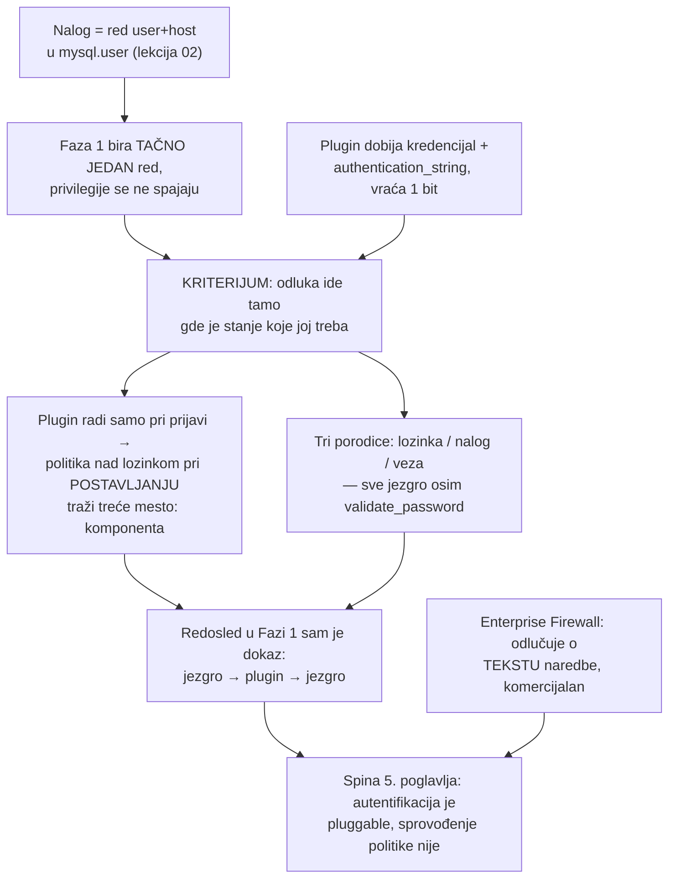

> [!quote] YOU

> [!note] SKILL loaded: teach

Chapter 5. Sprovođenje bezbednosnih politika — where is the enforcement point in MySQL's
   security-policy machinery. Pluggable authentication (caching_sha2_password) verifies credentials
   only; the server core decides everything else. Cover password policy (validate_password, expiration,
   reuse, dual passwords), account policy (FAILED_LOGIN_ATTEMPTS, resource limits), and connection
   policy (REQUIRE SSL, host-based access control) — not as a list of mechanisms but building toward
   that one distinction. Ground it in research memo 05 (security policy enforcement) and
   GLOSSARY.md §1's authentication/authorization split. Enterprise Firewall is the one commercial
   mechanism among the fourteen — name it as theory, don't demo it.

> [!question] Question
> Da li da ovu lekciju (5. poglavlje — Sprovođenje bezbednosnih politika) uživo preslikavam u Obsidian belešku?
>
> 1. Da, nova beleška (preporučeno)
> 2. Da, postojeći fajl
> 3. Ne, samo terminal

> [!example] Answer
> 1. Da, nova beleška (preporučeno)

> [!abstract] PI

Napravio sam fajl. Zalepi ovu komandu u Pi:

```
/md-log lessons-live/0004-sprovodjenje-politika.md
```

Javi kad je povezano pa krećemo na Fazu 1 (sondiranje).


> [!quote] YOU

Nastavi


> [!abstract] PI

Krećemo. **Faza 1 — sondiranje.** Tražim gde ti tačno staje znanje na nitima na koje se 5. poglavlje oslanja.


> [!question] Quiz
> Nalog `doc_nis`@`localhost` ima ispravnu lozinku, ali je nalog zaključan sa `ACCOUNT LOCK`. Klijent se povezuje i šalje tačnu lozinku. Šta radi autentifikacioni plugin `caching_sha2_password`?
>
> 1. Proverava lozinku i sam vraća neuspeh, jer čita status zaključanosti iz `mysql.user`
> 2. Pokreće se i vraća uspeh, a nalog se otključava jer je lozinka tačna
> 3. Proverava lozinku i vraća uspeh; odbijanje zbog zaključanosti donosi server
> 4. Ne pokreće se uopšte, jer server prvo rešava privilegije pa tek onda poziva plugin


> [!question] Quiz — I don't know
> Your answer: I don't know
> Correct answer: 3
>
> Note: prvi put cujem za ACCOUNT LOCK
>
> Plugin je samo verifikator kredencijala. Status zaključanosti, isteklost lozinke, REQUIRE SSL, host-matching i resursna ograničenja su odluke jezgra servera u Fazi 1 (refman, „Access Control, Stage 1"). Uspešna autentifikacija ne otključava ništa; samo uspešna prijava resetuje brojač neuspelih pokušaja kod `FAILED_LOGIN_ATTEMPTS`.


> [!abstract] PI

Dobro — to je iskren „ne znam", i tačno mi je to trebalo. Sad tražim pod.


> [!question] Quiz
> Iz lekcije o privilegijama: dvostepena provera pristupa. Šta se dešava u Fazi 1, a šta u Fazi 2?
>
> 1. Faza 1 proverava globalne privilegije iz `mysql.user`; Faza 2 proverava privilegije nad objektom, obe pri svakom zahtevu
> 2. Faza 1 pri uspostavljanju veze odlučuje da li se smeš povećati; Faza 2 pri svakom zahtevu da li smeš baš tu radnju nad tim objektom
> 3. Faza 1 proverava statičke privilegije; Faza 2 dinamičke privilegije iz `mysql.global_grants`
> 4. Faza 1 se izvršava pri uspostavljanju veze; Faza 2 jednom pri prvom upitu, a posle toga rezultat se kešira za tu sesiju


> [!success] Quiz — correct ✓
> Your answer: 2. Faza 1 pri uspostavljanju veze odlučuje da li se smeš povećati; Faza 2 pri svakom zahtevu da li smeš baš tu radnju nad tim objektom
> Correct answer: 2
>
> Note: pise povecati, pretpostavlajam da treba da pise povezati, molim te pripazi na srpski jezik ako pises da nije hrvatski ili bosanski
>
> Faza 1 je kontrola veze (connection verification): host+korisnik+kredencijali, jednom, pri konektovanju. Faza 2 je kontrola zahteva (request verification): za svaku pojedinačnu naredbu, i tu se primenjuje OR-kompozicija nivoa (global − restrictions) OR db OR table OR column OR routine. Ništa se ne kešira po sesiji — zato `REVOKE` odmah deluje na već otvorenu sesiju kod dinamičkih privilegija.


> [!abstract] PI

Izvini — treba **„povezati"**, ne „povećati". Tipfeler, pazim dalje.

Pod je čvrst: Faza 1 / Faza 2 ti sedi. Sad sondiram nit o hostu.


> [!question] Quiz
> U `mysql.user` postoje dva reda: `'doc'@'%'` (bez lozinke potrebne privilegije, ima `SELECT`) i `'doc'@'localhost'` (ima samo `USAGE`). Korisnik `doc` se povezuje sa same mašine servera. Šta se dešava?
>
> 1. Server spaja privilegije oba reda, pa nalog dobija `SELECT`
> 2. Server odbija vezu kao dvosmislenu, jer se dva reda poklapaju sa istim klijentom
> 3. Server bira red `'doc'@'localhost'`, jer sortira hostove od najspecifičnijeg ka najširem
> 4. Server bira red `'doc'@'%'`, jer se `%` poklapa sa svim hostovima pa ima prioritet


> [!failure] Quiz — incorrect ✗
> Your answer: 1. Server spaja privilegije oba reda, pa nalog dobija `SELECT`
> Correct answer: 3
>
> Note: Nisam siguran ali ako moram da pretpostavim rekao bih 1.
>
> Nalog nije „korisnik", nego par korisnik+host, i u Fazi 1 server bira **tačno jedan** red — prvi po sortiranju od najspecifičnijeg hosta (literalni IP/ime, pa CIDR/maska, pa džokeri, pa prazan string). Privilegije se ne spajaju između redova `mysql.user`. Zato `'doc'@'localhost'` sa samo `USAGE` „zaklanja" širi red.


> [!abstract] PI

Vrlo korisna greška: preneo si OR-kompoziciju nivoa (lekcija 02) na **izbor reda** — a to su dve različite stvari. Zapisujem, to je čvor u lekciji.

Još jedna nit:


> [!question] Quiz
> `validate_password` odbija `ALTER USER ... IDENTIFIED BY 'abc'` jer je lozinka preslaba. Gde ta odluka nastaje?
>
> 1. U klijentu (Workbench, `mysql` CLI), koji proverava jačinu pre slanja naredbe serveru
> 2. U jezgru servera, po pravilima upisanim u `mysql.user` za taj nalog
> 3. U posebnoj komponenti koja se učitava u server i koju server pita pre nego što prihvati lozinku
> 4. U autentifikacionom pluginu naloga, jer on ionako barata lozinkama tog naloga


> [!question] Quiz — I don't know
> Your answer: I don't know
> Correct answer: 3
>
> `validate_password` je **komponenta** (`INSTALL COMPONENT 'file://component_validate_password'`), a ne plugin i ne deo jezgra: server je poziva kao politiku nad tekstom lozinke pri `CREATE USER`/`ALTER USER`/`SET PASSWORD`. Autentifikacioni plugin nikad ne vidi lozinku u tom trenutku — on samo verifikuje pri prijavi. To je treća tačka sprovođenja: jezgro / komponenta / plugin.


> [!abstract] PI

Ivica je sad jasno omeđena: **pod** = Faza 1/Faza 2 i OR-kompozicija (čvrsto), **plafon** = svi konkretni mehanizmi 5. poglavlja + tačka sprovođenja (jezgro / komponenta / plugin), plus jedna aktivna zabluda (spajanje redova `mysql.user`).

Jedno pitanje o cilju pre nego što napravim plan:


> [!question] Question
> Šta hoćeš da ova lekcija ostavi kao glavni rezultat?
>
> 1. Jedan kriterijum kojim za bilo koji mehanizam odmah lociraš tačku sprovođenja (preporučeno)
> 2. Pregled svih četrnaest mehanizama iz memoranduma 05, sa sintaksom
> 3. Fokus na ono što možeš sam da odigraš na serveru i uslikaš za rad


> [!example] Answer
> 1. Jedan kriterijum kojim za bilo koji mehanizam odmah lociraš tačku sprovođenja (preporučeno)


> [!abstract] PI

Plan pravim uz proveru — nekoliko tvrdnji iz memoranduma 05 želim potvrđene iz primarnog izvora pre nego što ih izgovorim kao istinu.


> [!abstract] PI

Provera je vratila **dve ispravke memoranduma 05** — reći ću ih na licu mesta kad dođemo do njih (jedna menja rečenicu koju bi inače napisao u rad).

---

## Plan lekcije 04 — Sprovođenje bezbednosnih politika

**Pristup.** Ne krećemo od spiska mehanizama. Krećemo od jednog pitanja: *šta uopšte autentifikacioni plugin vidi?* Odgovor je oskudan — kredencijal koji je klijent poslao i `authentication_string` iz jednog reda `mysql.user` — i iz te oskudice se **izvodi** sve ostalo: ako odluci treba bilo koja druga informacija, plugin je ne može doneti. To je tvoj kriterijum: **koje stanje odluka zahteva**. Četrnaest mehanizama iz memoranduma 05 zatim ulaze ne kao lista nego kao provere tog kriterijuma.

Usput zatvaram zabludu iz sondiranja (spajanje redova `mysql.user`) — i ona nije sporedna: to što se bira **tačno jedan** red je upravo ono što pluginu ograničava vidno polje.

Obuhvat: jedan opipljiv dobitak — kriterijum + tri porodice politika kao njegovi dokazi. Enterprise Firewall ide kao teorija, imenovan kao komercijalan, nedemonstriran.



Da li da krenem ovako?


> [!quote] YOU

Moze


> [!abstract] PI

# Faza 3 — učimo

## Čvor 1 — Faza 1 bira tačno jedan red

**Zašto baš sad.** Ceo kriterijum koji hoćeš zavisi od toga *koliko* stanja neko vidi u trenutku odluke. A da bismo uopšte mogli da kažemo šta plugin vidi, moramo prvo znati **nad čim** radi. Odgovor je: nad jednim jedinim redom.

Iz lekcije 02 već držiš: nalog nije korisnik, nego par `'ime'@'host'`, i to je jedan red u `mysql.user`. Sada dodajemo ono što si u sondiranju promašio.

Kad se klijent poveže, više redova može da se poklopi — `'doc'@'localhost'` i `'doc'@'%'` oba odgovaraju konekciji sa same mašine. Server tada **ne spaja** ništa. Priručnik kaže doslovno:

> „Whenever the server reads the `user` table into memory, it sorts the rows. When a client attempts to connect, the server looks through the rows in sorted order. **The server uses the first row that matches the client host name and user name.**"
> — [8.2.4 Access Control, Stage 1](https://dev.mysql.com/doc/refman/8.4/en/connection-access.html)

Sortiranje ide od najspecifičnijeg hosta ka najširem: literalni IP ili ime hosta → IP u CIDR notaciji → IP sa mrežnom maskom → `%` → prazan string (koji takođe znači „bilo koji host", ali sortira *iza* `%`). Unutar istog hosta, neanonimni korisnici idu pre anonimnih.

**Gde ti je bila greška, i zašto je vredna.** Rekao si da se privilegije oba reda spajaju. To nije nasumična greška — to je **tačno pravilo iz lekcije 02, primenjeno na pogrešnom mestu**. OR-kompozicija (`global OR db OR table OR column`) važi u Fazi 2, i ona kombinuje **nivoe jednog već izabranog naloga**. Izbor reda je Faza 1 i tamo nema nikakvog OR-a — tamo je „prvi koji se poklopi, i gotovo".

Posledica koja ti treba za rad: širi red `'doc'@'%'` sa punim privilegijama može biti **potpuno zaklonjen** užim redom `'doc'@'localhost'` koji ima samo `USAGE`. Nalog kao da nema nijednu privilegiju — a privilegije stoje, samo u redu koji server nikad nije ni pogledao.


> [!question] Quiz
> U `mysql.user` postoje `'app'@'192.168.1.7'`, `'app'@'192.168.1.0/24'` i `'app'@'%'`. Klijent se povezuje sa adrese `192.168.1.7`. Koji red server koristi i šta to znači za ostale?
>
> 1. `'app'@'192.168.1.0/24'` — CIDR je precizniji od golog IP-a jer opisuje mrežu
> 2. `'app'@'%'` — jer se đoker poklapa sa svakim klijentom pa se proverava prvi
> 3. `'app'@'192.168.1.7'` — ostala dva se ne konsultuju uopšte
> 4. `'app'@'192.168.1.7'` — a privilegije preostala dva reda mu se dodaju odozgo


> [!failure] Quiz — incorrect ✗
> Your answer: 1. `'app'@'192.168.1.0/24'` — CIDR je precizniji od golog IP-a jer opisuje mrežu
> Correct answer: 3
>
> Sortiranje ide od najspecifičnijeg: literalni IP → CIDR → maska → `%` → prazan string. Server uzima prvi poklopljeni red i tu staje. Ostala dva reda postoje u tabeli, ali za ovu konekciju ne znače ništa — nema spajanja privilegija između redova `mysql.user`. To je Faza 1; OR-kompozicija nivoa je Faza 2 i radi unutar već izabranog naloga.


> [!abstract] PI

Bitno: **više ne spajaš redove** — to je zatvoreno. Promašaj je sad mnogo manji i čisto o redosledu.

„Specifičnije" ovde nema veze sa tim koliko je zapis detaljan, nego sa tim **koliko hostova zapis obuhvata**:

| Zapis | Poklapa se sa | Pozicija |
|---|---|---|
| `192.168.1.7` | 1 host | najspecifičnije |
| `192.168.1.0/24` | 256 hostova | |
| `192.168.1.0/255.255.255.0` | 256 hostova | |
| `%` | svi | |
| `''` | svi | najšire (iza `%`) |

Dakle: **manji skup = specifičnije = ranije u sortiranju.** CIDR jeste „mrežno precizniji zapis", ali opisuje 256 mašina; goli IP opisuje jednu. Pravilo nije proizvoljno — ono je jedino koje ima smisla ako hoćeš da izuzetak za jednu mašinu uopšte može da nadjača pravilo za celu mrežu.


> [!question] Quiz
> Zašto server uopšte sortira redove od najužeg hosta ka najširem, a ne obrnuto?
>
> 1. Da bi se anačini poklapanja hostova mogli kombinovati u istu OR-kompoziciju kao nivoi privilegija
> 2. Da bi širi zapisi služili kao rezerva ako uži red nema dovoljne privilegije za upit
> 3. Da bi provera stala što pre, jer uži zapisi zahtevaju manje računanja pri poređenju
> 4. Da bi zapis koji pokriva manje mašina mogao da nadjača širi zapis za istog korisnika


> [!question] Quiz — I don't know
> Your answer: I don't know
> Correct answer: 4
>
> Note: Nisam siguran da rec anačini znaci nesto
>
> Pošto server uzima prvi poklopljeni red i tu staje, redosled sortiranja je jedini način da se izrazi izuzetak. Da je obrnuto, `'doc'@'%'` bi uvek pobedio i uži zapis ne bi mogao nikad da se aktivira — pravilo za celu mrežu bi progutalo svako pojedinačno podešavanje. Rezervnog pokušaja nema: ako izabrani red nema privilegiju, dobija se odbijanje, ne prelazak na širi red.


> [!abstract] PI

Izvini — „anačini" je moj tipfeler, trebalo je „načini". Nema te reči.

Suština u jednoj rečenici: **pošto server staje na prvom poklapanju, redosled je jedini način da izuzetak uopšte postoji.** Da su širi zapisi prvi, `'doc'@'%'` bi pobeđivao uvek, i ni jedno podešavanje za pojedinačnu mašinu ne bi moglo da se aktivira. I nema rezervnog pokušaja: ako izabrani red nema privilegiju, dobiješ odbijanje — server se ne vraća da proba širi red.

Provera na konkretnom slučaju:


> [!question] Quiz
> `'doc'@'%'` ima `SELECT` nad `poliklinika`. Administrator doda `'doc'@'10.0.0.5'` sa samo `USAGE`, da bi sa te jedne mašine zabranio pristup. Korisnik `doc` se povezuje sa `10.0.0.5` i pokušava `SELECT`. Rezultat?
>
> 1. `SELECT` uspeva — kad uži red nema privilegiju, server je traži u širem poklopljenom redu
> 2. `SELECT` ne uspeva — izabran je red sa `USAGE` i server se ne vraća na širi red
> 3. Veza se uopšte ne uspostavlja — nalog sa samo `USAGE` nema pravo da se poveže
> 4. `SELECT` uspeva — `USAGE` znači „bez dodatnih ograničenja", pa nasleđuje zatečene privilegije naloga


> [!success] Quiz — correct ✓
> Your answer: 2. `SELECT` ne uspeva — izabran je red sa `USAGE` i server se ne vraća na širi red
> Correct answer: 2
>
> Uži red je izabran u Fazi 1 i to je jedini nalog koji dalje postoji za tu sesiju. `USAGE` znači „nema nijedne privilegije" — ali dozvoljava povezivanje, pa se veza uspostavlja i tek `SELECT` pada u Fazi 2. Ovo je standardni obrazac za isključivanje jedne mašine: dodaj uži red bez privilegija.


> [!abstract] PI

Čvor 1 stoji. **Jedan red, izabran u Fazi 1, i to je ceo svet te sesije.**

---

## Čvor 2 — šta plugin uopšte vidi

**Zašto sad.** Taj jedan red ima mnogo kolona: `authentication_string`, `account_locked`, `password_expired`, `ssl_type`, `max_questions`, `password_last_changed`… Pitanje celog poglavlja je: **koliko tih kolona plugin sme da čita?**

Priručnik opisuje šta se dešava:

> „The server then authenticates the client, determining from the account row which authentication plugin applies to the client: … the server invokes that plugin to authenticate the user, and **the plugin returns a status to the server indicating whether the user provided the correct password** and is permitted to connect."
> — [8.2.17 Pluggable Authentication](https://dev.mysql.com/doc/refman/8.4/en/pluggable-authentication.html)

Pažljivo pročitaj šta tu piše, a još pažljivije šta **ne** piše. Plugin ne bira red — server ga je već izabrao, i iz njega je pročitao *koji plugin uopšte pozvati*. Plugin ne odlučuje o pristupu. Plugin dobija dve stvari — kredencijal koji je klijent poslao i sačuvani `authentication_string` — i vraća **jedan bit**: poklapa se / ne poklapa se.

Tri posledice, sve iz te iste rečenice:

1. **Plugin je izabran redom, ne obrnuto.** Host-matching se dešava *pre* plugina. Zato kontrola pristupa po hostu ne može biti stvar plugina — ona određuje koji će plugin postojati.
2. **Plugin radi samo pri prijavi.** Ne postoji trenutak u kojem bi plugin gledao neku kasniju naredbu.
3. **Plugin ne zna ništa o vremenu, brojačima, TLS-u ni o tome šta je nalog radio.** Njegov ulaz je tajna protiv tajne.

Zato `caching_sha2_password` — podrazumevani plugin u 8.4, koji je zamenio `mysql_native_password` (zastareo u 8.0.34, isključen u 8.4, uklonjen u 9.0) — koliko god da je kriptografski ozbiljan, **ne donosi nijednu odluku o politici**.


> [!question] Quiz
> Nalog je konfigurisan sa `REQUIRE X509`. Klijent se povezuje bez sertifikata, ali sa ispravnom lozinkom. Ko odbija vezu?
>
> 1. Plugin, jer se sertifikat predaje zajedno sa lozinkom pa ih plugin proverava u istom koraku
> 2. Jezgro servera, na osnovu kolone `ssl_type` iz izabranog reda
> 3. Nijedan — veza prolazi, a `REQUIRE X509` se primenjuje tek na prvi upit u Fazi 2
> 4. Komponenta za proveru, koju jezgro poziva za sve zahteve nad vezom


> [!question] Quiz — I don't know
> Your answer: I don't know
> Correct answer: 2
>
> Note: Ne znam o kakvom plugin-u je rec, ali ako moram da pretpostavim rekoa bih 4.
>
> `REQUIRE` je zapisan u izabranom redu `mysql.user` (kolona `ssl_type` i prateće), pa je to odluka jezgra nad stanjem naloga, u Fazi 1. Plugin vidi samo kredencijal i `authentication_string` — sertifikat i TLS stanje veze nisu u njegovom vidnom polju. Ovde ide i ispravka memoranduma 05, dole.


> [!abstract] PI

Stani — to je prava rupa i vredi je popuniti pre svega ostalog. Vratimo se korak nazad.

### Šta je autentifikacioni plugin, konkretno

Problem iz kog je nastao: **ne proveravaju se svi nalozi na isti način.** Jedan nalog se dokazuje lozinkom. Drugi bi trebalo da se dokaže preko LDAP direktorijuma firme. Treći preko naloga operativnog sistema, četvrti sertifikatom, peti preko Kerberosa. Da je provera lozinke ušivena u server, svaki novi način dokazivanja identiteta značio bi novu verziju MySQL-a.

Rešenje: **način provere se izdvoji u zamenljiv modul i upiše u sam nalog.** U `mysql.user` postoji kolona `plugin`, i u njoj piše ime modula koji taj nalog proverava:

```sql
SELECT user, host, plugin, LEFT(authentication_string, 12) AS pocetak
FROM mysql.user;
```

```
+----------------+-----------+-----------------------+--------------+
| user           | host      | plugin                | pocetak      |
+----------------+-----------+-----------------------+--------------+
| doc_podgorica  | localhost | caching_sha2_password | $A$005$...   |
| dbadmin        | localhost | caching_sha2_password | $A$005$...   |
| root           | localhost | caching_sha2_password | $A$005$...   |
+----------------+-----------+-----------------------+--------------+
```

Dakle plugin nije neki opšti „dodatak serveru". To je **imenovani postupak provere identiteta, vezan za konkretan nalog**, i njegov ceo posao je: uzmi ono što je klijent poslao, uzmi `authentication_string` iz tog reda, i reci da li se poklapa.

Redosled je zato bitan i sam po sebi objašnjava sve:

```
klijent se povezuje
   ↓
jezgro: sortira redove, bira JEDAN (host + ime)          ← Čvor 1
   ↓
jezgro: iz kolone `plugin` tog reda vidi koga da pozove
   ↓
PLUGIN: kredencijal vs authentication_string → 1 bit
   ↓
jezgro: sve ostalo (locked, REQUIRE, istek, brojači…)
```

Plugin je **u sredini**, i okružen je jezgrom sa obe strane. Ne bira se sam, ne odlučuje, ne vidi ostatak reda.

Zato je tvoj instinkt „komponenta" bio blizu po duhu (nešto pored jezgra), ali `REQUIRE X509` uopšte nije pitanje provere identiteta — to je pitanje **stanja naloga**, upisano u kolonu `ssl_type` tog istog reda. Sve što piše u redu, čita jezgro.

> **Ispravka memoranduma 05.** Memorandum kaže da se `REQUIRE` proverava „during TLS handshake **before** Stage 1". To nije tačno i ne sme tako u rad: `REQUIRE` je svojstvo **naloga**, pa se ne može proveriti dok nalog nije izabran. TLS rukovanje se dešava ranije, ali provera *da li baš ovaj nalog sme bez šifrovane veze* je odluka jezgra nad izabranim redom, unutar Faze 1.


> [!question] Quiz
> Zašto `FAILED_LOGIN_ATTEMPTS` (zaključavanje naloga posle N promašaja) ne može biti posao autentifikacionog plugina?
>
> 1. Zato što plugin ne može da vrati grešku klijentu, nego samo uspeh
> 2. Zato što zahteva pamćenje ishoda ranijih pokušaja, a plugin samo upoređuje kredencijal sa `authentication_string`
> 3. Zato što bi svaki plugin morao posebno da ga primeni, pa je izbačen radi ujednačenosti
> 4. Zato što je zaključavanje privilegija, a privilegije se razrešavaju tek u Fazi 2


> [!success] Quiz — correct ✓
> Your answer: 2. Zato što zahteva pamćenje ishoda ranijih pokušaja, a plugin samo upoređuje kredencijal sa `authentication_string`
> Correct answer: 2
>
> Plugin je funkcija bez pamćenja: ulaz je kredencijal + `authentication_string`, izlaz je jedan bit. Brojanje uzastopnih promašaja traži stanje koje traje između pokušaja povezivanja — a to stanje drži jezgro. Po istoj logici jezgro drži i brojače resursa. Uspešna prijava resetuje brojač neuspelih pokušaja.


> [!abstract] PI

Tačno, i to prvim pokušajem. Sad možemo da izvučemo kriterijum.

---

## Čvor 3 — kriterijum

Ti si ga upravo sam upotrebio. Uopšti ga:

> **Odluka se donosi tamo gde živi stanje koje joj je potrebno.**

Plugin ima najsiromašniji ulaz u celom sistemu — dve vrednosti i nikakvo pamćenje. Zato važi jak, bezuslovan iskaz:

> **Svaka odluka kojoj treba bilo šta osim „poklapa li se ovaj kredencijal sa ovim `authentication_string`" ne može biti odluka plugina.**

Primeni ga i sve se raspoređuje samo:

| Odluci treba… | …a to živi u | dakle odlučuje |
|---|---|---|
| tajna vs. sačuvani otisak | ulazu plugina | **plugin** |
| `account_locked`, `ssl_type`, `password_expired` | kolonama izabranog reda | **jezgro** |
| broj uzastopnih promašaja, potrošnja po satu | brojačima jezgra | **jezgro** |
| `mysql.password_history` | tabeli koju plugin ne čita | **jezgro** |
| koji plugin uopšte pozvati | koloni `plugin` | **jezgro** |

Time smo dobili i **spinu 5. poglavlja**: autentifikacija je pluggable — to je tačno ono za šta je proširivost i napravljena. Sprovođenje politike nije pluggable ni u jednoj tački, jer politika po prirodi govori o stanju naloga, a ne o tačnosti tajne.

Dodatni detalj koji ovo lepo zaoštrava, iz priručnika:

> „The server checks credentials first, then account locking state."
> — [8.2.4 Access Control, Stage 1](https://dev.mysql.com/doc/refman/8.4/en/connection-access.html)

Dakle zaključan nalog sa **tačnom** lozinkom prolazi kroz plugin uspešno, pa ga jezgro odbije odmah posle. To je tvoje prvo sondažno pitanje, sad izvedeno umesto pogođeno.


> [!question] Quiz
> Firma hoće da MySQL nalozi radnika koriste LDAP direktorijum, i da nalog bude zaključan posle 5 promašaja. Šta od toga rešava zamena autentifikacionog plugina?
>
> 1. Samo LDAP provera; zaključavanje ostaje odluka jezgra bez obzira na plugin
> 2. Oboje, jer plugin preuzima ceo tok prijave za naloge koji ga koriste
> 3. Nijedno — LDAP traži spoljni izvor, pa i to mora u jezgro servera
> 4. Samo zaključavanje; LDAP traži komponentu, jer plugin ne sme da izlazi izvan servera


> [!success] Quiz — correct ✓
> Your answer: 1. Samo LDAP provera; zaključavanje ostaje odluka jezgra bez obzira na plugin
> Correct answer: 1
>
> Note: spina i sondažno nisu srpske reči, upotrebi neke druge nadalje
>
> LDAP je drugi način da se odgovori na isto pitanje — „da li je ovaj kredencijal ispravan" — pa savršeno staje u ulogu plugina (MySQL ima `authentication_ldap_simple`; SASL varijanta je komercijalna). Zaključavanje traži pamćenje ishoda između pokušaja, što je stanje jezgra, pa ga nikakva zamena plugina ne dodiruje.


> [!abstract] PI

Prihvaćeno — dalje pišem **okosnica** umesto „spina", i **provera znanja** umesto „sondažno". (Zapisaću to u `NOTES.md` da važi i za naredne lekcije.)

---

## Čvor 4 — treće mesto: komponenta

**Zašto sad.** Kriterijum je za sada dao dve kutije: plugin i jezgro. Ali jedna politika ne staje ni u jednu.

Razmisli o zahtevu „lozinka mora imati najmanje 12 znakova, veliko i malo slovo, cifru i specijalni znak". Kad se ta odluka donosi?

Ne pri prijavi — tada je lozinka već odavno postavljena, a server čuva samo otisak, iz kog se pravila o sastavu ne mogu proveriti. Odluka mora pasti u trenutku **postavljanja** lozinke: `CREATE USER`, `ALTER USER`, `SET PASSWORD` — jedini trenutak kada server uopšte vidi lozinku u čistom tekstu.

A plugin u tom trenutku ne radi. Plugin je vezan za prijavu.

Dakle politika nad *vrednošću lozinke* nema gde da stane — i MySQL zato otvara treće mesto: **komponentu**. To je modul koji se učitava u server i koji jezgro poziva kad mu zatreba mišljenje:

```sql
INSTALL COMPONENT 'file://component_validate_password';
```

> „The `validate_password` component serves to improve security by requiring account passwords and enabling strength testing of potential passwords. … `validate_password` checks the password against the current password policy and rejects the password if it is weak (the statement returns an `ER_NOT_VALID_PASSWORD` error). **This applies to the `ALTER USER`, `CREATE USER`, and `SET PASSWORD` statements.**"
> — [8.4.3 The Password Validation Component](https://dev.mysql.com/doc/refman/8.4/en/validate-password.html)

Podrazumevana podešavanja (sistemske promenljive `validate_password.*`): dužina 8, po jedno veliko/malo slovo, jedna cifra, jedan specijalni znak, `check_user_name` uključen. Može i rečnik zabranjenih reči preko `dictionary_file`.

**Razlika plugin / komponenta, u jednoj rečenici:** plugin odgovara na pitanje *„da li si ti taj"*, komponenta na pitanje *„da li je ova vrednost prihvatljiva"*. Prvi gleda identitet, drugi gleda podatak. Ni jedan ni drugi ne odlučuju o pristupu objektu — to ostaje Faza 2.

I pazi na zamku za rad: od cele porodice politika o lozinkama, **jedino provera jačine je komponenta**. Istek lozinke, istorija ponovne upotrebe, dvostruke lozinke — sve to živi u kolonama naloga i tabeli `mysql.password_history`, dakle u jezgru.


> [!question] Quiz
> `password_history` sprečava da nalog ponovo postavi neku od svojih poslednjih N lozinki. Po kriterijumu — gde se ta odluka donosi?
>
> 1. U komponenti `validate_password`, jer se sve provere nad tekstom nove lozinke stiču na istom mestu
> 2. U jezgru, ali tek pri sledećoj prijavi, kada se otisak stare lozinke ponovo izračuna
> 3. U pluginu naloga, jer jedino on ume da uporedi lozinku sa sačuvanim otiscima
> 4. U jezgru, jer poređenje traži tabelu `mysql.password_history` koju komponenta ne čita


> [!failure] Quiz — incorrect ✗
> Your answer: 1. U komponenti `validate_password`, jer se sve provere nad tekstom nove lozinke stiču na istom mestu
> Correct answer: 4
>
> Kriterijum: odluci treba istorija lozinki tog naloga, a to je stanje u tabeli `mysql.password_history` kojom upravlja jezgro. `validate_password` sudi isključivo o sastavu same vrednosti (dužina, znakovi, rečnik) i ne zna ništa o nalogu i njegovoj prošlosti. Provera se dešava pri postavljanju, ne pri narednoj prijavi.


> [!abstract] PI

Ovo je vredan promašaj i tiče se **same formulacije kriterijuma**. Ti si grupisao po **trenutku**: „obe provere se dešavaju pri postavljanju lozinke, dakle na istom mestu". Ali kriterijum ne govori o trenutku — govori o **stanju**.

Dve provere, isti trenutak, različito potrebno stanje:

| Provera | Treba joj | Mesto |
|---|---|---|
| „ima li 12 znakova i cifru" | samo tekst nove lozinke | komponenta |
| „da li je među poslednje 3" | redovi u `mysql.password_history` za taj nalog | jezgro |

Komponenta sudi o **vrednosti koju joj jezgro doda u ruke**. Ona sama ne čita tabele, ne zna čiji je to nalog niti šta je taj nalog radio ranije.

Jedan detalj koji ovo izoštrava umesto da ga ruši, i vredi ga znati jer izgleda kao protivprimer: `validate_password` ima i `check_user_name` (odbija lozinku jednaku korisničkom imenu) i `changed_characters_percentage` (traži da se nova lozinka dovoljno razlikuje od tekuće). Izgleda kao da komponenta ipak zna nešto o nalogu — ali ne zna: **jezgro joj te vrednosti prosleđuje kao ulaz**, isto kao i samu lozinku. Komponenta ostaje funkcija nad prosleđenim vrednostima. Ono što nikada ne radi jeste da sama pogleda u `mysql.user` ili `mysql.password_history`.

Dakle preciznije izdanje kriterijuma:

> **Jezgro je jedino koje čita stanje. Plugin i komponenta sude samo o onome što im je predato.**


> [!question] Quiz
> Po izoštrenom kriterijumu — šta je zajedničko pluginu i komponenti, a razdvaja ih od jezgra?
>
> 1. Oboje mogu odbiti naredbu, ali ne mogu da je odobre bez potvrde jezgra
> 2. Oboje se izvršavaju samo pri uspostavljanju veze, dok jezgro odlučuje i kasnije
> 3. Oboje se učitavaju naredbom `INSTALL` i mogu se ukloniti bez restarta servera
> 4. Oboje sude isključivo o vrednostima koje im jezgro prosledi i sami ne čitaju stanje naloga


> [!success] Quiz — correct ✓
> Your answer: 4. Oboje sude isključivo o vrednostima koje im jezgro prosledi i sami ne čitaju stanje naloga
> Correct answer: 4
>
> To je poenta celog poglavlja: proširivi delovi su funkcije nad prosleđenim ulazom, bez pristupa stanju. Vremenski se razlikuju (plugin radi pri prijavi, komponenta pri postavljanju lozinke), pa ih trenutak ne spaja. Zato nijedna politika koja zavisi od stanja naloga ne može biti proširiva.


> [!abstract] PI

Sad je kriterijum čvrst. Ostatak poglavlja je samo njegova primena — zato ide brzo.

---

## Čvor 5 — tri porodice politika kao dokazi

**Politika lozinke**

| Mehanizam | Sintaksa | Mesto |
|---|---|---|
| jačina lozinke | `validate_password.*`, greška `ER_NOT_VALID_PASSWORD` | **komponenta** |
| istek | `default_password_lifetime` (podrazumevano `0` = nikad), `PASSWORD EXPIRE INTERVAL 90 DAY` | jezgro |
| ponovna upotreba | `PASSWORD HISTORY 5`, `PASSWORD REUSE INTERVAL 365 DAY` | jezgro |
| dvostruka lozinka | `RETAIN CURRENT PASSWORD` / `DISCARD OLD PASSWORD` | jezgro |
| nasumična lozinka | `IDENTIFIED BY RANDOM PASSWORD` | jezgro |

Istek nije odbijanje veze, nego **ograničeni režim**: nalog se poveže, ali svaka naredba osim promene lozinke vraća

```
ERROR 1820 (HY000): You must reset your password using ALTER USER
statement before executing this statement.
```

Dvostruke lozinke rešavaju konkretan problem koji vredi imenovati u radu: kad deset aplikacija na deset servera koristi isti nalog, lozinka se ne može promeniti u jednom trenutku svuda. `RETAIN CURRENT PASSWORD` čini staru lozinku **sekundarnom** — obe rade istovremeno — pa se aplikacije prebacuju jedna po jedna, a tek onda ide `DISCARD OLD PASSWORD`. Za sopstveni nalog traži privilegiju `APPLICATION_PASSWORD_ADMIN`, za tuđe `CREATE USER`.

**Politika naloga**

`FAILED_LOGIN_ATTEMPTS 3 PASSWORD_LOCK_TIME 2` — tri uzastopna promašaja, dva dana zaključano; tačna lozinka resetuje brojač. Ručno: `ACCOUNT LOCK` / `ACCOUNT UNLOCK`, greška `ER_ACCOUNT_HAS_BEEN_LOCKED`.

Resursna ograničenja: `WITH MAX_QUERIES_PER_HOUR 1000 MAX_USER_CONNECTIONS 5`. Granice stoje u kolonama reda naloga, brojači su u memoriji, kreću od nule pri pokretanju servera i ne prenose se kroz restart; `FLUSH USER_RESOURCES` ih nuluje. Prekoračenje vraća grešku 1226.

**Politika veze**

`REQUIRE SSL` / `REQUIRE X509` / `SUBJECT` / `ISSUER` / `CIPHER` — kolone izabranog reda. Host-matching iz Čvora 1 — takođe. `skip_networking=ON` isključuje TCP/IP potpuno.

Svih ovih jedanaest stavki deli jedno: **znaju nešto o nalogu.** Zato su sve u jezgru, i zato je tabela iznad kratka na strani proširivosti.


> [!question] Quiz
> Zašto `RETAIN CURRENT PASSWORD` uopšte postoji, kad se lozinka može promeniti i običnim `ALTER USER ... IDENTIFIED BY`?
>
> 1. Jer nalog sa istekom lozinke ne može sam sebi da postavi novu bez sekundarne
> 2. Jer bi obična promena lozinke prekinula već otvorene sesije tog naloga
> 3. Jer `validate_password` odbija novu lozinku dok stara još stoji kao tekuća
> 4. Jer se lozinka ne može istovremeno promeniti u svim aplikacijama koje koriste isti nalog


> [!success] Quiz — correct ✓
> Your answer: 4. Jer se lozinka ne može istovremeno promeniti u svim aplikacijama koje koriste isti nalog
> Correct answer: 4
>
> Priručnik navodi upravo taj scenario: mnogo servera, više aplikacija, periodična izmena kredencijala. Bez sekundarne lozinke postoji prozor u kom je nova lozinka na serveru, a stara još u konfiguraciji aplikacija — i sve padaju. Promena lozinke ne prekida već otvorene sesije, pa problem nije u njima nego u narednim povezivanjima.


> [!abstract] PI

---

## Čvor 6 — Enterprise Firewall, jedini izuzetak

Od četrnaest mehanizama iz memoranduma 05, trinaest radi na besplatnom serveru. Četrnaesti ne — i vredi ga imenovati baš zato što **ne staje u kriterijum**.

> „MySQL Enterprise Edition includes MySQL Enterprise Firewall, an application-level firewall that enables database administrators to permit or deny SQL statement execution based on matching against **lists of accepted statement patterns**. … Each MySQL account registered with the firewall has its own statement allowlist."
> — [8.4.7 MySQL Enterprise Firewall](https://dev.mysql.com/doc/refman/8.4/en/firewall.html) (komercijalno izdanje)

Sve što smo do sada videli odlučuje na osnovu **identiteta** (ko si) ili **objekta** (nad čim radiš). Firewall odlučuje na osnovu **oblika same naredbe**: nalog se prvo pusti da radi u režimu učenja, napravi se spisak dozvoljenih obrazaca naredbi, i posle toga naredba koja ne liči ni na jedan obrazac biva odbijena — čak i ako nalog ima svaku potrebnu privilegiju.

To je zato zanimljivo za rad: SQL injekcija ne krši nijednu privilegiju. Napadnuta aplikacija radi pod svojim potpuno legitimnim nalogom; samo je naredba drugačija nego inače. Nijedan mehanizam iz naše tabele to ne vidi — DAC sudi o paru (subjekat, objekat), a tu se ni subjekat ni objekat nisu promenili.

U radu ide kao teorija, uz jasnu oznaku da je komercijalan, i bez demonstracije.


> [!question] Quiz
> Po čemu se Enterprise Firewall razlikuje od svih ostalih mehanizama iz ovog poglavlja?
>
> 1. Jedini je koji dodaje privilegije umesto da ih oduzima, preko spiska dozvoljenih naloga
> 2. Odlučuje na osnovu oblika same naredbe, a ne na osnovu identiteta ni objekta
> 3. Jedini radi nad redovima tabele, pa donosi red-level security koji jezgro nema
> 4. Odlučuje pre Faze 1, pa može da odbije vezu i pre nego što se nalog izabere


> [!success] Quiz — correct ✓
> Your answer: 2. Odlučuje na osnovu oblika same naredbe, a ne na osnovu identiteta ni objekta
> Correct answer: 2
>
> Kontrola pristupa u MySQL-u sudi o paru (subjekat, objekat). Firewall uvodi treću dimenziju — tekst naredbe upoređen sa naučenim spiskom obrazaca — pa hvata napad u kom su i subjekat i objekat legitimni, a promenjen je samo upit. Radi posle Faze 1, nad naredbama već povezanog naloga, i ništa ne dodaje privilegijama.


> [!abstract] PI

Poslednja provera — vraćam se na početak lekcije, s odmakom:


> [!question] Quiz
> Nalog `'app'@'%'` ima `SELECT` nad `poliklinika` i `REQUIRE NONE`. Dodaje se `'app'@'10.0.0.5'` sa `REQUIRE X509` i istim `SELECT`. Klijent sa `10.0.0.5` se povezuje bez sertifikata. Šta se dešava?
>
> 1. Veza se odbija — izabran je uži red, a njegov `REQUIRE X509` proverava jezgro u Fazi 1
> 2. Veza se odbija — plugin `caching_sha2_password` traži sertifikat kad je `REQUIRE X509` postavljen
> 3. Veza prolazi — poklapa se i širi red sa `REQUIRE NONE`, pa se blaži uslov primenjuje
> 4. Veza prolazi — `REQUIRE` vredi tek kad nalog izda prvi upit, pa se proverava u Fazi 2


> [!success] Quiz — correct ✓
> Your answer: 1. Veza se odbija — izabran je uži red, a njegov `REQUIRE X509` proverava jezgro u Fazi 1
> Correct answer: 1
>
> Dva pravila zajedno: Faza 1 bira tačno jedan red (najuži host pobeđuje, nema povratka na širi), a `REQUIRE` je stanje u tom redu koje čita jezgro. Plugin vidi samo kredencijal i `authentication_string`, pa sertifikat nije njegov posao.


> [!abstract] PI

Graf je potvrđen. Sad kompresujem u radni prostor.


> [!abstract] PI

Lekcija je otvorena u pregledaču.

## Šta je ostalo iza sesije

| Fajl | Šta je |
|---|---|
| `lessons/0004-sprovodjenje-politika.html` | lekcija, sa 6 pitanja za prisećanje i dva `.try` bloka |
| `reference/04-sprovodjenje-politika.html` | kartica: kriterijum, redosled Faze 1, sortiranje hostova, sintaksa po porodicama, greške, zamke |
| `learning-records/0006-sprovodjenje-politika.md` | šta je učeno, tri ispravljene zablude, ispravke memoranduma 05 |
| `learning-records/README.md` | četiri nove stavke pod „Standing constraints" |
| `NOTES.md` | jezička napomena (*okosnica*, *provera znanja*, pažnja na tipfelere) |

## Dve stvari za sledeći put

1. **Ništa nije izvršeno.** Oba `.try` bloka su očekivanja, ne merenja — pokreni ih pre pisanja poglavlja i uveži u `examples/05-sprovodjenje-politika/`. `INSTALL COMPONENT` traži `root`, `dbadmin` neće proći.
2. **Ispravke memoranduma 05** su zapisane: `REQUIRE` nije provera pre Faze 1, a istek lozinke nije odbijanje veze. Ne prepisuj memorandum doslovno u rad.

Rečenica koju sad umeš da odbraniš bez beležaka: **jezgro je jedino koje čita stanje; plugin i komponenta sude samo o onome što im je predato.**


> [!quote] YOU

Sta dalje treba


> [!abstract] PI

Prema `../WORKFLOW.md`, Korak 1 (naučiti) je gotov. Ostaju dva.

## Korak 2 — pokreni sam, još u ovoj sesiji

Ovo je jedino što sad blokira pisanje poglavlja. Dva bloka iz lekcije, oba kao **`root`** (`dbadmin` nema prava ni za `CREATE USER` ni za `INSTALL COMPONENT`):

1. **Sortiranje hostova** — `'probni'@'%'` sa `SELECT` naspram `'probni'@'localhost'` sa `USAGE`, pa prijava sa iste mašine. Očekivanje: veza prolazi, upit pada. To je jedina merena potvrda da uži red zaklanja širi.
2. **`validate_password`** — `INSTALL COMPONENT`, `SHOW VARIABLES LIKE 'validate_password%'`, pa `CREATE USER ... IDENTIFIED BY 'abc'`. Očekivanje: `ER_NOT_VALID_PASSWORD`, nalog ne nastaje. Posle: `UNINSTALL COMPONENT`.

Vredelo bi dodati i treći, jer daje najbolju sliku za rad:

3. **`FAILED_LOGIN_ATTEMPTS 3 PASSWORD_LOCK_TIME 1`** na probnom nalogu, pa tri pogrešne prijave i četvrta **tačna** — koja i dalje pada. To je vidljiv dokaz da plugin nije taj koji odlučuje.

Skripte idu u `examples/05-sprovodjenje-politika/`. Pošalji mi izlaze i uvezaću ih — merenja u `.scratch/`, a ako se nešto ne poklopi sa očekivanjem, ispravljam lekciju, ne izlaz.

## Korak 3 — pisanje, u **novoj** sesiji

```
/mattpocock-skills:wayfinder .scratch/kontrola-pristupa/map.md
```

~3.5 strane, kriterijum prvo, mehanizmi kao njegovi dokazi. Kandidat za sliku je već zapisan: traka Faze 1 (jezgro → jezgro → **plugin** → jezgro), sa pluginom kao jedinim zamenljivim elementom.

---

Da ti sad napišem te tri skripte u `examples/05-sprovodjenje-politika/` da ih samo pokreneš?


> [!quote] YOU

13:50:14    SELECT * FROM poliklinika.pacijent LIMIT 1    Error Code: 1146. Table 'poliklinika.pacijent' doesn't exist    0.000 sec
validate_password.changed_characters_percentage    0
validate_password.check_user_name    ON
validate_password.dictionary_file    
validate_password.length    8
validate_password.mixed_case_count    1
validate_password.number_count    1
validate_password.policy    MEDIUM
validate_password.special_char_count    1 13:52:00    CREATE USER 'slaba'@'localhost'   IDENTIFIED BY 'abc'    Error Code: 1819. Your password does not satisfy the current policy requirements    0.000 sec


> [!abstract] PI

Dve stvari, i prva je **moja greška**.

## 1. `poliklinika.pacijent` ne postoji — tabele su na engleskom

Proverio sam `examples/00-setup/01-schema.sql`: tabele su `tenants`, `staff`, `patients`, `visits`, `diagnoses`, `invoices`. Izmislio sam srpsko ime u lekciji. Ispravljam odmah.

Ali tu je i druga, korisnija informacija: **greška 1146 („table doesn't exist") znači da si upit izvršio iz privilegovane veze**, a ne kao `probni`. Da si bio prijavljen kao `probni` sa samo `USAGE`, dobio bi 1142 („access denied"), bez obzira na to što tabela ne postoji — server ne otkriva postojanje objekta nalogu koji nema pristup šemi. Dakle test 1 još nije odigran.

Kako ga odigrati: u Workbench-u napravi **novu konekciju** (`probni` / `Lozinka!2345`, host `127.0.0.1` ili `localhost`), pa iz nje:

```sql
SELECT * FROM poliklinika.patients LIMIT 1;
```

Očekivanje: veza se uspostavlja, upit pada sa **1142**. To je cela poenta — širi red `'probni'@'%'` ima `SELECT`, ali je izabran uži red sa `USAGE`.

## 2. `validate_password` — potvrđeno, i bolje nego što je lekcija tvrdila

```
Error Code: 1819. Your password does not satisfy the current policy requirements
```

To je `ER_NOT_VALID_PASSWORD` i sada imamo **izmeren broj greške: 1819**. Nalog `slaba` nije nastao. Izmerene su i podrazumevane vrednosti, uz jednu koju memorandum 05 nije pomenuo: `validate_password.policy = MEDIUM` — to je prekidač koji određuje koliko se ostalih promenljivih uopšte primenjuje (`LOW` gleda samo dužinu; `MEDIUM` dodaje sastav znakova; `STRONG` dodaje rečnik).

Ažuriram lekciju i karticu.


> [!abstract] PI

Sve je uvezano. Stanje:

| | |
|---|---|
| `examples/05-sprovodjenje-politika/02-validate-password.sql` | **izmereno**, sa tvojim izlazom u komentarima |
| `examples/05-sprovodjenje-politika/01-host-sortiranje.sql` | napisano, čeka ponovno pokretanje |
| `.scratch/.../measurements/0006-sprovodjenje-politika.md` | merenja + zašto prvi pokušaj nije merio ono što treba |
| `lessons/0004-…html`, `reference/04-…html` | ispravljeni (tabela `patients`, greška 1819, `policy` prekidač) |

## Ostaju ti dva pokretanja

**A. Sortiranje hostova** — `examples/05-sprovodjenje-politika/01-host-sortiranje.sql`. Ključno je da korak 2 ide iz **odvojene konekcije prijavljene kao `probni`**. Pošalji mi i `SELECT CURRENT_USER();` uz grešku — to dvoje zajedno su cela slika.

**C. Zaključavanje naloga** — ovo nisam još skriptovao, a daje najjaču sliku u poglavlju:

```sql
CREATE USER 'kljucar'@'localhost' IDENTIFIED BY 'Lozinka!2345'
  FAILED_LOGIN_ATTEMPTS 3 PASSWORD_LOCK_TIME 1;
```

Pa tri pokušaja prijave sa pogrešnom lozinkom, i **četvrti sa tačnom** — koji i dalje pada. To je jedini kadar u kom se vidi da plugin kaže „da", a jezgro svejedno kaže „ne".

Da napišem i tu skriptu kao `03-zakljucavanje-naloga.sql`?


> [!quote] YOU

probni@localhost 1    1    Pacijent 001    1967-12-23
            Not sure if I did everyhting correct?


> [!abstract] PI

Nisi ti pogrešio — **ja sam.** Rezultat je `CURRENT_USER()` = `probni@localhost` i upit je **prošao**, što je suprotno od onoga što sam ti rekao da očekuješ. To nije greška u izvođenju, to je pravi nalaz. Proveravam ga pre nego što kažem išta dalje.


> [!abstract] PI

Odgovor: **uradio si sve tačno, a moja tvrdnja je bila pogrešna.** Tvoje merenje je oborilo ono što sam ti predavao u Čvoru 1, i priručnik je na tvojoj strani.

## Šta sam pogrešio

Rekao sam: „uži red sa `USAGE` potpuno zaklanja širi red". To važi **samo za globalne privilegije** iz `mysql.user`. Ne važi za privilegije na nivou baze i tabele — a upravo takvu smo dodelili (`GRANT SELECT ON poliklinika.*`).

Razlog je da **Faza 2 ne koristi red koji je Faza 1 izabrala.** Ona radi svoje, nezavisno poklapanje u `mysql.db`:

> „The server looks in the `db` table for a match on the `Host`, `Db`, and `User` columns. **The `Host` and `User` columns are matched to the connecting user's host name and MySQL user name.** … The wildcard characters `%` and `_` can be used in the `Host` and `Db` columns."
> — [8.2.7 Access Control, Stage 2: Request Verification](https://dev.mysql.com/doc/refman/8.4/en/request-access.html)

Dakle `GRANT SELECT ON poliklinika.* TO 'probni'@'%'` upisuje red u `mysql.db` sa `Host='%'`, a `%` se poklapa sa klijentom koji dolazi sa `localhost`. Privilegija stiže iz reda koji **nije** onaj kojim si se autentifikovao. Zato `CURRENT_USER()` kaže `probni@localhost`, a `SELECT` svejedno radi.

## Tačna podela, u dve rečenice

| Šta | Odakle |
|---|---|
| Koji plugin, koja lozinka, `REQUIRE`, zaključanost, **globalne** privilegije | isključivo iz **jednog** reda izabranog u Fazi 1 |
| Privilegije na nivou baze / tabele / kolone | iz **sopstvenog** poklapanja u `mysql.db` i `mysql.tables_priv`, po **hostu klijenta**, sa džokerima |

`CURRENT_USER()` prikazuje samo prvi red — pa **ne prikazuje ceo domet sesije**. To je već drugi put da naletimo na isto: zapis 0004 kaže isto za `CURRENT_ROLE()`, koji ne prikazuje nasleđene uloge.

## Jedna provera pre nego što ovo uknjižim

Postoji još jedno moguće objašnjenje (`mandatory_roles`), i treba ga isključiti. Pokreni kao `root` — ovo ništa ne menja:

```sql
SELECT @@mandatory_roles, @@activate_all_roles_on_login;
SELECT Host, Db, User, Select_priv FROM mysql.db WHERE User = 'probni';
```

Ako drugi upit vrati red sa `Host = %`, `Db = poliklinika`, `Select_priv = Y`, a prvi je prazan/`OFF` — objašnjenje je potvrđeno i mehanizam je tačno onaj gore.

(Ako si već obrisao naloge preko `DROP USER` na kraju skripte, pusti korake 1 iz `01-host-sortiranje.sql` ponovo pa onda ove upite.)


> [!quote] YOU

0 %    poliklinika    probni    Y


> [!abstract] PI

Potvrđeno. `mandatory_roles` prazno, `activate_all_roles_on_login` = 0, i u `mysql.db` stoji red `Host='%'`, `Db='poliklinika'`, `User='probni'`, `Select_priv='Y'`. Mehanizam je tačno onaj iz priručnika — nema drugog objašnjenja.

**Ovo je bolje merenje od onog koje sam planirao.** Planirano je trebalo da potvrdi opšte poznatu tvrdnju; ovo obara tvrdnju koja bi u radu bila greška. Uknjižavam.


> [!quote] YOU

continue


> [!abstract] PI

Sad zapis o učenju i tabela stalnih ograničenja — ovo je nalaz koji utiče i na već napisano 3. poglavlje.


> [!abstract] PI

Proverio sam `rad.md` §3: tamo stoji da prvi korak „učitava **globalne** privilegije tog naloga" — što je tačno i ne traži ispravku. Poglavlje 3 je pošteđeno.

## Šta je promenjeno

| Fajl | Izmena |
|---|---|
| `lessons/0004-…html` | novi odeljak **1a** sa citatom 8.2.7, tvoj izmereni izlaz u `.try` bloku, novo 7. pitanje |
| `reference/04-…html` | „Zamka koja bi bila greška u radu" + tabela šta određuje koji red |
| `examples/05-…/01-host-sortiranje.sql` | prepisan: meri sada ono što se stvarno dešava, sa tvojim brojevima |
| `.scratch/…/measurements/0006-…md` | merenje 2 upisano kao **oboreno očekivanje** |
| `learning-records/0006-…md` | zaseban odeljak o ispravci, kao najvažnija stavka zapisa |
| `learning-records/README.md` | stalno ograničenje prepisano na mestu, ne dopisano ispod starog |

Zapisao sam i zašto mi je promaklo: istraživački podagent je dobio pitanje samo o Fazi 1, pa je tvrdnja koja se proteže na dve faze prošla neproverena. **Tvoje pokretanje je to uhvatilo** — to je tačno ono zbog čega Korak 2 u `../WORKFLOW.md` postoji.

Pošto je ovo nov čvor, mora i provera:


> [!question] Quiz
> Nalog `'app'@'%'` ima `GRANT SELECT ON poliklinika.*`. Red `'app'@'localhost'` postoji i nema ništa. Klijent se prijavi sa same mašine. Šta važi za tu sesiju?
>
> 1. `CURRENT_USER()` je `app@localhost`, a `SELECT` prolazi tek posle `FLUSH PRIVILEGES`
> 2. `CURRENT_USER()` je `app@localhost`, i `SELECT` pada sa 1142
> 3. `CURRENT_USER()` je `app@localhost`, a `SELECT` nad `poliklinika` prolazi
> 4. `CURRENT_USER()` je `app@%`, jer je privilegija nađena u tom redu


> [!success] Quiz — correct ✓
> Your answer: 3. `CURRENT_USER()` je `app@localhost`, a `SELECT` nad `poliklinika` prolazi
> Correct answer: 3
>
> Dve nezavisne stvari. Faza 1 bira uži red i `CURRENT_USER()` ga imenuje. Faza 2 privilegiju nad bazom traži sama, u `mysql.db`, gde se `Host` poredi sa hostom klijenta i sme da bude `%` — pa grant dat širem nalogu važi. Zato `CURRENT_USER()` imenuje nalog kojim si se autentifikovao, ali ne ograničava domet sesije.


> [!abstract] PI

Čisto. Čvor stoji.

## Ostalo je jedno merenje

`03-zakljucavanje-naloga.sql` — `FAILED_LOGIN_ATTEMPTS 3 PASSWORD_LOCK_TIME 1`, tri pogrešne prijave, pa četvrta **tačna** koja i dalje pada. To je jedini kadar u kom se vidi da plugin kaže „da", a jezgro svejedno „ne" — i posle ovog obrta imamo dva merenja koja nose poglavlje umesto jednog.

Posle toga poglavlje 5 je spremno za pisanje, u **novoj** sesiji:

```
/mattpocock-skills:wayfinder .scratch/kontrola-pristupa/map.md
```

Da napišem tu skriptu?


> [!quote] YOU

Moze


> [!abstract] PI

`examples/05-sprovodjenje-politika/03-zakljucavanje-naloga.sql`

(Uhvatio sam i ispravio dva ćirilična slova koja su mi se uvukla u komentar — hvala što me držiš na oku oko jezika.)

## Kako da je pokreneš

Korake 1, 4 i 5 pusti u Workbench-u kao `root`. **Korake 2 i 3 mora komandna linija**, ne Workbench — Workbench kešira i ponovo koristi konekciju, pa ti pokušaji neće biti zasebne prijave:

```
mysql -u kljucar -h 127.0.0.1 -p
```

Tri puta pogrešna lozinka, četvrti put **`Lozinka!2345`** — tačna, i svejedno pada. Pošalji mi:

1. ispis `SHOW CREATE USER` i onaj `JSON_EXTRACT` red iz koraka 1,
2. **tačan tekst poruke** iz koraka 3 — priručnik za taj slučaj ne navodi broj greške, pa tvoj izlaz postaje izmereni podatak,
3. potvrdu da prijava posle `ACCOUNT UNLOCK` prolazi sa **istom** lozinkom.

Ta treća stavka je ono što zatvara argument: između neuspeha i uspeha ništa u vezi sa lozinkom nije promenjeno, pa lozinka nije ni bila razlog.


> [!quote] YOU

CREATE USER `kljucar`@`localhost` IDENTIFIED WITH 'caching_sha2_password' AS '$A$005$PL\r9GmOF\"CsBonYpHoJ5UeqTfHWUsjcFdeqdbrpJEp4qhxsaAWso7LVs.' REQUIRE NONE PASSWORD EXPIRE DEFAULT ACCOUNT UNLOCK PASSWORD HISTORY DEFAULT PASSWORD REUSE INTERVAL DEFAULT PASSWORD REQUIRE CURRENT DEFAULT FAILED_LOGIN_ATTEMPTS 3 PASSWORD_LOCK_TIME 1 kljucar    localhost    caching_sha2_password    {"failed_login_attempts": 3, "password_lock_time_days": 1} ERROR 3955 (HY000): Access denied for user 'kljucar'@'localhost'. Account is blocked for 1 day(s) (1 day(s) remaining) due to 3 consecutive failed logins. Welcome to the MySQL monitor.


> [!abstract] PI

Ovo je odličan ulov — i daje **više** nego što sam očekivao.


> [!abstract] PI

Proverio sam pre nego što ovo uknjižim, i dobro je što jesam — ima suptilnost.

## Šta si izmerio

```
ERROR 3955 (HY000): Access denied for user 'kljucar'@'localhost'.
Account is blocked for 1 day(s) (1 day(s) remaining)
due to 3 consecutive failed logins.
```

Tri stvari koje ovo daje radu:

1. **Lozinka je bila tačna.** Poruka ne govori o lozinci nego o brojaču prethodnih pokušaja — dokaz da je plugin odradio svoje i da je odbijanje došlo posle njega.
2. **Politika je stanje, i to si video u koloni.** `JSON_EXTRACT` je vratio `{"failed_login_attempts": 3, "password_lock_time_days": 1}` iz `User_attributes`. Isti obrazac kao `partial_revokes` iz zapisa 0004: kad oblik grant-tabela nešto ne može da izrazi, MySQL to upiše kao JSON na sam nalog.
3. **`ACCOUNT UNLOCK` je vratio pristup sa nepromenjenom lozinkom** („Welcome to the MySQL monitor"). Time je argument zatvoren: između neuspeha i uspeha ništa u vezi sa lozinkom nije dirano.

## Suptilnost oko broja greške

Priručnik za ovu poruku u primeru prikazuje **`ERROR 3957`**, a tvoj server je vratio **`3955`**. Priručnik uz taj primer kaže „an error that **looks like** this", dakle to je ilustracija, ne specifikacija, a stranice koje sam našao su za novije verzije. U rad ide **3955, kao izmereno na 8.4.11**, uz napomenu da priručnik navodi drugi broj u primeru — nikad obrnuto.

I nije isto što i `ER_ACCOUNT_HAS_BEEN_LOCKED`, koji ide na **ručno** zaključan nalog i glasi „Account is locked." Dve različite poruke za dva različita puta do iste posledice.


> [!abstract] PI

Sve je uknjiženo. **Poglavlje 5 je sada spremno za pisanje.**

## Stanje

| | |
|---|---|
| Lekcija + kartica | ispravljene, sa tvojim izmerenim izlazima |
| `examples/05-sprovodjenje-politika/` | tri skripte, **sve tri pokrenute**, izlazi u komentarima |
| Merenja | `.scratch/kontrola-pristupa/measurements/0006-…md` |
| Zapis + stalna ograničenja | ispravka o `mysql.db`, greška 3955, JSON politika zaključavanja |

Dva nalaza koje sesija nije planirala, a oba idu u rad:

1. **`CURRENT_USER()` ne ograničava domet sesije** — grant dat `'u'@'%'` važi i kad si prijavljen kao `'u'@'localhost'`. Obara tvrdnju koju sam ti pogrešno predavao.
2. **Politika zaključavanja je JSON na nalogu** (`User_attributes -> $.Password_locking`) — četvrti put da naletimo na isti obrazac: što grant-tabele ne mogu da izraze, MySQL piše van njihovog oblika.

## Sledeći korak — u novoj sesiji

```
/mattpocock-skills:wayfinder .scratch/kontrola-pristupa/map.md
```

Dve slike su već spremne i obe imaju podatke iza sebe: traka Faze 1 (jezgro → jezgro → **plugin** → jezgro), i „slika ispravke" — `probni@localhost` pored reda koji nije smeo da pročita, sa `mysql.db` linijom ispod.

Ako hoćeš, mogu sad još proći kroz Serbian-grammar proveru lekcije i kartice pre nego što zatvorimo sesiju.
