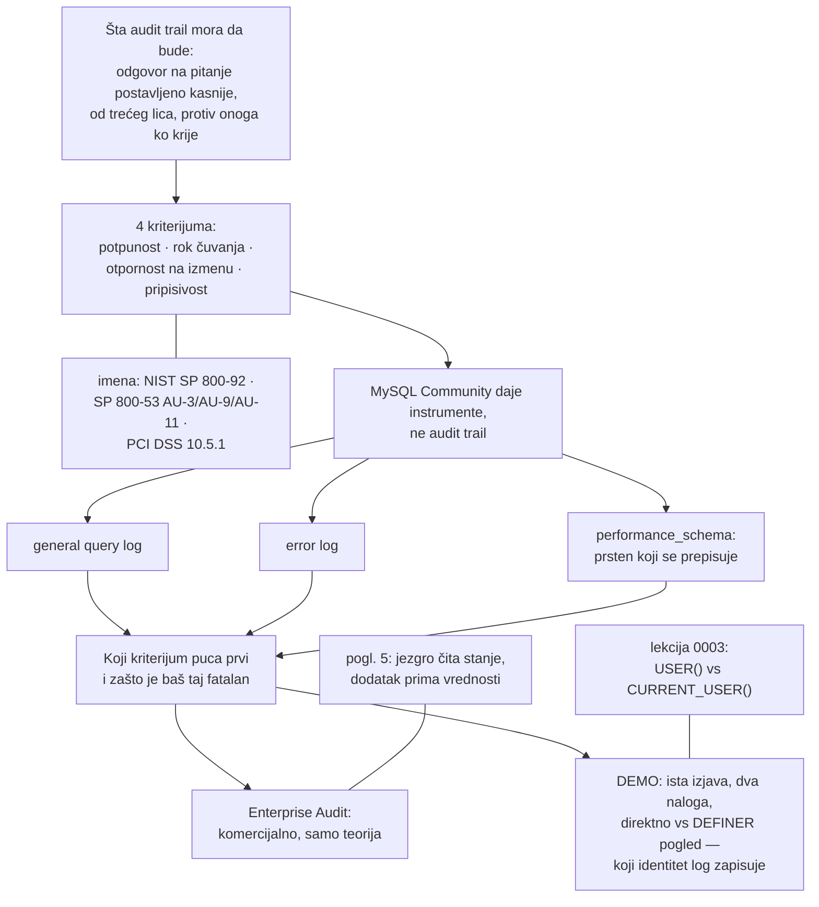

> [!quote] YOU

> [!note] SKILL loaded: teach

Chapter 6, Audit logging — the argument that MySQL Community gives instruments, not an audit trail. Derive it: first what an audit trail must be (NIST SP 800-92: completeness, retention, tamper
 resistance, accountability), before MySQL is named; then judge the free instruments one by one against those four (general query log, error log, performance_schema ring buffer) and make me say which
 criterion breaks first and why that one is fatal; then Enterprise Audit named as the commercial reference point, theory only, not demoed; then the payload I want to run myself — the same statement as two
 accounts, direct vs. through a SQL SECURITY DEFINER view, so I see which identity the log records, tied back to USER() vs CURRENT_USER() from lesson 0003 and to ch. 5's plugin-vs-core split. Record 0002
 already settled that no free audit plugin loads on this server: don't re-measure it, don't install anything. Chapter is budgeted ~2 pages, the shortest — scope the lesson to the argument plus the one demo,
 and don't write rad.md this session.

> [!abstract] PI

I'll start by loading the pedagogical engine and the workspace state.

> [!abstract] PI

Workspace state loaded. Before Phase 1, one setup question and one research pass in parallel.

> [!question] Question
> Da li da ovu lekciju (0005, Audit logging) preslikavam uživo u Obsidian?
>
> Kao i ranije: ja pravim prazan fajl, ti nalepiš jednu komandu. Terminal ostaje mesto gde odgovaraš na kvizove.
>
> 1. Da — novi fajl lessons-live/0005-audit-logging.md (preporučeno)
> 2. Da, ali u postojeći fajl (reći ću putanju)
> 3. Ne, samo terminal

> [!example] Answer
> 1. Da — novi fajl lessons-live/0005-audit-logging.md (preporučeno)

> [!abstract] PI

Fajl je napravljen. Nalepi ovo pa ću krenuti:

```
/md-log lessons-live/0005-audit-logging.md
```

Javi kad je povezano — onda idemo na proveru znanja (Faza 1).


> [!quote] YOU

nastavi


> [!abstract] PI

Krećemo. Faza 1 — provera znanja, da nađem ivicu.


> [!question] Quiz
> Kada tačno server upisuje izjavu u general query log?
>
> 1. Posle izvršenja, zajedno sa ishodom izjave
> 2. U trenutku kada je primi, pre nego što je izvrši
> 3. Tek pošto izjava prođe proveru privilegija
> 4. Samo za izjave koje menjaju podatke u tabelama


> [!question] Quiz — I don't know
> Your answer: I don't know
> Correct answer: 2
>
> General query log je log saobraćaja, ne log odluka: server upisuje izjavu čim je primi, pre izvršenja i pre provere privilegija. Zato se u njemu vidi i izjava koja je završila sa ERROR 1142 — ali se iz samog loga ne vidi da je odbijena, jer ishod nije zapisan nigde.


> [!abstract] PI

Dobro — to je baš gradivo lekcije, ne problem. Da vidim šta stoji ispod toga.


> [!question] Quiz
> Nalog `recept_podgorica` čita podatke kroz `SQL SECURITY DEFINER` pogled koji je definisao `dbadmin`. Šta vraćaju `USER()` i `CURRENT_USER()` u tom trenutku?
>
> 1. USER() vraća `recept_podgorica`, CURRENT_USER() vraća `dbadmin`
> 2. USER() vraća `dbadmin`, CURRENT_USER() vraća `recept_podgorica`
> 3. Obe vraćaju `recept_podgorica`, jer se sesija nije promenila
> 4. Obe vraćaju `dbadmin`, jer se ceo upit izvršava u definer kontekstu


> [!success] Quiz — correct ✓
> Your answer: 1. USER() vraća `recept_podgorica`, CURRENT_USER() vraća `dbadmin`
> Correct answer: 1
>
> USER() je zamrznut na prijavi i nikada ne može biti definer; CURRENT_USER() je red iz `mysql.user` čije se privilegije proveravaju, i u definer kontekstu to postaje definer. Izmereno na 8.4.11 u jednom redu rezultata: `recept_podgorica@localhost` pored `dbadmin@localhost`.


> [!abstract] PI

Ivica na identitetu je potvrđena (lekcija 0003 stoji). Sad ceiling na samom instrumentu.


> [!question] Quiz
> Koja tvrdnja o general query logu na ovom serveru (MySQL 8.4.11 Community) je tačna?
>
> 1. Odbijene izjave (ERROR 1142) ne pojavljuju se u logu
> 2. Uz svaku izjavu log beleži i njen ishod, uspeh ili grešku
> 3. Izmenu ili brisanje samog log fajla server ne beleži nigde
> 4. Log se automatski rotira i čuva se po podešenom roku


> [!question] Quiz — I don't know
> Your answer: I don't know
> Correct answer: 3
>
> General query log je običan fajl (ili tabela) u vlasništvu servisnog naloga — nema potpisa, kontrolnog zbira ni zapisa o pristupu samom fajlu. Odbijene izjave se jesu vide (upisuju se pri prijemu), ishod se ne beleži nigde, a rotacija i rok čuvanja ne postoje kao ugrađena funkcija.


> [!question] Quiz
> Po kriterijumu iz poglavlja 5 (jezgro čita stanje, dodatak sudi samo o vrednostima koje mu se predaju), gde stoji audit plugin?
>
> 1. Presreće izjavu pre jezgra i odlučuje da li će se izvršiti
> 2. Radi samo u trenutku prijave, isto kao authentication plugin
> 3. Dobija događaje koje mu jezgro prosledi i sam ne čita stanje servera
> 4. Sam čita grant tabele da bi utvrdio šta je nalog smeo da uradi


> [!success] Quiz — correct ✓
> Your answer: 3. Dobija događaje koje mu jezgro prosledi i sam ne čita stanje servera
> Correct answer: 3
>
> Note: Nisam siguran ali pogadjam da je 3.
>
> Ista podela kao u poglavlju 5: jezgro je jedino što čita stanje i donosi odluku, a dodatak dobija gotove vrednosti. Audit plugin je pasivni primalac događaja — jezgro mu prosledi opis događaja, on ga zapiše. Zato audit plugin ne može da zabeleži ono što mu jezgro nije prosledilo, što je ključno za ceo argument ovog poglavlja.


> [!abstract] PI

Ivica je locirana: identitet (`USER()`/`CURRENT_USER()`) stoji čvrsto, podela jezgro/dodatak iz pogl. 5 se prenosi rezonovanjem, a **svojstva samih logova i pojam audit trail-a su prazni** — to je tačno ono što lekcija treba da izgradi.

## Plan lekcije 0005 — „instrumenti, a ne audit trail"

Ne počinjemo od MySQL-a. Prvo izvodimo **šta audit trail uopšte mora da bude**, i to ne kao listu koju treba zapamtiti, nego iz jedne rečenice koju možeš prihvatiti zdravo za gotovo: *audit trail postoji da bi na pitanje „ko je ovo uradio" odgovorio neko ko nije bio prisutan, kasnije, a protiv nekoga ko ima motiv da to sakrije.* Iz te jedne rečenice sva četiri kriterijuma (potpunost, rok čuvanja, otpornost na izmenu, pripisivost) ispadaju sama — svaki je odgovor na jedan način da to pitanje propadne. Tek onda vezujemo imena: NIST SP 800-92, i preciznije SP 800-53 AU-3 / AU-9 / AU-11, plus PCI DSS 10.5.1 za rok.

Tek kad ta četiri kriterijuma stoje, imenujemo MySQL i sudimo mu instrument po instrument: general query log, error log, `performance_schema` prsten. Tu tebi ostavljam presudu — **koji kriterijum puca prvi i zašto je baš taj fatalan**, jer tri od četiri su problemi razvoja i mogu se zakrpiti spolja, a jedan ne može. Enterprise Audit ulazi posle toga, kao komercijalna referentna tačka, teorijski, po tvom pravilu iz misije — i tu se zatvara krug sa pogl. 5: audit plugin je primalac događaja, ne čitalac stanja.

Na kraju payload koji sam pokrećeš: ista izjava iz dva naloga, direktno i kroz `SQL SECURITY DEFINER` pogled, i pitanje koji identitet log zapisuje.

```mermaid
graph TD
  U1["Audit trail = odgovor na pitanje<br/>postavljeno kasnije, od trećeg lica"]
  K["4 kriterijuma: potpunost, rok,<br/>otpornost na izmenu, pripisivost"]
  N["NIST 800-92 / 800-53 AU-3, AU-9, AU-11<br/>PCI DSS 10.5.1"]
  I["Instrument ≠ trail"]
  G["general query log"]
  E["error log"]
  P["performance_schema (prsten)"]
  F["Koji kriterijum puca prvi<br/>i zašto je fatalan"]
  EE["Enterprise Audit<br/>(komercijalno, teorija)"]
  C5["pogl. 5: jezgro čita stanje,<br/>dodatak prima vrednosti"]
  D["Demo: ista izjava, 2 naloga,<br/>direktno vs DEFINER pogled"]
  L3["lekcija 0003: USER() vs CURRENT_USER()"]

  U1 --> K --> I
  K -.imena.-> N
  I --> G & E & P
  G & E & P --> F
  F --> EE
  C5 --> EE
  L3 --> D
  F --> D
</parameter>
```

Obim: argument + jedan demo, poglavlje je najkraće (~2 strane). `rad.md` se danas ne dira.

Da li da krenem ovako?


> [!quote] YOU

Ne vidim mermaid diagram bas najbolje


> [!abstract] PI

Izvini — u poruci je i ostao višak teksta. Evo dijagrama kao slika.


> [!abstract] PI


Čita se odozgo: **žuto je koren** — jedina stvar koju tražim da prihvatiš zdravo za gotovo. Iz nje ispadaju četiri kriterijuma (sivo levo su samo *imena* standarda koja im kasnije lepimo, ne izvor). Zatim se MySQL imenuje i tri besplatna instrumenta se sude jedan po jedan. **Zeleno su dve tačke gde ti radiš posao**: presuda koji kriterijum puca prvi, i demo koji sam pokrećeš. Enterprise Audit visi sa strane, kao referentna tačka, i spaja se sa podelom jezgro/dodatak iz poglavlja 5.

Idemo ovako?


> [!quote] YOU

I still don't see it, render it in this chat like before just fix syntax, no need to export it to an image


> [!abstract] PI



Koren je gore (žuti u prethodnoj slici): jedina tvrdnja koju tražim da prihvatiš zdravo za gotovo. Iz nje izvodimo četiri kriterijuma — `N` su samo imena standarda koja im posle lepimo, nisu izvor. Tek onda se MySQL imenuje i tri besplatna instrumenta sude jedan po jedan. `F` i `D` su tačke gde ti radiš posao: presuda i demo.

Idemo ovako?


> [!quote] YOU

Moze, nastavi


> [!abstract] PI

Faza 3. Gradimo čvor po čvor.

---

## Čvor 1 — koren: šta audit trail uopšte jeste

Zašto uopšte počinjemo odavde, a ne od MySQL-a? Zato što bi obrnuto bilo neodbranjivo: da prvo pogledamo šta MySQL nudi pa to prozovemo „audit logging", kriterijum bi bio izveden iz alata, a ne alat sužen kriterijumom. Profesor bi to prvo probušio. Zato prvo fiksiramo meru, pa tek onda merimo.

Uzmi ovo zdravo za gotovo, bez ograda:

> **Audit trail postoji da bi se na pitanje „ko je ovo uradio" odgovorilo *kasnije*, od strane nekoga *ko nije bio prisutan*, i to *protiv* onoga ko ima motiv da to sakrije.**

Sve tri odrednice su tu namerno. *Kasnije* — znači da trenutak posmatranja i trenutak pitanja nisu isti. *Neko ko nije bio prisutan* — znači da zapis mora sam da nosi ceo odgovor, jer se nema koga pitati za dopunu. *Protiv onoga ko krije* — znači da zapis mora da važi i kad je posmatrani neprijateljski nastrojen, a ne samo kad je nesmotren.

Sad obrni rečenicu: koliko načina ima da to pitanje propadne? Tačno četiri, i svaki napada po jednu odrednicu:

1. **Potpunost** — događaj uopšte nije zapisan. Nema šta da se čita.
2. **Rok čuvanja** — događaj jeste zapisan, ali zapisa više nema kad pitanje stigne.
3. **Otpornost na izmenu** — zapis postoji, ali ga je onaj o kome se pita mogao promeniti ili obrisati, pa ne dokazuje ništa.
4. **Pripisivost** — zapis postoji, netaknut je, ali ne imenuje subjekta koji je stvarno odlučivao. Odgovara na „šta se desilo", ne na „ko".

To nije lista koju treba zapamtiti — to je iscrpljivanje načina da jedna rečenica ne uspe. Imena ćemo im zalepiti (NIST) tek kad ti posude budu pune.

Provera da ta četiri stvarno razlikuješ:


> [!question] Quiz
> Bolnica loguje svaki upit, čuva logove 12 meseci na medijumu koji se ne može prepisati. Ali aplikacija koristi connection pool, pa svaki red u logu glasi `app_user@10.0.0.5` — za svih 400 zaposlenih. Koji kriterijum je pao?
>
> 1. Otpornost na izmenu
> 2. Pripisivost
> 3. Potpunost
> 4. Rok čuvanja


> [!success] Quiz — correct ✓
> Your answer: 2. Pripisivost
> Correct answer: 2
>
> Svaki događaj jeste zapisan (potpunost stoji), zapis traje 12 meseci (rok stoji), medijum se ne može prepisati (otpornost stoji). Pao je jedini preostali: zapis ne imenuje subjekta koji je odlučivao, nego posrednika. Zapamti ovaj primer — to je tačno sudar sa principom najmanjih privilegija koji nas čeka u poglavlju 7 (connection pooling).


> [!abstract] PI

Tačno, i to je baš onaj primer koji nas čeka u poglavlju 7.

---

## Čvor 2 — sad im lepimo imena

Ta četiri nisu moja izmišljotina; postoje kao normativan tekst, i to je ono što u radu ide u zagradu:

| kriterijum | gde stoji | šta tačno traži |
|---|---|---|
| potpunost + pripisivost | **NIST SP 800-53 Rev. 5, AU-3** | zapis mora da sadrži *what type of event, when, where, source, **outcome***, i *identity of any individuals, subjects… associated with the event* |
| otpornost na izmenu | **AU-9** | *protect audit information and audit logging tools from unauthorized access, modification, and deletion*, uz **uzbunu** kad se to ipak desi |
| rok čuvanja | **AU-11**, precizno u **PCI DSS v4.0, zahtev 10.5.1** | AU-11 prepušta rok organizaciji; PCI ga zakucava: **12 meseci, od toga poslednja 3 odmah dostupna** |
| ceo okvir | **NIST SP 800-92** (*Guide to Computer Security Log Management*, 2006) | upravljanje logovima kao proces: šta se loguje, kako se štiti, koliko se čuva |

Obrati pažnju na dve reči u AU-3 koje će nas ubiti kod MySQL-a: **outcome** i **identity**. Ishod i identitet. Zapamti ih.

---

## Čvor 3 — prvi instrument: general query log

Sad imenujemo MySQL. Uzimamo najozbiljniji besplatan kandidat i puštamo ga kroz sva četiri kriterijuma. Ono što znamo iz prethodne provere znanja: **server upisuje izjavu čim je primi, pre izvršenja.**

Iz te jedne činjenice izvodi se skoro ceo sud, pre nego što uopšte pogledaš fajl:

- Ako se upisuje **pre** izvršenja, onda log fizički **ne može** da sadrži ishod. Ne zna ga još. Odbijena izjava (`ERROR 1142`) i uspela izjava izgledaju **identično** u logu. → AU-3, *outcome*: pao.
- Ako se upisuje **svaka** izjava bez izuzetka, onda je to log saobraćaja, a ne log bezbednosno značajnih događaja — cena je performansa, pa je zato **isključen po podrazumevanoj vrednosti** i nema ugrađenu rotaciju ni rok. → AU-11 / PCI 10.5.1: pao.
- Zapis je **običan fajl** (ili tabela `mysql.general_log`) u vlasništvu servisnog naloga: nema potpisa, nema kontrolnog zbira, nema uzbune. Izmena samog loga nigde se ne beleži. → AU-9: pao.

I jedna izmerena sitnica sa ovog servera, koja je sama po sebi rečenica za rad: **`dbadmin` ne može da uključi `general_log`** — traži `SUPER`/`SYSTEM_VARIABLES_ADMIN`, koje namerno nema. Nalog koji izvodi demonstraciju ne može da upali log koji bi ga posmatrao.

Ostaje četvrti kriterijum, pripisivost — njega namerno ne rešavam ja, nego ti, demom, za koji minut.


> [!question] Quiz
> Zašto se u general query logu ne vidi da je jedna izjava odbijena sa `ERROR 1142`?
>
> 1. Jer se izjava upisuje pre izvršenja, pa ishod još ne postoji
> 2. Jer se ishod upisuje u error log umesto u general query log
> 3. Jer se ishod upisuje tek kad je `log_error_verbosity` na 3
> 4. Jer server odbijene izjave uopšte ne upisuje u taj log


> [!success] Quiz — correct ✓
> Your answer: 1. Jer se izjava upisuje pre izvršenja, pa ishod još ne postoji
> Correct answer: 1
>
> Izjava se upisuje u trenutku prijema. U našem snimku sa 8.4.11 `SELECT * FROM diagnoses LIMIT 1` (koji je završio sa ERROR 1142) stoji u logu potpuno isto kao i izjava koja je uspela — log beleži da je izjava stigla, ne kako se završila. To direktno obara stavku „outcome" iz NIST AU-3.


> [!abstract] PI

---

## Čvor 4 — druga dva instrumenta, kratko

**Error log.** Beleži pokretanje/gašenje servera, greške, upozorenja, dijagnostičke poruke. Za nas je bitno jedno: prijave koje nisu uspele i „access denied" poruke se pojavljuju **samo ako je `log_error_verbosity = 3`** (podrazumevano je 2). Dakle: nula izjava, i događaji na nivou konekcije koji se podrazumevano **ne** beleže. Kao trag on pokriva delić potpunosti, i ništa više — isti fajl, ista nezaštićenost.

**`performance_schema`**, tabele `events_statements_history` / `..._long`. Ovo je kandidat koji najviše liči na rešenje, i zato ga vredi ubiti eksplicitno: to je **prsten fiksne veličine, po niti** — kad se napuni, najstariji red se odbacuje da bi novi stao. Ništa se ne čuva na disku: sve živi u memoriji i **nestaje pri restartu servera**. Priručnik ga pozicionira kao alat za *performance data*, ne za bezbednost.

Primeti šta to znači: kod njega nije reč o tome da rok čuvanja nije podešen — **rok čuvanja je „dok ne dođe dovoljno saobraćaja"**. Napadač ne mora ništa da briše; dovoljno je da posle svog upita pusti buku i zapis ispadne sam. Za razliku od fajla, ovde je brisanje dostupno svakome ko ume da postavi upit.

Sad presuda, tvoja:


> [!question] Quiz
> Tri od četiri kriterijuma se mogu zakrpiti spolja, bez ijedne izmene u MySQL-u. Koji je jedini koji se tako ne može popraviti?
>
> Zamisli da imaš neograničen budžet za sve van baze: slanje logova na drugi server, zaključan fajl-sistem, rotacija, arhiva od 12 meseci.
>
> 1. Rok čuvanja
> 2. Potpunost
> 3. Otpornost na izmenu
> 4. Pripisivost


> [!success] Quiz — correct ✓
> Your answer: 4. Pripisivost
> Correct answer: 4
>
> Rok i otpornost su problemi razvoja: preusmeri log na drugi server, zaključaj fajl, arhiviraj 12 meseci — rešeno, a MySQL nisi ni takao. Potpunost se takođe kupuje: upali `general_log` i plati performansu. Pripisivost ne: podatak o tome čije su privilegije zapravo odobrile pristup server **nikad ne emituje**. Ne postoji alat nizvodno koji može da rekonstruiše informaciju koja nikad nije izašla iz servera. To je gubitak informacije, ne propust u podešavanju — i zato je baš taj kriterijum fatalan.


> [!abstract] PI

---

## Čvor 5 — Enterprise Audit, kao referentna tačka (samo teorija)

Po pravilu iz misije: ovo se **ne instalira i ne demonstrira**, jer je komercijalno. Priručnik to kaže sam: *„MySQL Enterprise Audit is an extension included in MySQL Enterprise Edition, a commercial product."* Imenujemo ga da bi se videlo **šta se zapravo kupuje**, jer to izoštrava argument.

Šta rešava, mereno našim kriterijumima:

- **Potpunost, ali ciljana** — filtriranje po nalogu i klasi događaja (`mysql.audit_log_filter`, `mysql.audit_log_user`), umesto „sve ili ništa" kao kod general query loga. Logiraš bezbednosno značajno, ne sav saobraćaj.
- **Rok čuvanja** — rotacija i strukturisan format (JSON, odnosno XML), dakle nešto što se može mašinski arhivirati i pretraživati.
- **Otpornost, delimično** — šifrovanje log fajlova preko keyringa (podrazumevano isključeno). Ali: kriptografsku **tamper-evidence** — potpis ili kontrolni zbir koji dokazuje da fajl nije menjan — priručnik za 8.4 **ne dokumentuje**. Ovo ti kažem kao nalaz sa zvezdicom: nije potvrđeno da ne postoji, potvrđeno je da nije dokumentovano, i tako to mora i da stoji u radu.

I sad veza sa poglavljem 5, ona koju si maločas pogodio rezonovanjem — sad je vidiš zašto je važna: **audit plugin je pasivni primalac događaja.** Jezgro mu prosledi opis događaja, on ga zapiše. Odatle sledi granica koju nikakav plugin ne pomera: **plugin može da zabeleži samo ono što mu jezgro preda.** Ako jezgro u strukturi događaja ne prosledi efektivni identitet, nijedan audit plugin — ni komercijalni — ne može da ga izmisli. Zato pitanje „da li MySQL može da revidira" nije pitanje o dodacima, nego o tome šta jezgro uopšte emituje.

---

## Čvor 6 — payload: pokreni ga sam

Ovo je centralna figura poglavlja. Postavka (iz `examples/11-audit/`, već izgrađena na tvom serveru):

- `v_definer_demo` je `SQL SECURITY DEFINER` pogled nad tabelom `diagnoses`, definisao ga `dbadmin`@`localhost`.
- `role_receptionist` **nema nijednu privilegiju** nad `diagnoses` — ima samo `SELECT` nad pogledom.
- `role_doctor` ima direktnu privilegiju nad tabelom.

Tri izjave, dva naloga:

```sql
-- kao recept_podgorica@localhost:
SELECT * FROM diagnoses LIMIT 1;    -- ERROR 1142
SELECT * FROM v_definer_demo;       -- prolazi, jer se izvršava kao dbadmin

-- kao doc_podgorica@localhost:
SELECT diagnosis_id, tenant_id, icd_code FROM diagnoses LIMIT 1;   -- prolazi direktno
```

Pogled vraća i `USER()` i `CURRENT_USER()` kao kolone, pa se rascep vidi u samom rezultatu:

```
| connected_user             | effective_user    | diagnosis_id | tenant_id | icd_code |
| recept_podgorica@localhost | dbadmin@localhost |            1 |         1 | J06.9    |
```

A sad ono zbog čega sve ovo postoji — **isti taj trenutak, viđen iz general query loga** (snimljeno dok je `general_log` bio kratko upaljen, kao root):

```
62 Connect  recept_podgorica@localhost on poliklinika using SSL/TLS
62 Query    SELECT * FROM diagnoses LIMIT 1
63 Connect  recept_podgorica@localhost on poliklinika using SSL/TLS
63 Query    SELECT * FROM v_definer_demo
64 Connect  doc_podgorica@localhost on poliklinika using SSL/TLS
64 Query    SELECT diagnosis_id, tenant_id, icd_code FROM diagnoses LIMIT 1
```

Pogledaj šta ovde nedostaje pre nego što odgovoriš na sledeće pitanje: nit 62 je odbijena, nit 63 je pročitala podatke iz `diagnoses`, a u logu se to dvoje razlikuje samo po tekstu izjave.


> [!question] Quiz
> Šta bi istražitelj, kome je na raspolaganju samo ovaj log, morao da zna unapred da bi rekonstruisao ko je odobrio čitanje iz `diagnoses` u niti 63?
>
> 1. Koja je uloga bila aktivna u toj sesiji preko `CURRENT_ROLE()`
> 2. Koje privilegije `recept_podgorica` ima nad `diagnoses`
> 3. Sa kog hosta se nalog povezao, da bi se našao red u `mysql.user`
> 4. Da je `v_definer_demo` DEFINER pogled i ko mu je definer


> [!success] Quiz — correct ✓
> Your answer: 4. Da je `v_definer_demo` DEFINER pogled i ko mu je definer
> Correct answer: 4
>
> Log kaže samo dve stvari: ko se povezao i koji je tekst izjave stigao. Da je `v_definer_demo` uopšte pogled, da je `SQL SECURITY DEFINER` i da mu je definer `dbadmin` — sve to živi u rečniku podataka, ne u logu. Privilegije `recept_podgorica` ne pomažu (nema ih nijednu, a čitanje je ipak uspelo — to je baš paradoks koji log ne objašnjava), uloge ovde ne učestvuju, a host se u logu i vidi. Dakle: log se može pročitati tek uz spoljno znanje o šemi, i to o njenom stanju u trenutku događaja, a ne danas.


> [!abstract] PI

Tačno. I to je poslednja karika: **general query log beleži `USER()`, nikad `CURRENT_USER()`** — pri čemu i to radi posredno, kroz `Connect` red, a ne uz svaku izjavu.

Zato ceo argument poglavlja sad staje u jednu rečenicu, izvedenu, a ne tvrđenu:

> MySQL Community izdanje pruža instrumente posmatranja, a ne audit trail: njegovi besplatni logovi padaju na sva četiri kriterijuma, a na pripisivosti padaju nepopravljivo, jer efektivni identitet pod kojim je pristup odobren server nikada ne emituje — ni u jedan log.

Jedna finesa da se ne prevari u odbrani:


> [!question] Quiz
> Da MySQL u log upisuje `CURRENT_USER()` umesto `USER()`, da li bi pripisivost bila rešena?
>
> 1. Ne — `CURRENT_USER()` se ne može pročitati van sesije
> 2. Da — to je identitet pod kojim je pristup odobren
> 3. Ne — tada bi se izgubilo ko se stvarno povezao
> 4. Da — u direktnim upitima te dve funkcije ionako vraćaju isto


> [!success] Quiz — correct ✓
> Your answer: 3. Ne — tada bi se izgubilo ko se stvarno povezao
> Correct answer: 3
>
> Zamena bi samo premestila rupu: log bi kod niti 63 pisao `dbadmin`, pa bi ispalo da je administrator čitao kartone, a `recept_podgorica` bi nestao iz traga. Pripisivost traži **oba** identiteta u istom zapisu — ko je pokrenuo i čije je privilegije to trošilo. Zato je ispravna formulacija za rad „log beleži samo jedan od dva identiteta", a ne „log beleži pogrešan identitet".


> [!abstract] PI

Graf je potvrđen — sve čvorove si zaključao. Sad kompresujem u radni prostor.


> [!abstract] PI

Kontrakti se poklapaju. Sad referentna kartica i zapis.


> [!abstract] PI

Lekcija je zatvorena i otvorena u pregledaču.

**Napisano:**
- `lessons/0005-audit-logging.html` — ceo argument: mera → četiri kriterijuma → imena (AU-3/AU-9/AU-11, PCI 10.5.1) → tri instrumenta → presuda → Enterprise Audit → demo, sa kvizom od 6 pitanja za kasnije prisećanje
- `reference/05-audit-logging.html` — kartica za brzo gledanje pred odbranom: četiri kriterijuma, tabela presude, `USER()`/`CURRENT_USER()`, izmereno na 8.4.11
- `learning-records/0007-audit-logging.md` + pet novih stavki u „Standing constraints" u `learning-records/README.md`

**Tri stvari koje sam zaključao da se ne bi pogrešno napisale u radu:**
1. Formulacija je „log beleži **samo jedan od dva** identiteta", nikad „pogrešan identitet".
2. Enterprise Audit tamper-evidence je **nedokumentovana**, ne nepostojeća — tako mora i u tekst.
3. MySQL bug #120896 (DEFINER u logu) se **ne citira** uz naš demo — odnosi se na tela rutina, ne na poglede; naše merenje ostaje nesporno.

Ništa nije mereno iznova i server nije diran. `rad.md` nije menjan — kao što si tražio.

Sledeći put: poglavlje 6 se piše (posebna sesija), a posle toga poglavlje 7 nasleđuje connection-pooling scenario odavde.
