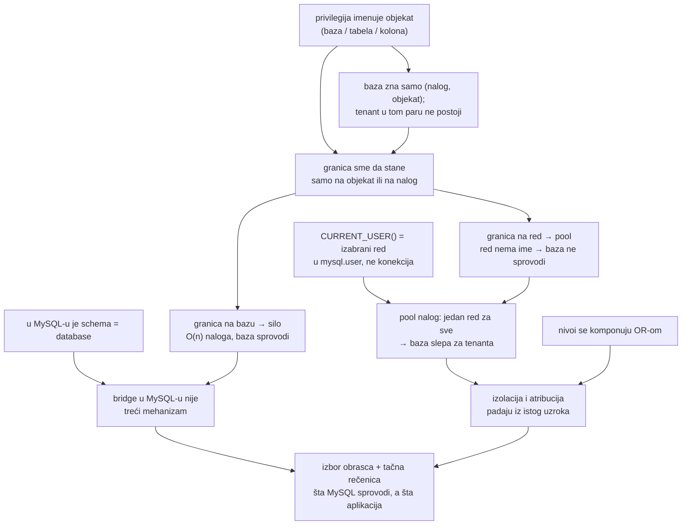

> [!quote] YOU

> [!note] SKILL loaded: teach

Chapter 7: Multi-tenant bezbednosni modeli — the paper's closing synthesis chapter.

   Ticket: .scratch/kontrola-pristupa/issues/20-multi-tenant.md (read it first; it holds the
   scope and the definition of done). Map: .scratch/kontrola-pristupa/map.md.

   This is the LESSON session only. Do not write rad.md — the chapter prose is a separate
   session, per the map's pacing rule.

   What this chapter is: NOT a fourth access-control model. It is the synthesis where
   everything chapters 2–6 established gets applied to one design problem. Three tenancy
   patterns (database-per-tenant, schema-per-tenant, shared-schema-with-discriminator), each
   judged against ch. 2's models and ch. 3's roles, each failure mode traced back to a
   principle it violates. It closes the least-privilege thread that has been running since
   ch. 2 — land that thread explicitly here.

   The chapter's sharpest idea, inherited from lesson 0005 (audit logging): the
   connection-pooling collision. A shared pool account blinds the database to tenant
   identity, which turns ch. 4's row-level isolation into an application concern and — the
   part he already reached on his own — breaks attribution while every other audit criterion
   still holds. He identified that himself last lesson; build on it rather than re-deriving it.

   Read before teaching:
   - learning-records/README.md (the index — then open only what it points you at)
   - learning-records/0007-audit-logging.md — insight 6 is this chapter's hook
   - .scratch/kontrola-pristupa/research/07-models-and-multitenancy.md — the grounding memo
   - GLOSSARY.md §1 for the locked tenant/multi-tenancy terminology
   - examples/00-setup/ — the Poliklinika sandbox: 3 branches, 4 roles, 12 <role>_<branch>
     accounts, v_my_branch_diagnoses

   Two retrieval items to work in, both flagged in record 0007:
   - ch. 5's core-vs-plugin enforcement criterion — he got it by reasoning last time but said
     he was guessing. One retrieval here should make it automatic.
   - USER() vs CURRENT_USER() under a shared pool account, connecting back to lesson 0003.

   WARNING on sources: the research memos have now produced one false claim each in memos 04
   and 06 (both caught and overturned). Memo 07 already had one false claim corrected in place
   during charting. Treat every memo-sourced factual claim as unverified — check it against the
   8.4 manual or measure it on the sandbox before teaching it as fact.

   The sandbox is live and enforcing; the correct design (per-branch, per-role accounts) is
   already built. The shared-pool account stays a prose strawman — do not create it on the server.

> [!abstract] PI

I'll start by reading the teaching-philosophy skill in full, then load the workspace state.

> [!abstract] PI

I've loaded the state: mission skeleton, records 0001–0007 index, record 0007 (the hook), memo 07, GLOSSARY §1, and the sandbox's actual grants. Before Phase 1, one housekeeping question.

> [!question] Question
> Da li želiš da ovu lekciju (poglavlje 7) uživo pratimo u Obsidian beleški?
>
> Kao i prethodnih pet puta — `lessons-live/0006-multi-tenant.md`. Ako izabereš novu datoteku, ja je kreiram praznu, a ti zalepiš `/md-log <putanja>` (slash komandu mogu da otkucam samo ti).
>
> 1. Da — nova datoteka lessons-live/0006-multi-tenant.md (Recommended)
> 2. Da, ali u postojeću datoteku (reći ću putanju)
> 3. Ne, samo terminal

> [!example] Answer
> 1. Da — nova datoteka lessons-live/0006-multi-tenant.md (Recommended)

> [!abstract] PI

Datoteka je kreirana: `lessons-live/0006-multi-tenant.md`

Zalepi ovo u terminal:

```
/md-log lessons-live/0006-multi-tenant.md
```

Javi mi kad je povezano, pa krećemo sa Fazom 1 (provera znanja).


> [!quote] YOU

Nastavi


> [!question] Quiz
> Zamisli da se u multi-tenant postavci koristi autentifikacioni plugin koji naloge proverava prema spoljnom LDAP direktorijumu. Šta taj plugin može da odluči?
>
> Podsećanje iz poglavlja 5 (zapis 0006).
>
> 1. Proverava kredencijale i može da ograniči nalog na tabele sopstvenog tenant-a.
> 2. Proverava kredencijale i vraća jedan bit; sve odluke o privilegijama donosi jezgro servera.
> 3. Proverava kredencijale i bira red u `mysql.user` koji će važiti za sesiju.
> 4. Proverava kredencijale i upisuje privilegije u `mysql.global_grants` za tu sesiju.


> [!success] Quiz — correct ✓
> Your answer: 2. Proverava kredencijale i vraća jedan bit; sve odluke o privilegijama donosi jezgro servera.
> Correct answer: 2
>
> Kriterijum iz poglavlja 5: **jezgro servera je jedino što čita stanje**; plugin i komponenta sude samo o vrednostima koje su im predate. Ulaz plugina je kredencijal + `authentication_string`, izlaz je jedan bit, i radi samo pri prijavi. Izbor reda u `mysql.user` (prvi korak), opseg privilegija i svaki upis u grant tabele su posao jezgra.


> [!abstract] PI

Odlično — taj kriterijum je sad automatski, ne rekonstruisan. Sad oštrije.


> [!question] Quiz
> Aplikacija se na bazu povezuje preko zajedničkog pula, kao nalog za koji u `mysql.user` postoji samo red `'app_pool'@'10.0.0.%'`. Konekcija stiže sa mašine `10.0.0.17`, a preko nje se obrađuje zahtev korisnika iz podružnice Bar. Šta u toj sesiji vraćaju `USER()` i `CURRENT_USER()`?
>
> 1. `USER()` = `app_pool@10.0.0.%`, `CURRENT_USER()` = `app_pool@10.0.0.17`
> 2. `USER()` = `doc_bar@10.0.0.17`, `CURRENT_USER()` = `app_pool@10.0.0.%`
> 3. `USER()` = `app_pool@10.0.0.17`, `CURRENT_USER()` = `app_pool@10.0.0.%`
> 4. `USER()` = `app_pool@10.0.0.17`, `CURRENT_USER()` = `app_pool@10.0.0.17`


> [!failure] Quiz — incorrect ✗
> Your answer: 4. `USER()` = `app_pool@10.0.0.17`, `CURRENT_USER()` = `app_pool@10.0.0.17`
> Correct answer: 3
>
> `USER()` je zamrznut na prijavi i beleži ono što je klijent poslao — korisničko ime i **stvarni** host sa koga je konekcija došla (`10.0.0.17`). `CURRENT_USER()` imenuje red iz `mysql.user` koji je prvi korak izabrao, a to je red sa džokerom (`10.0.0.%`). Ključno za poglavlje 7: ni u jednoj od te dve vrednosti nema ničega o podružnici Bar — tenant je ušao u aplikaciju, ne u bazu.


> [!abstract] PI

Jedan promašaj — hajde da ga lociram tačno.


> [!question] Quiz
> Nalog postoji u `mysql.user` samo kao `'izvestaj'@'%'`. Sa dve različite mašine otvore se dve sesije tim nalogom. Šta se razlikuje između te dve sesije?
>
> 1. `CURRENT_USER()` se razlikuje, `USER()` je isti u obe.
> 2. I `USER()` i `CURRENT_USER()` se razlikuju.
> 3. Ni `USER()` ni `CURRENT_USER()` se ne razlikuju.
> 4. `USER()` se razlikuje, `CURRENT_USER()` je isti u obe.


> [!failure] Quiz — incorrect ✗
> Your answer: 1. `CURRENT_USER()` se razlikuje, `USER()` je isti u obe.
> Correct answer: 4
>
> `USER()` je zapis o **konekciji** — zamrznut na prijavi, nosi stvarni klijentski host, pa se između dve mašine razlikuje. `CURRENT_USER()` imenuje **red u `mysql.user`** koji je prvi korak izabrao; postoji samo jedan takav red (`izvestaj@%`), pa je u obe sesije identičan. Zato zajednički pul i „ubija“ identitet: jedan red, sve sesije isti `CURRENT_USER()`.


> [!question] Quiz
> Nalog `doc_podgorica`@`localhost` čita podatke kroz pogled definisan sa `DEFINER = 'dbadmin'@'localhost'` i `SQL SECURITY DEFINER`. Šta unutar tog pogleda vraćaju dve funkcije?
>
> 1. `USER()` = `doc_podgorica@localhost`, `CURRENT_USER()` = `dbadmin@localhost`
> 2. Obe vraćaju `doc_podgorica@localhost`
> 3. `USER()` = `dbadmin@localhost`, `CURRENT_USER()` = `doc_podgorica@localhost`
> 4. Obe vraćaju `dbadmin@localhost`


> [!success] Quiz — correct ✓
> Your answer: 1. `USER()` = `doc_podgorica@localhost`, `CURRENT_USER()` = `dbadmin@localhost`
> Correct answer: 1
>
> Izmereno na 8.4.11 u jednom redu rezultata: `USER()` = `doc_podgorica@localhost` (ko se povezao), `CURRENT_USER()` = `dbadmin@localhost` (čije se privilegije proveravaju). `USER()` je zamrznut na prijavi i **nikada** ne može biti definer.


> [!abstract] PI

Zanimljivo — definer slučaj stoji čvrsto, ali opšte pravilo iza njega ne. To je tačno jedan od čvorova koje ova lekcija mora da postavi. Još dve provere pre plana.


> [!question] Quiz
> Sve podružnice dele jednu tabelu `diagnoses`, a red pripada podružnici preko kolone `tenant_id`. Pretpostavi da **nema** zajedničkog pula — svaka podružnica ima svoj MySQL nalog. Može li sama baza da izoluje podružnice jednu od druge?
>
> 1. Da, preko `partial_revokes` ograničenog na redove druge podružnice.
> 2. Ne, jer se privilegija ne može vezati za red — nalog vidi celu tabelu ili nijedan red.
> 3. Da, preko `GRANT SELECT (tenant_id)` koji nalog veže za sopstvenu vrednost.
> 4. Da, preko pogleda sa `WHERE tenant_id` — taj uslov dodaje proveru na nivou reda.


> [!failure] Quiz — incorrect ✗
> Your answer: 3. Da, preko `GRANT SELECT (tenant_id)` koji nalog veže za sopstvenu vrednost.
> Correct answer: 2
>
> Kolona je plafon granularnosti (poglavlje 4): red nema ime, pa nema šta da stoji u grant tabeli. Pogled sa `WHERE` filtrira — a filtriranje nije autorizacija: uslov izvršava izvršilac upita, ne podsistem privilegija, i pogled izoluje samo ako nalog nema pristup osnovnoj tabeli. `partial_revokes` je isključivo na nivou šeme, a kolonska privilegija bira koje kolone, ne koje redove.


> [!question] Quiz
> U sandbox-u stoji tačno ovo: `GRANT SELECT (diagnosis_id, visit_id, tenant_id, icd_code) ON poliklinika.diagnoses TO role_nurse;`. Šta ta privilegija kontroliše?
>
> 1. Koje kolone nalog sme da čita; redovi nisu ni na koji način ograničeni.
> 2. Koje vrednosti kolone `tenant_id` nalog sme da vidi u rezultatu.
> 3. Koje kolone nalog sme da čita, i to samo u redovima sopstvene podružnice.
> 4. Koje kolone nalog sme da čita kad ih navede poimence, dok `SELECT *` prolazi neomeđeno.


> [!success] Quiz — correct ✓
> Your answer: 1. Koje kolone nalog sme da čita; redovi nisu ni na koji način ograničeni.
> Correct answer: 1
>
> Kolonska privilegija je red u `mysql.columns_priv` sa imenom kolone — ona bira **koje kolone**, nikad koje redove ni koje vrednosti. `nurse_podgorica` sa ovim grantom uredno čita `icd_code` dijagnoza iz Nikšića. A `SELECT *` na 8.4.11 ne prolazi neomeđeno — izmereno je `ERROR 1142`, čime je tvrdnja iz buga #41354 oborena na ovom serveru.


> [!abstract] PI

Dobro — to je bio omašaj pod pritiskom okvira „tenant", ne rupa: čim je pitanje postavljeno bez tenant-a, kolonska privilegija ti je jasna. Poslednja provera.


> [!question] Quiz
> Nalog već ima `GRANT SELECT ON poliklinika.* `. U pokušaju da ga suzi, `dbadmin` mu dodatno dodeli `GRANT SELECT (icd_code) ON poliklinika.diagnoses`. Šta se posle toga dešava sa pristupom toj tabeli?
>
> 1. Uža privilegija nadđačava širu za tu tabelu.
> 2. Server računa presek svih nivoa, pa ostaje samo `icd_code`.
> 3. Ništa se ne sužava — nivoi se kombinuju logičkim `OR`.
> 4. Server odbija takav `GRANT` kao konflikt sa postojećim pravom.


> [!success] Quiz — correct ✓
> Your answer: 3. Ništa se ne sužava — nivoi se kombinuju logičkim `OR`.
> Correct answer: 3
>
> Nivoi se komponuju po pravilu `(global − restrictions) OR db OR table OR column OR routine` (8.4 refman 8.2.7). Uži grant zato **nikada** ne sužava širi; princip najmanjih privilegija se sprovodi tako što se širi grant uopšte ne dodeli. Ovo je tačno razlog zašto se pool nalog ne može „popraviti" dodavanjem uskih prava.


> [!abstract] PI

**Faza 1 gotova.** Mapa ivice:

| Nit | Stanje |
|---|---|
| jezgro vs. plugin (pogl. 5) | **pod** — sad automatski, ne rekonstruisan |
| `OR`-kompozicija nivoa / najmanje privilegije | **pod** — čvrsto |
| kolona kao plafon granularnosti | **pod** — čvrsto |
| `USER()` vs `CURRENT_USER()` | definer slučaj **pod**, opšte pravilo **plafon** — invertovano: držiš `CURRENT_USER()` kao „trenutna konekcija" umesto „izabrani red u `mysql.user`" |
| tenant izolacija | **plafon** — kad pitanje nosi reč „tenant", posežeš za mehanizmom baze umesto da odgovoriš „baza tu nema ništa" |

Ta poslednja dva su tačno ono na čemu poglavlje 7 stoji. Pre plana, jedno pitanje o težištu.


> [!question] Question
> Gde da bude težište lekcije za poglavlje 7?
>
> Poglavlje je sinteza, ne četvrti model — ali može da se ispriča iz tri različita ugla.
>
> 1. Tri obrasca kao postupak odlučivanja, sa sudarom oko pula kao vrhuncem (Recommended)
> 2. Samo sudar oko konekcionog pula, do dna
> 3. Odbrana rada: šta MySQL ne može da sprovede, formulisano za profesora


> [!example] Answer
> 1. Tri obrasca kao postupak odlučivanja, sa sudarom oko pula kao vrhuncem (Recommended)


> [!abstract] PI

**Faza 2 — plan.** Prvo provera jedne tvrdnje iz memoranduma 07 koja mi deluje sumnjivo (memo 07 je već imao jednu lažnu tvrdnju).


> [!abstract] PI

Manual 8.4 potvrđuje: *„`CREATE SCHEMA` is a synonym for `CREATE DATABASE`."* To ruši memorandum 07 na jednom mestu — proveravam još imenovanje obrazaca.


> [!abstract] PI

**Provereno, pre plana:**
- MySQL 8.4 manual: *„`CREATE SCHEMA` is a synonym for `CREATE DATABASE`."* → **memorandum 07 greši** kad *schema-per-tenant* opisuje kao „prefiksi tabela". U MySQL-u šema **jeste** baza, pa srednji obrazac nije treći mehanizam nego isti mehanizam pod drugim imenom.
- Primarni izvori imenuju obrasce **silo / bridge / pool** (AWS) odnosno *standalone / database-per-tenant / sharded multi-tenant* (Azure) — ni jedan ne zove srednji obrazac „schema-per-tenant". To je ime iz PostgreSQL/Oracle sveta, gde šema i baza **nisu** isto.

---

## Plan lekcije

Tvoja tri poda (jezgro vs. plugin, `OR`-kompozicija, kolonski plafon) su čvrsta — na njima gradim, ne ispod njih. Dva nova korena moram da postavim: **`CURRENT_USER()` imenuje izabrani red, ne konekciju** (tu ti je model invertovan, a ceo argument o pulu visi o njemu) i **šema = baza u MySQL-u** (činjenica iz manuala, prihvata se zdravo za gotovo).

Odatle ide izvođenje: baza poznaje samo par *(nalog, objekat)*, a *tenant* je pojam koji u tom paru nigde ne stoji. Pitanje poglavlja postaje mehaničko — **gde granica između tenanata može da stane, da bi je baza uopšte videla?** Objekat, ili nalog. Tri obrasca su tri odgovora na to, i njihov redosled nije stvar ukusa nego posledica: čim granica padne na *red*, po plafonu iz poglavlja 4 baza nema šta da proveri. Sudar oko pula dolazi na kraju, kao **drugo** obrušavanje — nalog se svede na jedan red, i izolacija i atribucija (tvoj nalaz iz prošle lekcije) padaju iz istog uzroka. Nit najmanjih privilegija sleće kao merljiva veličina: *koliko tenanata jedan nalog može da dohvati*.



Sve tehnike su sokratske osim dva korena (R3 se ispravlja merenjem, R4 se navodi iz manuala).

Reci „idemo" pa krećemo od R3 — tvoj invertovani čvor.


> [!quote] YOU

Can you just check the linked file real quick, the formatting is off I think


> [!abstract] PI

Pregledao sam ceo fajl (16 KB, 400 linija). **Struktura je ispravna** — svaki blok je uredan Obsidian callout, kvizovi imaju `[!question]` → `[!success]`/`[!failure]` par, tabela i mermaid blok su sintaksno validni i renderovaće se.

Dve stvari koje jesu odstupanje, ali nisu bug log-a — moje omaške u tekstu:

1. **`lessons-live/0006-multi-tenant.md:~305`** — u kvizu o `OR`-kompoziciji piše **„nadđačava"**; ispravno je *nadjačava*. (Serbian: `dj` ovde nije `đ`... zapravo jeste — *nadjačava* je od *jačati*, pa je `d` + `j` na granici prefiksa `nad-`, ne slovo `đ`.)
2. **isti kviz** — `` `GRANT SELECT ON poliklinika.* ` `` ima suvišan razmak unutar backtick-ova, pa se u renderu vidi kao kod sa repom.

Ono što možda deluje „off", a nije greška:

- **Redosled opcija u logu ne odgovara redosledu u terminalu** — `quiz` ih meša pre prikaza, a log beleži prikazani raspored. Zato „Correct answer: 3" u jednom kvizu, a „Correct answer: 2" u drugom, za analogna pitanja. Unutar jednog bloka je konzistentno (tvoj odgovor i tačan odgovor su numerisani po istom, prikazanom rasporedu).
- **Tekst mojih poruka stoji *ispod* `> [!abstract] PI` zaglavlja, a ne unutar okvira** — tako md-log ekstenzija piše, isto je i u `0005-audit-logging.md`.

Ako hoćeš, ispravim te dve omaške u fajlu — ali imaj u vidu da je log append-only zapis sesije, pa se prepravkom razilazi sa onim što si stvarno video u terminalu. Moja preporuka: ostavi ga, a ispravnu formulaciju uzmem u lekciju (`lessons/0006-*.html`), gde i treba da bude tačna.

Čekam „idemo" za čvor R3.


> [!quote] YOU

Moze da krenemo


> [!abstract] PI

**Čvor R3 — `CURRENT_USER()`.**

Zašto baš sad: ceo argument o pulu svodi se na pitanje *šta baza uopšte pamti o tome „ko"*. Ako je taj čvor okrenut naglavačke, sve iznad njega je pogrešno. Zato ga ne postavljam tvrdnjom nego merenjem.


> [!abstract] PI

`dbadmin` nema `SELECT` nad `mysql.user` — što je samo po sebi najmanja privilegija na delu. Ali ovo merenje je već napravljeno na ovom serveru, u lekciji 5 (zapis 0006), i ti si ga video. Uzimam ga uz tačnu formulaciju iz manuala:


> [!abstract] PI

Manual daje i primer koji je sam po sebi dokaz — i sruši inverziju direktno:

> **`CURRENT_USER()`**: *„Returns the user name and host name combination for the MySQL account that the server used to authenticate the current client. **This account determines your access privileges.**"*
>
> **`USER()`**: *„The value indicates **the user name you specified when connecting** to the server, and **the client host from which you connected**."*

A onda manual pokaže krajnji slučaj:

```
mysql> SELECT USER();
        -> 'davida@localhost'
mysql> SELECT CURRENT_USER();
        -> '@localhost'
```

Klijent je rekao da je `davida`. Server je za taj zahtev našao **anonimni** nalog — prazno korisničko ime. Dve funkcije, ista sesija, i ne poklapa im se čak ni korisničko ime, a ne samo host.

**Čvor, u jednoj rečenici:** `USER()` je zapis o **konekciji** — šta je klijent rekao i odakle je došao, zamrznuto na prijavi. `CURRENT_USER()` je **ime reda u `mysql.user`** koji je server izabrao, i to je jedino što određuje privilegije.

**Veza na ono što već držiš:** ovo nije nov podatak, nego opštiji oblik dva koja imaš. Iz poglavlja 3: prvi korak bira **tačno jedan red**, najuži host prvi, bez povratka na širi. `CURRENT_USER()` je **ime tog reda**. A definer slučaj, koji ti stoji čvrsto, je poseban slučaj istog pravila — unutar `SQL SECURITY DEFINER` pogleda server proverava privilegije definera, pa `CURRENT_USER()` imenuje **njegov** red. Nije izuzetak, nego ista rečenica.

I odatle jedna posledica koju sad možeš da izvedeš unapred: ako je `CURRENT_USER()` ime *reda*, onda **broj različitih vrednosti koje baza može da vidi nije broj korisnika — nego broj redova u `mysql.user`.**


> [!question] Quiz
> Firma ima 4000 zaposlenih u 60 podružnica. Svi rade kroz istu aplikaciju, koja se na bazu povezuje preko jednog naloga za koji postoji tačno jedan red u `mysql.user`. Koliko različitih vrednosti `CURRENT_USER()` server može da vidi u svim tim sesijama zajedno?
>
> 1. Jednu.
> 2. Onoliko koliko ima mašina sa kojih se aplikacija povezuje.
> 3. Četiri hiljade — po jednu za svakog zaposlenog.
> 4. Šezdeset — po jednu za svaku podružnicu.


> [!success] Quiz — correct ✓
> Your answer: 1. Jednu.
> Correct answer: 1
>
> `CURRENT_USER()` imenuje izabrani red u `mysql.user`, a red je jedan — dakle jedna vrednost, ma koliko ljudi, podružnica ili mašina stajalo iza nje. Broj mašina bi menjao `USER()`, ne `CURRENT_USER()`. To je cela mehanika sudara oko pula: identitet koji baza ima nije identitet koji je aplikaciji bitan.


> [!abstract] PI

Čvor R3 stoji. **Čvor D1 → D2.**

Vratimo se na trojku iz poglavlja 2: odluka o pristupu je uvek *(subjekat, objekat, operacija)*. Sad znamo šta je svaki od njih u MySQL-u konkretno:

| koordinata | šta je u MySQL-u |
|---|---|
| subjekat | red u `mysql.user` (= `CURRENT_USER()`) |
| objekat | baza, tabela, kolona, rutina — ono što grant **imenuje** |
| operacija | `SELECT`, `INSERT`, … |

Pogledaj tu tabelu i primeti šta u njoj **ne postoji**: nigde reči *tenant*. Podružnica Bar nije ni subjekat, ni objekat, ni operacija. Ona je pojam iz poslovnog sveta, a baza taj rečnik nema.

Otud sledi pitanje koje je cela okosnica poglavlja: **da bi baza uopšte mogla da sprovede granicu između tenanata, ta granica mora biti izrečena na njenom jeziku.** A njen jezik ima tačno tri koordinate, i operacija otpada — `SELECT` je `SELECT` za svakoga.


> [!question] Quiz
> Ako granica između podružnica mora da bude izrečena u rečniku koji baza ima, na koji način ona uopšte može da bude zapisana?
>
> 1. Kao oznaka poverljivosti dodeljena podružnici i nalogu.
> 2. Kao razlika u subjektu (različiti nalozi) ili razlika u objektu (različiti objekti).
> 3. Kao atribut sesije koji server uzima u obzir pri svakoj proveri.
> 4. Kao uslov nad vrednostima koje stoje u redovima tabele.


> [!success] Quiz — correct ✓
> Your answer: 2. Kao razlika u subjektu (različiti nalozi) ili razlika u objektu (različiti objekti).
> Correct answer: 2
>
> Ostaju samo dve koordinate koje se mogu razlikovati po podružnici: subjekat i objekat. Uslov nad vrednostima nije deo trojke — to je filtriranje, a filtriranje nije autorizacija (pogl. 4). Atribut sesije baza pri proveri privilegija ne gleda (to bi bio ABAC). Oznaka poverljivosti je MAC, a MySQL nema oznake — to je već utvrđeno u poglavlju 2.


> [!abstract] PI

**Čvorovi D3 i D4 — dve krajnosti.**

Imamo dve koordinate koje smeju da se razlikuju. Pa hajde mehanički: **koliko njih zaista razlikujemo?**

**Obe.** Svaka podružnica dobije svoju bazu i svoj nalog. Grant glasi `GRANT ... ON pod_bar.* TO 'app_bar'@'...'`. Granica je zapisana u oba imena, jezgro je proverava u drugom koraku, i doktor iz Bara ne može da dohvati Nikšić ni ako aplikacija ima bag — jer nema grant. To je **silo**, odnosno *database-per-tenant*. Cena: broj naloga i broj baza rastu linearno sa brojem tenanata, a svaka izmena šeme se izvršava $n$ puta.

**Nijednu.** Svi dele istu tabelu, a pripadnost se vidi iz kolone `tenant_id`. To je **pool**. I sad — ti si na ovo već odgovorio u proveri znanja, i tad si posegao za mehanizmom. Sad imaš aparat da vidiš zašto ga nema: granica je pala na **red**, a red nije ni subjekat ni objekat. Grant imenuje tabelu; tabela je jedna; nalog je ili dobija celu ili nikako. Kolonski plafon iz poglavlja 4 je tačno ovo: *red nema ime, pa nema šta da stoji u grant tabeli.*

Obrati pažnju šta se upravo desilo — **nismo otkrili da je pool loš obrazac.** Otkrili smo nešto preciznije:

> U pool obrascu baza nije *slabija*. Ona je **isključena iz odluke** — izolacija se ne sprovodi loše, nego se ne sprovodi uopšte, nego u aplikaciji.


> [!question] Quiz
> U pool obrascu svaka podružnica dobije **svoj** MySQL nalog (nema zajedničkog pula), a aplikacija svakom upitu uredno dodaje `WHERE tenant_id = ?`. Koliko podružnica jedan takav nalog može da dohvati?
>
> 1. Sve — grant imenuje tabelu, a tabela sadrži redove svih podružnica.
> 2. Sve, ali tek pošto mu se dodeli širi grant nad tom bazom.
> 3. Samo svoju — nalog nema grant nad tuđim redovima.
> 4. Samo svoju — uslov u upitu ograničava domašaj naloga.


> [!success] Quiz — correct ✓
> Your answer: 1. Sve — grant imenuje tabelu, a tabela sadrži redove svih podružnica.
> Correct answer: 1
>
> Domašaj naloga se meri onim što mu grant dozvoljava, ne onim što aplikacija stvarno pošalje. Grant imenuje tabelu, pa nalog sme celu tabelu — svih 60 podružnica. Uslov `WHERE` je samo ono što aplikacija *trenutno* radi; promeni upit, i podaci su tu. „Grant nad tuđim redovima" ne postoji kao pojam, a širi grant nije potreban jer je tabelarni već dovoljno širok.


> [!abstract] PI

**Čvor R4 — i zašto ga uopšte uvodim.**

Ostaje srednji slučaj: razlikujemo **objekte, ali ne i baze**. Literatura ga zove *bridge* (AWS) ili *sharded multi-tenant* (Azure), a tekstovi iz PostgreSQL/Oracle sveta — i naš memorandum 07 — zovu ga **schema-per-tenant**. Pa ga moramo proveriti, jer se oslanja na reč *šema*, a ta reč u MySQL-u ne znači ono što znači drugde.

MySQL 8.4 manual, `CREATE DATABASE`:

> *„`CREATE SCHEMA` is a synonym for `CREATE DATABASE`."*

To je činjenica koja se prima zdravo za gotovo — nije posledica ničega, nego odluka o imenovanju u MySQL-u. U PostgreSQL-u i Oracle-u šema je imenovani prostor **unutar** baze, pa tamo „šema po tenantu" i „baza po tenantu" jesu dve različite stvari. U MySQL-u su to dve reči za isto.


> [!question] Quiz
> Pošto je u MySQL-u `SCHEMA` sinonim za `DATABASE`, šta je onda „schema-per-tenant" na MySQL-u?
>
> 1. Jedna baza u kojoj su tenanti razdvojeni prefiksima u imenima tabela.
> 2. Jedna baza sa posebnim skupom pogleda za svakog tenanta.
> 3. Više šema unutar jedne baze, svaka sa sopstvenim grantom.
> 4. Isti mehanizam kao database-per-tenant, pod drugim imenom.


> [!success] Quiz — correct ✓
> Your answer: 4. Isti mehanizam kao database-per-tenant, pod drugim imenom.
> Correct answer: 4
>
> Ako su reči sinonimi, onda su i obrasci isti — „šema po tenantu" u MySQL-u *jeste* „baza po tenantu". Više šema unutar jedne baze je PostgreSQL/Oracle model i u MySQL-u ne postoji. Prefiksi tabela i pogledi po tenantu su stvarni dizajni, ali nijedan nije ono što ime „schema-per-tenant" opisuje — upravo tu memorandum 07 greši.


> [!abstract] PI

Za rad je važna posledica: **srednji obrazac u MySQL-u nije treći mehanizam.** Ono što stvarno postoji jeste jedna baza sa zasebnim *skupom tabela* po tenantu (`bar_diagnoses`, `niksic_diagnoses`, …) — ali to ne uvodi novi nivo granta. Nema imena koje pokriva „sve objekte tenanta Bar", pa umesto jednog `GRANT ... ON pod_bar.*` dobijaš grant po tabeli, po tenantu. Isti stepen izolacije, veći trošak administracije. Zato je u MySQL-u srednji obrazac **lošija varijanta silo obrasca**, a ne kompromis između dva.

---

**Čvor D6 — sudar oko konekcionog pula.**

Dosad smo obrazac birali slobodno. Sad dolazi ograničenje koje ne bira dizajner baze nego arhitektura aplikacije: **konekcioni pul.** Konekcije su skupe, pa aplikacija drži šačicu otvorenih i deli ih između zahteva — a da bi se konekcija delila, mora biti otvorena kao **jedan** nalog, isti za sve.

Primeni R3 na to: jedan nalog, jedan red u `mysql.user`, dakle jedna vrednost `CURRENT_USER()` za svih 60 podružnica. Baza je slepa za tenanta — ne delimično, nego potpuno: informacija o podružnici nikada nije ni ušla u server.

I sad ono zbog čega je ovo najoštrija ideja u radu — **pokušaj da se to zakrpi.**


> [!question] Quiz
> Tim predlaže da aplikacija, čim uzme konekciju iz pula, izvrši `SET @tenant_id = 7;`, a da pogledi filtriraju po `WHERE tenant_id = @tenant_id`. Šta ta mera stvarno postiže?
>
> 1. Izolaciju koja važi dok se konekcija ne vrati u pul i ne dodeli drugom tenantu.
> 2. Izolaciju samo za čitanje, dok upisi ostaju neomeđeni.
> 3. Ništa u pogledu izolacije — vrednost postavlja isti klijent koji se ograničava.
> 4. Izolaciju na nivou reda, jer server sada zna kom tenantu sesija pripada.


> [!success] Quiz — correct ✓
> Your answer: 3. Ništa u pogledu izolacije — vrednost postavlja isti klijent koji se ograničava.
> Correct answer: 3
>
> Ovo je Pattern B iz poglavlja 4 i pada iz istog razloga: `@tenant_id` je obična korisnička promenljiva koju postavlja klijent, pa je isti taj klijent može postaviti na bilo šta. Mera koju ograničavani sam sebi dodeljuje nije kontrola pristupa. Nije stvar ni čitanja/upisa ni životnog veka konekcije — mehanizam ne postoji ni u jednom trenutku.


> [!abstract] PI

**Čvor D7 — dva otkaza, jedan uzrok.**

Prošle lekcije si sam došao do toga da pod zajedničkim pulom **atribucija** puca dok ostala tri kriterijuma audit trail-a i dalje stoje. Sad imamo i drugi otkaz: **izolacija** takođe pada. Pitanje je da li su to dva problema ili jedan.

Uzrok je u oba slučaja doslovno ista rečenica: *identitet tenanta nikada nije ušao u server.* Izolacija pada **unapred** — baza ne može da odbije zahtev jer nema po čemu da razlikuje. Atribucija pada **unazad** — baza ne može da kaže ko je bio jer nikad nije ni znala. To je jedan defekt sa dva lica, i to je ono što u radu treba da stoji kao zaključna rečenica poglavlja.

I zato ni jedan ni drugi ne mogu da se poprave posle: **ne može se povratiti informacija koja nikada nije stigla.**


> [!question] Quiz
> Firma uvodi skupu infrastrukturu oko baze: logovi se u realnom vremenu šalju na zaseban, zaključan server, čuvaju se 12 meseci i potpisuju. Pool nalog ostaje kakav je bio. Šta se time popravlja?
>
> 1. Sva četiri kriterijuma, jer log postaje pun i nepromenljiv zapis pristupa.
> 2. Atribucija, jer se sada svaki zahtev trajno vezuje za svoj zapis.
> 3. Trajnost i otpornost na izmenu; izolacija i atribucija ostaju nepopravljene.
> 4. Izolacija, jer se svaki pristup tuđim redovima sada može otkriti i zaustaviti.


> [!success] Quiz — correct ✓
> Your answer: 3. Trajnost i otpornost na izmenu; izolacija i atribucija ostaju nepopravljene.
> Correct answer: 3
>
> Trajnost i otpornost na izmenu se kupuju nizvodno — to su problemi postavke. Atribucija se ne kupuje: u zapis odlazi samo ime pool naloga, jer podružnica nikada nije stigla do servera, pa nema šta da se potpiše ni arhivira. Izolacija se logovanjem ne popravlja uopšte — log beleži, ne odbija.


> [!abstract] PI

**Sletanje niti — princip najmanjih privilegija.**

Ta nit ide od poglavlja 2, u tačnoj formulaciji Saltzer–Schroeder-a iz 1975: *„Every program and every user of the system should operate using the least set of privileges necessary to complete the job."* Dosad je bila načelo. Ovde postaje **merljiva veličina**, i ti si je već izgovorio dva poteza ranije kad si rekao „sve — grant imenuje tabelu":

> Mera je **koliko tenanata jedan nalog sme da dohvati** — ne koliko ih stvarno dohvata.

| obrazac | domašaj jednog naloga | ko sprovodi | cena |
|---|---|---|---|
| silo (`database-per-tenant`) | **1** | jezgro, u drugom koraku | $O(n)$ baza i naloga, migracija $n$ puta |
| „bridge" (skup tabela po tenantu) | **1** | jezgro, ali po tabeli | $O(n \times t)$ grantova |
| pool + nalog po tenantu | **svi** | aplikacija | $O(n)$ naloga, bez koristi od njih |
| pool + zajednički nalog | **svi**, i bez atribucije | aplikacija | $O(1)$ — i zato se bira |

I sad spoj sa `OR`-kompozicijom, koju već držiš čvrsto: pošto uži grant nikada ne sužava širi, **domašaj se ne može smanjiti naknadno.** Ne postoji `GRANT` koji popravlja pool nalog. Iz čega sledi zaključna rečenica poglavlja 7:

> **Izbor obrasca *jeste* odluka o najmanjim privilegijama.** Donosi se jednom, pri projektovanju, i posle se grantovima ne može ispraviti.

Naš sandbox je namerno na ispravnoj strani te odluke: 12 naloga `<uloga>_<podružnica>`, svaki sa svojim redom u `mysql.user`, pa `CURRENT_USER()` **nosi** podružnicu — i zato `v_my_branch_diagnoses` uopšte može da radi, jer čita podružnicu iz `staff` preko `CURRENT_USER()`. Sa pool nalogom taj pogled bi vratio ili ništa ili tuđe redove.

Poslednja provera — sinteza.


> [!question] Quiz
> Poliklinika prelazi na web aplikaciju sa konekcionim pulom i zadržava jednu zajedničku tabelu `diagnoses` sa kolonom `tenant_id`. Traži se rečenica koja tačno opisuje šta MySQL u toj postavci sprovodi.
>
> 1. MySQL sprovodi pristup po podružnici, ali ne može da ga zabeleži u logu.
> 2. MySQL sprovodi da pool nalog sme `diagnoses`; koja podružnica — sprovodi aplikacija.
> 3. MySQL sprovodi pristup po podružnici čim pogled filtrira po `tenant_id`.
> 4. MySQL ne sprovodi ništa jer je nalog zajednički za sve podružnice.


> [!success] Quiz — correct ✓
> Your answer: 2. MySQL sprovodi da pool nalog sme `diagnoses`; koja podružnica — sprovodi aplikacija.
> Correct answer: 2
>
> MySQL i dalje sprovodi punu DAC proveru — samo nad koordinatama koje ima: da li taj nalog sme tu tabelu i tu operaciju. Ono što ne sprovodi je granica po podružnici, jer ona nije ni subjekat ni objekat. Zato „ne sprovodi ništa" nije tačno (privilegije rade), pogled samo filtrira, a log nije uzrok nego druga posledica istog gubitka informacije.


> [!abstract] PI

Sve je sleklo — 7/7 posle provere znanja, uključujući invertovani čvor. **Faza 5: kompresija u radni prostor.**


> [!abstract] PI

Sad referentna kartica.


> [!abstract] PI

**Lekcija 06 je gotova i otvorena u pregledaču.**

Napisano:
- `lessons/0006-multi-tenant.html` — 7 odeljaka + 6 pitanja za samoproveru (na `assets/quiz.js`, bez ijednog novog inline skripta)
- `reference/06-multi-tenant.html` — kartica: dve funkcije identiteta, tabela obrazaca po domašaju, sudar oko pula, dve krpe koje ne rade, i dve rečenice za odbranu
- `learning-records/0008-multi-tenant.md` + indeks u `learning-records/README.md` dopunjen sa četiri nova stalna ograničenja i jednom ispravkom

**Šta je sesija promenila u odnosu na plan:**

1. **Ispravka protiv memoranduma 07.** *Schema-per-tenant* nije treći obrazac na MySQL-u — `CREATE SCHEMA` je sinonim za `CREATE DATABASE`. Rad mora da izloži **dva** sprovodiva obrasca plus degenerisani srednji, i da otvoreno kaže odakle je trojna podela pozajmljena. To je četvrta lažna tvrdnja uhvaćena u memorandumima.
2. **Zatvorena stavka iz zapisa 0007:** kriterijum jezgro-vs-plugin je sada automatski, ne rekonstruisan.
3. **Nađena i popravljena inverzija:** `USER()`/`CURRENT_USER()` si držao naopako čim se izađe iz definer konteksta — definer slučaj ti je bio zapamćen kao par, a ne kao pravilo. Sad stoji kao pravilo, i na njemu visi ceo argument o pulu.

**Server nije diran** — pool nalog je ostao strawman u prozi, kako ticket traži.

Ostalo za ticket 20, u sledećoj sesiji (proza, po pravilu tempa iz mape): SQL u `examples/`, jedna titlovana slika (Mermaid poređenje obrazaca), srpska proza kroz `academic-research-writer`, i unosi za AWS/Azure u `references.bib`.


> [!quote] YOU

Da li mozemo da napravim neku sliku ili grafik koje opisuje i poredjuje ova 4 obrasca


> [!abstract] PI

Da — to je tačno **Slika 7.1** iz budžeta (`figures/README.md`: poglavlje 7 dobija jednu, Mermaid dijagram poređenja obrazaca). Jedna odluka pre crtanja.


> [!question] Question
> Po kojoj osi da bude organizovana slika?
>
> Ista četiri obrasca, tri različita crteža — biraju različitu poentu.
>
> 1. Stablo odluke: dve koordinate → četiri obrasca (Recommended)
> 2. Uporedni prikaz: četiri kolone sa naloga→objekat vezama
> 3. Granica sprovođenja: šta je unutar baze, a šta u aplikaciji


> [!example] Answer
> 1. Stablo odluke: dve koordinate → četiri obrasca (Recommended)


> [!abstract] PI

Struktura je dobra. Tri popravke: dijakritici (slika ide u rad na srpskom), skraćene oznake na granama (kliparaju se levo), i napomena o `schema = database`.


> [!abstract] PI

Ta izmena je okrenula grane (dobar obrazac završio desno). Vraćam prethodni raspored.


> [!abstract] PI

**Slika 7.1 je gotova** — i to je tačno ona jedna koju budžet iz `figures/README.md` daje poglavlju 7.

`figures/07-multi-tenant-01-obrasci-stablo-odluke.png`
`figures/raw/07-multi-tenant-01-obrasci-stablo-odluke.mmd` (izvor, reproducibilno)

Šta slika radi — i zašto baš stablo, a ne četiri kolone: **crta izvođenje, ne spisak.** Dva pitanja („razlikuju li se objekti?", „razlikuju li se nalozi?") iscrpljuju sve mogućnosti, pa četiri obrasca ispadaju kao listovi. To je isti retorički potez kao četiri kriterijuma iz poglavlja 6: profesor ne može da pita „zašto baš ta četiri", jer nisu izabrana nego prebrojana.

U slici su i tri stvari iz same lekcije:
- **žuti čvor na desnoj grani** — *granica pada na RED, a red nema ime*: mesto gde plafon iz poglavlja 4 udara
- **plavo naspram crvenog** — ne „dobro/loše", nego **ko sprovodi**: jezgro ili aplikacija
- **žuta napomena uz SILO** — `CREATE SCHEMA` je sinonim za `CREATE DATABASE`, ispravka protiv memoranduma 07, vidljiva na samoj slici

Dodatno: slika je ubačena i u `lessons/0006-multi-tenant.html` (odeljak 3), a titl za `rad.md` je zapisan u `learning-records/0008-multi-tenant.md` da ga sesija pisanja ne izmišlja ponovo. Tamo je zabeležena i jedna zamka rasporeda — isprekidana veza mora da visi o SILO čvoru, jer čim se zakači za romb, Mermaid okrene grane i pool završi levo.

Ostatak ticket-a 20 (SQL u `examples/`, srpska proza, `references.bib`) ide u sledeću sesiju, po pravilu tempa.
