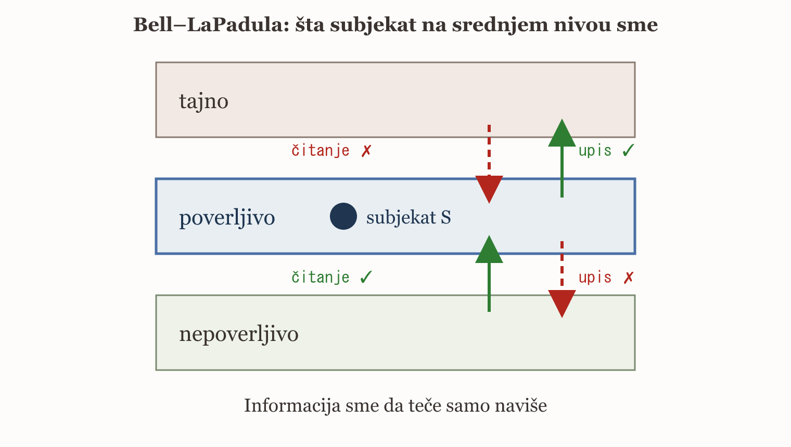
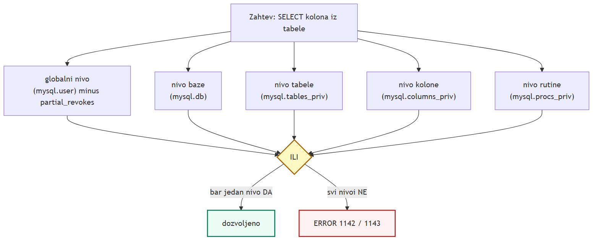
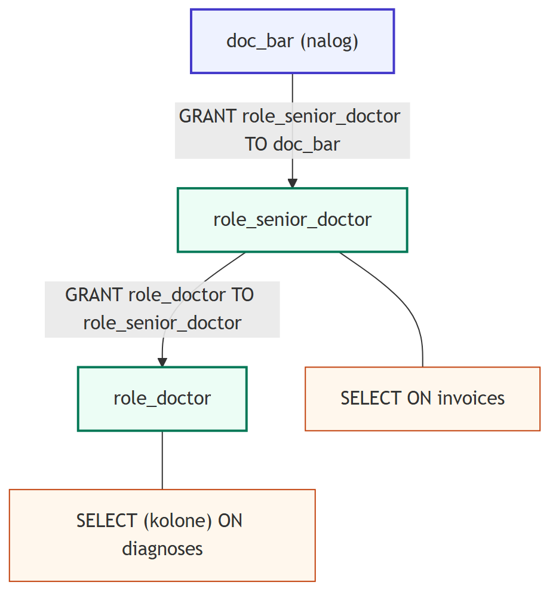
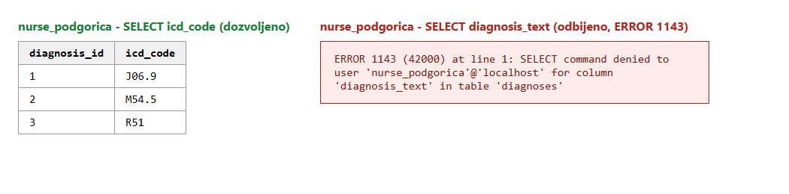
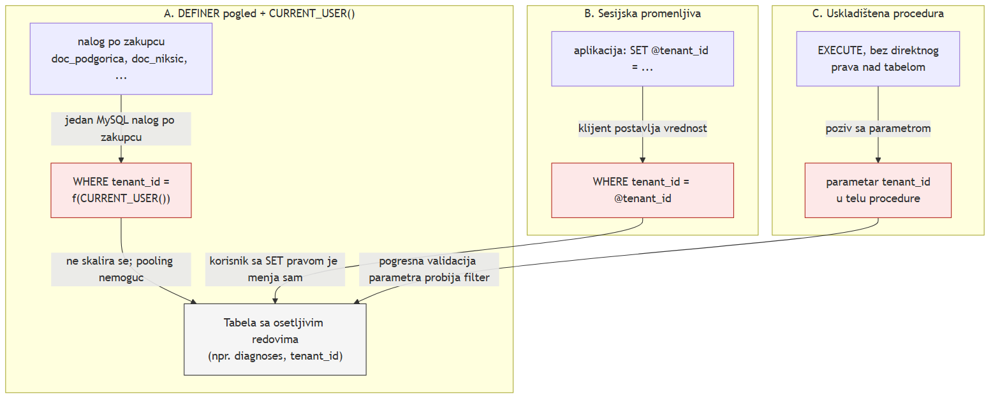
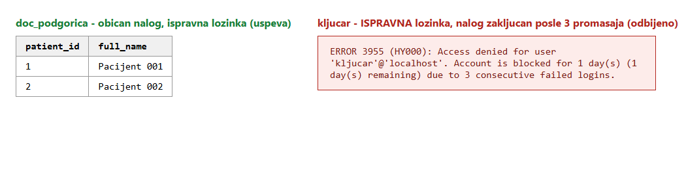
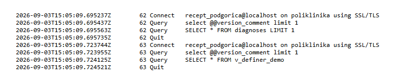
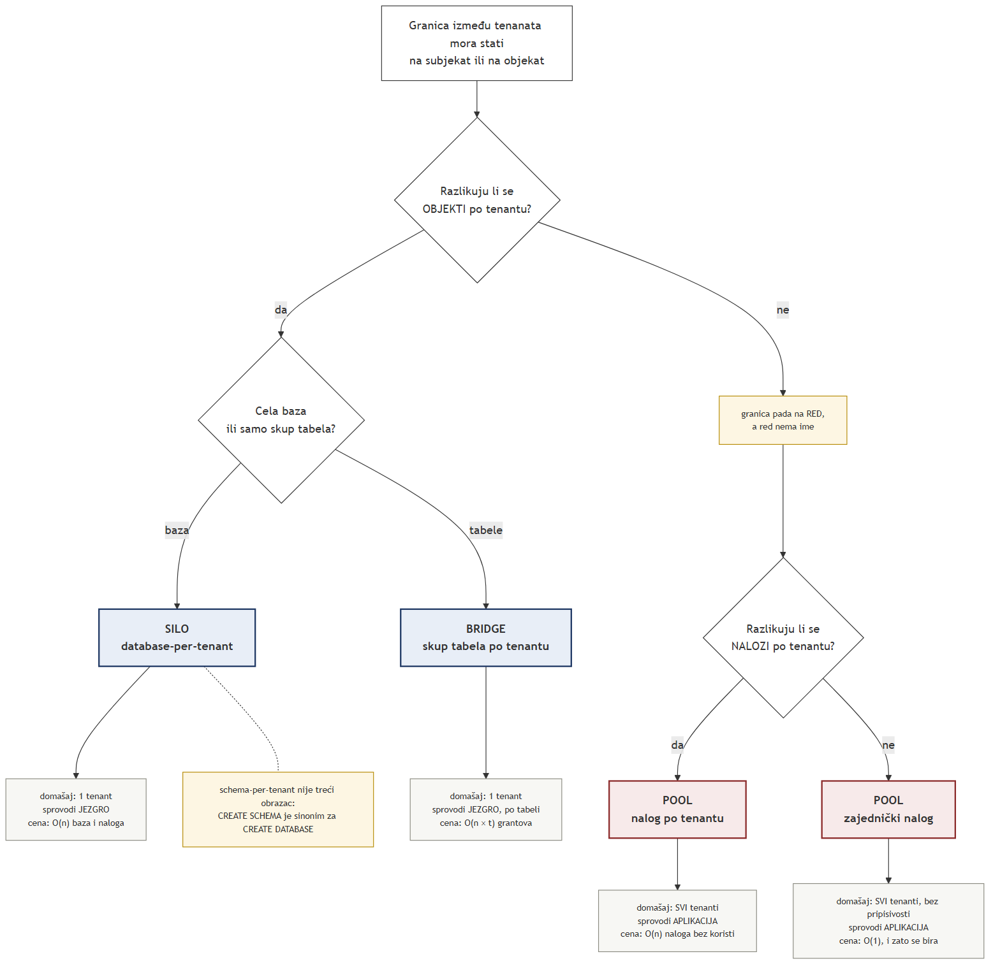

<!--
  The body of the paper. One chapter appended per session, by the academic-research-writer
  skill under the rules in ../WRITING.md. Never hand-written and tidied afterwards.

  Do NOT set `lang: sr` here - it forces the IEEE reference list into Cyrillic.
  The title page is a separate file (naslovna.md) and is prepended by ../tools/make-docx.ps1.
-->

# 1. Uvod

Kontrola pristupa predstavlja jedan od centralnih bezbednosnih mehanizama svakog sistema za
upravljanje bazama podataka: dok autentifikacija (provera identiteta) utvrđuje ko se povezuje na
sistem, kontrola pristupa (autorizacija) određuje koje operacije taj subjekat sme da izvrši nad kojim
objektom, i time neposredno štiti tajnost i integritet podataka [@ramakrishnan2003]. Razlika između
politike pristupa, kao pravila o tome ko sme šta da radi, i mehanizma sigurnosti, kao tehničkog
sredstva kojim se to pravilo sprovodi, jeste polazna tačka svakog ozbiljnog razmatranja bezbednosti
baza podataka: isti mehanizam može sprovoditi različite politike, a promena politike ne zahteva
nužno promenu mehanizma [@ramakrishnan2003]. Klasična teorija razlikuje diskrecionu kontrolu
pristupa (DAC), u kojoj vlasnik objekta samostalno odlučuje kome dodeljuje prava, od obavezne
kontrole pristupa (MAC), u kojoj centralni autoritet nameće sigurnosne klase koje korisnik ne može
da zaobiđe niti da prenese drugom korisniku [@ramakrishnan2003].

Ovaj rad razmatra kontrolu pristupa i sigurnosne modele u sistemu MySQL, čiji je sistem
privilegija u potpunosti diskrecion i zasnovan na objektima: svako pravo pristupa dodeljuje se
eksplicitnom naredbom `GRANT` određenom korisničkom nalogu nad određenim objektom, ne postoji
mehanizam eksplicitnog uskraćivanja prava, a odsustvo dodeljenog prava jedini je oblik zabrane koji
sistem poznaje [@mysql84refman]. Osnovna teza rada glasi da je MySQL isključivo DAC sistem i da se
svaki savremeniji zahtev sa profesorove liste tema, kontrola pristupa zasnovana na ulogama u punom
smislu, bezbednost na nivou reda (RLS) i izolacija u multi-tenant okruženjima, ili sastavlja iz te
diskrecione osnove kombinovanjem privilegija, pogleda i definer/invoker semantike, ili je u MySQL-u
u potpunosti odsutan i mora se rešavati izvan same baze podataka, na nivou aplikacije.

Rad je organizovan tako da svako naredno poglavlje proverava jednu stranu te teze. Drugo poglavlje
izlaže klasične modele kontrole pristupa (DAC i MAC), Bell-LaPadula model i argument o trojanskom
konju koji motiviše prelazak sa DAC na MAC, i time postavlja teorijski okvir prema kome se MySQL
kasnije ocenjuje. Treće poglavlje opisuje sistem privilegija i uloga u MySQL-u: tabele dodele prava,
dvostepenu proveru pristupa, statičke i dinamičke privilegije, i pokazuje u kojoj meri MySQL-ove
uloge odgovaraju modelu kontrole pristupa zasnovanom na ulogama (RBAC) kako ga definišu Sandhu i
saradnici [@sandhu1996]. Četvrto poglavlje razmatra fino-granularnu kontrolu pristupa na nivou
kolona i pogleda, kao i tehnike kojima se u MySQL-u emulira bezbednost na nivou reda, budući da
izvorna podrška za nju ne postoji. Peto poglavlje analizira sprovođenje bezbednosnih politika,
autentifikaciju, lozinke, naloge i mrežne veze, i pokazuje gde tačno u sistemu leži tačka
sprovođenja svake pojedinačne politike. Šesto poglavlje ispituje mogućnosti evidentiranja pristupa
(audit logging) dostupne bez komercijalne licence. Sedmo poglavlje objedinjuje prethodna poglavlja
kroz projektovanje bezbednosti u multi-tenant okruženjima, gde se princip najmanjih privilegija
javlja kao nit koja povezuje čitav rad. Osmo poglavlje sumira nalaze i zaokružuje odgovor na tezu
postavljenu u ovom uvodu.

# 2. Klasični modeli kontrole pristupa

Svaki zahtev za pristup podacima može se opisati trojkom (subjekat, objekat, operacija): subjekat je
korisnik ili aplikacija koja pokreće zahtev, objekat je resurs nad kojim se zahtev izvršava (tabela,
pogled, kolona), a operacija je radnja koja se nad objektom traži (čitanje, upisivanje, brisanje)
[@ramakrishnan2003]. Nad tom trojkom sistem primenjuje politiku pristupa, skup pravila koja određuju
koje trojke su dozvoljene, posredstvom mehanizma sigurnosti, tehničkog sredstva koje tu politiku
sprovodi u svakom pojedinačnom zahtevu; razdvajanje politike od mehanizma omogućava da se ista
implementacija koristi za različita pravila, bez izmene same baze podataka [@ramakrishnan2003]. Ova
trojka je istovremeno i granica klasičnih modela: nijedan od njih ne ume da izrazi pravilo koje zavisi
od same vrednosti podatka (na primer, „dozvoli izmenu samo ako je status različit od 'otkazan'"), jer
vrednost nije deo trojke (subjekat, objekat, operacija) [@ramakrishnan2003]. Ovo ograničenje se
ponovo javlja u četvrtom poglavlju, kada se pokaže da MySQL nema izvornu podršku za bezbednost na
nivou reda upravo zato što grant sistem odlučuje na nivou objekta, ne na nivou vrednosti.

Diskreciona kontrola pristupa (DAC) rešava pitanje ko odlučuje o pristupu na jedan konkretan način:
odluku donosi vlasnik objekta. Kada subjekat kreira objekat, on nad njim automatski dobija sva prava,
uključujući i pravo da ta prava dodeli drugim subjektima; ako je dodela praćena eksplicitnom opcijom
prenosa prava, primalac može dalje dodeljivati isto pravo trećim subjektima, čime nastaje lanac
delegacije čiji je koren uvek vlasnik [@ramakrishnan2003]. Standard SQL propisuje da se takav lanac
ponaša simetrično i pri oduzimanju: kaskadno oduzimanje prava povlači za sobom oduzimanje svih prava
koja su na osnovu njega dalje dodeljena, tako da uklanjanje korena lanca uklanja i sve njegove grane
[@ramakrishnan2003]. Ovde vredi primetiti da opcija prenosa prava nije proizvoljna velikodušnost
sistema prema vlasniku, već nužna posledica same definicije DAC-a: kada bi sistem zabranio vlasniku
da dalje delegira sopstveno pravo, ta zabrana bi sama predstavljala pravilo koje vlasnik ne bi mogao
da zaobiđe, odnosno klicu obavezne kontrole pristupa unutar modela koji je po definiciji diskrecion.

MySQL sledi upravo ovaj obrazac dodele, ali se namerno udaljava od standarda u pitanju oduzimanja:
prema sopstvenom priručniku, oduzimanje privilegije u MySQL-u ne povlači automatski oduzimanje
privilegija koje su na osnovu nje dodeljene drugim korisnicima [@mysql84refman]. To odsustvo kaskade
nije posledica nedostatka podataka o poreklu dodele: MySQL u tabeli `mysql.tables_priv` čuva kolonu
`Grantor`, koju priručnik opisuje kao vrednost koja se postavlja pri dodeli, ali se „inače ne
koristi" [@mysql84refman], što odsustvo kaskadnog oduzimanja čini svesnom projektantskom odlukom, a
ne tehničkim ograničenjem. Ista provera pokazuje i da opcija prenosa prava nadživljava oduzimanje
privilegije na koju se odnosi: nalog kome je oduzeto pravo čitanja i dalje zadržava mogućnost da to
pravo, ako mu bude ponovo dodeljeno, prenosi na druge naloge, sve dok mu se izričito ne oduzme i sama
opcija prenosa [@mysql84refman]. Oba nalaza pokazuju da DAC, kao teorijski model, ne propisuje samo
pravac oduzimanja prava, već da svaka implementacija bira sopstveno tumačenje te tačke modela, što
treće poglavlje razmatra u celini na primeru MySQL-ovog sistema privilegija.

Granica same DAC diskrecije najbolje se vidi kroz argument poznat kao trojanski konj. Subjekat sa
legitimnim pravom čitanja poverljivog objekta može pokrenuti program koji, uz njegovu privilegiju,
pročita sadržaj tog objekta i tajno ga upiše u drugi objekat nad kojim pravo pisanja ima napadač, iako
napadač nikada nije dobio pravo čitanja izvornog objekta; DAC ovaj tok informacija ne sprečava jer se
provera prava vršila u trenutku pristupa legitimnog subjekta, a ne u trenutku kada je informacija
napustila objekat u koji je upisana [@ramakrishnan2003]. Pošto DAC kontroliše ko sme da pristupi
objektu, a ne kuda dalje putuje informacija koja iz njega izađe, ovaj propust nije greška u
implementaciji nego posledica same definicije modela, i predstavlja motivaciju za uvođenje modela
koji nadzire tok informacija nezavisno od volje vlasnika.

Obavezna kontrola pristupa (MAC) tu prazninu popunjava tako što odluku o pristupu prepušta
centralnom autoritetu, a ne vlasniku objekta: svakom subjektu se dodeljuje dozvola (klasa sigurnosti),
a svakom objektu klasa sigurnosti, i nijedan subjekat, uključujući vlasnika, ne može tu klasifikaciju
sam da promeni niti dodeljeno pravo da prenese na drugog subjekta [@ramakrishnan2003]. Najpoznatiji
formalni model MAC-a, Bell-LaPadula, propisuje dva pravila nad uređenim skupom klasa sigurnosti
[@bell1973]. Simple Security Property (pravilo „bez čitanja naviše") dozvoljava subjektu S da čita
objekat O samo ako je klasa(S) ≥ klasa(O), čime se sprečava da subjekat niže dozvole pročita podatak
više poverljivosti. *-Property (pravilo „bez upisa naniže") dozvoljava subjektu S da upisuje u objekat
O samo ako je klasa(S) ≤ klasa(O), čime se sprečava da subjekat koji je pročitao poverljiv podatak taj
podatak dalje prenese upisom u objekat niže klase, i time zatvara upravo onaj tok informacija koji
trojanski konj koristi protiv DAC-a [@bell1973]. Slika 2.1 prikazuje oba pravila za subjekta na
srednjem nivou poverljivosti: čitanje je dozvoljeno samo naniže ili u istom nivou, upis samo naviše
ili u istom nivou, tako da informacija u sistemu sme da teče isključivo naviše.

{width=70%}

Vredi naglasiti da su oba Bell-LaPadula pravila usmerena na zaštitu tajnosti, ne integriteta:
subjekat niže dozvole nikada ne sme da pročita poverljiviji podatak, ali mu ništa ne brani da upiše u
objekat više klase, takozvani „slepi upis", čime se poverljivi podatak može oštetiti a da ga napadač
nikada nije video; zaštita integriteta u prisustvu MAC-a zahteva poseban, dualan model (Biba), koji
pravila čitanja i upisa okreće u suprotnom smeru [@ramakrishnan2003]. Zbog stroge, sistemski nametnute
klasifikacije i nemogućnosti da je bilo koji korisnik zaobiđe, MAC u praksi znatno otežava svakodnevni
rad, uključujući situacije u kojima nijedan subjekat ne poseduje dovoljno visoku dozvolu za rutinski
zadatak, zbog čega se u komercijalnim sistemima retko sreće i preživljava uglavnom u specijalizovanim,
vojnim primenama [@ramakrishnan2003].

Blisko srodan problem, koji klasična trojka (subjekat, objekat, operacija) takođe ne rešava, jeste
problem statističke baze podataka: sistem koji dozvoljava samo agregirane upite (na primer, prosek ili
broj zapisa koji zadovoljavaju uslov) može otkriti pojedinačnu, poverljivu vrednost ako se napadaču
dozvoli da postavi niz pažljivo odabranih agregiranih upita, na primer tako što uporedi broj zaposlenih
starijih od X godina sa brojem starijih od X+1 godina i iz razlike izvede podatak o tačno jednoj osobi
[@ramakrishnan2003]. Ni DAC ni MAC ovaj problem ne rešavaju, jer oba modela odlučuju o pristupu samom
objektu, a ne o tome šta se iz niza dozvoljenih upita može zaključiti; problem ostaje otvoren i u
savremenim sistemima poput MySQL-a, koji nemaju poseban mehanizam za njegovo sprečavanje.

Kontrola pristupa zasnovana na ulogama (RBAC) uvodi osu koja je nezavisna od para DAC/MAC: umesto da
se pravo dodeljuje direktno subjektu ili da o njemu odlučuje centralni autoritet preko klase
sigurnosti, pravo se dodeljuje ulozi, imenovanom skupu privilegija koji odgovara funkciji u
organizaciji, a subjektu se dodeljuje uloga [@sandhu1996]. Sandhu i saradnici formalizuju RBAC kroz
niz od četiri modela rastuće izražajnosti: RBAC0, osnovni model dodele uloga i privilegija; RBAC1, koji
dodaje hijerarhiju uloga u kojoj viša uloga nasleđuje privilegije nižih; RBAC2, koji dodaje ograničenja
poput razdvajanja dužnosti, pravila da isti subjekat ne sme istovremeno da drži dve međusobno
sukobljene uloge; i RBAC3, koji objedinjuje hijerarhiju i ograničenja [@sandhu1996]. Nezavisno od
Sandhua i saradnika, Ferraiolo i Kuhn dolaze do istog zaključka analizom komercijalnih sistema:
privilegije organizovane oko uloga bolje prate stvarnu strukturu ovlašćenja u jednoj organizaciji nego
privilegije dodeljene pojedinačnim korisnicima, i lakše se održavaju kada zaposleni menja posao ili
napušta organizaciju [@ferraiolokuhn1992]. Ova dva nezavisna izvora kasnije su objedinjena u formalni
standard ANSI/INCITS 359-2004, koji RBAC definiše kroz sesiju u kojoj subjekat aktivira podskup uloga
koje mu je administrator dodelio, tako da su u svakom trenutku na snazi samo privilegije aktivnih
uloga, ne sve privilegije koje subjekat uopšte poseduje [@incits2004]. Upravo ta razlika, između svih
dodeljenih uloga i uloga aktivnih u tekućoj sesiji, jeste tačka na kojoj treće poglavlje proverava da
li MySQL-ove uloge zaista predstavljaju RBAC u ovom, formalnom smislu.

Kroz sve prethodno izložene modele provlači se jedan zajednički zahtev, koji Saltzer i Šreder
formulišu kao princip najmanjih privilegija: „svaki program i svaki korisnik sistema treba da radi
koristeći najmanji skup privilegija neophodan za obavljanje posla" [@saltzerschroeder1975]. Ovaj
princip ne propisuje novi mehanizam kontrole pristupa, već kriterijum za ispravnu upotrebu bilo kog od
prethodno opisanih modela: nalog kome je dovoljno pravo čitanja ne treba da poseduje i pravo
izmene, uloga zadužena za jedan zadatak ne treba da nosi privilegije potrebne za neki drugi. Isti rad
formuliše i princip „bezbednih podrazumevanih vrednosti": „odluke o pristupu treba zasnivati na
dozvoli, a ne na isključenju" [@saltzerschroeder1975], što je tačan opis grant-only modela kakav ima
MySQL, gde odsustvo eksplicitne dodele predstavlja jedini oblik zabrane koji sistem poznaje; ovim se
MySQL-ov projektantski izbor oslanja na princip star pola veka, a ne samo na priručnik proizvođača.
Princip najmanjih privilegija se u ovom radu ne obrađuje kao posebno poglavlje, već kao nit koja se
ponovo imenuje u svakom narednom poglavlju u kojem konkretna projektantska odluka, obim uloge u
trećem poglavlju ili šablon izolacije zakupaca u sedmom poglavlju, tu nit čini opipljivom.

Ovo poglavlje postavlja tezu koju svako naredno poglavlje proverava na jednom njenom delu: MySQL-ov
sistem privilegija je diskrecion u celini, bez ijednog elementa obavezne kontrole pristupa, dok se
savremeniji zahtevi, RBAC u formalnom smislu, bezbednost na nivou reda i izolacija u multi-tenant
okruženjima, moraju ili sastaviti od diskrecionih građevnih blokova opisanih u ovom poglavlju, ili
priznati kao potpuno odsutni iz same baze podataka.

# 3. Sistem privilegija i uloga u MySQL-u

MySQL čuva svaku privilegiju kao običan red u jednoj od deset tabela dodele prava u sistemskoj bazi
`mysql` [@mysql84refman]. Šest od tih deset tabela kodira nivo na kome privilegija važi, i taj nivo se
prepoznaje direktno iz naziva kolone koja identifikuje objekat: `mysql.user` i `mysql.global_grants`
ne nose nijednu kolonu objekta pa važe globalno, nad celim serverom; `mysql.db` nosi kolonu `Db` pa
važi nad bazom; `mysql.tables_priv` dodaje `Table_name` pa važi nad tabelom; `mysql.columns_priv`
dodaje `Column_name` pa važi nad kolonom; a `mysql.procs_priv` nosi `Routine_name` pa važi nad
rutinom [@mysql84refman]. Preostale četiri tabele ne kodiraju privilegije nego pomoćne odnose:
`mysql.role_edges` vezu jedne uloge sa drugom ili sa nalogom, `mysql.default_roles` ulogu aktivnu po
prijavljivanju, `mysql.proxies_priv` proxy naloge, a `mysql.password_history` istoriju lozinki
[@mysql84refman]. Pet nivoa, globalni, baza, tabela, kolona i rutina, jeste, dakle, direktna
posledica ovog rasporeda kolona, ne proizvoljna arhitektonska odluka nametnuta odozgo.

Provera prava u MySQL-u izvodi se u dva odvojena koraka [@mysql84refman]. Prvi korak, provera pri
povezivanju, odigrava se jednom po sesiji: server proverava akreditive naloga i, ako su ispravni,
učitava globalne privilegije tog naloga u memoriju sesije; ovaj korak odgovara autentifikaciji, ne
autorizaciji. Drugi korak, provera pri zahtevu, ponavlja se za svaku pojedinačnu naredbu tokom
trajanja sesije i predstavlja autorizaciju u užem smislu: server prolazi kroz nivoe utvrđene u
prethodnom pasusu, od globalnog ka rutinskom, i traži bilo koji nivo na kome postoji dovoljna
privilegija.

Sastavljanje privilegija preko nivoa je isključivo logičko ILI, nikada presek: priručnik ovu proveru
formuliše kao ispitivanje globalnih privilegija umanjenih za eventualna ograničenja
(`partial_revokes`), zatim privilegija nad bazom, zatim nad tabelom, zatim nad kolonom, i konačno nad
rutinom, uz prihvatanje zahteva čim bilo koji od tih nivoa traženu privilegiju sadrži [@mysql84refman].
Slika 3.1 prikazuje ovaj lanac kao razgranatu proveru koja se spaja u jedno ILI. Posledica je merljiva
i suprotna intuiciji: uža privilegija nikada ne sužava širu. Na serveru rada izmereno je (verzija
8.4.11) da nalog sa privilegijom `SELECT` nad celom bazom `poliklinika` i, pride, kolonskom
privilegijom `SELECT (icd_code)` nad tabelom `diagnoses`, može da pročita i kolonu `diagnosis_text`,
iako mu ona nikada nije eksplicitno dodeljena, jer je član baze u ILI-lancu sam po sebi dovoljan;
nalog sa identičnom kolonskom privilegijom, ali bez privilegije nad bazom, na isti upit dobija
`ERROR 1143`, uz napomenu da server u poruci greške imenuje prvu kolonu bez privilegije na koju
naiđe, ne onu zbog koje je upit zapravo pisan. Princip najmanjih privilegija se u ovakvom modelu,
dakle, ne postiže dodavanjem uže privilegije pored šire, nego time što se šira nikada i ne dodeli
[@saltzerschroeder1975].

{width=90%}

Privilegije se dodatno dele na statičke i dinamičke, razlika koja ne prati nivo nego poreklo. Statička
privilegija je ugrađena u sam server i predstavlja kolonu u tabeli `mysql.user` ili `mysql.db`; spisak
statičkih privilegija je zamrznut za datu verziju servera, a sve tabelske, kolonske i rutinske
privilegije su statičke [@mysql84refman]. Dinamička privilegija je, naprotiv, red u tabeli
`mysql.global_grants`, postoji isključivo na globalnom nivou i registruje se pri pokretanju servera ili
pri prvom `FLUSH PRIVILEGES`; ova razlika u poreklu ima i praktičnu posledicu na već otvorene sesije,
jer dinamička globalna privilegija stupa na snagu odmah, dok statička globalna privilegija važi tek za
nove konekcije [@mysql84refman]. Upravo je taj mehanizam iskorišćen za rastavljanje privilegije
`SUPER`, istorijski jedne privilegije koja je objedinjavala desetine nepovezanih administrativnih
ovlašćenja, od izmene sistemskih promenljivih do upravljanja binarnim logom i gašenja servera: `SUPER`
je u MySQL-u 8.0 i kasnijim verzijama proglašena zastarelom u korist tridesetak imenovanih dinamičkih
privilegija poput `SYSTEM_VARIABLES_ADMIN`, `BINLOG_ADMIN` i `CONNECTION_ADMIN`, tako da se nalogu koji
administrira samo binarni log može dodeliti tačno ta privilegija, bez preostalih ovlašćenja koja
`SUPER` nosi uz nju [@mysql84refman]. Rastavljanje `SUPER`-a je, drugim rečima, princip najmanjih
privilegija primenjen na sam projekat sistema, ne samo na to kako ga administrator koristi
[@saltzerschroeder1975].

`partial_revokes` je jedini deo MySQL-ovog sistema privilegija koji liči na eksplicitnu zabranu, i
upravo je zbog toga uzak po obimu. Kada je ova promenljiva uključena, `REVOKE` nad nazivom baze upisuje
ograničenje u JSON dokument u koloni `User_attributes` tabele `mysql.user`, a ne u samu tabelu
privilegija [@mysql84refman]. To ograničenje deluje isključivo na globalni član ILI-lanca opisanog
ranije: oduzima deo globalne privilegije unutar te jedne baze, ali privilegija dodeljena direktno na
nivou tabele unutar iste baze i dalje radi, jer je taj nivo poseban član lanca koji ograničenje ne
dotiče. `partial_revokes`, dakle, nije opšti mehanizam zabrane ugrađen u model, nego tačkasta zakrpa
nad jednim njegovim članom. Isto važi i za `mandatory_roles`, sistemsku promenljivu koja nameće da
svaki nalog na serveru poseduje navedenu ulogu bez obzira na to da li mu je ona ikada eksplicitno
dodeljena preko `GRANT`-a [@mysql84refman]: oba mehanizma dopisuju izuzetak van same tabele dodele
prava, umesto da menjaju osnovni, isključivo dodeljujući karakter modela.

Uloga u MySQL-u nije poseban tip objekta, nego zaključan red u istoj tabeli `mysql.user` u kojoj stoje
i nalozi; jedina razlika je bit koji sprečava prijavljivanje pod tim imenom [@mysql84refman]. Dodela
uloge nalogu, `GRANT uloga TO nalog`, upisuje ivicu u tabelu `mysql.role_edges` i ne kopira nijednu
privilegiju: server u trenutku provere obilazi taj graf i sabira privilegije svih uloga do kojih se od
datog naloga može stići, umesto da privilegije unapred umnožava po nalozima [@mysql84refman]. Slika 3.2
prikazuje ovakav graf izmeren na sopstvenom sandbox okruženju rada: nalog `doc_bar` dobija samo ulogu
`role_senior_doctor`, koja dalje nasleđuje ulogu `role_doctor`; nijedan red u `mysql.tables_priv` nema
`User='doc_bar'`, jer sve privilegije koje `doc_bar` stvarno koristi pripadaju dvema ulogama iznad
njega u grafu, ne samom nalogu.

{width=55%}

Dodeljena uloga, međutim, nije automatski i aktivna uloga, razlika koju formalni RBAC model predviđa
kroz pojam sesije [@incits2004] a koju MySQL sprovodi doslovno. Izmereno na serveru rada (verzija
8.4.11, uz `activate_all_roles_on_login` isključeno): nalog `doc_bar` odmah po prijavljivanju ima
aktivnu samo podrazumevanu ulogu `role_doctor`, dok je `role_senior_doctor` dodeljena ali neaktivna,
pa upit nad tabelom `invoices`, čija privilegija pripada isključivo ulozi `role_senior_doctor`, pada sa
`ERROR 1142`, iako je nalog tu privilegiju formalno već dobio. Nakon `SET ROLE role_senior_doctor` isti
upit prolazi, a `CURRENT_ROLE()` vraća isključivo `role_senior_doctor`; `role_doctor` više nije prikazan
kao aktivan, što znači da `SET ROLE` postavlja aktivan skup uloga, a ne da u njega dodaje. Upravo je
zbog toga sledeći nalaz suprotan očekivanju: upit nad tabelom `diagnoses`, čija privilegija pripada
ulozi `role_doctor`, u tom istom trenutku i dalje prolazi, jer se do te privilegije stiže obilaskom
grafa preko uloge `role_senior_doctor`, iako `role_doctor` formalno više ne stoji među aktivnim
ulogama. `CURRENT_ROLE()` prikazuje, drugim rečima, samo aktivan skup, ne i njegovo tranzitivno
zatvorenje: nasleđene uloge su na snazi, ali nevidljive, pa administrator koji doseg sesije
procenjuje isključivo na osnovu `CURRENT_ROLE()` taj doseg sistematski potcenjuje.

Ovi nalazi omogućavaju da se MySQL-ove uloge ocene direktno prema tri od četiri formalna nivoa RBAC
modela postavljenog u drugom poglavlju [@sandhu1996; @incits2004]. RBAC0, osnovna dodela uloga
praćena stvarnom sesijom u kojoj je na snazi samo aktivan podskup dodeljenih uloga, ostvaren je u
potpunosti: `SET ROLE` i `CURRENT_ROLE()` sprovode razliku između dodeljenog i aktivnog tačno onako
kako standard zahteva. RBAC1, hijerarhija uloga, ostvaren je samo delimično: ivice u
`mysql.role_edges` nasleđivanje stvarno sprovode, izmereno kroz dva skoka u grafu (`doc_bar` →
`role_senior_doctor` → `role_doctor`), ali priručnik nigde ne zabranjuje ciklus u tom grafu
[@mysql84refman], dok RBAC1 zahteva da hijerarhija bude parcijalno uređenje, odnosno aciklički odnos;
`mysql.role_edges` je, dakle, običan usmeren graf, ne formalno parcijalno uređenje, pa je tačnije reći
da je RBAC1 ostvaren delimično zbog odsustva te garancije, ne da MySQL nema hijerarhiju uloga uopšte,
jer nasleđivanje demonstrativno postoji i radi. RBAC2, ograničenja poput razdvajanja dužnosti, nije
ostvaren: MySQL nema mehanizam koji bi sprečio da isti nalog istovremeno drži dve međusobno sukobljene
uloge, i to odsustvo je strukturno, ne slučajno, jer uloga i nalog dele isti tip objekta u
`mysql.user`, pa ne postoji zasebno mesto u modelu na koje bi se takvo ograničenje uopšte moglo
zakačiti.

Ovo poglavlje potvrđuje jednu stranu teze postavljene u uvodu na sopstvenom terenu: MySQL-ov sistem
privilegija ostaje diskrecion u osnovi, svaka privilegija je i dalje red u tabeli koji vlasnik ili
neko sa `GRANT OPTION` dodeljuje, a uloge ne uvode novi mehanizam kontrole pristupa, nego graf nad
istim, diskrecionim redovima. RBAC0 se time sastavlja u potpunosti, RBAC1 delimično, dok RBAC2 ostaje
van dometa samog sistema privilegija i mora se, ako je organizaciji potreban, sprovesti izvan same
baze podataka, na primer procesom koji pre svakog `GRANT`-a proverava da li nalogu već pripada
sukobljena uloga.

# 4. Fino-granularna kontrola pristupa i red-level security

Privilegija u MySQL-u može imenovati najviše kolonu; ništa iznad tog nivoa arnosti u šemi tabela
dodele prava ne postoji [@mysql84refman]. `mysql.columns_priv` dodaje koloni `Column_name` uz
`Table_name`, pa dozvoljava dodelu tačno određenih tipova prava, `SELECT`, `INSERT`, `UPDATE` i
`REFERENCES`, nad pojedinačnom kolonom [@mysql84refman]. To je, kao što je prethodno poglavlje
pokazalo za nivo tabele, direktna posledica raspoloživih kolona identifikacije u grant tabelama, ne
proizvoljno ograničenje: sistem privilegija nema nijedno mesto na kome bi upisao predikat, vremenski
prozor ili izračunati izraz, pa granularnost staje tačno na koloni. Kolona je, drugim rečima, plafon
fino-granularne kontrole pristupa koju MySQL sprovodi izvorno, ne jedan nivo među više njih.

Server pri odbijanju kolonske privilegije baca grešku `ERROR 1143`, koja se razlikuje od `ERROR 1142`
za odbijenu tabelsku privilegiju ne samo brojem nego i sadržajem poruke: obe greške imenuju tabelu nad
kojom je zahtev odbijen, ali `1143` uz to imenuje i tačan naziv kolone [@mysql84refman]. Ta razlika
nosi bezbednosnu posledicu, jer poruka greške sama po sebi otkriva da tražena kolona postoji u šemi,
čak i nalogu koji na nju nema pravo. Na serveru rada (verzija 8.4.11) ovo je izmereno na nalogu `nurse_podgorica` iz sandbox okruženja
rada, kome je dodeljeno `SELECT` nad kolonama `diagnosis_id`, `visit_id`, `tenant_id` i
`icd_code` tabele `diagnoses`, ali ne i nad kolonom `diagnosis_text`. Upit koji čita samo dodeljene
kolone prolazi bez greške; upit koji čita `diagnosis_text` pada sa `ERROR 1143`, uz tačan naziv kolone
u tekstu poruke. Slika 4.1 prikazuje oba ishoda iz iste sesije, kao dokaz sprovođenja, ne kao
konfiguraciju.

{width=85%}

Ranija prijava greške iz 2009. godine tvrdila je da džoker `*` zaobilazi kolonsku privilegiju: nalog
kome je dodeljena samo jedna kolona pogleda pod `SQL SECURITY DEFINER` navodno je upitom `SELECT *`
dobijao ceo red, dok je isti taj nalog, pri imenovanju nedodeljene kolone, uredno odbijan greškom
`ERROR 1143` [@mysqlbug41354]. Na serveru rada tvrdnja je proverena nad objektom koji prijava
izričito imenuje, dakle nad pogledom, a ne nad osnovnom tabelom, i nije reprodukovana: nalogu
dodeljenom isključivo nad kolonom `icd_code` pogleda `v_bug41354` upit `SELECT *` pada sa
`ERROR 1143`, uz naziv prve nedodeljene kolone na koju provera naiđe, dok upit nad samom kolonom
`icd_code` uredno vraća redove. Isti ishod potvrđuje se i nad osnovnom tabelom, doduše pod drugim
brojem greške: `SELECT *` nad tabelom `diagnoses` kao `nurse_podgorica` pada sa `ERROR 1142`, jer taj
nalog nad tabelom kao celinom nema nijednu privilegiju, pa provera prestaje već na nivou tabele i ne
stiže do kolona. Zaključak se, dakle, u ovaj rad prenosi uz ogradu na verziju: ono što je 2009. godine
bilo tiho curenje podataka, na MySQL-u 8.4 je otvoreno odbijanje pristupa, jer se džoker `*` proširuje
pre provere i svaka dobijena kolona se proverava pojedinačno.

## Pogledi kao mehanizam fino-granularne kontrole

Pošto privilegija ne može imenovati predikat, jedini objekat u MySQL-u koji predikat uopšte može da
nosi jeste pogled: `WHERE` klauzula u definiciji pogleda je predikat kome je dat naziv, i taj naziv se
potom može dodeliti kao objekat na koji se privilegija odnosi [@mysql84refman]. Ova osobina čini
pogled jedinim mostom između sistema privilegija, koji radi isključivo sa imenovanim objektima, i
bilo kakvog filtriranja po vrednosti reda.

Karakteristika `SQL SECURITY`, podrazumevano `DEFINER`, određuje čije se privilegije proveravaju kada
se pogled izvrši, ne kada je definisan [@mysql84refman]. Pod `SQL SECURITY DEFINER`, korisniku koji
poziva pogled potrebna je samo privilegija da referencira sam pogled, `SELECT` nad njim; osnovne
tabele proverava se isključivo protiv privilegija naloga navedenog u atributu `DEFINER`, pa nalog
kome je pogled dodeljen nikada ne mora imati direktan pristup osnovnim tabelama. Pod
`SQL SECURITY INVOKER`, naprotiv, izvršava se sa privilegijama pozivaoca, pa pozivalac mora sam imati
sve privilegije koje telo pogleda zahteva, uključujući i tabele koje pogled koristi samo za sopstvenu
filtrsku logiku, ne samo one koje se vraćaju u rezultatu [@mysql84refman]. Upravo je ova druga
osobina izmerena pri izgradnji sandbox pogleda `v_my_branch_diagnoses`: pogled je definisan sa
`SQL SECURITY INVOKER` i u svojoj filtrskoj logici spaja tabelu `staff` da bi razrešio podružnicu
kojoj pozivalac pripada, pa je uloga `role_doctor`, iako nikada direktno ne čita `staff` u svom rezultatu,
morala dobiti kolonsku privilegiju nad tri kolone te tabele da bi pogled uopšte proradio. `INVOKER`
bezbednost, drugim rečima, nije besplatna: ona premešta zahtev za privilegijom na svaki nalog koji
pogled koristi, ne samo na njegovog kreatora.

Funkcija `CURRENT_USER()` prati ovu istu razliku i menja vrednost prema kontekstu izvršavanja: unutar
pogleda pod `SQL SECURITY DEFINER`, `CURRENT_USER()` vraća nalog naveden kao `DEFINER`, dok
`USER()` uvek vraća nalog kojim se klijent stvarno povezao, zamrznut u trenutku prijavljivanja
[@mysql84refman]. Na serveru rada ovo je izmereno pogledom čiji rezultat u jednom redu nosi obe
vrednosti: nalog `doc_podgorica`, povezan kao `role_doctor`, vidi `USER() = 'doc_podgorica@localhost'`
naspram `CURRENT_USER() = 'dbadmin@localhost'`, iako se nikada nije prijavio pod nalogom `dbadmin`.
Posledica je precizna i lako se previdi: filter oblika `WHERE tenant_id = f(CURRENT_USER())` upisan u
`DEFINER` pogled ne filtrira po nalogu koji je upit zaista poslao, nego po samom definer nalogu, isto
za svakog pozivaoca, pa izolacija po pozivaocu tim putem tiho nestaje.

Ako se nalog naveden kao `DEFINER` obriše, `DROP USER` po podrazumevanom ponašanju odbija zahtev
greškom, upravo da spreči da pogled ili rutina ostanu bez definer naloga [@mysql84refman]; ako do
takvog stanja ipak dođe, pogled pod `SQL SECURITY DEFINER` pri sledećem pozivu baca grešku umesto da
vrati rezultat. MySQL, dakle, tretira definer identitet kao deo integriteta samog objekta, ne kao
puku metapodatku.

Poslednji deo ove slike jeste putanja upisa. `WHERE` klauzula pogleda sama po sebi ne ograničava
`INSERT` ni `UPDATE`: bez klauzule `WITH CHECK OPTION`, red koji upis kroz pogled unese, a koji ne
zadovoljava uslov pogleda, jednostavno postane nevidljiv kroz taj isti pogled posle upisa, ne odbijen
pri upisu [@mysql84refman]. Ovo je izmereno na probnoj tabeli: upis vrednosti koja pripada drugoj
podružnici kroz pogled bez klauzule prijavljuje uspeh, `1 row(s) affected`, dok isti upit nad bazom
pokazuje da je red zaista upisan, a pogled ga posle upisa uopšte ne prikazuje. `WITH CHECK OPTION`,
podrazumevano `CASCADED` kada je klauzula prisutna, menja ovo ponašanje tako što proverava uslov
pogleda i pri samom upisu, a `CASCADED` tu proveru dodatno prenosi i na svaki pogled ispod njega
[@mysql84refman]; isti upis kroz pogled sa ovom klauzulom pada sa `ERROR 1369`. Razlika nije u tome
da li je uslov moguće proveriti pre upisa, buduće vrednosti reda server već drži u trenutku upisa,
nego u tome da li se ta provera podrazumevano sprovodi; klauzula postoji upravo zato što se ne
sprovodi automatski.

## Emulacija bezbednosti na nivou reda

MySQL nema mehanizam koji bi na nivou samog mehanizma za obradu upita filtrirao redove prema
identitetu naloga; nijedna naredba oblika koji bi dodelio predikat direktno tabeli ne postoji
[@mysql84refman]. Sve što je opisano u prethodnom odeljku, dakle, ne uvodi bezbednost na nivou reda
(RLS) kao novi mehanizam, nego to čini emulacija: pogled sa `WHERE` klauzulom, imenovan i dodeljen kao
objekat sistemu privilegija koji inače radi isključivo sa imenima. Iz ove osnove proizlaze tri obrasca
emulacije, prikazana na Slici 4.2, koji se razlikuju po tome odakle filter uzima identitet pozivaoca,
i upravo tu tačku svaki od njih na svoj način gubi.

{width=95%}

Prvi obrazac filtrira preko `CURRENT_USER()` unutar `DEFINER` pogleda, isti mehanizam demonstriran
gore za razrešavanje podružnice u `v_my_branch_diagnoses`. On je jedini od tri obrasca čiji identitet
sprovodi sam server, jer `CURRENT_USER()` ne može biti falsifikovan sa strane klijenta, ali upravo
zbog toga zahteva poseban MySQL nalog po zakupcu, engl. tenant, jedinici izolacije kojoj u ovom radu
konkretno odgovara podružnica klinike, ne po korisničkoj sesiji aplikacije; u okruženju sa zajedničkim
skupom konekcija (connection pooling), gde više krajnjih korisnika deli manji broj serverskih naloga,
ovaj obrazac se jednostavno ne primenjuje. Drugi obrazac filtrira preko
sesijske promenljive koju aplikacija postavlja pri povezivanju, na primer `SET @tenant_id = ...`; on
skalira se bolje, jer ne zahteva poseban nalog po zakupcu, ali njegovu vrednost može promeniti bilo
koji nalog kome je dozvoljeno da izvrši `SET`, pa je sprovođenje u potpunosti preneto na aplikaciju,
ne na server. Treći obrazac izlaže pristup isključivo kroz uskladištenu proceduru sa `EXECUTE`
privilegijom, bez ijedne direktne privilegije nad osnovnim tabelama; on sprečava zaobilaženje
direktnim upitom, ali pomera tačku otkaza na ispravnost validacije parametra unutar tela procedure i
na integritet samog definer naloga procedure.

Sva tri obrasca dele jedan zajednički uslov: filtriranje nije autorizacija. Provera privilegije i
`WHERE` klauzula pogleda žive u dva odvojena podsistema servera i otkazuju na različite načine, prva
odbijanjem sa jasnom greškom, druga tihim izostankom reda iz rezultata [@mysql84refman]. Ono što se u
ovom poglavlju naziva bezbednošću na nivou reda jeste, dakle, svojstvo putanje pristupa, konkretnog
pogleda ili procedure kroz koju se do podataka dolazi, a ne svojstvo same tabele; direktan upit nad
osnovnom tabelom, ako nalog ima privilegiju da ga izvrši, zaobilazi svaki od tri opisana obrasca u
potpunosti.

PostgreSQL i Oracle ovu razliku rešavaju na nivou samog mehanizma za obradu upita, ne kroz imenovan
objekat sistema privilegija. PostgreSQL naredbom `CREATE POLICY`, uz `ALTER TABLE ... ENABLE ROW LEVEL
SECURITY`, vezuje predikat direktno za tabelu; server taj predikat sam dodaje u svaki upit nad njom,
bez obzira na to da li upit dolazi kroz pogled ili direktno, i bez posebne privilegije `BYPASSRLS`
nijedan nalog tu proveru ne može zaobići [@postgresrls2024]. Oracle-ova Virtual Private Database (VPD)
postiže isto dinamičkim ubacivanjem `WHERE` predikata koji vraća funkcija na jeziku PL/SQL, vezana za
tabelu preko bezbednosne politike, tako da se predikat izračunava u trenutku izvršavanja i primenjuje
nad svakim pristupom toj tabeli [@oraclevpd2024]. Ono što oba sistema imaju, a MySQL nema, jeste tačka
sprovođenja unutar samog mehanizma za obradu upita, koja se ne može zaobići izborom putanje pristupa;
sva tri MySQL-ova obrasca su, u različitom stepenu, sprovođenje van tog mehanizma, oslonjeno na
disciplinu kojom su pogled, aplikacija ili procedura napisani.

Ovo poglavlje na sopstvenom terenu ponavlja obrazac koji je treće poglavlje već ustanovilo za uloge:
kada model sistema privilegija ne može da izrazi neko pravilo, MySQL ga ne uvodi kao novi mehanizam,
nego ga dopisuje van osnovne šeme, ovde kao imenovan objekat u samoj bazi, pogled ili proceduru, čije
telo nosi ono što tabela dodele prava ne ume da zapiše. Fino-granularna kontrola pristupa ostaje,
dakle, sastavljena isključivo iz diskrecionih elemenata opisanih u drugom poglavlju, dodela nazvanog
objekta, dok red-level security, u smislu u kome ga sprovode PostgreSQL i Oracle, u MySQL-u
strukturno odsustvuje i mora se, kao takva, izgraditi izvan same baze podataka.

# 5. Sprovođenje bezbednosnih politika

Do ovog poglavlja, svaka odluka o pristupu bila je pitanje autorizacije: da li nalog, jednom kada je
njegov identitet utvrđen, sme da izvrši dati zahtev nad datim objektom. Ovo poglavlje se vraća korak
unazad, do autentifikacije, provere samog identiteta, i pita odakle ta provera dolazi i ko sve, uz
nju, odlučuje sme li se veza uopšte održati [@mysql84refman]. Prvi korak provere prava, uveden u
trećem poglavlju kao korak koji se odigrava jednom po sesiji, jeste upravo taj trenutak: po hostu se
bira tačno jedan red tabele `mysql.user`, od najužeg poklapanja ka najširem, bez vraćanja na širi red
ako uži ne zadovolji lozinku [@mysql84refman]. Taj izabrani red imenuje, u sopstvenoj koloni
`plugin`, autentifikacioni modul koji proverava akreditiv: podrazumevano `caching_sha2_password`,
naslednik ranijeg `mysql_native_password`, obeleženog kao zastarelog od verzije 8.0.34 i
podrazumevano isključenog od verzije 8.4 [@mysql84refman]. Plugin je, dakle, zamenljiv modul vezan
za pojedinačan nalog, ne za server u celini, a njegov posao je uzak: prima akreditiv i sadržaj
kolone `authentication_string`, i vraća jedan bit, da ili ne [@mysql84refman].
Svaka druga odluka, stanje naloga, isticanje lozinke, broj promašenih prijava, zahtev za šifrovanom
vezom, ograničenje resursa, donosi se u jezgru servera, posle plugina i nezavisno od njega
[@mysql84refman]. Ovo poglavlje sledi tačno tu podelu: **plugin proverava akreditiv, jezgro sprovodi
politiku**, i skoro svaki mehanizam opisan dalje je samo primena ove jedne razlike na drugi deo naloga.

Politika jačine lozinke ne stiže u ovaj obrazac na očekivan način. Plugin je pri prijavi nemoćan da
je sprovede, jer u tom trenutku vidi samo otisak, hešovanu vrednost, nikada čist tekst lozinke; sama
politika ima smisla jedino u trenutku kada se lozinka postavlja, `CREATE USER`, `ALTER USER` ili
`SET PASSWORD`, kada čist tekst kratko postoji u serveru [@mysql84refman]. MySQL zato otvara treće
mesto sprovođenja, različito i od plugina i od samog jezgra: komponentu, `validate_password`, koju
jezgro poziva nad prosleđenom lozinkom i čiji je odgovor, kao i pluginov, samo da ili ne
[@mysql84refman]. Razlika prema pluginu je u tome što komponenta nikada sama ne čita `mysql.user` ili
`mysql.password_history`; svaka vrednost nad kojom odlučuje, dužina, sastav znakova, procenat
promenjenih znakova u odnosu na prethodnu lozinku, prosleđuje joj se izvana, iz jezgra
[@mysql84refman]. Promenljiva `validate_password.policy` određuje koliko se od toga uopšte
primenjuje:
`LOW` proverava samo dužinu, `MEDIUM` dodaje sastav znakova (velika i mala slova, cifru, poseban
znak), `STRONG` dodaje proveru prema rečniku [@mysql84refman]. Na serveru rada (verzija 8.4.11), uz
`validate_password.policy = MEDIUM` kao izmerenu podrazumevanu vrednost, pokušaj `CREATE USER ...
IDENTIFIED BY 'abc'` pada sa `ERROR 1819`, simboličko ime `ER_NOT_VALID_PASSWORD`, koje priručnik
navodi po imenu, ne po broju [@mysql84refman].

Nalog nosi, van komponente, i sopstvenu politiku zaključavanja posle uzastopnih promašenih prijava:
klauzule `FAILED_LOGIN_ATTEMPTS n` i `PASSWORD_LOCK_TIME {n|UNBOUNDED}` uz `CREATE USER` ili
`ALTER USER` [@mysql84refman]. Ova politika nije nova kolona grant tabele, nego JSON zapis unutar
postojeće kolone `mysql.user.User_attributes`, na putanji `$.Password_locking`
[@mysql84refman]. To je četvrti primer istog obrasca u ovom radu: kada oblik grant tabela ne ume da
izrazi pravilo, MySQL ga ne uvodi kao novi mehanizam, nego ga dopisuje van te šeme (`partial_revokes`
iz trećeg poglavlja i pogled kao imenovan predikat iz četvrtog poglavlja su ranija dva primera istog
poteza). Slika 5.1 pokazuje posledicu ove politike izmerenu na serveru rada: nalogu `kljucar` je pri
kreiranju dodeljeno `FAILED_LOGIN_ATTEMPTS 3 PASSWORD_LOCK_TIME 1`; posle tri uzastopne prijave sa
pogrešnom lozinkom, četvrti pokušaj, ovog puta sa **tačnom** lozinkom, i dalje pada, sa
`ERROR 3955 (HY000)`, tekstom koji imenuje brojač promašaja, ne lozinku [@mysql84refman]. Levo je,
radi kontrasta, ista vrsta upita kroz običan, nezaključan nalog. Poruka na serveru rada glasi `3955`;
primer u samom priručniku, uveden rečima „greška nalik ovoj“, ilustracija a ne specifikacija,
prikazuje broj `3957` [@mysql84refman]. Razlika je zabeležena ovde upravo zato što se u rad prenosi
izmerena vrednost, ne primer iz priručnika. Ova greška je, uz to, različita od
`ER_ACCOUNT_HAS_BEEN_LOCKED`, koja se vraća za ručno zaključan nalog (`ACCOUNT LOCK`) i glasi samo
„Account is locked.“ [@mysql84refman]: dva odvojena puta do istog ishoda, zaključan nalog, zaslužuju
dve različite poruke jer jezgro pamti i zašto je nalog zaključan.

{width=90%}

Ovo je najjasniji primer teze ovog poglavlja: plugin je, u četvrtom pokušaju, akreditiv proverio
ispravno i vratio potvrdan bit, pošto se ništa u vezi sa lozinkom nije promenilo između trećeg i
četvrtog pokušaja; vezu je, ipak, prekinulo jezgro, jer čita stanje, brojač promašaja upisan na sam
nalog, koje plugin nikada ne vidi.

Isticanje lozinke sledi istu podelu nadležnosti, ali sa drugačijim ishodom:
`default_password_lifetime` podrazumevano iznosi `0`, isticanje je globalno isključeno, a po nalogu se
uključuje klauzulama `PASSWORD EXPIRE INTERVAL n DAY` ili `PASSWORD EXPIRE NEVER` [@mysql84refman].
Kada lozinka istekne, veza se ne odbija, nego se prijava završava u ograničenom režimu u kome svaka
naredba osim same promene lozinke pada sa `ERROR 1820`, `ER_MUST_CHANGE_PASSWORD` [@mysql84refman]:
jezgro, dakle, ne bira uvek između odbijanja i dozvole, nego ume i da nalog primi u sopstvenu, suženu
sesiju. Istoj porodici odluka jezgra pripadaju i istorija lozinki, `PASSWORD HISTORY n` uz proveru
prema `mysql.password_history` pre prihvatanja nove vrednosti, dvostruke lozinke, `RETAIN CURRENT
PASSWORD` koje čuvaju staru uz novu radi bezbedne rotacije akreditiva u sistemima sa više povezanih
servisa, i ograničenje resursa po nalogu, `MAX_QUERIES_PER_HOUR` i srodne klauzule, posle čijeg
prekoračenja sledeći upit u istom satu pada sa `ERROR 1226` [@mysql84refman]. Nijedna od ovih odluka
ne prolazi kroz plugin niti kroz `validate_password`; sve čita ili upisuje jezgro, nad kolonama ili
brojačima vezanim za sam nalog.

Klauzula `REQUIRE`, kojom se nalog vezuje za zahtev da veza bude šifrovana (`REQUIRE SSL`) ili da
klijentski sertifikat zadovolji dati izdavalac ili predmet (`REQUIRE X509`, `SUBJECT`, `ISSUER`),
svojstvo je samog naloga, upisano u onom istom redu koji prvi korak bira, pa se ne može proveriti pre
nego što je taj red izabran. TLS razmena se dešava ranije, ali odluku „sme li baš ovaj nalog da se
poveže bez šifrovanog kanala“ jezgro donosi tek pošto je red već poznat, u okviru istog prvog koraka
u kome se proverava i stanje zaključavanja [@mysql84refman]. Poređenje hostova, kojim se, kod naloga
sa istim imenom a različitim hostom, bira najuže poklapanje, sledi isti redosled prioriteta: doslovan
host ili IP adresa, zatim CIDR zapis, zatim mrežna maska, zatim džoker `%`, zatim prazan niz, uz
neanonimne naloge ispred anonimnih na istom nivou [@mysql84refman].

Ovaj izbor jednog reda, međutim, važi samo za autentifikaciju i za privilegije na globalnom nivou;
privilegije nad bazom i nad tabelom traže se nezavisno, u `mysql.db` i `mysql.tables_priv`, gde se
kolona `Host` poredi sa hostom klijenta koji se povezuje i sme da sadrži džokere, bez obzira na to koji
je red izabran u prvom koraku [@mysql84refman]. Posledica je merljiva i, u ovom radu, izmerena: nalogu
`'probni'@'%'` dodeljeno je `SELECT` nad `poliklinika.*`; kada se sa hosta `localhost` poveže korisnik
imena `probni`, prvi korak bira uži red, `'probni'@'localhost'`, koji sam po sebi ne nosi nijednu
privilegiju, pa `CURRENT_USER()` u toj sesiji vraća `probni@localhost`; `SELECT` nad tabelom
`patients` ipak uspeva, jer red `mysql.db` sa `Host='%'` poredi taj isti klijentski host nezavisno od
toga koji je red izabran za autentifikaciju [@mysql84refman]. Provera je isključila alternativna
objašnjenja: `mandatory_roles` je prazno, `activate_all_roles_on_login` je isključeno, a red u
`mysql.db` (`% | poliklinika | probni | Y`) je pregledan neposredno. Posledica za rad je načelna:
`CURRENT_USER()` imenuje red izabran u prvom koraku, ali ne ograničava domet same sesije, isti oblik
zaključka do kog je treće poglavlje došlo za `CURRENT_ROLE()`, koja takođe ne opisuje pun domet
aktivnih uloga.

Trinaest od četrnaest mehanizama opisanih u ovom poglavlju radi na besplatnom MySQL Community izdanju
[@mysql84refman]. Četrnaesti, MySQL Enterprise Firewall, dostupan je samo u komercijalnom izdanju i
radi po drugačijem kriterijumu od celog ostatka poglavlja: ne proverava ni identitet naloga ni
imenovani objekat, nego oblik same SQL naredbe, upoređujući ga sa naučenim, dozvoljenim obrascem
upita za dati nalog [@mysql84refman]. Baš zato je ovaj mehanizam, iako u ovom radu pokriven samo u
teoriji, najbolji argument za granicu diskrecionog modela iz drugog poglavlja: SQL injekcija ne krši
nijednu privilegiju, subjekat i objekat upita su oba legitimna, menja se isključivo oblik naredbe, pa
je model zasnovan isključivo na podatku (subjekat, objekat) strukturno slep za nju. Sprovođenje
bezbednosnih politika opisanih u ovom poglavlju uopšte ne pripada sistemu privilegija iz trećeg
poglavlja: ono ne dodeljuje pravo nad objektom, nego ograničava samo pravo naloga da se poveže i da
vezu održi. Autentifikacija je u
MySQL-u zamenljiva; sprovođenje politike nije.

# 6. Audit logging

Evidencioni zapis pristupa bazi (audit log/trail) odgovara na jedno posebno pitanje: ko je učinio
šta, postavljeno *naknadno*, od strane nekoga ko *nije bio prisutan* u trenutku događaja, protiv
nekoga ko ima motiv da to sakrije. Ako se ta definicija negira, dobijaju se četiri načina da odgovor
izostane, i upravo su ta četiri načina svojstva koja NIST-ov vodič za upravljanje bezbednosnim
zapisima navodi kao uslove da bi zapis uopšte važio kao dokaz: potpunost, čuvanje svakog relevantnog
događaja bez izostavljanja; retenciju, dovoljno
dugo trajanje da istraga koja počne kasno i dalje ima šta da pregleda; otpornost na neovlašćenu izmenu,
zapis koji sam napadač ne može tiho da preuredi ili obriše; i pripisivost, zapis koji imenuje *ko*, ne
samo *šta* [@nistsp80092]. Isti zahtevi imaju i formalna imena u kontrolama NIST SP 800-53: AU-3
određuje sadržaj zapisa (događaj, ishod, identitet), AU-9 njegovu zaštitu od izmene, AU-11 njegovo
čuvanje [@nistsp80053r5], a PCI DSS 4.0 im dodaje i konkretan broj, dvanaest meseci ukupno, od čega
poslednja tri odmah dostupna za analizu [@pcidss2022]. Nijedan od ova četiri zahteva ne pominje MySQL;
to je namerno, jer mera dolazi pre merenja - tek kada su kriterijumi postavljeni, ima smisla pitati
da li ih neki konkretan alat ispunjava.

MySQL Enterprise Audit je komercijalni odgovor na ove zahteve: filtrira događaje po
nalogu, tabeli i vrsti operacije, piše ih u JSON ili XML format, i čuva ih u zasebnoj datoteci, van
samih podataka koje nadgleda [@mysql84refman]. Vredi biti precizan oko toga dokle njegove garancije
sežu: priručnik za verziju 8.4 dokumentuje šifrovanje zapisa preko sistema ključeva, ali ne i
potpisivanje niti kontrolni zbir kojim bi se naknadna izmena otkrila [@mysql84refman]. Otpornost na
izmenu kod njega, dakle, nije dokumentovano svojstvo, što nije isto što i tvrdnja da je nema.

Ovaj rad ga, u skladu sa ograničenjem na besplatno izdanje uspostavljenim u petom poglavlju, ne
pokreće, nego ga navodi samo kao referentnu tačku: mehanizam koji je, za razliku od svega što sledi,
uopšte i projektovan kao evidencioni trag, a ne prenamenjen u njega. Njegova arhitektura potvrđuje i podelu s
kojom je prethodno poglavlje zatvoreno - audit je *plugin*, jedna od zamenljivih komponenti koje
jezgro poziva, ne deo samog jezgra [@mysql84refman].

Besplatno izdanje nudi tri instrumenta, i nijedan od njih nije projektovan kao dokaz. Opšti dnevnik
upita (`general_log`) upisuje svaku primljenu naredbu u trenutku prijema, pre nego što je izvršena
[@mysql84refman]; iz te jedne činjenice slede sve njegove slabosti odjednom - ishod naredbe još ne
postoji u trenutku upisa, pa odbijena naredba u zapisu izgleda identično uspešnoj, a sam fajl je
običan tekstualni fajl u vlasništvu servisnog naloga servera, koji svako sa pristupom fajl-sistemu
može da skrati ili obriše. Sama SQL privilegija `FILE` za to nije dovoljna, jer
`SELECT ... INTO OUTFILE` po priručniku ne sme da piše u postojeću datoteku, a i kada sme, ograničena
je direktorijumom iz `secure_file_priv` [@mysql84refman]; napad na sam zapis zato ne dolazi iz baze,
nego sa nivoa operativnog sistema, što je i razlog što se zaštita zapisa rešava van same baze. Dnevnik grešaka, uz
`log_error_verbosity = 3`, beleži pokušaje povezivanja, neuspele autentifikacije i podizanje i
gašenje servera, ali nijednu naredbu i nijedan pristup podacima [@mysql84refman]; on odgovara na
pitanje ko je pokušao da uđe, nikada na pitanje šta je unutra uradio.
`performance_schema` čuva poslednjih deset završenih naredbi po niti izvršavanja i približno deset
hiljada globalno,
ali kao kružni bafer: kada se ispuni, najstariji zapis se prepisuje, ne arhivira [@mysql84refman].
Njegov kvar u retenciji je oštriji od kvara običnog fajla - napadaču nije potrebna privilegija brisanja,
dovoljno je da generiše dovoljno saobraćaja da stari zapis sam nestane.

Od četiri kriterijuma, tri su, za ova tri instrumenta, popravljiva van same baze: retencija se rešava
prebacivanjem zapisa na drugi sistem pre nego što budu prepisani, otpornost na izmenu zaključavanjem
fajl-sistema ili slanjem zapisa van dohvata servera, a potpunost se, za `general_log`, svodi na to da
ostane trajno uključen, po cenu koja je merljiva: svaka naredba se upisuje na disk, pa se za ovaj rad
dnevnik uključivao samo za trajanje demonstracije i odmah zatim gasio. Pripisivost se ne popravlja na isti način, i to iz strukturnog, ne iz
količinskog razloga: efektivni identitet pod kojim je naredba stvarno izvršena nikada ne napušta
server kao posebna vrednost u zapisu, pa ga nijedan naknadni alat ne može rekonstruisati iz podataka
koji nikada nisu ni zapisani. Zato se za slobodno dostupne instrumente MySQL Community izdanja može
reći tačno ovo: oni su *instrumenti, ne evidencioni trag* - beleže saobraćaj, ne dokazuju identitet.

Ta razlika se može i izmeriti, ne samo tvrditi. Pogled `v_definer_demo`, definisan sa
`SQL SECURITY DEFINER` i dodeljen nalogu `recept_podgorica` koji nad tabelom `diagnoses` inače nema
nijednu privilegiju, čita istu tabelu preko definerovih prava umesto preko svojih [@mysql84refman].
Dok je opšti dnevnik upita bio uključen, isti nalog je pokušao direktan upit nad `diagnoses`, odbijen
sa `ERROR 1142`, a zatim isti podatak pročitao preko pogleda, uspešno. Dnevnik za obe veze beleži
isključivo `recept_podgorica@localhost` u liniji `Connect`; ništa u njemu ne pokazuje da je upit kroz
pogled stvarno izvršen pod pravima naloga `dbadmin`, definera pogleda. Tek kada pogled sam vrati `USER()` i
`CURRENT_USER()` kao kolone rezultata, razlika postaje vidljiva: `connected_user` ostaje
`recept_podgorica@localhost`, dok `effective_user` postaje `dbadmin@localhost`
(Slika 6.1). Ispravna formulacija nije da dnevnik beleži pogrešan identitet, nego da beleži samo
jedan od dva identiteta; kad bi umesto `USER()` beležio `CURRENT_USER()`, rupa bi se samo
premestila - zapis bi tada pokazivao `dbadmin`, a nalog koji je upit zaista pokrenuo bi nestao.
Pripisivost zahteva oba identiteta u istom zapisu, a slobodno dostupni instrumenti ovog izdanja ne
nude nijedan mehanizam koji bi to obezbedio.

{width=90%}

# 7. Multi-tenant bezbednosni modeli

Pod multi-tenant okruženjem podrazumeva se postavka u kojoj jedna instanca sistema opslužuje više
međusobno nepoverljivih zakupaca (tenanta), pri čemu svaki od njih sme da vidi isključivo sopstvene
podatke. U primeru na kome je ovaj rad građen, tenant je podružnica klinike, a instanca je jedan
MySQL server sa jednom šemom `poliklinika`. Ovo poglavlje ne uvodi četvrti model kontrole pristupa
pored DAC-a, MAC-a i RBAC-a iz drugog poglavlja, nego proverava sve prethodne na jednom
projektantskom zadatku: gde se granica između tenanta može postaviti tako da je sprovodi sama baza
podataka, a ne aplikacija iznad nje.

Polazna tačka nije spisak obrazaca iz literature, nego rečnik kojim baza raspolaže. Drugo poglavlje
je odluku o pristupu definisalo kao trojku (subjekat, objekat, operacija) [@ramakrishnan2003], a
treće i četvrto su pokazali čime je svaka koordinata u MySQL-u konkretno popunjena: subjekat je red u
tabeli `mysql.user` koji je prvi korak provere izabrao i koji `CURRENT_USER()` imenuje, objekat je
ono što `GRANT` imenuje (baza, tabela, kolona ili rutina), a operacija je sama privilegija
[@mysql84refman]. U toj trojci nigde ne stoji pojam tenanta. Podružnica nije ni subjekat, ni objekat,
ni operacija, nego pojam poslovnog domena, pa server o njoj ne zna ništa osim onoga što mu je
prethodno prevedeno u jednu od tri koordinate.

Otuda sledi pitanje koje čini okosnicu poglavlja: da bi baza uopšte mogla da sprovede granicu između
tenanta, ta granica mora biti izrečena na njenom jeziku. Operacija pritom otpada, jer je `SELECT`
ista operacija za svakoga, pa ostaju tačno dve koordinate koje se po tenantu mogu razlikovati,
objekat i subjekat. Kombinacije te dve mogućnosti nisu stvar izbora nego iscrpno nabrajanje, i upravo
to nabrajanje daje obrasce prikazane na Slici 7.1, gde svaki list nosi tri podatka: domašaj jednog
naloga, tačku sprovođenja i cenu.

{width=92%}

Kada se razlikuju obe koordinate, svaki tenant dobija sopstvenu bazu i sopstveni nalog, pa grant
glasi, na primer, `GRANT SELECT, INSERT ON pod_bar.* TO 'app_bar'@'10.0.0.%'`. Granica je tada
zapisana u oba imena koja provera pristupa ionako čita, i sprovodi je jezgro servera u drugom koraku
provere, nezavisno od ispravnosti aplikacije: nalog jedne podružnice ne može da dohvati podatke druge
ni onda kada upit koji to pokušava zaista stigne do servera, jer odgovarajućeg reda u tabeli dodele
prava nema [@mysql84refman]. Ovaj obrazac se u dokumentaciji vodećih dobavljača naziva *silo*
[@awssaaslens], odnosno *database-per-tenant* [@azuretenancy], i oba izvora mu pripisuju visok
stepen izolacije uz visoku cenu: broj baza i naloga raste linearno sa brojem tenanta, a svaka izmena
šeme mora da se izvrši nad svakom bazom posebno [@azuretenancy].

Srednji slučaj, u kome se objekti razlikuju ali se ne razdvajaju u zasebne baze, zahteva jednu
terminološku ispravku. Tekstovi nastali oko sistema u kojima je šema imenovani prostor unutar baze,
kao što su PostgreSQL i Oracle, ovaj obrazac zovu *schema-per-tenant*, ali u MySQL-u takvog nivoa
nema: naredba `CREATE SCHEMA` je sinonim za `CREATE DATABASE` [@mysql84refman], pa je šema po tenantu
u MySQL-u doslovno isto što i baza po tenantu. Ono što na MySQL-u stvarno postoji kao srednji slučaj
jeste zaseban skup tabela po tenantu unutar jedne baze, ali on ne uvodi nijedan novi nivo dodele
prava: ne postoji ime koje obuhvata sve objekte jednog tenanta, pa se umesto jednog granta nad bazom
dodeljuje grant po tabeli i po tenantu, uz isti stepen izolacije. Na MySQL-u je taj obrazac, dakle,
samo skuplja varijanta silo obrasca, a ne kompromis između dva krajnja slučaja; i sami dobavljači ga
ne imenuju po šemi, nego kao *bridge*, mešovitu postavku u kojoj je jedan deo sistema izveden kao
silo a drugi kao deljeni resurs [@awssaaslens], odnosno kao *sharded multitenant* model kome se
izričito pripisuje niska izolacija [@azuretenancy].

Kada se ne razlikuje nijedna koordinata, svi tenanti dele istu tabelu, a pripadnost reda se čita iz
kolone kakva je `tenant_id` u tabeli `diagnoses`. To je *pool* obrazac [@awssaaslens], i u njemu
granica pada na red. Četvrto poglavlje je već pokazalo zašto je to kraj puta za sistem privilegija:
kolona je plafon granularnosti, red nema ime, pa nema šta da stoji u tabeli dodele prava
[@mysql84refman]. Merenje na opisanom okruženju to i potvrđuje: nalog `doc_bar`, vezan za podružnicu
Bar, kroz osnovnu tabelu `diagnoses` uredno čita redove sve tri podružnice, dok kroz pogled
`v_my_branch_diagnoses` vidi samo redove sopstvene, pri čemu njegov `SHOW GRANTS` ne sadrži nijednu
odredbu koja podružnicu uopšte pominje, jer je jedino što grant imenuje tabela kao celina.
Formulacija koja tačno opisuje ishod nije da je baza u ovom obrascu slabija, nego da je isključena iz
odluke: DAC provera se izvršava u punom obimu, samo nad koordinatama među kojima tenanta nema.

Na taj izbor se nadovezuje ograničenje koje ne postavlja projektant baze nego arhitektura aplikacije.
Otvaranje konekcije je skupa operacija, pa aplikacije održavaju zajednički skup konekcija
(connection pooling), a da bi jedna konekcija mogla da se dodeli bilo kom zahtevu, mora biti otvorena
kao jedan te isti nalog za sve korisnike. Posledica je neposredna: jedan nalog znači jedan red u
tabeli `mysql.user`, a to znači jednu jedinu vrednost funkcije `CURRENT_USER()` u svim sesijama, bez
obzira na broj krajnjih korisnika iza njih. Broj identiteta koje baza ume da razlikuje jednak je
broju redova u `mysql.user`, a ne broju ljudi koji kroz aplikaciju rade. Druga identitetska funkcija
tu ne pomaže, jer meri drugu stvar: `USER()` beleži ono što je klijent naveo pri povezivanju i
stvarni host sa koga je došao, dok `CURRENT_USER()` imenuje red koji je server izabrao i koji jedini
određuje prava pristupa; priručnik tu razliku ilustruje slučajem u kome se te dve vrednosti razlikuju
čak i u korisničkom imenu, jer je zahtev klijenta `davida` pripao anonimnom nalogu [@mysql84refman].
Ni u jednoj od te dve vrednosti nema podatka o podružnici.

Uobičajena zakrpa za taj gubitak jeste da aplikacija, čim preuzme konekciju iz skupa, prijavi tenanta
naredbom oblika `SET @tenant_id = 3`, a da pogledi filtriraju po toj promenljivoj. Reč je o drugom
obrascu emulacije iz četvrtog poglavlja, i merenje pokazuje zašto on u pogledu izolacije ne menja
ništa: isti nalog, u istoj sesiji, jednom dodelom vrednosti prelazi sa sopstvene podružnice na tuđu i
uredno dobija njene redove, bez ijedne nove privilegije i bez ijedne greške. Korisnička promenljiva
je vrednost koju postavlja upravo onaj nalog koji bi njome trebalo da bude ograničen, a mera koju
ograničavani sam sebi dodeljuje nije kontrola pristupa [@mysql84refman].

Time postaje vidljivo da zajednički nalog proizvodi dva otkaza koja imaju isti uzrok. Izolacija
otkazuje unapred, jer server nema po čemu da razlikuje zahteve, a pripisivost otkazuje unazad, jer u
zapis odlazi isključivo ime zajedničkog naloga. Šesto poglavlje je pokazalo da su trajnost i
otpornost zapisa na izmenu svojstva koja se mogu obezbediti nizvodno, slanjem zapisa na zaseban i
zaključan sistem [@nistsp80092], ali pripisivost se tako ne popravlja: identitet tenanta nikada nije
ni ušao u server, a informacija koja nije stigla ne može se naknadno rekonstruisati. Jedan isti
propust, dakle, ima dva lica, i nijedno od njih se ne leči merama koje se primenjuju pošto je odluka
o obrascu već doneta.

Na tom mestu se sklapa i nit koja kroz rad traje od drugog poglavlja. Princip najmanjih privilegija
je u Saltzer-Schroederovoj formulaciji načelo o najmanjem skupu prava potrebnom za obavljanje posla
[@saltzerschroeder1975]; u izboru multi-tenant obrasca on postaje merljiva veličina, i to ona koja
glasi koliko tenanta jedan nalog *sme* da dohvati, a ne koliko ih stvarno dohvata upitima koje
aplikacija trenutno šalje. Merenje iz ovog poglavlja daje obe vrednosti za isti nalog: kroz pogled
jednu podružnicu, kroz osnovnu tabelu sve tri, pri čemu je samo druga vrednost mera u smislu ovog
principa. Treće poglavlje je uz to utvrdilo da se nivoi dodele prava sastavljaju logičkim `OR`
operatorom, pa uža dodela nikada ne sužava širu [@mysql84refman]: ne postoji naredba `GRANT` kojom se
domašaj zajedničkog naloga naknadno smanjuje. Iz oba nalaza sledi zaključna tvrdnja poglavlja: izbor
obrasca jeste odluka o najmanjim privilegijama, donosi se jednom, pri projektovanju, i kasnijim
dodelama prava se ne ispravlja.

Za tezu ovog rada multi-tenant postavka je zato poslednja i najoštrija provera. Silo obrazac je u
celini sastavljen iz diskrecionih elemenata drugog poglavlja, imenovanog objekta i imenovanog
subjekta, i MySQL ga sprovodi bez ijednog dodatnog mehanizma. Pool obrazac traži granicu koju
diskreciona, na objektima zasnovana kontrola pristupa ne ume da zapiše, pa MySQL u njemu izolaciju
tenanta ne sprovodi uopšte, nego je prepušta aplikaciji, zajedno sa pripisivošću koja iz istog
razloga otpada. Okruženje na kome je ovaj rad građen namerno stoji na prvoj strani te odluke:
dvanaest naloga oblika `<uloga>_<podružnica>`, svaki sa sopstvenim redom u `mysql.user`, čini da
`CURRENT_USER()` nosi podružnicu, i to je jedini razlog zbog koga pogled `v_my_branch_diagnoses`
uopšte može da radi.

# 8. Zaključak

Rad je pošao od teze da MySQL sprovodi isključivo diskrecionu, na objektima zasnovanu kontrolu
pristupa, i da je svaki savremeniji bezbednosni zahtev nad takvim sistemom ili sastavljen iz te
osnove ili u potpunosti odsutan iz same baze podataka, pa se mora rešavati izvan nje. Šest poglavlja
koja slede uvod proverila su tu tvrdnju, svako na svom delu materije i, gde god je to bilo izvodljivo,
merenjem nad radnim okruženjem `poliklinika` na besplatnom MySQL 8.4 Community izdanju, a ne samo
čitanjem priručnika [@mysql84refman]. Nalazi se razvrstavaju tačno prema dvema stranama te teze.

Na strani sastavljanja stoji veći deo onoga što MySQL stvarno radi. Sistem privilegija je skup redova
u tabelama dodele prava, a dvostepena provera pristupa, izbor jednog reda u tabeli `mysql.user` pri
povezivanju i potom provera prava za svaku naredbu, ostaje jedini put kojim se odluka o pristupu
donosi [@mysql84refman]. Uloge ne uvode novi mehanizam, nego graf nad istim, diskrecionim redovima, pa
je RBAC0 ostvaren u potpunosti, dok je RBAC1 ostvaren delimično, jer graf u tabeli `mysql.role_edges`
nije formalno parcijalno uređenje [@sandhu1996; @incits2004]. Fino-granularna kontrola pristupa
sastavlja se iz privilegija nad kolonama i iz pogleda sa definer semantikom, a silo obrazac
multi-tenant izolacije, u kome svaki tenant dobija sopstvenu bazu, sprovodi samo jezgro servera, bez
ijednog dodatnog mehanizma [@mysql84refman].

Na strani odsustva stoji ono što je za tezu rada značajnije. Obavezne kontrole pristupa i
Bell-LaPadula modela u MySQL-u nema ni u tragovima, pa argument o trojanskom konju, kojim se u teoriji
motiviše prelazak sa DAC na MAC, nad ovim sistemom ostaje neodgovoren [@ramakrishnan2003]. Razdvajanje
dužnosti, odnosno RBAC2, ne postoji, i to odsustvo je strukturno, jer uloga i nalog dele isti tip
objekta, pa ograničenje nema na šta da se veže [@sandhu1996]. Bezbednosti na nivou reda, kakvu
PostgreSQL sprovodi naredbom `CREATE POLICY`, a Oracle mehanizmom Virtual Private Database, nema kao
tačke sprovođenja unutar obrade upita, nego samo kao obrasca koji se dopisuje spolja
[@postgresrls2024; @oraclevpd2024]. Pripisivost u evidentiranju pristupa izostaje jer efektivni
identitet, pod kojim je naredba stvarno izvršena, nikada ne napušta server kao zasebna vrednost
zapisa, pa slobodno dostupni instrumenti ne zadovoljavaju kriterijume evidencionog traga
[@nistsp80092]. Izolacija tenanta u pool obrascu, najzad, ne slabi, nego potpuno izlazi iz nadležnosti
baze podataka.

Poređenje tih odsustava daje im zajednički uzrok, i to je glavni nalaz ovog rada. Rečnik MySQL-ovog
modela ima samo tri koordinate: subjekat je imenovani red u tabeli `mysql.user`, objekat je imenovani
objekat koji se navodi u naredbi `GRANT`, a operacija je privilegija iz unapred određenog skupa
[@mysql84refman]. Svako pojedinačno odsustvo utvrđeno u ovom radu jeste pravilo koje se u tom rečniku
ne može zapisati: klasa sigurnosti subjekta i objekta u drugom poglavlju, ograničenje nad parom uloga
u trećem, predikat nad pojedinačnim redom u četvrtom, oblik same naredbe u petom, efektivni identitet
u zapisu u šestom i tenant kao koordinata u sedmom. Odatle sledi i drugi obrazac, ponovljen u više
poglavlja: kada model ne ume da izrazi pravilo, MySQL ne proširuje šemu dodele prava, nego pravilo
dopisuje van nje, u telo pogleda, u proceduru ili u aplikaciju, čime tačka sprovođenja prelazi sa
jezgra servera na disciplinu onoga ko je to telo napisao.

Praktična posledica formuliše se kroz princip najmanjih privilegija, nit koja povezuje čitav rad
[@saltzerschroeder1975]. Pošto se nivoi dodele prava sastavljaju logičkim `OR` operatorom, uža dodela
nikada ne sužava širu, pa se domašaj naloga određuje pri projektovanju, izborom toga koliko objekata
jedno ime uopšte sme da dohvati, i naknadnim dodelama se ne ispravlja [@mysql84refman]. Za onoga ko
projektuje bezbednost nad MySQL bazom zaključak nije da je sistem slab, nego da je precizno ograničen:
sve što se izražava kao par imenovanog subjekta i imenovanog objekta server sprovodi pouzdano i sam,
dok se sve ostalo mora svesno prepustiti sloju izvan baze, uz puno znanje o tome šta se time gubi.
Mehanizmi dostupni isključivo u komercijalnom izdanju, pre svih MySQL Enterprise Audit i Enterprise
Firewall, u ovom radu su obrađeni samo teorijski i predstavljaju prirodan pravac daljeg rada, kao i
poređenje sa sistemima koji navedene tačke sprovođenja imaju ugrađene [@mysql84refman].
