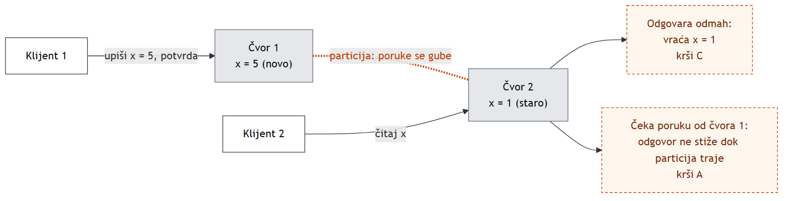
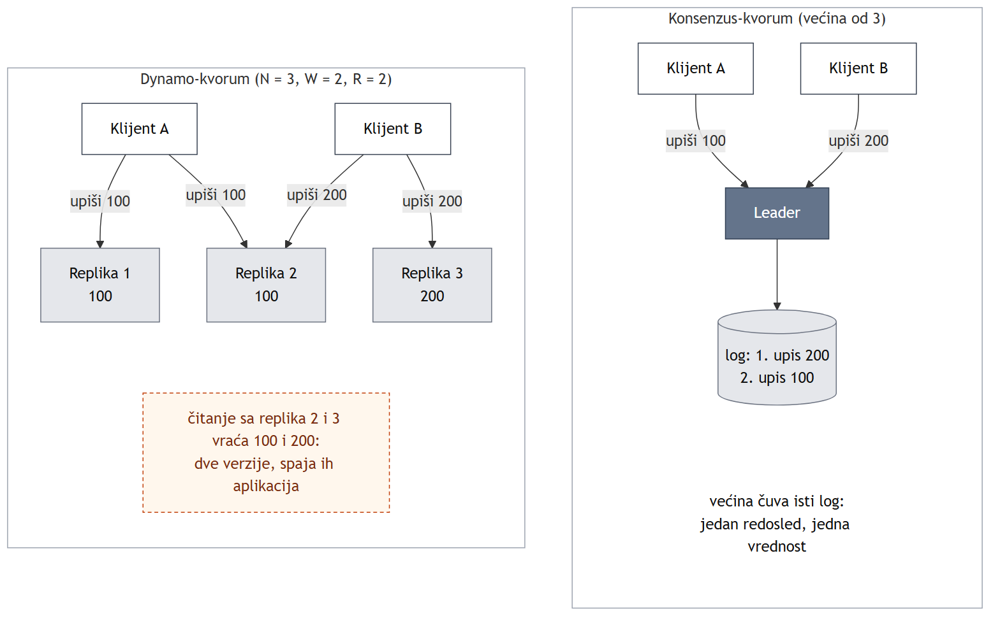
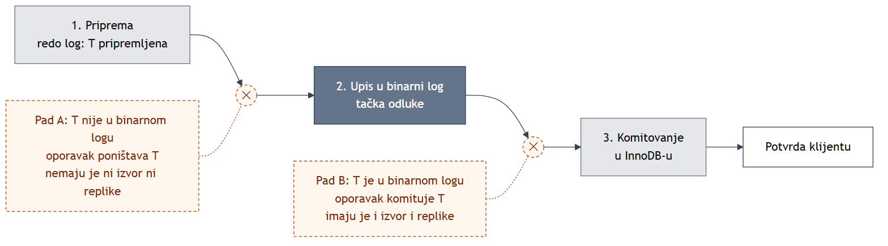

<!--
  The body of the paper. One chapter appended per session, by the academic-research-writer
  skill under the rules in ../WRITING.md. Never hand-written and tidied afterwards.

  Do NOT set `lang: sr` here - it forces the IEEE reference list into Cyrillic.
  The title page is a separate file (naslovna.md) and is prepended by ../tools/make-docx.ps1.
-->

# 1. Uvod

# 2. Teorijski okvir: modeli konzistentnosti, CAP/PACELC i konsenzus

Replikacija podrazumeva da isti podatak postoji na više čvorova. Čvorovi nemaju zajedničku memoriju
ni zajednički sat, pa se svaka informacija između njih prenosi porukom, a prenos poruke traje
[@lamport1978]. U asinhronoj mreži poruka može i da se izgubi, a čvor ne može da razlikuje
izgubljenu poruku od zakasnele, pa ni čvor koji je pao od čvora koji je samo spor ili odsečen
[@gilbert2002]. Upis zato ne stiže na sve kopije istovremeno, pa se postavlja pitanje šta čitanje sa
pojedinačne kopije sme da vrati. Ovo poglavlje uvodi rečnik kojim se na to pitanje odgovara, bez
ijednog MySQL mehanizma; kasnija poglavlja ga koriste bez ponovnog definisanja.

## Modeli konzistentnosti

Model konzistentnosti je ugovor između sistema i klijenta koji određuje koje vrednosti čitanje sme
da vrati dok se upisi šire kroz replike. Najjači takav ugovor je stroga konzistentnost (strong
consistency), formalno linearizabilnost (linearizability): svaka operacija izgleda kao da stupa na
snagu trenutno, u nekoj tački između svog poziva i svog odgovora [@herlihy1990], pa se sistem ponaša
kao da postoji samo jedna kopija podatka. Kada klijent dobije potvrdu upisa, svako kasnije čitanje
bilo kog klijenta mora da vidi tu vrednost ili noviju. Cena je ugrađena u samu definiciju: replika
pre odgovora mora da zna da poseduje sve završene upise, a to znanje može da stigne samo porukom.

Slabiji modeli su međusobno ugnežđeni, tako da jači model ispunjava sva obećanja slabijih. Uzročna
konzistentnost (causal consistency) oslanja se na Lamportovu relaciju „desilo se pre“ (happened
before) [@lamport1978]: ako je jedan upis mogao da utiče na drugi, svi čvorovi vide prvi upis pre
drugog, pa niko ne sme da vidi odgovor na pitanje pre samog pitanja. Na dnu je konačna
konzistentnost (eventual consistency), koja obećava samo to da će, ako novih upisa više nema, sva
čitanja na kraju vraćati poslednju upisanu vrednost [@vogels2008].

Između ovih krajnosti nalaze se sesijske garancije (session guarantees), definisane za pojedinačnu
sesiju klijenta, a ne za ceo sistem [@terry1994]. Read-your-writes (čitanje sopstvenih upisa) zahteva
da čitanja sesije odražavaju njene prethodne upise: korisnik koji promeni lozinku ne sme u sledećem
čitanju, sa replike koja kasni, da vidi staru. Monotona čitanja (monotonic reads) zahtevaju da
uzastopna čitanja odražavaju skup upisa koji se ne smanjuje, pa osvežena stranica ne sme da prikaže
stanje starije od već viđenog [@terry1994]. Anomaliju read-your-writes sedmo poglavlje meri na MySQL
topologiji.

## CAP i PACELC

Brewer je 2000. godine izneo pretpostavku da distribuirani sistem ne može istovremeno da obezbedi
konzistentnost, dostupnost i toleranciju na particiju mreže [@brewer2000], a Gilbert i Lynch su je
dve godine kasnije formalizovali i dokazali [@gilbert2002]. U njihovoj formulaciji C označava strogu
konzistentnost; A dostupnost (availability), odnosno da svaki zahtev koji primi čvor koji nije pao
dobije odgovor; a P particiju mreže (network partition), u kojoj mreža sme da izgubi proizvoljno
mnogo poruka između čvorova [@gilbert2002]. Suštinu dokaza prikazuje slika 2.1. Klijent je upisao
novu vrednost na čvor 1 i dobio potvrdu, a veza ka čvoru 2 je prekinuta. Ako čvor 2 odgovori na
čitanje, vraća staru vrednost posle završenog upisa i krši C; ako čeka poruku od čvora 1, ne
odgovara dok particija traje i krši A.

{width=100%}

Pravilo „izaberi dva od tri“ pogrešno je čitanje teoreme, na šta je upozorio i sam Brewer
[@brewer2012]. Particija nije svojstvo koje projektant bira, već događaj u mreži, pa se izbor svodi
na C ili A, i to samo dok particija traje; dok mreža radi, CAP ne zabranjuje da sistem bude
istovremeno strogo konzistentan i dostupan. C iz CAP-a pritom nije konzistentnost iz svojstava
ACID, koja znači da transakcija čuva pravila baze, poput jedinstvenosti ključeva, već samo
konzistentnost jedinstvene kopije, koju Brewer opisuje kao strogi podskup ACID konzistentnosti
[@brewer2012].

Ni bez particije stroga konzistentnost nije besplatna. Čvor koji pre potvrde hoće da zna da upis
postoji i na drugom čvoru mora da sačeka povratnu poruku, pa se ne gubi dostupnost, već se plaća
latencijom (latency), odnosno vremenom odziva. Abadi ovu razliku dodaje teoremi CAP, a proširenje se
može svesti na dva pitanja. Prvo glasi: kada mreža pukne, da li odsečeni čvor odgovara, rizikujući
zastareo odgovor, ili odbija zahtev, čuvajući konzistentnost? Drugo glasi: kada mreža radi, da li
komitovanje čeka druge čvorove, sporije ali konzistentno, ili ne čeka, brže ali uz rizik zastarelog
čitanja? Drugi kompromis prisutan je u svakom trenutku rada sistema, a CAP samo u, kako Abadi navodi,
verovatno retkom slučaju particije. Skraćenica PACELC beleži oba odgovora: ako postoji particija (P),
bira se između dostupnosti (A) i konzistentnosti (C), inače (E, else) između latencije (L) i
konzistentnosti (C) [@abadi2012]. Za ovaj rad presudno je drugo pitanje: svako podešavanje oblika
„sačekaj X pre potvrde“ u narednim poglavljima predstavlja odgovor upravo na njega.

## Modeli replikacije

Prvo projektantsko pitanje kod replikacije jeste koliko čvorova sme da primi upis. Kleppmann
razlikuje tri odgovora, single-leader, multi-leader i leaderless replikaciju [@kleppmann2017],
prikazana na slici 2.2. Ovo poglavlje za uloge čvorova koristi termine iz literature, *leader* i
*follower*; od trećeg poglavlja, kada predmet postane MySQL, prelazi se na nazive *izvor* i
*replika*. Kod single-leader replikacije upise prima tačno jedan čvor, a followeri primenjuju
njegov log, pa postoji jedan redosled upisa i nema sukoba; otvoreno ostaje šta se dešava kada
leader padne. Kod multi-leader replikacije upise prima više čvorova, pa dva istovremena upisa u
isti podatak čine sukob, koji neko mora da razreši [@kleppmann2017]. Kod leaderless replikacije, čiji
je uzor Amazonov sistem Dynamo, klijent upis smatra uspešnim kada ga potvrdi W od ukupno N replika,
a čitanje pita R replika; nijedan čvor ne određuje redosled upisa [@decandia2007].

{width=100%}

<!--
  Absence claim (../../NOTES.md rule 1), checked 2026-10-07, recorded in
  .scratch/replikacija/measurements/0003-theory-framework.md:
  rung 1, refman 8.4 ch. 19-20: async, semisync, delayed, Group Replication single/multi-primary,
  all leader- or group-ordered; rung 2, MySQL Shell 8.4 (InnoDB Cluster, ReplicaSet, ClusterSet):
  all built on Group Replication or single-source async. NDB Cluster out of scope, not asserted.
  Wording kept narrow on purpose: "dokumentuje", "Community", "u stilu sistema Dynamo".
-->
Nijedan oblik replikacije koji dokumentuje MySQL 8.4 Community nije leaderless u stilu sistema Dynamo:
svaki se oslanja ili na jedan čvor koji prima upise ili na grupu čvorova koja se dogovara o
redosledu upisa [@mysql84refman; @mysqlshell84].

## Konsenzus

Kada leader padne, neki follower mora da preuzme njegovu ulogu. Pošto čvor ne može da razlikuje
leadera koji je pao od leadera koji je samo odsečen, follower koji to samostalno zaključi rizikuje
da istovremeno postoje dva leadera koji primaju upise, odnosno split brain (razdvajanje grupe na
dve nezavisne celine). Čvorovi zato moraju da se slože oko toga ko je leader i šta se nalazi u logu,
i to tako da se dve grupe čvorova ne mogu složiti različito; taj problem naziva se konsenzus.
Klasično rešenje je Lamportov algoritam Paxos [@lamport2001], a algoritam Raft, projektovan da bude
razumljiviji, deli konsenzus na izbor leadera, replikaciju loga i bezbednost [@ongaro2014].

Sva tri dela oslanjaju se na jednu činjenicu: svake dve većine istog skupa od N čvorova imaju bar
jedan zajednički čvor. Svaki čvor u jednom mandatu (term) glasa najviše jednom, pa u istom mandatu
ne mogu postojati dva leadera; ulaz u logu je komitovan kada ga sačuva većina, pa pad manjine ne
zaustavlja sistem; a čvor ne glasa za kandidata čiji je log manje ažuran od njegovog, pa novi leader
neizbežno poseduje sve komitovane ulaze [@ongaro2014]. Protokol nijednom ne proverava da li je stari
leader zaista pao, već se oslanja isključivo na presek većina. Isti princip koristi MySQL Group
Replication: prema priručniku, da bi transakcija bila komitovana, većina grupe mora da se složi o
njenom mestu u globalnom redosledu transakcija, a u osnovi te tehnologije nalazi se implementacija
algoritma Paxos [@mysql84refman]. Tim mehanizmom bavi se peto poglavlje.

## Dva značenja kvoruma

Reč kvorum u literaturi označava dve različite stvari koje se oslanjaju na istu aritmetiku preseka.
Kod Dynamo-kvoruma uslov W + R > N obezbeđuje da se skup replika koje su potvrdile upis i skup
replika koje se čitaju seku, pa čitanje dodiruje bar jednu repliku sa najnovijom verzijom
[@decandia2007]. Presek, međutim, ne određuje redosled, što pokazuje leva strana slike 2.3: dva
istovremena upisa, vrednosti 100 i 200, dobijaju po dve potvrde, a replike završavaju sa
vrednostima 100, 100 i 200. Nijedan čvor nije odlučio koji je upis bio prvi, pa Dynamo čuva obe
verzije i njihovo spajanje prepušta aplikaciji [@decandia2007]. Abadi zato naglašava da ovakvi
sistemi ne dostižu punu konzistentnost u smislu Gilberta i Lynch ni kada je R + W > N [@abadi2012].

{width=85%}

Konsenzus-kvorum, na desnoj strani slike, isti presek koristi da bi se većina dogovorila o mestu
svakog upisa u jedinstvenom logu, pa dva istovremena upisa dobijaju dva različita mesta u
redosledu umesto dve verzije istog podatka [@ongaro2014]. Kada se u ovom radu govori o sistemima
zasnovanim na kvorumu, misli se na konsenzus-kvorum, jer na njemu počiva Group Replication, dok
Dynamo-kvorum služi samo kao kontrast. Time je zaokružen rečnik narednih poglavlja: svaki mehanizam
replikacije u MySQL-u biće smešten u jedan od tri modela, opisan modelom konzistentnosti koji
obezbeđuje i ocenjen prema tome kako odgovara na dva pitanja PACELC-a.

# 3. Binarni log, GTID i asinhrona replikacija

Replikacija u MySQL-u ne prenosi stanje baze, već zapis o promenama. Izvor svaku komitovanu
transakciju upisuje u binarni log (binary log), a replika te zapise preuzima i izvršava nad
sopstvenom kopijom podataka; isti log posle vraćanja rezervne kopije služi i za oporavak baze do
željenog trenutka [@mysql84refman]. Replika ponavljanjem loga stiže u isto stanje kao izvor ako obe
strane polaze od istog stanja i primenjuju iste promene istim redosledom. Redosled obezbeđuje sam
log: transakcija se u njega upisuje pre nego što se oslobode njena zaključavanja, pa log sledi
redosled komitovanja [@mysql84refman]. Poglavlje prati jednu transakciju od izvora do replike kroz
četiri pitanja: šta se upisuje u log, kada je upis postojan, kako replika zna dokle je stigla i kada
klijent dobija potvrdu.

Od ovog poglavlja uloge čvorova nazivaju se onako kako ih naziva MySQL: čvor čiji se binarni log
šalje drugima je izvor (source), a čvor koji taj log primenjuje je replika (replica); to su iste
uloge koje drugo poglavlje naziva *leader* i *follower*. Tim koji razvija MySQL naziv izvor
obrazlaže time da je replikacija tok promena, pa naziv ne određuje ulogu servera u celoj
arhitekturi, što je važno kod lančane ili dvosmerne replikacije [@gryp2020].[^uloge] Merenja u ovom
i narednim poglavljima izvedena su na tri instance servera MySQL 8.4.11 na jednom računaru, na
portovima 3307, 3308 i 3309, koje se u nastavku nazivaju node1, node2 i node3. Izvor je node1, a
node2 i node3 su njegove replike, sa uključenim GTID-ovima i formatom zapisa `ROW`. Kao primer služi
baza poliklinika, sa tabelama pacijenata, pregleda i računa, uz pomoćnu tabelu `heartbeat` za
merenje kašnjenja.

[^uloge]: Starija dokumentacija i veći deo literature ove uloge nazivaju master i slave. MySQL je
zamenu tih termina započeo 2020. godine [@gryp2020], a u verziji 8.4.0 uklonjene su i naredbe koje
su ih koristile, pa je, na primer, naredba `SHOW MASTER STATUS` zamenjena naredbom
`SHOW BINARY LOG STATUS` [@mysql84relnotes]. U ovom radu stari termini se dalje ne koriste.

## Binarni log i formati zapisa

Binarni log se vodi u tri formata, koji se razlikuju po tome da li beleže uzrok promene ili njenu
posledicu. Format `STATEMENT` upisuje sam SQL iskaz, koji replika ponovo izvršava (upisivanje
iskaza, statement-based logging). Format `ROW`, koji je podrazumevani, upisuje kako su se promenili
pojedinačni redovi tabele, a replika te promene kopira (upisivanje redova, row-based logging).
Format `MIXED` upisuje iskaze, a u određenim slučajevima automatski prelazi na upisivanje redova
[@mysql84refman]. Upisivanje iskaza je kompaktnije, jer iskaz koji menja hiljadu redova u logu
ostaje jedan iskaz, ali je pravac razvoja jasan: menjanje formata zastarelo je još u verziji 8.0, a
priručnik najavljuje da će upisivanje redova postati jedini format [@mysql84refman].

## Nesigurni iskazi

Upisivanje iskaza pretpostavlja da isti iskaz nad istim podacima daje isti rezultat. Iskaz za koji
to ne važi naziva se nesiguran iskaz (unsafe statement), jer replika koja ga ponovi može da stigne
u drugačije stanje od izvora. Priručnik kao primer navodi iskaze `UPDATE` i `DELETE` sa klauzulom
`LIMIT` bez `ORDER BY`, jer redosled redova na koje deluju nije definisan, kao i funkciju
`SYSDATE()`. Za takav iskaz server u formatu `STATEMENT` izdaje upozorenje, a u formatu `MIXED` ga
automatski upisuje kao redove [@mysql84refman].

Slika 3.1 prikazuje razliku na bazi poliklinika. Iskaz označava kao plaćena dva neplaćena računa za
koje je `tenant_id = 1`, uz `LIMIT 2` bez `ORDER BY`, pa ne određuje koja dva. U formatu `STATEMENT`
server izdaje upozorenje 1592, a u formatu `ROW` od klauzule `LIMIT` u logu ne ostaje trag, već samo
dva izmenjena reda, računi 11 i 18, sa slikom pre i posle izmene. Upisivanje redova nedeterminizam
ne uklanja, već izbor ostavlja izvoru, a replici šalje samo njegov ishod.

{width=90%}

## Postojanost: dva loga i dvofazno komitovanje

Potvrda komitovanja ima smisla samo ako transakcija preživi pad, a to zavisi od toga kada log
zaista stigne na disk. Upis u datoteku najpre dospeva u keš operativnog sistema, a na stabilnu
memoriju stiže kada ga sistem sam prenese ili kada proces to izričito zatraži pozivom `fsync()`, čiji
je ekvivalent na Windowsu `FlushFileBuffers` [@mysql84refman]. Zato pad procesa `mysqld` ne gubi ono
što je već predato operativnom sistemu, dok pad operativnog sistema ili nestanak napajanja gubi i
sadržaj keša. InnoDB postojanost obezbeđuje tehnikom write-ahead logging (WAL): opis izmene se pre
izmene stranica sa podacima upisuje u redo log, koji se koristi pri oporavku posle pada
[@mysql84refman].

MySQL, međutim, istu transakciju beleži u dva loga. Redo log pripada mehanizmu skladištenja
(storage engine) InnoDB, a binarni log vodi serverski sloj iznad njega, nezavisno od motora
[@mysql84refman]. Ako posle pada transakcija ostane samo u jednom od njih, izvor i replike se trajno
razilaze, a nijedan čvor ne prijavljuje grešku. Tu opasnost otklanja interno dvofazno komitovanje
(two-phase commit), u verziji 8.4 uvek uključeno i prikazano na slici 3.2. InnoDB transakciju
najpre upisuje u redo log kao pripremljenu (prepare), zatim se ona upisuje u binarni log i on se
sinhronizuje na disk, a tek tada je InnoDB komituje. Odluku o ishodu time donosi binarni log: posle
pada server dovršava pripremljene transakcije koje su upisane u binarni log, pa log tačno odražava
sadržaj tabela, a replika ne dobija transakciju koja je na izvoru poništena [@mysql84refman].

{width=100%}

Koliko je ova zaštita stvarno jaka, zavisi od toga da li se svaki log pri komitovanju sinhronizuje
na disk. Za binarni log o tome odlučuje `sync_binlog`: vrednost 1 sinhronizuje ga pre komitovanja, a
vrednost 0 sinhronizaciju prepušta operativnom sistemu. Za redo log odlučuje
`innodb_flush_log_at_trx_commit`: vrednost 1, neophodna za punu usklađenost sa svojstvima ACID,
sinhronizuje ga pri svakom komitovanju, a vrednost 2 ga pri komitovanju samo upisuje, dok ga
sinhronizuje jednom u sekundi [@mysql84refman]. Tabela 3.1 navodi šta od svake kombinacije ostaje
posle pada operativnog sistema. Ishode prvog i trećeg reda navodi priručnik, a ostali su izvedeni iz
razlike između upisa i sinhronizacije. Najopasniji je drugi red: binarni log sadrži transakciju čija
je priprema izgubljena iz redo loga, pa je replike imaju, a izvor ne, što je upravo razilaženje koje
je dvofazno komitovanje trebalo da spreči. Priručnik zato preporučuje vrednosti 1 i 1, uz upozorenje
da ni one nisu garancija na diskovima koji na zahtev za sinhronizaciju odgovaraju da je obavljena,
iako nije [@mysql84refman]. Koliko ta sigurnost košta u vremenu odziva, meri se u četvrtom
poglavlju.

| Binarni log | Redo log | Posle pada operativnog sistema ili nestanka napajanja |
|:------------:|:------------:|:------------------------------------------------------------|
| 1 | 1 | najveća postojanost i konzistentnost (preporuka priručnika) |
| 1 | 2 | binarni log ima transakciju, a redo log nema njenu pripremu: replike je imaju, izvor ne |
| 0 | 1 | izvor može imati komitovane transakcije kojih nema u binarnom logu: izvor ih ima, replike ne |
| 0 | 2 | gube se transakcije iz poslednje sekunde, a dva loga mogu da se raziđu |

Table: Tabela 3.1: Šta se gubi pri padu operativnog sistema, za svaku kombinaciju vrednosti `sync_binlog` (binarni log) i `innodb_flush_log_at_trx_commit` (redo log). Pad samog procesa mysqld ni u jednoj kombinaciji ne gubi komitovane transakcije.

## GTID i automatsko pozicioniranje

Replika mora da zna dokle je u logu izvora stigla, da bi posle prekida veze nastavila od prave
transakcije. Tradicionalni način je par koji čine ime datoteke binarnog loga i pozicija u njoj, ali
taj par je adresa u logu jednog servera, a ne ime transakcije: ista transakcija na izvoru i na
replici leži u različitim datotekama, na različitim pozicijama. Globalni identifikator transakcije
(GTID) transakciji daje ime koje putuje sa njom. Dodeljuje se pri komitovanju na izvoru, jedinstven
je u celoj topologiji i ima oblik `source_id:transaction_id`, gde je prvi deo obično `server_uuid`
izvora, a drugi redni broj transakcije na njemu. Server preskače svaku transakciju čiji je GTID već
izvršio, pa se transakcija na jednom serveru primenjuje najviše jednom [@mysql84refman].

<!--
  Absence-claim check (../../NOTES.md rule 1), 2026-10-09. The failover sentences below are worded
  as the manual's positive procedure, not as "MySQL cannot fail over asynchronously":
  rung 1, refman 8.4 sec. 19.4.8 "Switching Sources During Failover": "you can pick one of the
  replicas to become the new source", then CHANGE REPLICATION SOURCE TO.
  rung 1, refman 8.4 "Asynchronous Connection Failover for Sources" EXISTS: with GTIDs and
  SOURCE_AUTO_POSITION a replica re-points automatically to another source from a stored list.
  It re-points a connection; it is not documented as promoting a replica. So no sentence here may
  say asynchronous replication has no automatic failover of any kind. Ch. 5/6 own the automation.
-->
Uz opciju `SOURCE_AUTO_POSITION = 1` naredbe `CHANGE REPLICATION SOURCE TO` replika pri povezivanju
ne navodi ni datoteku ni poziciju, već šalje skup GTID-ova koje već ima, a izvor joj šalje sve
transakcije iz svog binarnog loga čiji GTID nije u tom skupu [@mysql84refman]. Automatsko
pozicioniranje je, dakle, razlika dva skupa, a ne traženje adrese; obe replike u topologiji ovog
rada pokrenute su upravo tako, od praznog skupa. GTID-ovi pojednostavljuju i failover (preuzimanje
uloge izvora nakon otkaza), ali samo pozicioniranje, ne i odluku: prema priručniku, kada izvor
otkaže, operater bira repliku koja postaje novi izvor i na nju preusmerava ostale replike
[@mysql84refman]. Mehanizmi koji tu odluku donose automatski predmet su petog i šestog poglavlja.

## Niti replikacije i mesto kašnjenja

Put transakcije od izvora do podataka replike prikazan je na slici 3.3. Na izvoru, za svaku
povezanu repliku, po jedna nit koja šalje log (binlog dump thread) čita binarni log i šalje njegov
sadržaj replici. Na replici nit prijema (receiver thread) kopira primljene događaje u relay log, a
koordinator primene ih raspoređuje nitima primene (applier threads), kojih u verziji 8.4 podrazumevano
ima četiri. Uz podrazumevanu vrednost `replica_preserve_commit_order = ON` niti primene komituju
transakcije redosledom iz relay loga, pa replika, uz ograničenja koja priručnik navodi, zadržava
istu istoriju transakcija kao izvor [@mysql84refman].

{width=90%}

Ova podela objašnjava gde nastaje kašnjenje replikacije (replication lag). Nit prijema samo kopira
bajtove, dok niti primene moraju da izvrše transakcije koje je na izvoru istovremeno izvršavalo
mnogo sesija, pa je primena po pravilu sporija od prijema. To potvrđuje i merenje na topologiji
ovog rada: kada je izvor u naletu upisao četiri hiljade jednorednih transakcija, a replika node2
imala samo jednu nit primene, relay log je prestao da raste posle približno tri sekunde, dok je
kašnjenje primene raslo i posle deset sekundi. Kašnjenje se, dakle, gomila iza relay loga, a ne u
mreži, i to je polazište sedmog poglavlja.

## Asinhrona potvrda

Replikacija u MySQL-u je podrazumevano asinhrona [@mysql84refman]: izvor transakciju komituje i
klijentu vraća potvrdu, a da nijedna replika ne mora da je primi. Zato na slici 3.3 postoji prozor
u kome potvrđena transakcija postoji samo na izvoru. Ako izvor u tom prozoru trajno otkaže, na
primer zbog kvara diska, replike transakciju nikada neće dobiti, jer događaje dobijaju isključivo od
niti koja ih na izvoru šalje, a postojanost iz prethodnih odeljaka štiti transakciju samo na disku
izvora. Kada se zatim jedna od replika unapredi u izvor, sistem se vraća u stanje starije od
potvrđenog upisa, što stroga konzistentnost iz drugog poglavlja zabranjuje.

U terminima PACELC-a asinhrona replikacija na drugo pitanje odgovara bez zadrške: komitovanje ne
čeka druge čvorove, pa se bira latencija, a cenu plaćaju klijenti koji čitaju sa replika i, pri
otkazu izvora, sami potvrđeni upisi. Format zapisa i promenljive `sync_binlog` i
`innodb_flush_log_at_trx_commit` određuju samo šta je u logu i koliko je on postojan na izvoru. Ono
što se menja nije log, već trenutak u kome pisac dobija potvrdu, a asinhrona replikacija taj
trenutak postavlja najranije što je moguće. Četvrto poglavlje ga pomera, uvodeći semisinhronu
replikaciju, u kojoj izvor pre potvrde čeka da bar jedna replika primi transakciju.
