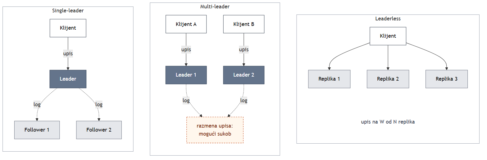
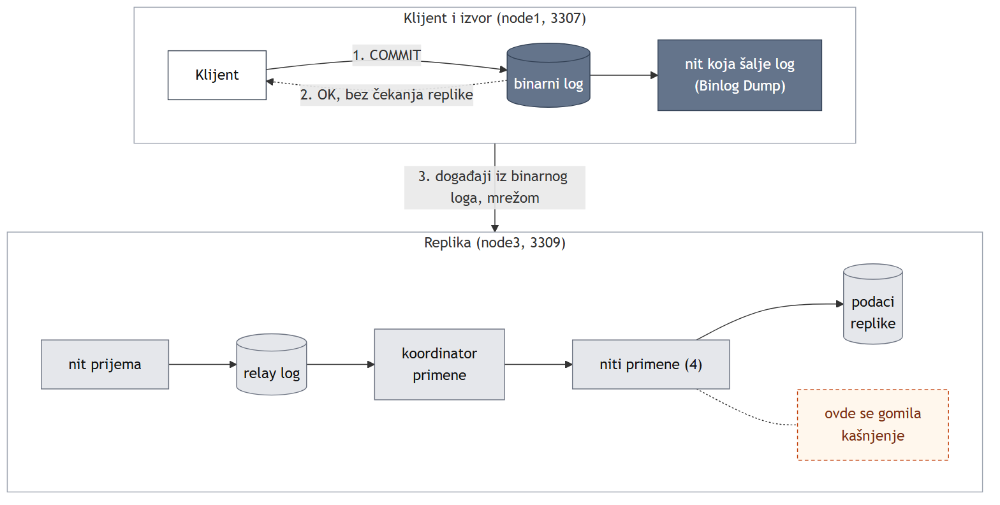

<!--
  The body of the paper. One chapter appended per session, by the academic-research-writer
  skill under the rules in ../WRITING.md. Never hand-written and tidied afterwards.

  Do NOT set `lang: sr` here - it forces the IEEE reference list into Cyrillic.
  The title page is a separate file (naslovna.md) and is prepended by ../tools/make-docx.ps1.
-->

# 1. Uvod

# 2. Teorijski okvir: modeli konzistentnosti, CAP/PACELC i konsenzus

Replikacija podrazumeva da isti podatak postoji na više čvorova, pri čemu klijent čita sa jednog od
njih. Svi pojmovi ovog poglavlja izvode se iz dve osobine okruženja u kome se ti čvorovi nalaze.
Prvo, čvorovi nemaju zajedničku memoriju ni zajednički sat, pa se svaka informacija između njih
prenosi isključivo porukom, a prenos poruke traje vreme koje nije zanemarljivo [@lamport1978].
Drugo, u asinhronoj mreži poruka može i da se izgubi, a čvor koji odluke donosi samo na osnovu
primljenih poruka ne može da razlikuje poruku koja je izgubljena od poruke koja samo kasni, pa ni
čvor koji je pao od čvora koji je spor ili odsečen [@gilbert2002]. Iz ovih osobina neposredno sledi
da upis ne stiže na sve kopije istovremeno, pa se postavlja pitanje šta čitanje sa pojedinačne kopije
sme da vrati. Ovo poglavlje uvodi rečnik kojim se na to pitanje odgovara: modele konzistentnosti,
teoreme CAP i PACELC, modele replikacije i konsenzus. Nijedan MySQL mehanizam se ovde ne objašnjava;
kasnija poglavlja ovaj rečnik koriste bez ponovnog definisanja.

## Modeli konzistentnosti

Model konzistentnosti je ugovor između sistema i klijenta koji određuje koje vrednosti čitanje sme
da vrati dok se upisi šire kroz replike. Najjači takav ugovor je stroga konzistentnost (strong
consistency), formalno definisana kao linearizabilnost (linearizability). Herlihy i Wing je opisuju
kao privid da svaka operacija stupa na snagu trenutno, u nekoj tački između svog poziva i svog
odgovora [@herlihy1990], tako da se sistem ponaša kao da postoji samo jedna kopija podatka. Praktična
posledica je da, kada se upis završi i klijent dobije potvrdu, svako kasnije čitanje bilo kog
klijenta mora da vidi tu vrednost ili noviju. Stroga konzistentnost pritom ne zamrzava vrednost, već
zabranjuje samo povratak na stanje starije od već završenog upisa. Cena je ugrađena u samu
definiciju: replika koja odgovara na čitanje mora pre odgovora da zna da poseduje sve završene
upise, a to znanje može da stigne samo porukom.

Zbog te cene definisani su slabiji modeli, koji su međusobno ugnežđeni: jači model automatski
ispunjava sva obećanja slabijih, pa se pri analizi konkretne anomalije traži najslabiji model koji
je zabranjuje. Uzročna konzistentnost (causal consistency) oslanja se na Lamportovu relaciju
„desilo se pre“ (happened before) [@lamport1978] i zahteva da, ako je jedan upis mogao da utiče na
drugi, svi čvorovi vide prvi upis pre drugog, dok upisi koji nisu uzročno povezani smeju na
različitim čvorovima da se vide različitim redosledom. Ako jedan korisnik objavi pitanje, a drugi ga
pročita i na njega odgovori, uzročna konzistentnost zabranjuje da treći korisnik vidi odgovor bez
pitanja. Na dnu ove lestvice nalazi se konačna konzistentnost (eventual consistency), koja obećava
samo to da će, ako novih upisa više nema, sva čitanja na kraju vraćati poslednju upisanu vrednost
[@vogels2008]. Dok upisi traju, konačna konzistentnost ne ograničava šta čitanje vraća.

Između ovih krajnosti nalaze se sesijske garancije (session guarantees), koje Terry i saradnici
definišu za pojedinačnu sesiju klijenta, a ne za ceo sistem [@terry1994]. Read-your-writes (čitanje
sopstvenih upisa) zahteva da čitanja jedne sesije odražavaju njene prethodne upise, a monotona
čitanja (monotonic reads) da uzastopna čitanja odražavaju skup upisa koji se ne smanjuje
[@terry1994]. Dve garancije razlikuje ono što ih pokreće. Read-your-writes pokreće sopstveni upis
sesije: korisnik koji promeni lozinku, a zatim u sledećem čitanju, sa replike koja kasni, vidi staru
lozinku, doživljava upravo kršenje ove garancije. Monotona čitanja pokreće prethodno čitanje:
korisnik koji ništa ne menja, a posle osvežavanja stranice vidi stanje starije od onog koje je već
video, doživljava kršenje monotonih čitanja, iako je konačna konzistentnost i dalje ispunjena.
Anomaliju read-your-writes sedmo poglavlje meri na MySQL topologiji.

## CAP i PACELC

Brewer je 2000. godine izneo pretpostavku da distribuirani sistem ne može istovremeno da obezbedi
konzistentnost, dostupnost i toleranciju na particiju mreže [@brewer2000], a Gilbert i Lynch su je
dve godine kasnije formalizovali i dokazali [@gilbert2002]. U njihovoj formulaciji C označava upravo
strogu konzistentnost: mora postojati potpun redosled svih operacija u kome svaka operacija izgleda
kao da je izvršena u jednom trenutku. A označava dostupnost (availability): svaki zahtev koji primi
čvor koji nije pao mora da dobije odgovor, pri čemu se brzina odgovora ne meri. P, particija mreže
(network partition), opisuje mrežu kojoj je dozvoljeno da izgubi proizvoljno mnogo poruka između
čvorova [@gilbert2002]. Suština dokaza staje u jedan misaoni eksperiment. Veza između dva čvora je
prekinuta, a oba rade; klijent upiše novu vrednost na prvi čvor i dobije potvrdu, a drugi klijent
zatim traži istu vrednost od drugog čvora. Drugi čvor ima tačno dve mogućnosti. Ako odgovori, vraća
staru vrednost posle završenog upisa i time krši C. Ako čeka poruku od prvog čvora, a particija
potraje, živ čvor ne odgovara i time krši A. Teorema koju su dokazali Gilbert i Lynch upravo tvrdi da
u asinhronoj mreži nije moguće implementirati objekat za čitanje i upis koji garantuje i dostupnost i
atomičnu konzistentnost u svim izvršavanjima, uključujući i ona u kojima se poruke gube
[@gilbert2002].

Teorema se često prepričava kao pravilo „izaberi dva od tri“, a na to pogrešno čitanje upozorio je
i sam Brewer: formulacija „dva od tri“ bila je, po njegovim rečima, oduvek pogrešna jer pojednostavljuje
napetosti između svojstava [@brewer2012]. Particija nije svojstvo koje sistem bira ili odbacuje, već
događaj u mreži koji se dešava nezavisno od volje projektanta, pa se izbor svodi na C ili A, i to
samo dok particija traje. Dok mreža radi, CAP ne zabranjuje da sistem bude istovremeno strogo
konzistentan i dostupan. Iz istog razloga konačna konzistentnost ne krši teoremu: sistem koji se
odrekne stroge konzistentnosti time je tokom particije izabrao dostupnost. Najzad, sistem koji bira C
ne gubi dostupnost stalno, već samo tokom particije, i to samo na strani koja ne može da utvrdi da je
ažurna. Posebno treba razlikovati C iz CAP-a od konzistentnosti iz svojstava ACID. Konzistentnost
transakcije znači da ona čuva pravila baze, poput jedinstvenosti ključeva, dok C iz CAP-a označava
samo konzistentnost jedinstvene kopije, koju Brewer opisuje kao strogi podskup ACID konzistentnosti
[@brewer2012].

Ako CAP bez particije ništa ne zabranjuje, to ne znači da je stroga konzistentnost tada besplatna.
Čvor koji pre potvrde klijentu hoće da zna da upis postoji i na drugom čvoru mora da sačeka povratnu
poruku. Dok mreža radi, ta poruka sigurno stiže, samo kasnije, pa se ne gubi dostupnost, već se plaća
latencijom (latency), odnosno vremenom odziva. Abadi je ovu razliku formulisao kao proširenje teoreme
CAP, koje se može svesti na dva pitanja postavljena svakom sistemu. Prvo pitanje glasi: kada mreža
pukne, da li odsečeni čvor odgovara, rizikujući zastareo odgovor, ili odbija zahtev, čuvajući
konzistentnost? To pitanje je CAP. Drugo pitanje glasi: kada mreža radi, da li komitovanje čeka
druge čvorove, sporije ali konzistentno, ili ne čeka, brže ali uz rizik zastarelog čitanja? Abadi
naglašava da je ovaj drugi kompromis prisutan u svakom trenutku rada sistema, dok je CAP relevantan
samo u, kako navodi, verovatno retkom slučaju particije mreže [@abadi2012]. Skraćenica PACELC samo
beleži oba odgovora: ako postoji particija (P), bira se između dostupnosti (A) i konzistentnosti (C),
inače (E, else) između latencije (L) i konzistentnosti (C) [@abadi2012]. Po ovoj podeli Abadi
sisteme Dynamo, Cassandra i Riak u podrazumevanoj konfiguraciji svrstava u PA/EL, a sisteme
VoltDB/H-Store i Megastore u PC/EC [@abadi2012]. Za ovaj rad je presudno drugo pitanje: svako
podešavanje oblika „sačekaj X pre potvrde“ koje se razmatra u narednim poglavljima predstavlja
odgovor upravo na njega.

## Modeli replikacije

Prvo projektantsko pitanje kod replikacije jeste koliko čvorova sme da primi upis. Kleppmann
razlikuje tri odgovora, koja zajedno pokrivaju gotovo sve distribuirane baze podataka:
single-leader, multi-leader i leaderless replikaciju [@kleppmann2017]. Ovo poglavlje za uloge
čvorova koristi termine iz literature, *leader* i *follower*; od trećeg poglavlja, kada predmet
postane MySQL, prelazi se na nazive *izvor* i *replika*. Slika 2.1 prikazuje sva tri modela istim
vizuelnim jezikom. Kod single-leader replikacije upise prima tačno jedan čvor, a followeri primenjuju
njegov log, pa postoji jedan redosled upisa i nema sukoba; otvoreno ostaje pitanje šta se dešava
kada leader padne. Kod multi-leader replikacije upise nezavisno prima više čvorova, pa dva
istovremena upisa u isti podatak čine sukob, koji neko mora da razreši [@kleppmann2017]. Kod
leaderless replikacije, čiji je uzor Amazonov sistem Dynamo, klijent šalje upis direktno na više
replika i smatra ga uspešnim kada potvrdu pošalje njih W od ukupno N, dok čitanje pita R replika;
nijedan čvor ne određuje redosled upisa [@decandia2007].

{width=100%}

<!--
  Absence claim (../../NOTES.md rule 1), checked 2026-10-07, recorded in
  .scratch/replikacija/measurements/0003-theory-framework.md:
  rung 1, refman 8.4 ch. 19-20: async, semisync, delayed, Group Replication single/multi-primary,
  all leader- or group-ordered; rung 2, MySQL Shell 8.4 (InnoDB Cluster, ReplicaSet, ClusterSet):
  all built on Group Replication or single-source async. NDB Cluster out of scope, not asserted.
  Wording kept narrow on purpose: "dokumentuje", "Community", "u stilu sistema Dynamo".
-->
Nijedan oblik replikacije koji dokumentuje MySQL 8.4 Community nije leaderless u stilu sistema Dynamo:
svaki se oslanja ili na jedan čvor koji prima upise ili na grupu čvorova koja se dogovara o
redosledu upisa [@mysql84refman; @mysqlshell84].

## Konsenzus

Single-leader replikacija mora da reši problem pada leadera, jer neki follower tada mora da preuzme
njegovu ulogu. Pošto čvor ne može da razlikuje leadera koji je pao od leadera koji je samo odsečen,
follower koji samostalno zaključi da je postao leader rizikuje da u sistemu istovremeno postoje dva
leadera koji primaju upise, odnosno split brain (razdvajanje grupe na dve nezavisne celine). Čvorovi
zato moraju da se slože oko toga ko je leader i šta se nalazi u logu, i to tako da se dve nezavisne
grupe čvorova ne mogu složiti različito; taj problem naziva se konsenzus. Klasično rešenje je
Lamportov algoritam Paxos [@lamport2001], a algoritam Raft, projektovan sa ciljem da bude
razumljiviji, deli konsenzus na tri potproblema: izbor leadera kada postojeći padne, replikaciju
loga sa leadera na ostale čvorove i bezbednost, odnosno garanciju da nijedan čvor ne primeni za isti
indeks loga drugu komandu od one koju je neki čvor već primenio [@ongaro2014].

Sva tri dela oslanjaju se na jednu činjenicu: svake dve većine istog skupa od N čvorova imaju bar
jedan zajednički čvor, jer zbir veličina dva skupa veća od N/2 premašuje N. Pri izboru leadera svaki
čvor u jednom mandatu (term) daje najviše jedan glas, a pobeđuje kandidat koji dobije većinu; dve
većine dele bar jednog glasača, pa u istom mandatu ne mogu postojati dva leadera [@ongaro2014]. Ulaz u
logu smatra se komitovanim kada ga sačuva većina čvorova, pa pad manjine ne zaustavlja sistem
[@ongaro2014]. Bezbednost obezbeđuje ograničenje pri izboru: čvor ne glasa za kandidata čiji je log
manje ažuran od njegovog, a pošto se većina glasača seče sa većinom koja čuva svaki komitovani ulaz,
novi leader neizbežno poseduje sve komitovane ulaze [@ongaro2014]. Protokol pritom nijednom ne
proverava da li je stari leader zaista pao, jer je to, kao što je pokazano, nemoguće znati, već se
oslanja isključivo na presek većina. Isti princip koristi MySQL Group Replication: prema priručniku,
da bi transakcija bila komitovana, većina grupe mora da se složi o njenom mestu u globalnom
redosledu transakcija, a u osnovi te tehnologije nalazi se implementacija algoritma Paxos
[@mysql84refman]. Tim mehanizmom bavi se peto poglavlje.

## Dva značenja kvoruma

Reč kvorum u literaturi označava dve različite stvari, a razliku je lako prevideti jer se obe
oslanjaju na istu aritmetiku preseka. Kod Dynamo-kvoruma uslov W + R > N obezbeđuje da se skup
replika koje su potvrdile upis i skup replika koje se čitaju seku, pa čitanje dodiruje bar jednu
repliku sa najnovijom verzijom [@decandia2007]. Presek, međutim, ne određuje redosled. Neka je
N = 3, W = 2 i R = 2, i neka dva klijenta istovremeno upišu različite vrednosti istog podatka: prvi
vrednost 100 na replike 1 i 2, a drugi vrednost 200 na replike 2 i 3, pri čemu na repliku 2 drugi
upis stigne pre prvog. Oba upisa dobijaju po dve potvrde, pa oba klijenta dobijaju potvrdu uspeha, a
replike završavaju sa vrednostima 100, 100 i 200. Čitanje sa replika 2 i 3 vraća obe vrednosti:
presek je ispunio svoje obećanje, ali nijedan čvor nikada nije odlučio koji je upis bio prvi, pa
Dynamo čuva obe verzije i njihovo spajanje prepušta aplikaciji [@decandia2007]. Abadi zato naglašava
da sistemi ovog tipa povećanjem R + W dobijaju više konzistentnosti po cenu latencije, ali ne mogu da
dostignu punu konzistentnost u smislu Gilberta i Lynch ni kada je R + W > N [@abadi2012]. Dynamo uz to
koristi i takozvani sloppy quorum, koji pri nedostupnosti replika upis smešta na prvih N ispravnih
čvorova, pa ni sam presek više nije zagarantovan [@decandia2007].

Konsenzus-kvorum koristi isti presek u drugu svrhu: većina koja je komitovala ulaz seče se sa svakom
sledećom većinom, pa se sistem većinom dogovara o mestu svakog upisa u jedinstvenom redosledu, a dva
istovremena upisa dobijaju dva različita mesta u logu umesto dve verzije istog podatka
[@ongaro2014]. Razlika se može sažeti u jednu rečenicu: oba sistema se oslanjaju na presek skupova
čvorova, ali se konsenzus većinom dogovara o redosledu transakcija, dok Dynamo-kvorum samo
obezbeđuje da čitanje dodirne svežu repliku. Kada se u ovom radu govori o sistemima zasnovanim na
kvorumu, misli se na konsenzus-kvorum, jer na njemu počiva Group Replication, dok Dynamo-kvorum služi
samo kao kontrast. Ovim je zaokružen rečnik kojim se u narednim poglavljima opisuje MySQL: svaki
njegov mehanizam replikacije biće smešten u jedan od tri modela, opisan modelom konzistentnosti koji
obezbeđuje i ocenjen prema tome kako odgovara na dva pitanja PACELC-a.

# 3. Binarni log, GTID i asinhrona replikacija

Replikacija u MySQL-u ne prenosi stanje baze, već zapis o promenama. Izvor svaku komitovanu
transakciju upisuje u binarni log (binary log), a replika te zapise preuzima i izvršava nad
sopstvenom kopijom podataka. Priručnik binarnom logu pripisuje dve namene: na izvoru on je zapis
promena koje se šalju replikama, koje te transakcije reprodukuju i time prave iste izmene podataka
kao izvor, a posle vraćanja rezervne kopije služi za oporavak baze do željenog trenutka
[@mysql84refman]. Da bi replika ponavljanjem loga stigla u isto stanje kao izvor, moraju da važe tri
uslova: obe strane polaze od istog početnog stanja, primenjuju iste promene i primenjuju ih istim
redosledom. Redosled obezbeđuje sam log, jer se transakcija upisuje u binarni log pre nego što se
oslobode njena zaključavanja, pa log, prema priručniku, sledi redosled komitovanja [@mysql84refman].
Ovo poglavlje prati jednu transakciju od komitovanja na izvoru do primene na replici i redom
odgovara na četiri pitanja: šta se tačno upisuje u log, kada je upis postojan, kako replika zna
dokle je stigla i kada klijent dobija potvrdu.

Od ovog poglavlja uloge čvorova nazivaju se onako kako ih naziva sam MySQL: čvor čiji se binarni log
šalje drugima je izvor (source), a čvor koji taj log primenjuje je replika (replica). Termini
*leader* i *follower* iz drugog poglavlja opisuju iste uloge, ali ih dokumentacija koja se u
nastavku citira ne koristi. Tim koji razvija MySQL naziv izvor obrazlaže time da je asinhrona
replikacija tok promena: svaka konfiguracija replikacije ima svoj izvor, ali taj naziv ne određuje
kakvu ulogu server ima u celoj arhitekturi, što je važno kod lančane ili dvosmerne replikacije
[@gryp2020].[^uloge] Sva merenja u ovom i narednim poglavljima izvedena su na tri instance servera
MySQL 8.4.11 pokrenute na jednom računaru, na portovima 3307, 3308 i 3309, koje se u nastavku
nazivaju node1, node2 i node3. Izvor je node1, a node2 i node3 su njegove replike; na sve tri
instance uključeni su GTID-ovi i podrazumevani format zapisa `ROW`. Kao primer služi baza
poliklinika, sa tabelama pacijenata, pregleda i računa, kojoj je dodata pomoćna tabela `heartbeat`
za merenje kašnjenja.

[^uloge]: Starija dokumentacija i veći deo literature ove uloge nazivaju master i slave. MySQL je
zamenu tih termina započeo 2020. godine [@gryp2020], a u verziji 8.4.0 uklonjene su i naredbe koje
su ih koristile, pa je, na primer, naredba `SHOW MASTER STATUS` zamenjena naredbom
`SHOW BINARY LOG STATUS` [@mysql84relnotes]. U ovom radu stari termini se dalje ne koriste.

## Binarni log i formati zapisa

Binarni log se može voditi u tri formata, a razlika među njima je u tome da li se upisuje uzrok
promene ili njena posledica. U formatu `STATEMENT` izvor upisuje sam SQL iskaz, a replika ga ponovo
izvršava; to je upisivanje iskaza (statement-based logging). U formatu `ROW` izvor upisuje događaje
koji opisuju kako su se promenili pojedinačni redovi tabele, a replika te promene kopira; to je
upisivanje redova (row-based logging), koje je podrazumevani način rada. Format `MIXED` podrazumevano
upisuje iskaze, a u određenim slučajevima automatski prelazi na upisivanje redova [@mysql84refman].
Upisivanje iskaza je kompaktnije, jer iskaz koji menja hiljadu redova u logu ostaje jedan iskaz, dok
upisivanje redova beleži svaki izmenjeni red i zato može da proizvede znatno više podataka
[@mysql84refman]. Pravac razvoja je ipak jasan: menjanje formata zastarelo je još u verziji 8.0, a
priručnik najavljuje da će promenljiva `binlog_format` biti uklonjena i da će upisivanje redova
postati jedini format [@mysql84refman].

## Nesigurni iskazi

Upisivanje iskaza oslanja se na pretpostavku da isti iskaz nad istim podacima daje isti rezultat,
odnosno da je promena deterministička. Iskaz za koji to ne važi naziva se nesiguran iskaz (unsafe
statement): njegov rezultat ne zavisi samo od podataka, pa replika koja ga ponovi može da stigne u
drugačije stanje od izvora. Priručnik kao primer navodi iskaze `UPDATE` i `DELETE` sa klauzulom
`LIMIT` bez `ORDER BY`, jer redosled redova na koje iskaz deluje nije definisan [@mysql84refman].
Sličan je slučaj funkcije `SYSDATE()`, dok je funkcija `NOW()` bezbedna: binarni log uz iskaz čuva i
vremensku oznaku, pa replika dobija vrednost koju je funkcija vratila na izvoru, a `SYSDATE()` tu
oznaku zanemaruje [@mysql84refman]. Kada naiđe na nesiguran iskaz, server u formatu `STATEMENT`
izdaje upozorenje, a u formatu `MIXED` takav iskaz automatski upisuje kao redove [@mysql84refman].

Slika 3.2 prikazuje ovu razliku na bazi poliklinika. Iskaz koji dva neplaćena računa za koje je
`tenant_id = 1` označava kao plaćena sadrži `LIMIT 2` bez `ORDER BY`, pa ne određuje koja dva računa
menja. U formatu `STATEMENT` server pri izvršavanju izdaje upozorenje 1592 i navodi da skup
obuhvaćenih redova nije moguće predvideti. U formatu `ROW` u logu ne ostaje nikakav trag klauzule
`LIMIT`, već samo dva izmenjena reda, svaki sa slikom pre i posle izmene: računi 11 i 18, kojima se
kolona `paid_status` menja iz vrednosti `unpaid` u `paid`. Replika zato ne bira redove, već primenjuje
izbor koji je izvor već napravio. Upisivanje redova problem nedeterminizma ne rešava tako što ga
uklanja, već tako što izbor ostavlja izvoru, a replici šalje samo njegov ishod.

{width=90%}

## Postojanost: dva loga i dvofazno komitovanje

Potvrda da je transakcija komitovana ima smisla samo ako transakcija preživi pad sistema, a to zavisi
od toga kada log zaista stigne na disk. Upis u datoteku najpre dospeva u keš operativnog sistema, u
radnoj memoriji, a na stabilnu memoriju stiže tek kada ga operativni sistem sam prenese ili kada
proces to izričito zatraži pozivom `fsync()`, čiji je ekvivalent na Windowsu `FlushFileBuffers`;
priručnik upravo tako opisuje rad binarnog loga kada server sinhronizaciju prepusti operativnom
sistemu [@mysql84refman]. Zato se razlikuju dva događaja: pad procesa `mysqld`, pri kome ono što je
već predato operativnom sistemu ostaje sačuvano, i pad operativnog sistema ili nestanak napajanja,
pri kome se gubi i sadržaj keša. InnoDB postojanost obezbeđuje tehnikom write-ahead logging (WAL):
pre izmene stranica sa podacima opis izmene upisuje se u redo log, koji priručnik opisuje kao
strukturu na disku koja se pri oporavku posle pada koristi da ispravi podatke koje su upisale
nedovršene transakcije [@mysql84refman]. Redo log se samo dopisuje [@mysql84refman], pa je jedna
sinhronizacija loga pri komitovanju jeftinija od upisa svih izmenjenih stranica, koje mogu da se
upišu kasnije.

MySQL, međutim, istu transakciju beleži u dva loga. Redo log pripada mehanizmu skladištenja (storage
engine) InnoDB i služi njegovom oporavku, dok binarni log vodi serverski sloj, iznad motora, i on
služi replikaciji. Da binarni log ne zavisi od motora vidi se po tome što priručnik dozvoljava da se
izmene InnoDB tabele na izvoru repliciraju u MyISAM tabelu na replici [@mysql84refman]. Dva
nezavisna upisa otvaraju opasnost koja kod jednog loga ne postoji. Ako transakcija posle pada ostane
u redo logu, a ne i u binarnom logu, izvor je ima, a replike je nikada neće dobiti; ako je obrnuto,
replike je primenjuju, a izvor ju je izgubio. U oba slučaja izvor i replike trajno se razilaze, a
nijedan čvor ne prijavljuje grešku.

MySQL ovu opasnost otklanja internim dvofaznim komitovanjem (two-phase commit) između motora InnoDB i
binarnog loga, koje je u verziji 8.4 uvek uključeno [@mysql84refman]. U prvoj fazi, pripremi
(prepare), InnoDB transakciju upisuje u redo log kao pripremljenu; zatim se transakcija upisuje u
binarni log i on se sinhronizuje na disk, a tek tada InnoDB transakciju komituje [@mysql84refman].
Odluku o ishodu time donosi binarni log: transakcija je komitovana onog trenutka kada je postojano
upisana u njega. Iz toga neposredno sledi pravilo oporavka. Posle pada server pregleda poslednju
datoteku binarnog loga, nalaže InnoDB-u da dovrši sve pripremljene transakcije koje su uspešno
upisane u binarni log i skraćuje binarni log do poslednje ispravne pozicije, tako da log tačno
odražava sadržaj InnoDB tabela, a replika ne dobija transakciju koja je na izvoru poništena
[@mysql84refman]. Pripremljena transakcija se, dakle, ne poništava uvek. Redo log izgleda isto bez
obzira na to da li je pad nastupio pre ili posle upisa u binarni log, pa o sudbini pripremljene
transakcije može da presudi samo binarni log.

Koliko je ova zaštita stvarno jaka, zavisi od dve promenljive, od kojih svaka za jedan od dva loga
odgovara na isto pitanje: da li se log pri komitovanju sinhronizuje na disk. Za binarni log to je
`sync_binlog`. Vrednost 1 sinhronizuje ga pre komitovanja, a vrednost 0 sinhronizaciju prepušta
operativnom sistemu, pa posle pada operativnog sistema ili nestanka napajanja server može imati
komitovane transakcije kojih nema u binarnom logu [@mysql84refman]. Za redo log to je
`innodb_flush_log_at_trx_commit`. Vrednost 1, neophodna za punu usklađenost sa svojstvima ACID,
upisuje i sinhronizuje log pri svakom komitovanju; vrednost 2 upisuje ga pri komitovanju, a
sinhronizuje jednom u sekundi; vrednost 0 ga i upisuje i sinhronizuje jednom u sekundi
[@mysql84refman]. Iz razlike između upisa i sinhronizacije sledi zaključak koji priručnik ne navodi
doslovno, već se izvodi: uz vrednosti 2 i `sync_binlog = 0` pad samog procesa `mysqld` ne gubi
komitovane transakcije, jer su oba loga već predata operativnom sistemu, dok ih pad operativnog
sistema gubi. Najopasnija je kombinacija u kojoj je binarni log sinhronizovan, a redo log nije:
posle nestanka napajanja binarni log sadrži transakciju čija je priprema izgubljena iz redo loga, pa
je replike imaju, a izvor ne. I ovo je izveden zaključak, a opisuje upravo razilaženje koje je
dvofazno komitovanje trebalo da spreči. Za najveću postojanost i konzistentnost priručnik zato
preporučuje vrednosti `sync_binlog = 1` i `innodb_flush_log_at_trx_commit = 1`, uz upozorenje da ni
one nisu garancija na operativnim sistemima i diskovima koji na zahtev za sinhronizaciju odgovaraju
da je obavljena, iako nije [@mysql84refman].

Cena sinhronizacije vidi se i na topologiji ovog rada. Na izvoru je izvršeno po sto jednorednih
transakcija sa vrednostima 1 i 1, jednom uz binarni log, a jednom uz upisivanje u binarni log
isključeno za tu sesiju (`sql_log_bin = 0`). Uz binarni log redo log se sinhronizovao po dva puta po
transakciji, a bez njega nešto više od jednom, dok je komitovanje uz binarni log trajalo približno
dva i po puta duže. Rezultat je u skladu sa time da se pri dvofaznom komitovanju redo log
sinhronizuje i u pripremi i pri komitovanju, ali taj unutrašnji raspored sinhronizacija nije
potvrđen u dokumentaciji, pa se ovde navodi samo kao merenje, izvedeno pod Windowsom na verziji
8.4.11. Sa vrednošću 2 za redo log broj sinhronizacija pao je gotovo na nulu. Isti izbor između
postojanosti i vremena odziva, proširen semisinhronom replikacijom, sistematski se meri u četvrtom
poglavlju.

## GTID i automatsko pozicioniranje

Replika mora da zna dokle je u logu izvora stigla, da bi posle prekida veze nastavila od prave
transakcije. Tradicionalni način je par koji čine ime datoteke binarnog loga i pozicija u njoj, ali
taj par je adresa u logu jednog servera, a ne ime transakcije. Na topologiji ovog rada jedna
transakcija upisana na izvoru završava se u datoteci `node1-bin.000008` na poziciji 640, a ista
transakcija na replici node3 u datoteci `node3-bin.000010` na poziciji 630, jer svaki server vodi
sopstveni log sa sopstvenim zapisima. Globalni identifikator transakcije (GTID) to rešava tako što
transakciji daje ime koje putuje sa njom. GTID se dodeljuje pri komitovanju na izvoru, jedinstven je
u celoj topologiji i ima oblik `source_id:transaction_id`, gde je prvi deo obično `server_uuid`
izvora, a drugi redni broj transakcije na njemu [@mysql84refman]. Replicirana transakcija zadržava
GTID koji je dobila na izvoru, a server preskače svaku transakciju čiji je GTID već izvršio, pa se
transakcija na jednom serveru primenjuje najviše jednom [@mysql84refman]. Opisana transakcija na oba
servera nosi isti GTID, sa rednim brojem 16854.

<!--
  Absence-claim check (../../NOTES.md rule 1), 2026-10-09. The failover sentences below are worded
  as the manual's positive procedure, not as "MySQL cannot fail over asynchronously":
  rung 1, refman 8.4 sec. 19.4.8 "Switching Sources During Failover": "you can pick one of the
  replicas to become the new source", then CHANGE REPLICATION SOURCE TO.
  rung 1, refman 8.4 "Asynchronous Connection Failover for Sources" EXISTS: with GTIDs and
  SOURCE_AUTO_POSITION a replica re-points automatically to another source from a stored list.
  It re-points a connection; it is not documented as promoting a replica. So no sentence here may
  say asynchronous replication has no automatic failover of any kind. Ch. 5/6 own the automation.
-->
GTID-ovi menjaju i način na koji se replika povezuje sa izvorom. Uz opciju
`SOURCE_AUTO_POSITION = 1` naredbe `CHANGE REPLICATION SOURCE TO` replika ne navodi ni datoteku ni
poziciju, već pri povezivanju šalje skup GTID-ova koje je već primila ili izvršila, a izvor joj šalje
sve transakcije iz svog binarnog loga čiji GTID nije u tom skupu [@mysql84refman]. Automatsko
pozicioniranje je, dakle, razlika dva skupa, a ne traženje adrese. Obe replike u topologiji ovog
rada pokrenute su upravo tako, od praznog skupa, pa su celu istoriju izvora dobile iz njegovog
binarnog loga. Priručnik navodi da su GTID-ovi uvedeni da pojednostave upravljanje replikacijom, a
posebno failover (preuzimanje uloge izvora nakon otkaza) [@mysql84refman]. Pojednostavljeno je
pozicioniranje, a ne odluka: prema priručniku, kada izvor otkaže, operater bira repliku koja postaje
novi izvor i ostale replike na nju preusmerava naredbom `CHANGE REPLICATION SOURCE TO`
[@mysql84refman]. Mehanizmi koji tu odluku donose automatski predmet su petog i šestog poglavlja.

## Niti replikacije i mesto kašnjenja

Put transakcije od izvora do podataka replike prikazan je na slici 3.1 i prolazi kroz tri vrste
niti. Na izvoru, za svaku povezanu repliku, po jedna nit koja šalje log (binlog dump thread) čita
binarni log i šalje njegov sadržaj replici. Na replici nit prijema (receiver thread) prima te
događaje i kopira ih u lokalne datoteke koje čine relay log. Relay log zatim čita koordinator
primene, koji transakcije raspoređuje nitima primene (applier threads); u verziji 8.4 replika
podrazumevano ima četiri niti primene [@mysql84refman]. Uz podrazumevanu vrednost
`replica_preserve_commit_order = ON` niti primene komituju transakcije istim redosledom kojim se
nalaze u relay logu, pa replika, uz ograničenja koja priručnik navodi, zadržava istu istoriju
transakcija kao izvor [@mysql84refman]. Na topologiji ovog rada izvor ima dve niti koje šalju log,
po jednu za svaku repliku, a replika node3 nit prijema, koordinator i četiri niti primene.

{width=90%}

Podela posla između niti objašnjava gde nastaje kašnjenje replikacije (replication lag). Nit prijema
samo kopira bajtove, dok niti primene moraju da izvrše transakcije koje je na izvoru istovremeno
izvršavalo mnogo sesija, pa je primena po pravilu sporija od prijema. To pokazuje i merenje na
topologiji ovog rada. Kada je izvor u naletu upisao četiri hiljade jednorednih transakcija, a
replika node2 imala samo jednu nit primene, relay log je prestao da raste posle približno tri
sekunde, dok je kašnjenje primene nastavilo da raste i posle deset sekundi. Nit prijema je tada već
imala ceo nalet, a zaostajala je samo primena. Kašnjenje se, dakle, gomila iza relay loga, a ne u
mreži, i to je polazište sedmog poglavlja, koje se bavi merenjem kašnjenja i skaliranjem čitanja.

## Asinhrona potvrda

Ostaje pitanje kada klijent dobija potvrdu. Replikacija u MySQL-u je podrazumevano asinhrona
[@mysql84refman]: izvor transakciju komituje i klijentu vraća potvrdu, a da nijedna replika ne mora
da je primi, dok je nit koja šalje log prenosi nezavisno od toga. Posledica se vidi na slici 3.1:
između potvrde klijentu i prijema na replici postoji prozor u kome komitovana transakcija postoji
samo na izvoru. Ako izvor u tom prozoru trajno otkaže, na primer zbog kvara diska, replike
transakciju nikada neće dobiti, jer događaje dobijaju isključivo od niti koja na izvoru šalje log, a
ne čitanjem njegovih datoteka. Klijent je, međutim, već dobio potvrdu za upis koji više ne postoji ni
na jednom čvoru. Postojanost iz prethodnih odeljaka tu ne pomaže, jer štiti transakciju samo na
disku izvora. Kada se jedna od replika zatim unapredi u izvor, sistem se vraća u stanje starije od
potvrđenog upisa, što je upravo ono što stroga konzistentnost iz drugog poglavlja zabranjuje.

U terminima PACELC-a asinhrona replikacija na drugo pitanje odgovara bez zadrške: dok mreža radi,
komitovanje ne čeka druge čvorove, pa se bira latencija. Cenu plaćaju klijenti koji čitaju sa
replika, a pri otkazu izvora i sami potvrđeni upisi. Mehanizam pritom ostaje isti bez obzira na
podešavanja: izvor uvek isporučuje binarni log, a format zapisa i promenljive `sync_binlog` i
`innodb_flush_log_at_trx_commit` određuju samo šta je u logu i koliko je on postojan na samom
izvoru. Ono što se menja nije log, već trenutak u kome pisac dobija potvrdu, a asinhrona replikacija
taj trenutak postavlja najranije što je moguće. Četvrto poglavlje ga pomera, uvodeći semisinhronu
replikaciju, u kojoj izvor pre potvrde čeka da bar jedna replika primi transakciju.
